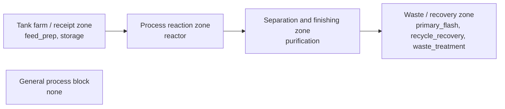

## Project and Plant Layout

Selected layout basis: Segregated hazard-zone layout. The scored winner is tied to Dahej, 13 major equipment items, 6 utility services, and 7 solved flowsheet nodes. The layout narrative therefore follows the scored arrangement rather than freewriting a generic plot plan.

### Plot Plan Basis

| Parameter | Value |
| --- | --- |
| Selected site | Dahej |
| Winning basis | Segregated hazard-zone layout |
| Major equipment count | 13 |
| Flowsheet node count | 7 |
| Operating mode | continuous |
| Campaign length (d) | 170.0 |
| Dispatch buffer (d) | 9.4 |

### Plot Layout Schematic

### Area Zoning and Separation Basis

| Zone | Representative Nodes | Primary Layout Driver | Access / Separation Note |
| --- | --- | --- | --- |
| Tank farm / receipt zone | feed_prep, storage | hazard segregation and controlled access | truck / service access maintained |
| Process reaction zone | reactor | hazard segregation and controlled access | buffered from dispatch / occupied areas |
| Waste / recovery zone | primary_flash, recycle_recovery, waste_treatment | short process transfer and operability grouping | kept accessible for maintenance and utility routing |
| Separation and finishing zone | purification | short process transfer and operability grouping | kept accessible for maintenance and utility routing |

### Equipment Placement Matrix

| Node | Label | Section | Upstream | Downstream |
| --- | --- | --- | --- | --- |
| feed_prep | Feed preparation | feed_handling | purification | reactor |
| reactor | Reaction zone | reaction | feed_prep | primary_flash |
| primary_flash | Primary flash and purge recovery | primary_recovery | reactor | waste_treatment, recycle_recovery |
| waste_treatment | Waste treatment | - | primary_flash, purification | - |
| recycle_recovery | Recycle recovery | recycle_recovery_carbonate_loop_cleanup | primary_flash | purification |
| purification | Purification train | purification | recycle_recovery | feed_prep, storage, waste_treatment |
| storage | Product storage | - | purification | - |

### Utility Corridor Matrix

| Utility | Corridor Type | Routing Basis | Spacing / Access Note |
| --- | --- | --- | --- |
| Steam | header / rack corridor | parallel to process train with branch take-offs at major units | kept off main truck path and outside maintenance lift envelope |
| Cooling water | header / rack corridor | parallel to process train with branch take-offs at major units | kept off main truck path and outside maintenance lift envelope |
| Electricity | electrical and local service corridor | distributed to storage, purge, and utility consumers with isolation access | routed with safe separation from wet and hot service zones |
| DM water | header / rack corridor | distributed to storage, purge, and utility consumers with isolation access | kept off main truck path and outside maintenance lift envelope |
| Nitrogen | header / rack corridor | distributed to storage, purge, and utility consumers with isolation access | kept off main truck path and outside maintenance lift envelope |
| Heat-integration auxiliaries | electrical and local service corridor | distributed to storage, purge, and utility consumers with isolation access | kept off main truck path and outside maintenance lift envelope |

### Utility Routing and Access Basis

| Utility | Basis | Routing Strategy | Layout Linkage |
| --- | --- | --- | --- |
| Steam | 20.0 bar saturated steam equivalent | process-side corridor to reaction and separation core | Segregated hazard-zone layout |
| Cooling water | 10 C cooling-water rise | process-side corridor to reaction and separation core | Segregated hazard-zone layout |
| Electricity | Agitation, pumps, vacuum auxiliaries, and transfer drives | service corridor routed away from primary hazard cluster | Segregated hazard-zone layout |
| DM water | Boiler and wash service allowance | service corridor routed away from primary hazard cluster | Segregated hazard-zone layout |
| Nitrogen | Inerting and blanketing | tank farm / blanketing header and service access edge | Segregated hazard-zone layout |
| Heat-integration auxiliaries | Selected utility train circulation, HTM pumping, and exchanger-network auxiliaries | process-side corridor to reaction and separation core | Segregated hazard-zone layout |

### Dispatch and Emergency Access Basis

| Topic | Basis | Layout Consequence |
| --- | --- | --- |
| Operating mode | continuous | layout keeps routine operator circulation outside the primary hazard core while preserving direct access to critical units |
| Dispatch and truck movement | 9.4 d FG buffer | storage and loading area placed toward the dispatch edge with maintained truck and emergency vehicle access |
| Emergency response | 1 reaction-zone nodes | reaction and high-hazard zones remain segregated from occupied / dispatch zones with clear firefighting approach |
| Maintenance turnaround | 170.0 d campaign | equipment clearance, platform access, and rack tie-ins inform maintenance-side spacing and isolation access |

### Maintenance and Foundation Basis

| Equipment | Support Variant | Footprint (m2) | Clearance (m) | Platform | Rack Tie-In |
| --- | --- | --- | --- | --- | --- |
| R-101 | cylindrical skirt with anchor chair | 656.205 | 1.800 | yes | no |
| PU-201 | cylindrical skirt with anchor chair | 6.620 | 1.800 | yes | no |
| V-101 | grouted base frame | 12.125 | 1.200 | no | no |
| E-101 | dual saddle | 47.328 | 1.500 | yes | no |
| TK-301 | dual saddle | 246.043 | 1.200 | no | no |
| HX-01 | dual saddle | 39.069 | 1.500 | yes | no |
| HX-01-CTRL | panel frame | 1.200 | 1.000 | no | no |
| HX-01-HDR | guided rack shoe | 2.430 | 1.200 | no | yes |
| HX-01-PMP | grouted base frame | 1.200 | 1.200 | no | no |
| HX-01-EXP | four-leg support | 1.600 | 1.200 | no | no |
| HX-01-RV | grouted base frame | 1.200 | 1.200 | no | no |
| HX-02 | dual saddle | 5.715 | 1.500 | yes | no |
| HX-02-CTRL | panel frame | 1.200 | 1.000 | no | no |