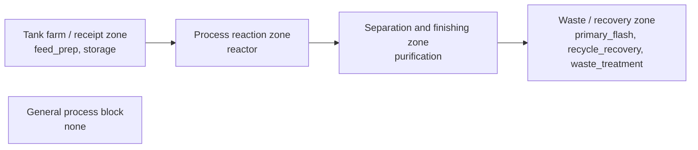

# Ethylene Glycol Plant Design Report

## Preliminary Techno-Economic Feasibility Report

**Target product:** Ethylene Glycol

**Design capacity:** 200000.00 TPA

**Region:** India

**Issue date:** 2026-03-31

---

## Report Basis

**Table 1. Report Basis**

| Field | Value |
| --- | --- |
| Target product | Ethylene Glycol |
| Capacity | 200000.00 TPA |
| Purity target | 99.90 wt% |
| Operating mode | continuous |
| Region | India |
| Currency | INR |
| Process template | ethylene_glycol_india |

## Document Control

**Table 2. Document Control**

| Field | Value |
| --- | --- |
| Report type | End-to-end techno-economic feasibility and plant design report |
| Issue date | 2026-03-31 |
| Report basis | Solver-backed benchmark-parity report package |
| Document coverage | Chapters, references, appendices, annexures, and datasheet bundle |

## Table of Contents
- List of Tables
- List of Figures

1. Executive Summary
2. Introduction and Product Profile
3. Literature Survey
4. Process Selection
5. Market and Capacity Selection
6. Site Selection
7. Thermodynamic Feasibility
8. Reaction Kinetics
9. Block Flow Diagram
10. Process Description
11. Material Balance
12. Energy Balance
13. Heat Integration and Utility Optimization
14. Reactor Design
15. Distillation / Process-Unit Design
16. Equipment Design and Sizing
17. Mechanical Design and MoC
18. Storage and Utilities
19. Instrumentation and Process Control
20. HAZOP
21. Safety, Health, Environment, and Waste Management
22. Project and Plant Layout
23. Project Cost
24. Cost of Production
25. Working Capital
26. Financial Analysis
27. Conclusion
28. References
29. Appendices and Annexures
   - Appendix A: Material Safety Data Sheet
   - Appendix B: Python Code and Reproducibility Bundle
   - Appendix C: Process Design Data Sheet

## Index

**Table 3. Index**

| Sr. No. | Content | Section |
| --- | --- | --- |
| 1 | Executive Summary | 1 |
| 2 | Introduction and Product Profile | 2 |
| 3 | Literature Survey | 3 |
| 4 | Process Selection | 4 |
| 5 | Market and Capacity Selection | 5 |
| 6 | Site Selection | 6 |
| 7 | Thermodynamic Feasibility | 7 |
| 8 | Reaction Kinetics | 8 |
| 9 | Block Flow Diagram | 9 |
| 10 | Process Description | 10 |
| 11 | Material Balance | 11 |
| 12 | Energy Balance | 12 |
| 13 | Heat Integration and Utility Optimization | 13 |
| 14 | Reactor Design | 14 |
| 15 | Distillation / Process-Unit Design | 15 |
| 16 | Equipment Design and Sizing | 16 |
| 17 | Mechanical Design and MoC | 17 |
| 18 | Storage and Utilities | 18 |
| 19 | Instrumentation and Process Control | 19 |
| 20 | HAZOP | 20 |
| 21 | Safety, Health, Environment, and Waste Management | 21 |
| 22 | Project and Plant Layout | 22 |
| 23 | Project Cost | 23 |
| 24 | Cost of Production | 24 |
| 25 | Working Capital | 25 |
| 26 | Financial Analysis | 26 |
| 27 | Conclusion | 27 |

## Appendix Index

**Table 4. Appendix Index**

| Appendix | Content | Section |
| --- | --- | --- |
| A | Material Safety Data Sheet | Appendix A |
| B | Python Code and Reproducibility Bundle | Appendix B |
| C | Process Design Data Sheet | Appendix C |

## List of Tables

- Table 1. Report Basis
- Table 2. Document Control
- Table 3. Index
- Table 4. Appendix Index
- Table 5. Route Comparison
- Table 6. Route Family Profiles
- Table 7. Unit-Operation Family Expansion
- Table 8. Sparse-Data Policy
- Table 9. Selected Property Basis
- Table 10. Separation Thermodynamics Basis
- Table 11. Selected Thermodynamic Method
- Table 12. Selected Kinetic Method
- Table 13. Unit Sequence
- Table 14. Section Topology
- Table 15. Separation Architecture
- Table 16. Recycle Architecture
- Table 17. Overall Plant Balance Summary
- Table 18. Section Balance Summary
- Table 19. Reaction Extent Allocation
- Table 20. Byproduct Closure
- Table 21. Unit Packet Balance Summary
- Table 22. Recycle and Purge Summary
- Table 23. Composition Closure Summary
- Table 24. Unitwise Outlet Composition Snapshot
- Table 25. Stream Role Summary
- Table 26. Route-Family Stream Focus
- Table 27. Long Stream Ledger
- Table 28. Stream-Balance Calculation Traces
- Table 29. Overall Energy Summary
- Table 30. Unit Duty Summary
- Table 31. Section Duty Summary
- Table 32. Unit Thermal Packet Summary
- Table 33. Recovery Candidate Summary
- Table 34. Utility Consumption Basis
- Table 35. Route-Family Duty Focus
- Table 36. Energy-Balance Calculation Traces
- Table 37. Heat Integration and Utility Optimization
- Table 38. Route-Family Basis
- Table 39. Solver Packet Basis
- Table 40. Balance Reference Snapshot
- Table 41. Reactor Feed / Product / Recycle Summary
- Table 42. Reactor Local Stream Split Summary
- Table 43. Key Reactor Component Balance
- Table 44. Reactor Design Inputs
- Table 45. Reactor Operating Envelope
- Table 46. Reactor Sizing Basis
- Table 47. Reaction and Sizing Derivation Basis
- Table 48. Reactor Equation-Substitution Sheet
- Table 49. Kinetic Design Basis
- Table 50. Reactor Geometry and Internals
- Table 51. Heat-Transfer Derivation Basis
- Table 52. Thermal Stability and Hazard Envelope
- Table 53. Catalyst Service Basis
- Table 54. Integrated Utility Package Basis
- Table 55. Utility Coupling
- Table 56. Reactor Calculation Traces
- Table 57. Route-Family Basis
- Table 58. Solver Packet Basis
- Table 59. Balance Reference Snapshot
- Table 60. Unit-by-Unit Feed / Product / Recycle Summary
- Table 61. Process-Unit Local Stream Split Summary
- Table 62. Key Process-Unit Component Balance
- Table 63. Separation Design Inputs
- Table 64. Section and Feed Basis
- Table 65. Distillation Equation-Substitution Basis
- Table 66. Feed and Internal Flow Derivation
- Table 67. Feed Condition and Internal Flow Substitution Sheet
- Table 68. Column Operating Envelope
- Table 69. Reboiler and Condenser Package Basis
- Table 70. Reboiler and Condenser Thermal Substitution Sheet
- Table 71. Process-Unit Sizing Basis
- Table 72. Hydraulics Basis
- Table 73. Heat-Transfer Package Inputs
- Table 74. Exchanger Package Selection Basis
- Table 75. Utility Coupling
- Table 76. Heat-Exchanger Thermal Basis
- Table 77. Process-Unit Calculation Traces
- Table 78. Storage Basis
- Table 79. Operations Planning Basis
- Table 80. Storage Transfer Pump Basis
- Table 81. Storage and Inventory Vessel Basis
- Table 82. Major Process Equipment Basis
- Table 83. Heat Exchanger and Thermal-Service Basis
- Table 84. Rotating and Auxiliary Package Basis
- Table 85. Utility-Coupled Package Inventory
- Table 86. Datasheet Coverage Matrix
- Table 87. Equipment-by-Equipment Sizing Summary
- Table 88. Mechanical Design and MoC
- Table 89. Mechanical Basis
- Table 90. Mechanical Design Input Matrix
- Table 91. Mechanical Design Input Matrix
- Table 92. Foundation and Access Basis
- Table 93. Shell and Head Thickness Derivation
- Table 94. Support and Overturning Derivation
- Table 95. Nozzle Reinforcement and Connection Basis
- Table 96. Connection and Piping Class Basis
- Table 97. Material of Construction Matrix
- Table 98. MoC Option Screening
- Table 99. Equipment-Wise MoC Justification Matrix
- Table 100. Inspection and Maintainability Basis
- Table 101. Corrosion and Service Basis
- Table 102. Utility and Storage MoC Basis
- Table 103. Nozzle and Connection Schedule
- Table 104. Storage Basis
- Table 105. Storage Inventory and Buffer Basis
- Table 106. Storage Service Matrix
- Table 107. Selected Heat Integration
- Table 108. Utility Basis Decision
- Table 109. Utility Consumption Summary
- Table 110. Utility Service System Matrix
- Table 111. Utility Peak and Annualized Demand
- Table 112. Utility Demand by Major Unit
- Table 113. Utilities
- Table 114. Utility Island Service Basis
- Table 115. Header and Thermal-Loop Basis
- Table 116. Control Philosophy
- Table 117. Loop Objective Matrix
- Table 118. Controlled and Manipulated Variable Register
- Table 119. Startup, Shutdown, and Override Basis
- Table 120. Alarm and Interlock Basis
- Table 121. Utility-Integrated Control Basis
- Table 122. Control Loop Sheets
- Table 123. HAZOP Coverage Summary
- Table 124. HAZOP Node Basis
- Table 125. Critical Node Summary
- Table 126. Deviation Cause-Consequence Matrix
- Table 127. HAZOP Node Register
- Table 128. Recommendation Register
- Table 129. Safety Basis
- Table 130. Hazard and Emergency Response Basis
- Table 131. Health and Exposure Basis
- Table 132. Environmental and Waste Basis
- Table 133. Environmental Control and Monitoring Basis
- Table 134. Waste Handling and Disposal Basis
- Table 135. Safeguard Linkage
- Table 136. Plot Plan Basis
- Table 137. Area Zoning and Separation Basis
- Table 138. Equipment Placement Matrix
- Table 139. Utility Corridor Matrix
- Table 140. Utility Routing and Access Basis
- Table 141. Dispatch and Emergency Access Basis
- Table 142. Maintenance and Foundation Basis
- Table 143. Project Cost Build-Up Summary
- Table 144. Direct Plant Cost Head Allocation
- Table 145. Indirect and Contingency Basis
- Table 146. Equipment Family Cost Allocation
- Table 147. Procurement Timing Basis
- Table 148. Procurement Timing Basis
- Table 149. Procurement Package Timing
- Table 150. Installed Equipment Cost Matrix
- Table 151. Utility Island Economics
- Table 152. Recurring Transport / Service Submodels
- Table 153. Scenario Cost Snapshot
- Table 154. Cost of Production Summary
- Table 155. Manufacturing Cost Build-Up
- Table 156. Utility and Raw-Material Cost Basis
- Table 157. Recurring Service and Maintenance Basis
- Table 158. Unit Cost and Selling Basis
- Table 159. Working-Capital Parameter Basis
- Table 160. Working-Capital Breakdown
- Table 161. Inventory, Receivable, and Payable Basis
- Table 162. Procurement-Linked Working-Capital Timing
- Table 163. Operations Planning Basis
- Table 164. Financial Performance Summary
- Table 165. Profitability and Return Summary
- Table 166. Funding and Capital Structure Basis
- Table 167. Procurement and Construction Funding Basis
- Table 168. Procurement-Linked Working-Capital Basis
- Table 169. Availability and Outage Calendar
- Table 170. Debt Service Coverage Schedule
- Table 171. Lender Coverage Screening
- Table 172. Financing Option Ranking
- Table 173. Scenario Margin Snapshot
- Table 174. Scenario Recurring Service Breakdown
- Table 175. Scenario Utility Island Breakdown
- Table 176. Multi-Year Financial Schedule
- Table 177. Profit and Loss Schedule
- Table 178. Cash Accrual and Funding Schedule
- Table 179. Debt Schedule
- Table 180. Material Safety Data Sheet Summary
- Table 181. Core Module Register
- Table 182. Reproducibility Artifact Register
- Table 183. Process Design Data Sheet Summary
- Table 184. Benchmark Manifest
- Table 185. Source Ranking Table
- Table 186. Source Conflict Register
- Table 187. Property Table
- Table 188. Component Identifier Table
- Table 189. Pure-Component Property Table
- Table 190. Property Correlation Register
- Table 191. Binary Interaction Parameter Register
- Table 192. Henry-Law Constant Register
- Table 193. Solubility Curve Register
- Table 194. Value Provenance Table
- Table 195. Resolved Value Table
- Table 196. Property Estimate Register
- Table 197. Property Requirement Coverage
- Table 198. Separation Thermodynamics Basis
- Table 199. Component K-Value Register
- Table 200. Blocked / Unresolved Property Register
- Table 201. Reaction Extent Set
- Table 202. Byproduct Closure Register
- Table 203. Process Archetype
- Table 204. Route Family Profiles
- Table 205. Unit-Operation Family Expansion
- Table 206. Unit-Operation Family Expansion
- Table 207. Sparse-Data Policy
- Table 208. Operations Planning Basis
- Table 209. Specialist Decision Fabric
- Table 210. Critic Registry
- Table 211. Alternative Set Summary
- Table 212. Stream Table
- Table 213. Flowsheet Graph
- Table 214. Flowsheet Case
- Table 215. Unit Composition States
- Table 216. Composition Closures
- Table 217. Mixture Property Packages
- Table 218. Solve Result
- Table 219. Phase Split Specs
- Table 220. Separator Performance
- Table 221. Recycle Convergence Summaries
- Table 222. Equipment Table
- Table 223. Mechanical Design Summary View
- Table 224. Mechanical Load and Foundation View
- Table 225. Mechanical Design Table
- Table 226. Utility Table
- Table 227. India Price Evidence Log
- Table 228. India Location Evidence Log
- Table 229. Financial Snapshot
- Table 230. Lender Coverage Screening
- Table 231. Equipment Cost Breakdown
- Table 232. Plant Cost Summary
- Table 233. Procurement Timing Schedule
- Table 234. Procurement Package Detail
- Table 235. Working-Capital Timing Basis
- Table 236. Mechanical Screening Table
- Table 237. Utility Island Economics
- Table 238. Utility Island Scenario Breakdown
- Table 239. Scenario Comparison Table
- Table 240. Financial Schedule Summary View
- Table 241. Financial Schedule Debt and Profit View
- Table 242. Financial Schedule Debt and Profit View
- Table 243. Typed Financial Schedule
- Table 244. Debt Schedule
- Table 245. Heat Integration Cases
- Table 246. Utility Architecture
- Table 247. Composite Thermal Intervals
- Table 248. Utility Island Summary View
- Table 249. Utility Island Operating Window View
- Table 250. Utility Island Operating Window View
- Table 251. Selected Utility Train
- Table 252. Utility Train Package Summary View
- Table 253. Utility Train Package Hydraulic View
- Table 254. Utility Train Package Hydraulic View
- Table 255. Operating Mode Decision
- Table 256. Control Architecture Decision
- Table 257. Site Decision
- Table 258. Route Decision
- Table 259. Utility Basis Decision
- Table 260. Economic Basis Decision
- Table 261. Capacity Case
- Table 262. Property Method Decision
- Table 263. Thermo Method
- Table 264. Kinetics Method
- Table 265. Exchanger Choice
- Table 266. Storage Choice
- Table 267. Moc Choice
- Table 268. Procurement Basis
- Table 269. Logistics Basis
- Table 270. Financing Basis
- Table 271. Layout Choice
- Table 272. HAZOP Node Register
- Table 273. Rejected Alternative Log
- Table 274. Economic Scenario Model
- Table 275. Economic Scenario Model
- Table 276. Economic Scenario Model
- Table 277. Reactor Design Basis
- Table 278. Column Hydraulics
- Table 279. Heat Exchanger Thermal Design
- Table 280. Pump Design
- Table 281. Mechanical Design Basis
- Table 282. Source Extracts
- Table 283. Reaction-System Calculation Traces
- Table 284. Stream-Balance Calculation Traces
- Table 285. Energy-Balance Calculation Traces
- Table 286. Reactor Design Traces
- Table 287. Column Design Traces
- Table 288. Heat-Exchanger Design Traces
- Table 289. Storage Design Traces
- Table 290. Mechanical Design Traces
- Table 291. Utility Basis Traces
- Table 292. Project-Cost Traces
- Table 293. Working-Capital Traces
- Table 294. Financial Traces

## List of Figures

- Figure 1. Block Flow Diagram
- Figure 2. Plot Layout Schematic

# 1. Executive Summary

## Executive Summary

This report develops an India-mode conceptual plant design for Ethylene Glycol at 200000 TPA. The selected basis uses ethylene oxide hydration, India-specific siting and tariff assumptions, traceable calculations for balances and major equipment, and approval gates around route, design basis, reactor/column basis, HAZOP, India economics, and final release.

---

# 2. Introduction and Product Profile

## Introduction and Product Profile

Ethylene glycol is a high-volume petrochemical intermediate with deep downstream demand in polyester, PET resin, coolants, and solvent applications. For a 200000 TPA India project, the product profile must be tied directly to feedstock integration, high-water hydration chemistry, and energy-intensive purification rather than written as a generic chemistry summary.

The design basis therefore uses cited thermophysical properties, continuous operation, and India-specific market relevance as direct inputs to route, site, and economics decisions.

---

# 3. Literature Survey

## Literature Survey

The route survey compares industrial EG pathways on maturity, selectivity, safety, utility intensity, and India feedstock fit. Ethylene oxide hydration remains the strongest basis because it is the most defensible large-scale route for a 200000 TPA feasibility-style home paper.

---

# 4. Process Selection

## Process Selection

### Route Comparison

**Table 5. Route Comparison**

| Route | Family | Total score | Residual hot utility (kW) | Heat case | Scenario stability |
| --- | --- | --- | --- | --- | --- |
| eo_hydration | liquid_hydration_train | 39.95 | 49263.839 | eo_hydration_pinch_htm | reviewed |
| omega_catalytic | liquid_hydration_train | 60.60 | 43800.060 | omega_catalytic_pinch_htm | stable |
| chlorohydrin | chlorinated_hydrolysis_train | -1.00 | 13044.246 | chlorohydrin_no_recovery | reviewed |

### Selected Route

OMEGA catalytic route via ethylene carbonate is selected because the `Liquid Hydration Train` route family stays economically competitive after the chosen heat-integration case `omega_catalytic_pinch_htm`, while retaining credible industrial maturity and India fit.

### Route Family Profiles

**Table 6. Route Family Profiles**

| Route | Family | Reactor Basis | Separation Train | Heat Style | India Blocker |
| --- | --- | --- | --- | --- | --- |
| eo_hydration | Liquid Hydration Train | Tubular plug-flow hydrator | EO flash -> water removal -> vacuum glycol distillation | condenser_reboiler_cluster | none |
| omega_catalytic | Liquid Hydration Train | Tubular plug-flow hydrator | EO flash -> water removal -> vacuum glycol distillation | condenser_reboiler_cluster | none |
| chlorohydrin | Chlorinated Hydrolysis Train | Agitated hydrolysis CSTR train | Salt removal -> brine handling -> water removal -> purification | utility_led_with_brine_management | Route generates chloride-heavy waste and is not preferred for India deployment under the current policy basis. |

### Unit-Operation Family Expansion

Route `omega_catalytic` is expanded into the `Liquid Hydration Train` unit-operation family.

**Table 7. Unit-Operation Family Expansion**

| Service Group | Candidate | Status | Score | Rationale |
| --- | --- | --- | --- | --- |
| reactor | tubular_plug_flow_hydrator | preferred | 102.0 | Tubular hydrator with strong dehydration integration fit |
| reactor | jacketed_cstr_train | preferred | 78.0 | CSTR fallback for liquid hydration service |
| reactor | high_pressure_carbonylation_loop | blocked | 18.0 | High-pressure carbonylation loop |
| separation | distillation_train | preferred | 100.0 | Flash and glycol distillation train |
| separation | extractive_distillation_train | fallback | 82.0 | Extractive/vacuum polishing distillation |
| separation | packed_absorption_train | blocked | 20.0 | Packed absorption train |

- Supporting unit operations: flash, dehydration_column, glycol_polishing_column, heat_exchanger_cluster, reactor, distillation, heat_exchanger
- Applicability critics: dehydration_duty, glycol_split_vle_basis, water_recycle_closure, relative_volatility_claims, reboiler_duty_burden

### Chemistry Family Adapter

Adapter `continuous_liquid_organic_train` supports continuous liquid organic train under a organic chemistry basis.

- Route hints: hydration, carbonylation, hydrogenation, dehydration cleanup
- Property priority: molecular_weight, normal_boiling_point, liquid_density, liquid_viscosity, liquid_heat_capacity, heat_of_vaporization, antoine_constants, binary_interaction_parameters
- Preferred reactor candidates: tubular_plug_flow_hydrator, jacketed_cstr_train
- Preferred separation candidates: distillation_train, extraction_recovery_train
- Common unit operations: reactor, flash, distillation, heat_exchanger, storage
- Corrosion cues: organic_acid_presence, water_content, chloride_trace_monitoring
- Heat-integration patterns: reboiler_condenser_cluster, shared_htm_island_network, moderate_temperature_recovery
- Critic focus: relative_volatility_claims, water_recycle_closure, reboiler_duty_burden
- Sparse-data blockers: missing_vle_basis, missing_density_viscosity_for_column_hydraulics

### Sparse-Data Policy

**Table 8. Sparse-Data Policy**

| Stage | Subject | Artifact Family | Est. | Analogy | Heuristic Fallback | Min Confidence | Status | Triggered Items |
| --- | --- | --- | --- | --- | --- | --- | --- | --- |
| thermodynamic_feasibility | molecular_weight | pure_component_identity | yes | no | no | 0.55 | covered | - |
| thermodynamic_feasibility | normal_boiling_point | pure_component_thermo | yes | no | no | 0.60 | covered | - |
| energy_balance | liquid_heat_capacity | bulk_thermal_properties | yes | no | no | 0.55 | covered | - |
| energy_balance | heat_of_vaporization | bulk_thermal_properties | yes | no | no | 0.55 | covered | - |
| reactor_design | liquid_density | transport_properties | yes | no | no | 0.60 | covered | - |
| reactor_design | liquid_viscosity | transport_properties | yes | no | no | 0.60 | covered | - |
| distillation_design | liquid_density | separation_transport | yes | no | no | 0.60 | covered | - |
| distillation_design | liquid_viscosity | separation_transport | yes | no | no | 0.60 | covered | - |
| distillation_design | binary_interaction_parameters | vle_nonideal_basis | no | no | yes | 0.00 | warning | ethylene_glycol__ethylene_oxide, ethylene_glycol__water, ethylene_oxide__water |

### Selected Reactor Basis

Tubular or plug-flow hydrator service selected as the highest-ranked alternative.

### Selected Separation Basis

Distillation and flash purification train selected as the highest-ranked alternative.

### Selected Heat-Integration Case

Pinch + HTM loop: Pinch-based heat recovery with an indirect hot-oil loop materially reduces purchased steam.

---

# 5. Market and Capacity Selection

## Market and Capacity Selection

The 200000 TPA basis is framed as a large continuous petrochemical train aligned with India polyester and resin demand rather than a niche batch-chemical facility. The market case depends on large throughput, stable EO integration, and India-based logistics and tariff assumptions, all normalized in INR.

### Capacity Decision

200,000 TPA plant basis selected because it best balances the benchmark throughput, market basis, and integration leverage.

---

# 6. Site Selection

## Site Selection

Dahej, Gujarat is selected because it best combines petrochemical integration, port logistics, utilities, industrial services, and a defendable India cost basis for a 200000 TPA EG plant.

### Deterministic Site Decision

Dahej is selected because it provides the strongest combined cluster, logistics, utility, and India execution fit for a 200000 TPA EG plant.

---

# 7. Thermodynamic Feasibility

## Thermodynamic Feasibility

### Selected Property Basis

Use cited public anchors with library-backed calculation and benchmark seeds for missing constants. selected for the active component set of route omega_catalytic.

**Table 9. Selected Property Basis**

| Property Basis | Feasible | Score |
| --- | --- | --- |
| direct_public_package | no | 16.00 |
| hybrid_cited_plus_library | yes | 62.00 |
| estimation_dominant | yes | 40.00 |
| analogy_basis | yes | 10.00 |

### Separation Thermodynamics Basis

**Table 10. Separation Thermodynamics Basis**

| Component | Ttop (C) | Gamma top | Ktop | Method | Tbottom (C) | Gamma bottom | Kbottom | Method |
| --- | --- | --- | --- | --- | --- | --- | --- | --- |
| Ethylene Glycol | 108.0 | 1.0000 | 0.0160 | ideal_raoult_missing_bip_clausius_clapeyron | 203.3 | 1.0000 | 0.3669 | ideal_raoult_missing_bip_clausius_clapeyron |
| Ethylene oxide | 108.0 | 1.0000 | 4.5086 | ideal_raoult_clausius_clapeyron | 203.3 | 1.0000 | 21.3927 | ideal_raoult_clausius_clapeyron |
| Water | 108.0 | 1.0000 | 0.4138 | ideal_raoult_missing_bip_antoine_extrapolated | 203.3 | 1.0000 | 5.2836 | ideal_raoult_missing_bip_antoine_extrapolated |

Light key: `Water`
Heavy key: `Ethylene Glycol`
Activity model: `ideal_raoult_missing_bip_fallback`
Average relative volatility: `19.3148`
System pressure: `3.240` bar

Fallback notes:
- Binary interaction parameters for Water / Ethylene Glycol were not resolved from cited/public sources.
- Activity coefficients defaulted to gamma=1.0 and the separation basis fell back to ideal Raoult's law for the key pair.

### Selected Thermodynamic Method

Use direct public property and reaction data where available. selected as the primary thermodynamic basis.

**Table 11. Selected Thermodynamic Method**

| Method | Feasible | Score | Rejected Reasons |
| --- | --- | --- | --- |
| direct_public_data | yes | 91.10 | - |
| correlation_interpolation | yes | 88.10 | - |
| estimation_method | yes | 65.90 | - |
| analogy_basis | yes | 53.50 | - |

### Thermodynamic Interpretation

The selected reaction is treated as thermodynamically favorable, with a negative Gibbs free energy and exothermic heat release that supports conversion but requires controlled heat removal.

---

# 8. Reaction Kinetics

## Reaction Kinetics

### Selected Kinetic Method

Use cited industrial or literature rate law directly. selected as the primary kinetic basis.

**Table 12. Selected Kinetic Method**

| Method | Feasible | Score | Rejected Reasons |
| --- | --- | --- | --- |
| cited_rate_law | yes | 92.00 | - |
| arrhenius_fit | yes | 88.50 | - |
| apparent_order_fit | yes | 72.50 | - |
| conservative_analogy | yes | 56.50 | - |

### Kinetic Interpretation

The seeded kinetics package supports a practical residence-time basis for preliminary equipment sizing.

---

# 9. Block Flow Diagram

## Block Flow Diagram

**Figure 1. Block Flow Diagram**

---

# 10. Process Description

## Process Description

Solver-derived process description for route `omega_catalytic` built from `5` solved unit packets.

### Unit Sequence

**Table 13. Unit Sequence**

| Unit | Type | Service | Inlet Streams | Outlet Streams | Closure | Coverage |
| --- | --- | --- | --- | --- | --- | --- |
| feed_prep | feed_preparation | Feed preparation | S-101, S-102, S-401 | S-150 | converged | complete |
| reactor | reactor | Reaction zone | S-150 | S-201 | converged | complete |
| primary_flash | flash | Primary flash and purge recovery | S-201 | S-202, S-203 | converged | complete |
| waste_treatment | waste_handling | Waste treatment | S-202, S-403 | - | converged | partial |
| recycle_recovery | recycle | Recycle recovery | S-203 | S-301 | estimated | partial |
| purification | distillation | Purification train | S-301 | S-401, S-402, S-403 | converged | partial |
| storage | storage | Product storage | S-402 | - | converged | partial |

### Section Topology

**Table 14. Section Topology**

| Section | Label | Type | Units | Inlet Streams | Outlet Streams | Side Draws | Status |
| --- | --- | --- | --- | --- | --- | --- | --- |
| feed_handling | Feed handling | feed_preparation | feed_prep | S-101, S-102, S-401 | S-150 | - | converged |
| reaction | Reaction | reaction | reactor | S-150 | S-201 | - | converged |
| primary_recovery | Primary recovery | primary_recovery | primary_flash | S-201 | S-202, S-203 | - | converged |
| recycle_recovery_carbonate_loop_cleanup | Carbonate loop cleanup | recycle_recovery | recycle_recovery | S-203 | S-301 | - | estimated |
| purification | Purification | purification | purification | S-301 | S-401, S-402, S-403 | - | estimated |

### Separation Architecture

**Table 15. Separation Architecture**

| Separation | Family | Driving Force | Product Streams | Recycle Streams | Status |
| --- | --- | --- | --- | --- | --- |
| primary_flash_separation_packet | flash | temperature/volatility | S-203 | - | converged |
| purification_separation_packet | distillation | temperature/volatility | S-402 | S-401 | converged |

### Recycle Architecture

**Table 16. Recycle Architecture**

| Loop | Source Unit | Recycle Streams | Purge Streams | Status |
| --- | --- | --- | --- | --- |
| recycle_recovery_recycle_loop | recycle_recovery | S-301 | - | converged |
| purification_recycle_loop | purification | S-401 | S-403 | estimated |

### Unit Narrative

- `feed_prep`: Feed preparation. Inlet streams `S-101, S-102, S-401` and outlet streams `S-150` with `converged` closure and `complete` coverage.
- `reactor`: Reaction zone. Inlet streams `S-150` and outlet streams `S-201` with `converged` closure and `complete` coverage.
- `primary_flash`: Primary flash and purge recovery. Inlet streams `S-201` and outlet streams `S-202, S-203` with `converged` closure and `complete` coverage.
- `waste_treatment`: Waste treatment. Inlet streams `S-202, S-403` and outlet streams `-` with `converged` closure and `partial` coverage.
- `recycle_recovery`: Recycle recovery. Inlet streams `S-203` and outlet streams `S-301` with `estimated` closure and `partial` coverage.
- `purification`: Purification train. Inlet streams `S-301` and outlet streams `S-401, S-402, S-403` with `converged` closure and `partial` coverage.
- `storage`: Product storage. Inlet streams `S-402` and outlet streams `-` with `converged` closure and `partial` coverage.

---

# 11. Material Balance

## Material Balance

### Overall Plant Balance Summary

**Table 17. Overall Plant Balance Summary**

| Basis | Mass Flow (kg/h) | Molar Flow (kmol/h) |
| --- | --- | --- |
| Fresh feed | 25952.368 | 837.633819 |
| External outlet | 25952.368 | 432.910401 |
| Recycle circulation | 27585.316 | 492.451084 |
| Side draws | 0.000 | 0.000000 |
| Closure error (%) | 0.000 | - |

### Section Balance Summary

**Table 18. Section Balance Summary**

| Section | Label | Type | Inlet kg/h | Outlet kg/h | Side Draw kg/h | Recycle kg/h | Status |
| --- | --- | --- | --- | --- | --- | --- | --- |
| feed_handling | Feed handling | feed_preparation | 26953.864 | 26953.864 | 0.000 | 0.000 | converged |
| reaction | Reaction | reaction | 26953.864 | 26953.863 | 0.000 | 0.000 | converged |
| primary_recovery | Primary recovery | primary_recovery | 26953.863 | 26559.945 | 0.000 | 0.000 | converged |
| recycle_recovery_carbonate_loop_cleanup | Carbonate loop cleanup | recycle_recovery | 25582.324 | 26583.820 | 0.000 | 26583.820 | estimated |
| purification | Purification | purification | 26583.820 | 25976.243 | 0.000 | 1001.496 | estimated |

### Reaction Extent Allocation

**Table 19. Reaction Extent Allocation**

| Extent | Kind | Representative Component | Fraction of Converted Feed | Status |
| --- | --- | --- | --- | --- |
| omega_catalytic_main_extent | main | Ethylene glycol | 0.990000 | converged |
| omega_catalytic_side_extent_1 | byproduct | Trace heavy glycols | 0.010000 | estimated |

### Byproduct Closure

**Table 20. Byproduct Closure**

| Component | Basis | Allocation Fraction | Provenance | Status |
| --- | --- | --- | --- | --- |
| Trace heavy glycols | Declared route byproducts | 1.000000 | declared_trace | estimated |

### Unit Packet Balance Summary

**Table 21. Unit Packet Balance Summary**

| Unit | Type | Service | Inlet Streams | Outlet Streams | Inlet kg/h | Outlet kg/h | Closure Error (%) | Status | Coverage |
| --- | --- | --- | --- | --- | --- | --- | --- | --- | --- |
| feed_prep | feed_preparation | Feed preparation | S-101, S-102, S-401 | S-150 | 26953.864 | 26953.864 | 0.000 | converged | complete |
| primary_flash | flash | Primary flash and vent recovery | S-201 | S-202, S-203 | 26953.863 | 26953.863 | 0.000 | converged | complete |
| purification | distillation | Purification train | S-301 | S-401, S-402, S-403 | 26583.820 | 26583.820 | 0.000 | converged | partial |
| reactor | reactor | Reaction zone | S-150 | S-201 | 26953.864 | 26953.863 | 0.000 | converged | complete |
| recycle_recovery | recycle | Recycle recovery | S-203 | S-301 | 25582.324 | 26583.820 | 3.767 | estimated | partial |

### Recycle and Purge Summary

**Table 22. Recycle and Purge Summary**

| Loop | Source Unit | Target Unit | Recycle Streams | Purge Streams | Max Error (%) | Mean Error (%) | Status |
| --- | --- | --- | --- | --- | --- | --- | --- |
| recycle_recovery_recycle_loop | recycle_recovery | purification | S-301 | - | 0.100 | 0.100 | converged |
| purification_recycle_loop | purification | feed_prep | S-401 | S-403 | 8.650 | 4.004 | estimated |

### Composition Closure Summary

**Table 23. Composition Closure Summary**

| Unit | Reactive | Inlet Fraction Sum | Outlet Fraction Sum | New Components | Missing Components | Error (%) | Status |
| --- | --- | --- | --- | --- | --- | --- | --- |
| feed_prep | no | 1.0000 | 1.0000 | - | - | 0.000 | converged |
| primary_flash | no | 1.0000 | 1.0000 | - | - | 0.000 | converged |
| purification | no | 1.0000 | 1.0000 | - | Trace heavy glycols | 0.000 | estimated |
| reactor | yes | 1.0000 | 1.0000 | Ethylene glycol, Trace heavy glycols | - | 0.000 | converged |
| recycle_recovery | no | 1.0000 | 1.0000 | - | - | 0.000 | converged |

### Unitwise Outlet Composition Snapshot

**Table 24. Unitwise Outlet Composition Snapshot**

| Unit | Type | Inlet Phase | Outlet Phase | Outlet Mass Fractions | Status |
| --- | --- | --- | --- | --- | --- |
| feed_prep | feed_preparation | gas | gas | Ethylene oxide=0.700, Water=0.300 | converged |
| primary_flash | flash | gas | gas | Ethylene oxide=0.028, Trace heavy glycols=0.010, Water=0.011, Ethylene glycol=0.951 | converged |
| purification | distillation | gas | gas | Ethylene oxide=0.018, Water=0.020, Ethylene glycol=0.961 | estimated |
| reactor | reactor | gas | gas | Ethylene glycol=0.937, Ethylene oxide=0.028, Trace heavy glycols=0.009, Water=0.026 | converged |
| recycle_recovery | recycle | gas | gas | Ethylene glycol=0.950, Ethylene oxide=0.020, Trace heavy glycols=0.009, Water=0.021 | converged |

### Stream Role Summary

**Table 25. Stream Role Summary**

| Stream | Role | Section | From | To | kg/h | kmol/h |
| --- | --- | --- | --- | --- | --- | --- |
| S-101 | feed | feed_handling | battery_limits | feed_prep | 18378.663 | 417.222770 |
| S-102 | feed | feed_handling | battery_limits | feed_prep | 7573.705 | 420.411049 |
| S-150 | intermediate | reaction | feed_prep | reactor | 26953.864 | 877.547235 |
| S-201 | intermediate | reaction | reactor | primary_flash | 26953.863 | 465.036538 |
| S-202 | vent | primary_recovery | primary_flash | waste_treatment | 977.621 | 30.546176 |
| S-203 | intermediate | primary_recovery | primary_flash | recycle_recovery | 25582.324 | 412.624251 |
| S-301 | recycle | recycle_recovery_carbonate_loop_cleanup | recycle_recovery | purification | 26583.820 | 452.537668 |
| S-401 | recycle | purification | purification | feed_prep | 1001.496 | 39.913416 |
| S-402 | product | purification | purification | storage | 24974.747 | 402.364225 |
| S-403 | waste | purification | purification | waste_treatment | 0.000 | 0.000000 |

### Route-Family Stream Focus

**Table 26. Route-Family Stream Focus**

| Stream | Role | From | To | Phase | kg/h | Dominant Components |
| --- | --- | --- | --- | --- | --- | --- |
| S-101 | feed | battery_limits | feed_prep | gas | 18378.663 | Ethylene oxide=18378.7 |
| S-102 | feed | battery_limits | feed_prep | gas | 7573.705 | Water=7573.7 |
| S-150 | intermediate | feed_prep | reactor | gas | 26953.864 | Ethylene oxide=18856.6, Water=8097.3 |
| S-201 | intermediate | reactor | primary_flash | gas | 26953.863 | Ethylene glycol=25252.5, Ethylene oxide=754.3, Water=694.1, Trace heavy glycols=253.0 |
| S-202 | vent | primary_flash | waste_treatment | gas | 977.621 | Ethylene oxide=709.0, Water=258.5, Trace heavy glycols=10.1 |
| S-203 | intermediate | primary_flash | recycle_recovery | gas | 25582.324 | Ethylene glycol=25252.5, Trace heavy glycols=242.9, Ethylene oxide=45.3, Water=41.6 |
| S-301 | recycle | recycle_recovery | purification | gas | 26583.820 | Ethylene glycol=25252.5, Water=565.2, Ethylene oxide=523.2, Trace heavy glycols=242.9 |
| S-401 | recycle | purification | feed_prep | gas | 1001.496 | Water=523.6, Ethylene oxide=477.9 |
| S-402 | product | purification | storage | gas | 24974.747 | Ethylene glycol=24974.7 |
| S-403 | waste | purification | waste_treatment | mixed | 0.000 | - |

### Long Stream Ledger

**Table 27. Long Stream Ledger**

| Stream | Description | From | To | Component | kg/h | kmol/h | T (C) | P (bar) |
| --- | --- | --- | --- | --- | --- | --- | --- | --- |
| S-101 | Ethylene oxide fresh feed | battery_limits | feed_prep | Ethylene oxide | 18378.663 | 417.222770 | 25.0 | 18.00 |
| S-102 | Water fresh feed | battery_limits | feed_prep | Water | 7573.705 | 420.411049 | 25.0 | 18.00 |
| S-150 | Mixed reactor feed | feed_prep | reactor | Ethylene oxide | 18856.564 | 428.071822 | 225.0 | 18.00 |
| S-150 | Mixed reactor feed | feed_prep | reactor | Water | 8097.300 | 449.475413 | 225.0 | 18.00 |
| S-201 | Reactor effluent | reactor | primary_flash | Ethylene glycol | 25252.525 | 406.839460 | 240.0 | 18.00 |
| S-201 | Reactor effluent | reactor | primary_flash | Ethylene oxide | 754.263 | 17.122873 | 240.0 | 18.00 |
| S-201 | Reactor effluent | reactor | primary_flash | Trace heavy glycols | 253.021 | 2.547741 | 240.0 | 18.00 |
| S-201 | Reactor effluent | reactor | primary_flash | Water | 694.054 | 38.526464 | 240.0 | 18.00 |
| S-202 | Primary separation overhead / vent / purge | primary_flash | waste_treatment | Ethylene oxide | 709.007 | 16.095501 | 205.0 | 16.50 |
| S-202 | Primary separation overhead / vent / purge | primary_flash | waste_treatment | Trace heavy glycols | 10.121 | 0.101910 | 205.0 | 16.50 |
| S-202 | Primary separation overhead / vent / purge | primary_flash | waste_treatment | Water | 258.493 | 14.348765 | 205.0 | 16.50 |
| S-203 | Primary separation bottoms / rich liquid | primary_flash | recycle_recovery | Ethylene glycol | 25252.525 | 406.839460 | 230.0 | 17.20 |
| S-203 | Primary separation bottoms / rich liquid | primary_flash | recycle_recovery | Ethylene oxide | 45.256 | 1.027372 | 230.0 | 17.20 |
| S-203 | Primary separation bottoms / rich liquid | primary_flash | recycle_recovery | Trace heavy glycols | 242.900 | 2.445831 | 230.0 | 17.20 |
| S-203 | Primary separation bottoms / rich liquid | primary_flash | recycle_recovery | Water | 41.643 | 2.311588 | 230.0 | 17.20 |
| S-301 | Cleanup / recycle recovery stream | recycle_recovery | purification | Ethylene glycol | 25252.525 | 406.839460 | 215.0 | 17.00 |
| S-301 | Cleanup / recycle recovery stream | recycle_recovery | purification | Ethylene oxide | 523.157 | 11.876425 | 215.0 | 17.00 |
| S-301 | Cleanup / recycle recovery stream | recycle_recovery | purification | Trace heavy glycols | 242.900 | 2.445831 | 215.0 | 17.00 |
| S-301 | Cleanup / recycle recovery stream | recycle_recovery | purification | Water | 565.238 | 31.375952 | 215.0 | 17.00 |
| S-401 | Light ends / recoverable recycle | purification | feed_prep | Ethylene oxide | 477.901 | 10.849052 | 45.0 | 1.00 |
| S-401 | Light ends / recoverable recycle | purification | feed_prep | Water | 523.595 | 29.064364 | 45.0 | 1.00 |
| S-402 | On-spec product | purification | storage | Ethylene glycol | 24974.747 | 402.364225 | 45.0 | 1.10 |

### Stream-Balance Calculation Traces

**Table 28. Stream-Balance Calculation Traces**

| Trace | Formula | Inputs | Result | Notes |
| --- | --- | --- | --- | --- |
| Main reaction extent | extent = product_kmol / nu_product | product_kmol=406.839460; nu_product=1.000 | 406.839460 kmol/h | - |
| Feed extent with conversion/selectivity | feed_extent = (product_kmol / nu_product) / (selectivity * conversion) | selectivity=0.9900; conversion=0.9600 | 428.071822 kmol/h | - |
| Byproduct closure allocation | Residual byproduct mass is allocated across explicit byproduct-closure estimates | closure_status=estimated; estimate_count=1; residual_mass_kg_hr=253.021 | 1 estimates items | This replaces the older implicit heavy-ends fallback whenever the reaction system carries a byproduct-closure artifact. |
| Multi-component recycle solution | Solve recycle per reactant using target_total, consumed, recovery, and purge fractions | Ethylene oxide=fresh=417.223; recycle=10.849; total=428.072; Water=fresh=420.411; recycle=29.064; total=449.475 | 2 components solved components | This is the first generic convergence slice: reactants are solved through the same recycle/purge loop instead of family-specific inline math. |
| Unit-sequence expansion | stream_count = feeds + mixed feed + reactor + separation + recycle + product/waste | family=generic | 10 streams | - |
| Fresh-feed to external-out closure | closure = |fresh_feed - external_out| / fresh_feed | fresh_feed=25952.368; external_out=25952.368 | 0.000000 % | - |

---

# 12. Energy Balance

## Energy Balance

### Overall Energy Summary

**Table 29. Overall Energy Summary**

| Basis | Value | Units |
| --- | --- | --- |
| Total heating duty | 5781.464 | kW |
| Total cooling duty | 8224.582 | kW |
| Net external duty | -2443.118 | kW |
| Thermal packets | 3 | count |
| Recovery candidates | 2 | count |
| Recoverable packet duty | 624.369 | kW |

### Unit Duty Summary

**Table 30. Unit Duty Summary**

| Unit | Section | Duty Type | Heating (kW) | Cooling (kW) | Notes |
| --- | --- | --- | --- | --- | --- |
| E-101 | - | sensible | 4532.727 | 0.000 | Feed preheat to operating temperature. |
| R-101 | - | reaction | 0.000 | 7600.213 | Net reactor thermal duty from the selected thermodynamic basis. |
| SEP-201 | - | sensible | 1248.737 | 624.369 | Generic purification duty. |

### Section Duty Summary

**Table 31. Section Duty Summary**

| Section | Label | Heating (kW) | Cooling (kW) | Recoverable (kW) | Status |
| --- | --- | --- | --- | --- | --- |
| feed_handling | Feed handling | 0.000 | 0.000 | 0.000 | converged |
| reaction | Reaction | 0.000 | 0.000 | 0.000 | converged |
| primary_recovery | Primary recovery | 0.000 | 0.000 | 0.000 | converged |
| recycle_recovery_carbonate_loop_cleanup | Carbonate loop cleanup | 0.000 | 0.000 | 0.000 | estimated |
| purification | Purification | 0.000 | 0.000 | 0.000 | estimated |

### Unit Thermal Packet Summary

**Table 32. Unit Thermal Packet Summary**

| Packet | Unit | Section | Type | Heating (kW) | Cooling (kW) | Hot In (C) | Hot Out (C) | Cold In (C) | Cold Out (C) | Recoverable (kW) | Candidate Media |
| --- | --- | --- | --- | --- | --- | --- | --- | --- | --- | --- | --- |
| E-101_thermal_packet | E-101 | - | sensible | 4532.727 | 0.000 | 270.0 | 255.0 | 225.0 | 240.0 | 0.000 | steam, hot oil |
| R-101_thermal_packet | R-101 | - | reaction | 0.000 | 7600.213 | 240.0 | 195.0 | 30.0 | 42.0 | 0.000 | Dowtherm A, cooling water |
| SEP-201_thermal_packet | SEP-201 | - | sensible | 1248.737 | 624.369 | 270.0 | 245.0 | 30.0 | 75.0 | 624.369 | cooling water, steam, hot oil |

### Recovery Candidate Summary

**Table 33. Recovery Candidate Summary**

| Candidate | Source Unit | Sink Unit | Topology | Recovered Duty (kW) | Min Approach (C) | Feasible | Notes |
| --- | --- | --- | --- | --- | --- | --- | --- |
| R-101_to_SEP-201 | R-101 | SEP-201 | direct | 1123.863 | 20.0 | yes | Direct packet-level recovery candidate. |
| SEP-201_to_E-101 | SEP-201 | E-101 | direct | 561.932 | 20.0 | yes | Direct packet-level recovery candidate. |

### Utility Consumption Basis

**Table 34. Utility Consumption Basis**

| Unit | Route | Candidate Media | Peak Duty (kW) | Recoverable Duty (kW) | Service |
| --- | --- | --- | --- | --- | --- |
| E-101 | omega_catalytic | steam, hot oil | 4532.727 | 0.000 | Feed preheat to operating temperature. |
| R-101 | omega_catalytic | Dowtherm A, cooling water | 7600.213 | 0.000 | Net reactor thermal duty from the selected thermodynamic basis. |
| SEP-201 | omega_catalytic | cooling water, steam, hot oil | 1248.737 | 624.369 | Generic purification duty. |

### Route-Family Duty Focus

**Table 35. Route-Family Duty Focus**

| Unit | Duty Type | Heating (kW) | Cooling (kW) | Section | Notes |
| --- | --- | --- | --- | --- | --- |
| E-101 | sensible | 4532.727 | 0.000 | - | Feed preheat to operating temperature. |
| R-101 | reaction | 0.000 | 7600.213 | - | Net reactor thermal duty from the selected thermodynamic basis. |

### Energy-Balance Calculation Traces

**Table 36. Energy-Balance Calculation Traces**

| Trace | Formula | Inputs | Result | Notes |
| --- | --- | --- | --- | --- |
| Feed preheat duty | Q = m * Cp * dT / 3600 | m=25952.368 kg/h; dT=215.0 K | 4532.727 kW | - |
| Reaction duty | Q = |n * dH| / 3600 | n=402.364225 kmol/h; dH=-68.000 kJ/mol | 7600.213 kW | - |
| Unitwise duty expansion | duty_count = number of explicit unit duties in the solved energy envelope | - | 3 duties | The generic energy solver now emits duty rows for each major process section rather than a single family-level total. |
| Thermal packet expansion | packet_count = number of unitwise thermal packets carried into utility and equipment design | - | 3 packets | These packets preserve unit-level hot and cold thermal interfaces downstream. |
| Packet-derived exchanger candidates | candidate_count = number of packet-to-packet heat-recovery candidates | - | 2 candidates | These candidates seed utility-architecture selection and detailed exchanger sizing. |
| Composition-driven thermal basis | Cp and latent-duty basis are derived from solved unit composition states and mixture-property packages | feed_state=feed_prep_composition_state; primary_state=primary_flash_composition_state; purification_state=purification_composition_state; feed_cp=2.816; product_cp=2.452; mixture_packages=5 | generic family | The energy solver now consumes mixture-property packages first and only retains heuristics as a compatibility fallback. |

---

# 13. Heat Integration and Utility Optimization

## Heat Integration and Utility Optimization

The heat-integration study evaluates no-recovery, multi-effect, and pinch/HTM-loop cases before final route choice. Routes that remain utility-heavy after recovery are penalized in downstream economics.

**Table 37. Heat Integration and Utility Optimization**

| Route | Selected case | Recovered duty (kW) | Residual hot utility (kW) | Savings (INR bn/y) | Payback (y) | Stability |
| --- | --- | --- | --- | --- | --- | --- |
| eo_hydration | Pinch + HTM loop | 51714.0 | 49263.8 | 1.45 | 0.40 | stable |
| omega_catalytic | Pinch + HTM loop | 47256.7 | 43800.1 | 1.32 | 0.44 | stable |
| chlorohydrin | No recovery | 0.0 | 13044.2 | 0.00 | 0.00 | stable |

---

# 14. Reactor Design

## Reactor Design

Reactor R-101 uses Tubular Plug Flow Hydrator basis in gas_phase_catalytic service with k=14.9632 1/h and Da=14.963. Thermal stability basis gives DeltaTad=414.73 C and heat-removal margin 0.120. Integrated duty basis is 0.000 kW via shared HTM island network (shared_htm) with 1 utility islands [shared_htm], with explicit coupled area 0.000 m2 at 0.000 K.

### Governing Equations

- `V = tau * volumetric_flow`
- `k = A * exp(-Ea/RT)`
- `Da = k * tau`
- `Q = U * A * LMTD`
- `Nu = 0.023 * Re^0.8 * Pr^0.4`

### Route-Family Basis

**Table 38. Route-Family Basis**

| Parameter | Value |
| --- | --- |
| Route family | Liquid Hydration Train |
| Route family id | liquid_hydration_train |
| Primary reactor class | Tubular plug-flow hydrator |
| Primary separation train | EO flash -> water removal -> vacuum glycol distillation |
| Heat recovery style | condenser_reboiler_cluster |
| Data anchors | binary_interaction_parameters, liquid_density, liquid_viscosity, missing_vle_basis, missing_density_viscosity_for_column_hydraulics |

### Solver Packet Basis

**Table 39. Solver Packet Basis**

| Packet | Primary Value 1 | Primary Value 2 | Closure / Recoverable | Status / Media |
| --- | --- | --- | --- | --- |
| reactor_unit_packet | 26953.864 | 26953.863 | 0.000 | converged |
| R-101_thermal_packet | 0.000 | 7600.213 | 0.000 | Dowtherm A, cooling water |

### Balance Reference Snapshot

**Table 40. Balance Reference Snapshot**

| Stream | Role | From | To | kg/h | Dominant Components |
| --- | --- | --- | --- | --- | --- |
| S-150 | intermediate | feed_prep | reactor | 26953.864 | Ethylene oxide=18856.6, Water=8097.3 |
| S-201 | intermediate | reactor | primary_flash | 26953.863 | Ethylene glycol=25252.5, Ethylene oxide=754.3, Water=694.1, Trace heavy glycols=253.0 |

### Reactor Feed / Product / Recycle Summary

**Table 41. Reactor Feed / Product / Recycle Summary**

| Unit | Service | Stream | Local Role | Stream Role | Section | Phase | kg/h | kmol/h | Dominant Components |
| --- | --- | --- | --- | --- | --- | --- | --- | --- | --- |
| reactor | Reaction zone | S-150 | feed | intermediate | reaction | gas | 26953.864 | 877.547235 | Ethylene oxide=18856.6, Water=8097.3 |
| reactor | Reaction zone | S-201 | product | intermediate | reaction | gas | 26953.863 | 465.036538 | Ethylene glycol=25252.5, Ethylene oxide=754.3, Water=694.1, Trace heavy glycols=253.0 |

### Reactor Local Stream Split Summary

**Table 42. Reactor Local Stream Split Summary**

| Split | Stream Count | Mass Flow (kg/h) | Molar Flow (kmol/h) |
| --- | --- | --- | --- |
| fresh_feed | 1 | 26953.864 | 877.547235 |
| recycle_feed | 0 | 0.000 | 0.000000 |
| total_feed | 1 | 26953.864 | 877.547235 |
| product_effluent | 1 | 26953.863 | 465.036538 |
| recycle_effluent | 0 | 0.000 | 0.000000 |
| side_draw_purge_vent | 0 | 0.000 | 0.000000 |

### Key Reactor Component Balance

**Table 43. Key Reactor Component Balance**

| Component | Inlet kg/h | Outlet kg/h | Delta kg/h |
| --- | --- | --- | --- |
| Ethylene glycol | 0.000 | 25252.525 | 25252.525 |
| Ethylene oxide | 18856.564 | 754.263 | -18102.301 |
| Water | 8097.300 | 694.054 | -7403.246 |
| Trace heavy glycols | 0.000 | 253.021 | 253.021 |

### Reactor Design Inputs

**Table 44. Reactor Design Inputs**

| Parameter | Value |
| --- | --- |
| Residence time hr | 1.000 |
| Design volume m3 | 27004.165 |
| Design conversion fraction | 0.9600 |
| Phase regime | gas_phase_catalytic |
| Kinetic rate constant 1 hr | 14.9632 |
| Kinetic space time hr | 0.6000 |
| Kinetic damkohler number | 14.9632 |
| Heat duty kw | 7600.213 |
| Heat release density kw m3 | 0.281 |
| Adiabatic temperature rise c | 414.729 |
| Heat removal capacity kw | 8512.239 |
| Heat removal margin fraction | 0.1200 |
| Thermal stability score | 5.00 |
| Runaway risk label | moderate |
| Integrated thermal duty kw | 0.000 |
| Residual utility duty kw | 7600.213 |
| Integrated lmtd k | 0.000 |
| Integrated exchange area m2 | 0.000 |
| Allocated recovered duty target kw | 0.000 |

### Reactor Operating Envelope

**Table 45. Reactor Operating Envelope**

| Parameter | Value |
| --- | --- |
| Temperature c | 255.0 |
| Pressure bar | 20.00 |
| Cooling medium | Dowtherm A / cooling water |
| Utility topology | shared HTM island network (shared_htm) with 1 utility islands |
| Utility architecture family | shared_htm |
| Coupled service basis | standalone utility service |
| Selected utility islands | none |
| Selected header levels | none |
| Selected cluster ids | none |
| Catalyst name | CO2 catalytic loop |
| Catalyst inventory kg | 4914758.026 |
| Catalyst cycle days | 270.0 |
| Catalyst regeneration days | 5.0 |
| Catalyst whsv 1 hr | 0.0055 |

### Reactor Sizing Basis

**Table 46. Reactor Sizing Basis**

| Parameter | Value |
| --- | --- |
| Selected reactor type | Tubular Plug Flow Hydrator |
| Design basis | tubular_plug_flow_hydrator selected at 1.00 h residence time and 0.960 conversion basis. |
| Phase regime | gas_phase_catalytic |
| Residence time (h) | 1.000 |
| Design volume (m3) | 27004.165 |
| Design temperature (C) | 255.0 |
| Design pressure (bar) | 20.00 |

### Reaction and Sizing Derivation Basis

**Table 47. Reaction and Sizing Derivation Basis**

| Check | Formula / Basis | Result |
| --- | --- | --- |
| Volumetric throughput | Vdot = V / tau | 27004.165 m3/h |
| Kinetic consistency | Da = k * tau | 14.9632 |
| Heat release density | q''' = Q / V | 0.281 kW/m3 |
| Heat-transfer area check | A = Q / (U * LMTD) | n/a |
| Design conversion basis | Target conversion | 0.9600 |
| Packet closure basis | Unit packet closure | 0.000 % |

### Reactor Equation-Substitution Sheet

**Table 48. Reactor Equation-Substitution Sheet**

| Check | Equation | Substitution | Result |
| --- | --- | --- | --- |
| Residence-time sizing | Vdot = V / tau | V=27004.165 m3; tau=1.000 h | 27004.165 m3/h |
| Damkohler basis | Da = k * tau | k=14.963167 1/h; tau=1.000 h | 14.9632 |
| Thermal intensity | q''' = Q / V | Q=7600.213 kW; V=27004.165 m3 | 0.281 kW/m3 |
| Heat-transfer area check | A = Q / (U * LMTD) | Integrated LMTD not available | n/a |
| Heat-removal margin | Margin = Qrem / Qduty - 1 | Qrem=8512.239 kW; Qduty=7600.213 kW | 0.1200 |
| Residual utility demand | Qres = Qduty - Qint | Qduty=7600.213 kW; Qint=0.000 kW | 7600.213 kW |

### Kinetic Design Basis

**Table 49. Kinetic Design Basis**

| Parameter | Value |
| --- | --- |
| Design conversion fraction | 0.9600 |
| Rate constant (1/h) | 14.963167 |
| Kinetic space time (h) | 0.600000 |
| Damkohler number | 14.963167 |

### Reactor Geometry and Internals

**Table 50. Reactor Geometry and Internals**

| Parameter | Value |
| --- | --- |
| Liquid holdup (m3) | 22884.886 |
| Shell diameter (m) | 19.016 |
| Shell length (m) | 95.081 |
| Tube count | 24 |
| Tube length (m) | 83.671 |
| Heat-transfer area (m2) | 50.578 |
| Cooling medium | Dowtherm A / cooling water |
| Utility topology | shared HTM island network (shared_htm) with 1 utility islands |

### Heat-Transfer Derivation Basis

**Table 51. Heat-Transfer Derivation Basis**

| Parameter | Value |
| --- | --- |
| Heat duty (kW) | 7600.213 |
| Heat-release density (kW/m3) | 0.281 |
| Adiabatic temperature rise (C) | 414.729 |
| Heat-removal capacity (kW) | 8512.239 |
| Heat-removal margin | 0.1200 |
| Thermal stability score | 5.00 |
| Runaway risk label | moderate |
| Heat-transfer area (m2) | 50.578 |
| Overall U (W/m2-K) | 850.0 |
| Reynolds number | 1,000.0 |
| Prandtl number | 122.136 |
| Nusselt number | 39.49 |
| Tube count | 24 |
| Tube length (m) | 83.671 |

### Thermal Stability and Hazard Envelope

**Table 52. Thermal Stability and Hazard Envelope**

| Parameter | Value |
| --- | --- |
| Adiabatic temperature rise (C) | 414.729 |
| Heat-removal capacity (kW) | 8512.239 |
| Heat-removal margin | 0.1200 |
| Thermal stability score | 5.00 |
| Runaway risk label | moderate |
| Residual utility duty (kW) | 7600.213 |
| Integrated recovered duty (kW) | 0.000 |

### Catalyst Service Basis

**Table 53. Catalyst Service Basis**

| Parameter | Value |
| --- | --- |
| Catalyst | CO2 catalytic loop |
| Catalyst inventory (kg) | 4914758.026 |
| Catalyst cycle (days) | 270.0 |
| Catalyst regeneration (days) | 5.0 |
| Catalyst void fraction | 0.350 |
| Catalyst WHSV (1/h) | 0.0055 |

### Integrated Utility Package Basis

**Table 54. Integrated Utility Package Basis**

| Parameter | Value |
| --- | --- |
| Architecture family | shared_htm |
| Coupled service basis | standalone utility service |
| Integrated LMTD (K) | 0.000 |
| Integrated exchange area (m2) | 0.000 |
| Allocated recovered-duty target (kW) | 0.000 |
| Selected utility islands | none |
| Selected header levels | none |
| Selected cluster ids | none |
| Selected train steps | none |

### Utility Coupling

**Table 55. Utility Coupling**

| Parameter | Value |
| --- | --- |
| Utility topology | shared HTM island network (shared_htm) with 1 utility islands |
| Architecture family | shared_htm |
| Cooling medium | Dowtherm A / cooling water |
| Integrated duty (kW) | 0.000 |
| Allocated island target (kW) | 0.000 |
| Residual utility duty (kW) | 7600.213 |
| Integrated LMTD (K) | 0.000 |
| Integrated exchange area (m2) | 0.000 |
| Selected utility islands | none |
| Selected header levels | none |
| Selected cluster ids | none |
| Coupled service basis | standalone utility service |
| Selected train steps | none |

### Reactor Calculation Traces

**Table 56. Reactor Calculation Traces**

| Trace | Formula | Inputs | Result | Notes |
| --- | --- | --- | --- | --- |
| Reactor holdup | V = Qv * tau * factor | Qv=22884.886; tau=1.000 | 22884.886 m3 | - |
| Reactor design volume | Vd = V * design_factor | V=22884.886; factor=1.180 | 27004.165 m3 | - |
| Kinetics-coupled sizing basis | k = A*exp(-Ea/RT); tau_design from kinetic space time, route time, and solved conversion target | Ea_kJ_mol=58.000; A_1_hr=1.200e+07; T_K=513.15; k_1_hr=14.9632; tau_kin_hr=0.6000; X_target=0.9600 | 1.000 h | Stage 3 reactor design now ties residence time to the selected kinetic basis instead of only a fixed route heuristic. |
| Reactor-side Reynolds number | Re = rho * v * Dh / mu | rho=1.2; v=0.200; Dh=0.032; mu=0.01304 | 1000.0 - | - |
| Reactor-side Nusselt number | Nu = 0.023 Re^0.8 Pr^0.4 | Re=1000.0; Pr=122.14 | 39.49 - | - |
| Reactor property-package basis | Pr = Cp * mu / k using mixture-property package values when available | Cp=2.448; mu=0.013037; k=0.2613; mixture_package=reactor_mixture_properties | 122.14 - | - |
| Solved reactor packet basis | reactor packet -> inlet mass and thermal duty | packet_inlet_mass_kg_hr=26953.864; thermal_packet=R-101_thermal_packet; composition_state=reactor_composition_state | 7600.213 kW | Reactor sizing now reads the solved reactor unit packet, composition state, and thermal packet before falling back to route-level heuristics. |
| Reactor utility-train coupling | Integrated reactor duty = sum(selected train steps tied to reactor source/sink) | selected_steps=none; topology=shared HTM island network (shared_htm) with 1 utility islands; architecture_family=shared_htm; selected_islands=none; header_levels=none; allocated_target_kw=0.000 | 0.000 kW | This captures recovered reactor duty exported to or imported from the selected utility train. |
| Reactor integrated heat-transfer basis | A_int = Q_int / (U * LMTD_int) | Q_int=0.0; U=850.0; LMTD_int=0.00 | 0.000 m2 | Integrated heat-transfer area is derived from the selected train-step thermal driving force, not only aggregate recovered duty. |
| Reactor thermal stability basis | DeltaTad = Q/(m*Cp); margin = (Qcap-Qduty)/Qduty | Qduty=7600.213; m_feed=26953.864; Cp_kJ_kg_K=2.448; DeltaTad=414.729; Qcap=8512.239 | 0.1200 fraction margin | This is a screening runaway and heat-removal check to keep reactor selection tied to thermal controllability. |
| Catalyst service basis | mcat = V*(1-eps)*rhobulk ; WHSV = mfeed/mcat | catalyst=CO2 catalytic loop; void_fraction=0.350; inventory_kg=4914758.026; WHSV_1_hr=0.0055; cycle_days=270.0 | 4914758.026 kg | Catalyst inventory and cycle are screening values used to connect reactor selection with service-life assumptions. |

---

# 15. Distillation / Process-Unit Design

## Distillation / Process-Unit Design

Column PU-201 hydraulic basis uses tray spacing 0.450 m and flooding fraction 0.538, with superficial vapor velocity 0.188 m/s against allowable 0.350 m/s. Integrated reboiler duty basis is 0.000 kW via shared HTM island network (shared_htm) with 1 utility islands, family shared_htm, with reboiler area 0.000 m2 at 0.000 K.

### Route-Family Basis

**Table 57. Route-Family Basis**

| Parameter | Value |
| --- | --- |
| Route family | Liquid Hydration Train |
| Route family id | liquid_hydration_train |
| Primary separation train | EO flash -> water removal -> vacuum glycol distillation |
| Heat recovery style | condenser_reboiler_cluster |
| Dominant phase pattern | liquid_reactive |
| Data anchors | binary_interaction_parameters, liquid_density, liquid_viscosity, missing_vle_basis, missing_density_viscosity_for_column_hydraulics |

### Governing Equations

- `Fenske / Underwood / Gilliland equivalents`
- `Q = U * A * LMTD`
- `A = Q / (U * LMTD)`
- `m_phase = Q / lambda`

### Solver Packet Basis

**Table 58. Solver Packet Basis**

| Packet | Unit | Type | Inlet kg/h | Outlet kg/h | Closure Error (%) | Status |
| --- | --- | --- | --- | --- | --- | --- |
| purification_unit_packet | purification | distillation | 26583.820 | 26583.820 | 0.000 | converged |

### Balance Reference Snapshot

**Table 59. Balance Reference Snapshot**

| Stream | Role | From | To | kg/h | Dominant Components |
| --- | --- | --- | --- | --- | --- |
| S-301 | recycle | recycle_recovery | purification | 26583.820 | Ethylene glycol=25252.5, Water=565.2, Ethylene oxide=523.2, Trace heavy glycols=242.9 |
| S-401 | recycle | purification | feed_prep | 1001.496 | Water=523.6, Ethylene oxide=477.9 |
| S-402 | product | purification | storage | 24974.747 | Ethylene glycol=24974.7 |
| S-403 | waste | purification | waste_treatment | 0.000 | - |

### Unit-by-Unit Feed / Product / Recycle Summary

**Table 60. Unit-by-Unit Feed / Product / Recycle Summary**

| Unit | Service | Stream | Local Role | Stream Role | Section | Phase | kg/h | kmol/h | Dominant Components |
| --- | --- | --- | --- | --- | --- | --- | --- | --- | --- |
| purification | Purification train | S-301 | recycle feed | recycle | recycle_recovery_carbonate_loop_cleanup | gas | 26583.820 | 452.537668 | Ethylene glycol=25252.5, Water=565.2, Ethylene oxide=523.2, Trace heavy glycols=242.9 |
| purification | Purification train | S-401 | recycle product | recycle | purification | gas | 1001.496 | 39.913416 | Water=523.6, Ethylene oxide=477.9 |
| purification | Purification train | S-402 | product | product | purification | gas | 24974.747 | 402.364225 | Ethylene glycol=24974.7 |
| purification | Purification train | S-403 | waste | waste | purification | mixed | 0.000 | 0.000000 | - |

### Process-Unit Local Stream Split Summary

**Table 61. Process-Unit Local Stream Split Summary**

| Split | Stream Count | Mass Flow (kg/h) | Molar Flow (kmol/h) |
| --- | --- | --- | --- |
| fresh_feed | 0 | 0.000 | 0.000000 |
| recycle_feed | 1 | 26583.820 | 452.537668 |
| total_feed | 1 | 26583.820 | 452.537668 |
| product_effluent | 1 | 24974.747 | 402.364225 |
| recycle_effluent | 1 | 1001.496 | 39.913416 |
| side_draw_purge_vent | 1 | 0.000 | 0.000000 |

### Key Process-Unit Component Balance

**Table 62. Key Process-Unit Component Balance**

| Unit | Service | Component | Inlet kg/h | Outlet kg/h | Delta kg/h |
| --- | --- | --- | --- | --- | --- |
| purification | Purification train | Ethylene glycol | 25252.525 | 24974.747 | -277.778 |
| purification | Purification train | Water | 565.238 | 523.595 | -41.643 |
| purification | Purification train | Ethylene oxide | 523.157 | 477.901 | -45.256 |
| purification | Purification train | Trace heavy glycols | 242.900 | 0.000 | -242.900 |

### Separation Design Inputs

**Table 63. Separation Design Inputs**

| Parameter | Value |
| --- | --- |
| Service | Distillation and purification train |
| Equilibrium model | screening_vle |
| Equilibrium parameter ids | none |
| Light key | Water |
| Heavy key | Ethylene Glycol |
| Relative volatility | 19.315 |
| Minimum stages | 3.278 |
| Theoretical stages | 4.278 |
| Design stages | 7 |
| Minimum reflux ratio | 0.150 |
| Operating reflux ratio | 0.200 |

### Section and Feed Basis

**Table 64. Section and Feed Basis**

| Parameter | Value |
| --- | --- |
| Feed quality q-factor | 1.106 |
| Murphree efficiency | 0.634 |
| Top relative volatility | 25.909 |
| Bottom relative volatility | 14.399 |
| Rectifying theoretical stages | 2.444 |
| Stripping theoretical stages | 1.833 |
| Rectifying vapor load (kg/h) | 6352.735 |
| Stripping vapor load (kg/h) | 5683.010 |
| Rectifying liquid load (m3/h) | 6090.003 |
| Stripping liquid load (m3/h) | 16500.036 |

### Distillation Equation-Substitution Basis

**Table 65. Distillation Equation-Substitution Basis**

| Check | Equation | Substitution | Result |
| --- | --- | --- | --- |
| Fenske minimum stages | Nmin = Fenske(alpha, LK/HK split) | alpha=19.315; alpha_top=25.909; alpha_bottom=14.399 | 3.278 |
| Underwood minimum reflux | Rmin = Underwood(alpha, q, keys) | alpha_top=25.909; alpha_bottom=14.399; q=1.106 | 0.150 |
| Gilliland operating stages | N = Gilliland(Nmin, R/Rmin) | Nmin=3.278; R/Rmin=1.333 | 4.278 |
| Murphree tray conversion | Nactual = Ntheoretical / Em | Ntheoretical=4.278; Em=0.634 | 6.748 equivalent trays |

### Feed and Internal Flow Derivation

**Table 66. Feed and Internal Flow Derivation**

| Check | Formula / Basis | Result |
| --- | --- | --- |
| Minimum stages | Fenske screening | 3.278 |
| Minimum reflux | Underwood screening | 0.150 |
| Operating stages | Gilliland screening | 4.278 |
| Feed condition | q-factor basis | 1.106 |
| Rectifying section split | Section stage allocation | 2.444 stages |
| Stripping section split | Section stage allocation | 1.833 stages |
| Rectifying internal vapor load | Top section vapor load | 6352.735 kg/h |
| Stripping internal vapor load | Bottom section vapor load | 5683.010 kg/h |
| Rectifying liquid load | Top section liquid load | 6090.003 m3/h |
| Stripping liquid load | Bottom section liquid load | 16500.036 m3/h |

### Feed Condition and Internal Flow Substitution Sheet

**Table 67. Feed Condition and Internal Flow Substitution Sheet**

| Check | Equation | Substitution | Result |
| --- | --- | --- | --- |
| Feed quality basis | q = feed thermal condition parameter | selected feed stage=4; q=1.106 | 1.106 |
| Rectifying section split | Nrect = f(feed stage, N) | feed stage=4; N=7 | 2.444 stages |
| Stripping section split | Nstrip = N - Nrect | N=4.278; Nrect=2.444 | 1.833 stages |
| Rectifying vapor load | Vrect from section screening | R=0.200; Rmin=0.150 | 6352.735 kg/h |
| Stripping vapor load | Vstrip from bottom section screening | Nstrip=1.833; q=1.106 | 5683.010 kg/h |
| Rectifying liquid load | Lrect from reflux / internal flow basis | R=0.200 | 6090.003 m3/h |
| Stripping liquid load | Lstrip from boilup / internal flow basis | Reboiler duty=3179.805 kW | 16500.036 m3/h |

### Column Operating Envelope

**Table 68. Column Operating Envelope**

| Parameter | Value |
| --- | --- |
| Column diameter (m) | 1.500 |
| Column height (m) | 12.000 |
| Top temperature (C) | 108.0 |
| Bottom temperature (C) | 203.3 |
| Liquid density (kg/m3) | 1.158 |
| Vapor density (kg/m3) | 6.005 |
| Superficial vapor velocity (m/s) | 0.188 |
| Allowable vapor velocity (m/s) | 0.350 |
| Flooding fraction | 0.538 |
| Pressure drop per stage (kPa) | 0.282 |

### Reboiler and Condenser Package Basis

**Table 69. Reboiler and Condenser Package Basis**

| Parameter | Value |
| --- | --- |
| Reboiler package type | none |
| Reboiler medium | none |
| Reboiler integrated duty (kW) | 0.000 |
| Reboiler LMTD (K) | 0.000 |
| Reboiler integrated area (m2) | 0.000 |
| Reboiler phase-change load (kg/h) | 6187.729 |
| Condenser package type | none |
| Condenser recovery medium | none |
| Condenser recovery duty (kW) | 0.000 |
| Condenser recovery LMTD (K) | 0.000 |
| Condenser recovery area (m2) | 0.000 |
| Condenser phase-change load (kg/h) | 7049.642 |

### Reboiler and Condenser Thermal Substitution Sheet

**Table 70. Reboiler and Condenser Thermal Substitution Sheet**

| Check | Equation | Substitution | Result |
| --- | --- | --- | --- |
| Operating reflux multiple | R/Rmin = R / Rmin | R=0.200; Rmin=0.150 | 1.333 |
| Integrated reboiler area | A = Q / (U * LMTD) | Q=0.0 W; U=0.0 W/m2-K; LMTD=0.000 K | 0.000 m2 |
| Reboiler phase-change basis | m = Q / lambda | Q=3179.805 kW; lambda~=1850.0 kJ/kg | 6187.729 kg/h |
| Condenser recovery area | A = Q / (U * LMTD) | Q=0.0 W; U=0.0 W/m2-K; LMTD=0.000 K | 0.000 m2 |
| Condenser phase-change basis | m = Q / lambda | Q=0.000 kW; lambda~=0.0 kJ/kg | 7049.642 kg/h |

### Process-Unit Sizing Basis

**Table 71. Process-Unit Sizing Basis**

| Parameter | Value |
| --- | --- |
| Service | Distillation and purification train |
| Light key | Water |
| Heavy key | Ethylene Glycol |
| Relative volatility | 19.315 |
| Minimum stages | 3.278 |
| Theoretical stages | 4.278 |
| Design stages | 7 |
| Tray efficiency | 0.660 |
| Minimum reflux ratio | 0.150 |
| Reflux ratio | 0.200 |
| R / Rmin | 1.333 |
| Diameter (m) | 1.500 |
| Height (m) | 12.000 |
| Feed stage | 4 |

### Hydraulics Basis

**Table 72. Hydraulics Basis**

| Parameter | Value |
| --- | --- |
| Tray spacing (m) | 0.450 |
| Flooding fraction | 0.538 |
| Downcomer area fraction | 0.140 |
| Vapor velocity (m/s) | 0.188 |
| Allowable vapor velocity (m/s) | 0.350 |
| Capacity factor (m/s) | 350000.000 |
| Active area (m2) | 1.520 |
| Liquid load (m3/h) | 6090.003 |
| Vapor load (kg/h) | 6187.729 |
| Liquid density (kg/m3) | 1.158 |
| Vapor density (kg/m3) | 6.005 |
| Pressure drop per stage (kPa) | 0.282 |
| Top temperature (C) | 108.0 |
| Bottom temperature (C) | 203.3 |

### Heat-Transfer Package Inputs

**Table 73. Heat-Transfer Package Inputs**

| Parameter | Value |
| --- | --- |
| Heat load kw | 34024.794 |
| Lmtd k | 8.000 |
| U w m2 k | 470.000 |
| Package family | process_exchange |
| Circulation flow m3 hr | 1818.329 |
| Phase change load kg hr | 0.000 |
| Package holdup m3 | 542.949 |
| Utility topology | shared HTM island network (shared_htm) with 1 utility islands |
| Utility architecture family | shared_htm |
| Selected train step id | omega_catalytic_pinch_htm__shared_htm_step_01 |
| Selected island id | omega_catalytic_pinch_htm__shared_htm_shared_htm_01 |
| Selected header level | 1 |
| Selected cluster id | none |
| Allocated recovered duty target kw | 42530.992 |
| Boiling side coefficient w m2 k | 1200.000 |
| Condensing side coefficient w m2 k | 1200.000 |

### Exchanger Package Selection Basis

**Table 74. Exchanger Package Selection Basis**

| Parameter | Value |
| --- | --- |
| Package family | process_exchange |
| Selected package roles | circulation, controls, exchanger, expansion, header, relief |
| Selected package items | omega_catalytic_pinch_htm__shared_htm_step_01_exchanger, omega_catalytic_pinch_htm__shared_htm_step_01_controls, omega_catalytic_pinch_htm__shared_htm_step_01_header, omega_catalytic_pinch_htm__shared_htm_step_01_circulation, omega_catalytic_pinch_htm__shared_htm_step_01_expansion, omega_catalytic_pinch_htm__shared_htm_step_01_relief |

### Utility Coupling

**Table 75. Utility Coupling**

| Parameter | Value |
| --- | --- |
| Utility topology | shared HTM island network (shared_htm) with 1 utility islands |
| Architecture family | shared_htm |
| Integrated reboiler duty (kW) | 0.000 |
| Allocated reboiler target (kW) | 0.000 |
| Residual reboiler utility (kW) | 3179.805 |
| Integrated reboiler LMTD (K) | 0.000 |
| Integrated reboiler area (m2) | 0.000 |
| Reboiler medium | none |
| Reboiler package type | none |
| Reboiler circulation ratio | 3.000 |
| Reboiler phase-change load (kg/h) | 6187.729 |
| Reboiler package items | none |
| Condenser recovery duty (kW) | 0.000 |
| Allocated condenser target (kW) | 0.000 |
| Condenser recovery LMTD (K) | 0.000 |
| Condenser recovery area (m2) | 0.000 |
| Condenser recovery medium | none |
| Condenser package type | none |
| Condenser phase-change load (kg/h) | 7049.642 |
| Condenser circulation flow (m3/h) | 6090.003 |
| Condenser package items | none |
| Selected utility islands | none |
| Selected header levels | none |
| Selected cluster ids | none |
| Selected train steps | none |

### Heat-Exchanger Thermal Basis

**Table 76. Heat-Exchanger Thermal Basis**

| Parameter | Value |
| --- | --- |
| Configuration | Shell And Tube |
| Heat load (kW) | 34024.794 |
| LMTD (K) | 8.0 |
| Overall U (W/m2-K) | 470.0 |
| Area (m2) | 9049.147 |
| Package family | process_exchange |
| Architecture family | shared_htm |
| Selected train step | omega_catalytic_pinch_htm__shared_htm_step_01 |
| Selected utility island | omega_catalytic_pinch_htm__shared_htm_shared_htm_01 |
| Selected header level | 1 |
| Selected cluster id | none |
| Allocated island target (kW) | 42530.992 |
| Package roles | circulation, controls, exchanger, expansion, header, relief |
| Selected package items | omega_catalytic_pinch_htm__shared_htm_step_01_exchanger, omega_catalytic_pinch_htm__shared_htm_step_01_controls, omega_catalytic_pinch_htm__shared_htm_step_01_header, omega_catalytic_pinch_htm__shared_htm_step_01_circulation, omega_catalytic_pinch_htm__shared_htm_step_01_expansion, omega_catalytic_pinch_htm__shared_htm_step_01_relief |
| Boiling-side coefficient (W/m2-K) | 1200.000 |
| Condensing-side coefficient (W/m2-K) | 1200.000 |

### Process-Unit Calculation Traces

**Table 77. Process-Unit Calculation Traces**

| Trace | Formula | Inputs | Result | Notes |
| --- | --- | --- | --- | --- |
| Process-unit family | service = selected separation family | - | Distillation and purification train | - |
| Separation thermodynamics basis | alpha = sqrt(alpha_top * alpha_bottom) from component K-values when a VLE basis exists | light_key=Water; heavy_key=Ethylene Glycol; alpha_top=25.9091; alpha_bottom=14.3988; method=ideal_raoult_missing_bip_fallback | 19.3148 - | Column volatility basis now prefers the separation-thermodynamics artifact built from Antoine / Clausius-Clapeyron K-values when available. |
| Minimum theoretical stages | Nmin = log[(xD,LK/xB,LK)*(xB,HK/xD,HK)] / log(alpha) | xD,LK=0.9850; xB,LK=0.0040; xD,HK=0.0150; xB,HK=0.9990; alpha=19.315 | 3.278 stages | - |
| Minimum reflux proxy | Rmin = f(alpha, q, xD,LK) | alpha=19.315; q=1.106; xD,LK=0.9850 | 0.150 - | This is a screening Underwood-style reflux estimate built from the solved property basis and separation severity. |
| Feed and volatility section basis | q from Cp and DeltaT; section volatility anchored to top/bottom alpha estimates | q=1.106; alpha_top=25.909; alpha_bottom=14.399; murphree_efficiency=0.634 | 1.106 - | Stage 2 separation design keeps the feed-quality and section-volatility basis explicit instead of burying it inside the reflux proxy. |
| Actual stage proxy | Nactual = g(Nmin, R/Rmin, tray efficiency) | Nmin=3.278; R=0.200; Rmin=0.150; tray_eff=0.660 | 7.000 actual stages | - |
| Rectifying and stripping section basis | Nrect + Nstrip = Ntheoretical ; section loads derived from reflux and bottoms circulation | feed_stage=4; Ntheoretical=4.278; Nrect=2.444; Nstrip=1.833; Vrect=6352.735; Vstrip=5683.010 | 4.278 stages | This makes the section-level column basis explicit before deeper M9-style tray-by-tray work. |
| Equivalent diameter | D = sqrt(4*Aactive/[pi*(1-Adc)]) | Aactive=1.105; Adc=0.140 | 1.500 m | - |
| Column hydraulic capacity basis | uallow = C * sqrt[(rhoL-rhoV)/rhoV]; uflood = usuperficial/uallow | C=0.300; rhoL=1.158; rhoV=6.005; usuperficial=0.188 | 0.538 - | - |
| Process-unit property-package basis | Hydraulics proxy uses density, viscosity, and Cp from the mixture-property package | density=1.158; viscosity=0.014479; Cp=2.452; mixture_package=purification_mixture_properties | 1.158 kg/m3 | - |
| Solved process-unit packet basis | packet basis -> outlet throughput and matched thermal packets | process_packet=purification_unit_packet; heating_packet=fallback; cooling_packet=fallback; composition_state=purification_composition_state | 3179.805 kW | Process-unit sizing now prefers solved separation packet, composition state, and thermal packet before route-level utility heuristics. |
| Process-unit utility-train coupling | Integrated reboiler duty = sum(selected train steps tied to process-unit cold sinks | heating_steps=none; condenser_steps=none; topology=shared HTM island network (shared_htm) with 1 utility islands; architecture_family=shared_htm; selected_islands=none; header_levels=none | 0.000 kW | This captures recovered duty delivered into the reboiler/process unit and heat recovered from condenser-side streams. |
| Reboiler package basis | Vboil = Qreb / lambda; circulation from selected train package when available | package=fallback; package_type=generic; phase_change_load_kg_hr=6187.729; circulation_ratio=3.000; selected_islands=none; target_recovered_kw=0.000; cluster_ids=none | 3179.805 kW | - |
| Condenser package basis | mcond = Qcond / lambda; circulation from selected train package when available | package=fallback; package_type=generic; phase_change_load_kg_hr=7049.642; circulation_flow_m3_hr=6090.003; selected_islands=none; target_recovered_kw=0.000; cluster_ids=none | 4112.291 kW | - |
| Integrated reboiler heat-transfer basis | A_reb,int = Q_reb,int / (U_reb * LMTD_reb,int) | Q_reb,int=0.0; U_reb=780.0; LMTD_reb,int=0.00 | 0.000 m2 | Integrated reboiler area is derived from selected train steps that feed the process-unit heating sink. |
| Condenser-side recovery basis | A_cond,rec = Q_cond,rec / (U_cond * LMTD_cond,rec) | Q_cond,rec=0.0; U_cond=700.0; LMTD_cond,rec=0.00 | 0.000 m2 | Recovered condenser duty is tied to selected train steps sourced from the process-unit hot side. |
| Solved equilibrium packet basis | selected separation packets provide the active phase-equilibrium model and split basis for this process-unit family | packet_ids=purification_separation_packet; models=heuristic; parameter_ids=none; fallback=no | heuristic_split | This basis is consumed directly from the solved separator packets rather than being inferred from chapter prose. |
| Exchanger area | A = Q/(U*dTlm) | Q=34024794.0; U=470.0; dTlm=8.0 | 9049.147 m2 | - |
| Solved exchanger packet basis | packet basis -> selected thermal packet | thermal_packet=fallback; selected_train_step=omega_catalytic_pinch_htm__shared_htm_step_01; architecture_family=shared_htm; selected_island=omega_catalytic_pinch_htm__shared_htm_shared_htm_01 | 34024.794 kW | Exchanger sizing now prefers the selected utility-train step and solved thermal packet before aggregate-duty fallback. |
| Utility package exchanger basis | Selected exchanger package -> family, area, LMTD, circulation, phase load | package_family=process_exchange; exchanger_package=omega_catalytic_pinch_htm__shared_htm_step_01_exchanger; circulation_flow_m3_hr=1818.329; phase_change_load_kg_hr=0.000; header_level=1; cluster_id=none; target_recovered_kw=42530.992 | 542.949 m3 | Reboiler/condenser package sizing now reads the selected utility package item before applying generic exchanger fallback. |

---

# 16. Equipment Design and Sizing

## Equipment Design and Sizing

### Storage Decision

Vertical atmospheric tank farm selected as the highest-ranked alternative.

### Material of Construction Decision

Carbon steel construction selected as the highest-ranked alternative.

### Storage Basis

**Table 78. Storage Basis**

| Parameter | Value |
| --- | --- |
| Inventory days | 14.1 |
| Dispatch buffer days | 9.4 |
| Operating stock days | 2.5 |
| Restart buffer days | 1.5 |
| Turnaround buffer factor | 1.050 |
| Working volume (m3) | 7661.521 |
| Total volume (m3) | 8580.903 |
| Tank diameter (m) | 13.979 |
| Straight-side height (m) | 55.914 |

### Operations Planning Basis

**Table 79. Operations Planning Basis**

| Parameter | Value |
| --- | --- |
| Operating mode | continuous |
| Service family | continuous_liquid_purification |
| Raw-material buffer (d) | 19.6 |
| Finished-goods buffer (d) | 9.4 |
| Operating stock (d) | 2.5 |
| Restart buffer (d) | 1.5 |
| Startup ramp (d) | 2.0 |
| Campaign length (d) | 170.0 |
| Annual restart loss (kg/y) | 16,426.7 |

### Storage Transfer Pump Basis

**Table 80. Storage Transfer Pump Basis**

| Parameter | Value |
| --- | --- |
| Pump id | TK-301_pump |
| Service | Ethylene Glycol storage via vertical tank farm transfer |
| Flow (m3/h) | 957.690 |
| Differential head (m) | 52.0 |
| Power (kW) | 159.360 |
| NPSH margin (m) | 2.500 |

### Storage and Inventory Vessel Basis

**Table 81. Storage and Inventory Vessel Basis**

| ID | Type | Service | Volume (m3) | Design T (C) | Design P (bar) | MoC | Design Basis |
| --- | --- | --- | --- | --- | --- | --- | --- |
| V-101 | Flash drum | Intermediate disengagement | 4860.750 | 85.0 | 3.00 | Carbon Steel | Generic separator hold-up |
| TK-301 | Storage tank | Ethylene Glycol storage via vertical tank farm | 8580.903 | 45.0 | 1.20 | SS304 | 14.1 days inventory |
| HX-01-EXP | HTM expansion tank | R-rough to D-rough heat recovery HTM expansion and inventory hold-up | 2.835 | 210.0 | 6.00 | Carbon steel | Utility train package item for omega_catalytic_pinch_htm__shared_htm_step_01; island omega_catalytic_pinch_htm__shared_htm_shared_htm_01; header 1; cluster - |

### Major Process Equipment Basis

**Table 82. Major Process Equipment Basis**

| ID | Type | Service | Volume (m3) | Duty (kW) | Design T (C) | Design P (bar) | MoC |
| --- | --- | --- | --- | --- | --- | --- | --- |
| R-101 | Reactor | Tubular Plug Flow Hydrator | 27004.165 | 7600.213 | 255.0 | 20.00 | Carbon Steel |
| PU-201 | Distillation column | Distillation and purification train | 21.206 | 3179.805 | 140.0 | 2.00 | Carbon Steel |
| E-101 | Heat exchanger | R-rough to D-rough heat recovery | 723.932 | 34024.794 | 180.0 | 8.00 | Carbon Steel |
| TK-301 | Storage tank | Ethylene Glycol storage via vertical tank farm | 8580.903 | 0.000 | 45.0 | 1.20 | SS304 |

### Heat Exchanger and Thermal-Service Basis

**Table 83. Heat Exchanger and Thermal-Service Basis**

| ID | Type | Service | Duty (kW) | Design T (C) | Design P (bar) | MoC | Design Basis |
| --- | --- | --- | --- | --- | --- | --- | --- |
| E-101 | Heat exchanger | R-rough to D-rough heat recovery | 34024.794 | 180.0 | 8.00 | Carbon Steel | LMTD 8.0 K |
| HX-01 | HTM loop exchanger | R-rough to D-rough heat recovery | 34024.794 | 213.0 | 11.00 | Carbon steel | Utility train package item for omega_catalytic_pinch_htm__shared_htm_step_01; island omega_catalytic_pinch_htm__shared_htm_shared_htm_01; header 1; cluster - |
| HX-01-CTRL | Utility control package | R-rough to D-rough heat recovery control valves, instrumentation, and bypass station | 0.000 | 203.0 | 9.00 | Carbon steel | Utility train package item for omega_catalytic_pinch_htm__shared_htm_step_01; island omega_catalytic_pinch_htm__shared_htm_shared_htm_01; header 1; cluster - |
| HX-01-HDR | Shared HTM header manifold | R-rough to D-rough heat recovery network header and isolation package | 34024.794 | 205.0 | 14.50 | Carbon steel | Utility train package item for omega_catalytic_pinch_htm__shared_htm_step_01; island omega_catalytic_pinch_htm__shared_htm_shared_htm_01; header 1; cluster - |
| HX-01-PMP | HTM circulation skid | R-rough to D-rough heat recovery circulation loop | 15.466 | 205.0 | 14.50 | Carbon steel | Utility train package item for omega_catalytic_pinch_htm__shared_htm_step_01; island omega_catalytic_pinch_htm__shared_htm_shared_htm_01; header 1; cluster - |
| HX-01-EXP | HTM expansion tank | R-rough to D-rough heat recovery HTM expansion and inventory hold-up | 0.000 | 210.0 | 6.00 | Carbon steel | Utility train package item for omega_catalytic_pinch_htm__shared_htm_step_01; island omega_catalytic_pinch_htm__shared_htm_shared_htm_01; header 1; cluster - |
| HX-01-RV | HTM relief package | R-rough to D-rough heat recovery thermal relief and collection package | 0.000 | 213.0 | 13.50 | Carbon steel | Utility train package item for omega_catalytic_pinch_htm__shared_htm_step_01; island omega_catalytic_pinch_htm__shared_htm_shared_htm_01; header 1; cluster - |
| HX-02 | Heat integration exchanger | D-rough to E-rough heat recovery | 8506.198 | 162.0 | 6.50 | SS316 | Utility train package item for omega_catalytic_pinch_htm__shared_htm_step_02; island omega_catalytic_pinch_htm__shared_htm_shared_htm_01; header 1; cluster - |
| HX-02-CTRL | Utility control package | D-rough to E-rough heat recovery control valves, instrumentation, and bypass station | 0.000 | 158.0 | 5.00 | Carbon steel | Utility train package item for omega_catalytic_pinch_htm__shared_htm_step_02; island omega_catalytic_pinch_htm__shared_htm_shared_htm_01; header 1; cluster - |

### Rotating and Auxiliary Package Basis

**Table 84. Rotating and Auxiliary Package Basis**

| ID | Type | Service | Flow/Volume Basis | Head/Pressure Basis | Power/Duty (kW) | NPSH Margin | Design Basis |
| --- | --- | --- | --- | --- | --- | --- | --- |
| TK-301_pump | Transfer pump | Ethylene Glycol storage via vertical tank farm transfer | 957.690 | 52.000 | 159.360 | 2.500 | Dedicated pump design artifact |
| HX-01-PMP | HTM circulation skid | R-rough to D-rough heat recovery circulation loop | 0.250 | 14.50 | 15.466 | n/a | Utility train package item for omega_catalytic_pinch_htm__shared_htm_step_01; island omega_catalytic_pinch_htm__shared_htm_shared_htm_01; header 1; cluster - |

### Utility-Coupled Package Inventory

**Table 85. Utility-Coupled Package Inventory**

| ID | Type | Service | Volume (m3) | Duty (kW) | MoC | Design Basis |
| --- | --- | --- | --- | --- | --- | --- |
| V-101 | Flash drum | Intermediate disengagement | 4860.750 | 0.000 | Carbon Steel | Generic separator hold-up |
| HX-01 | HTM loop exchanger | R-rough to D-rough heat recovery | 542.949 | 34024.794 | Carbon steel | Utility train package item for omega_catalytic_pinch_htm__shared_htm_step_01; island omega_catalytic_pinch_htm__shared_htm_shared_htm_01; header 1; cluster - |
| HX-01-CTRL | Utility control package | R-rough to D-rough heat recovery control valves, instrumentation, and bypass station | 0.150 | 0.000 | Carbon steel | Utility train package item for omega_catalytic_pinch_htm__shared_htm_step_01; island omega_catalytic_pinch_htm__shared_htm_shared_htm_01; header 1; cluster - |
| HX-01-HDR | Shared HTM header manifold | R-rough to D-rough heat recovery network header and isolation package | 0.851 | 34024.794 | Carbon steel | Utility train package item for omega_catalytic_pinch_htm__shared_htm_step_01; island omega_catalytic_pinch_htm__shared_htm_shared_htm_01; header 1; cluster - |
| HX-01-PMP | HTM circulation skid | R-rough to D-rough heat recovery circulation loop | 0.250 | 15.466 | Carbon steel | Utility train package item for omega_catalytic_pinch_htm__shared_htm_step_01; island omega_catalytic_pinch_htm__shared_htm_shared_htm_01; header 1; cluster - |
| HX-01-EXP | HTM expansion tank | R-rough to D-rough heat recovery HTM expansion and inventory hold-up | 2.835 | 0.000 | Carbon steel | Utility train package item for omega_catalytic_pinch_htm__shared_htm_step_01; island omega_catalytic_pinch_htm__shared_htm_shared_htm_01; header 1; cluster - |
| HX-01-RV | HTM relief package | R-rough to D-rough heat recovery thermal relief and collection package | 1.309 | 0.000 | Carbon steel | Utility train package item for omega_catalytic_pinch_htm__shared_htm_step_01; island omega_catalytic_pinch_htm__shared_htm_shared_htm_01; header 1; cluster - |
| HX-02 | Heat integration exchanger | D-rough to E-rough heat recovery | 30.379 | 8506.198 | SS316 | Utility train package item for omega_catalytic_pinch_htm__shared_htm_step_02; island omega_catalytic_pinch_htm__shared_htm_shared_htm_01; header 1; cluster - |
| HX-02-CTRL | Utility control package | D-rough to E-rough heat recovery control valves, instrumentation, and bypass station | 0.150 | 0.000 | Carbon steel | Utility train package item for omega_catalytic_pinch_htm__shared_htm_step_02; island omega_catalytic_pinch_htm__shared_htm_shared_htm_01; header 1; cluster - |

### Datasheet Coverage Matrix

**Table 86. Datasheet Coverage Matrix**

| Equipment Family | Datasheet Count | Representative IDs |
| --- | --- | --- |
| Distillation column | 1 | PU-201 |
| Flash drum | 1 | V-101 |
| HTM circulation skid | 1 | HX-01-PMP |
| HTM expansion tank | 1 | HX-01-EXP |
| HTM loop exchanger | 1 | HX-01 |
| HTM relief package | 1 | HX-01-RV |
| Heat exchanger | 1 | E-101 |
| Heat integration exchanger | 1 | HX-02 |
| Reactor | 1 | R-101 |
| Shared HTM header manifold | 1 | HX-01-HDR |
| Storage tank | 1 | TK-301 |
| Transfer pump | 1 | TK-301_pump |
| Utility control package | 2 | HX-01-CTRL, HX-02-CTRL |

### Equipment-by-Equipment Sizing Summary

**Table 87. Equipment-by-Equipment Sizing Summary**

| ID | Type | Service | Volume (m3) | Duty (kW) | Design T (C) | Design P (bar) | MoC | Design Basis |
| --- | --- | --- | --- | --- | --- | --- | --- | --- |
| R-101 | Reactor | Tubular Plug Flow Hydrator | 27004.165 | 7600.213 | 255.0 | 20.00 | Carbon Steel | tubular_plug_flow_hydrator selected at 1.00 h residence time and 0.960 conversion basis. |
| PU-201 | Distillation column | Distillation and purification train | 21.206 | 3179.805 | 140.0 | 2.00 | Carbon Steel | 7 stages equivalent |
| V-101 | Flash drum | Intermediate disengagement | 4860.750 | 0.000 | 85.0 | 3.00 | Carbon Steel | Generic separator hold-up |
| E-101 | Heat exchanger | R-rough to D-rough heat recovery | 723.932 | 34024.794 | 180.0 | 8.00 | Carbon Steel | LMTD 8.0 K |
| TK-301 | Storage tank | Ethylene Glycol storage via vertical tank farm | 8580.903 | 0.000 | 45.0 | 1.20 | SS304 | 14.1 days inventory |
| HX-01 | HTM loop exchanger | R-rough to D-rough heat recovery | 542.949 | 34024.794 | 213.0 | 11.00 | Carbon steel | Utility train package item for omega_catalytic_pinch_htm__shared_htm_step_01; island omega_catalytic_pinch_htm__shared_htm_shared_htm_01; header 1; cluster - |
| HX-01-CTRL | Utility control package | R-rough to D-rough heat recovery control valves, instrumentation, and bypass station | 0.150 | 0.000 | 203.0 | 9.00 | Carbon steel | Utility train package item for omega_catalytic_pinch_htm__shared_htm_step_01; island omega_catalytic_pinch_htm__shared_htm_shared_htm_01; header 1; cluster - |
| HX-01-HDR | Shared HTM header manifold | R-rough to D-rough heat recovery network header and isolation package | 0.851 | 34024.794 | 205.0 | 14.50 | Carbon steel | Utility train package item for omega_catalytic_pinch_htm__shared_htm_step_01; island omega_catalytic_pinch_htm__shared_htm_shared_htm_01; header 1; cluster - |
| HX-01-PMP | HTM circulation skid | R-rough to D-rough heat recovery circulation loop | 0.250 | 15.466 | 205.0 | 14.50 | Carbon steel | Utility train package item for omega_catalytic_pinch_htm__shared_htm_step_01; island omega_catalytic_pinch_htm__shared_htm_shared_htm_01; header 1; cluster - |
| HX-01-EXP | HTM expansion tank | R-rough to D-rough heat recovery HTM expansion and inventory hold-up | 2.835 | 0.000 | 210.0 | 6.00 | Carbon steel | Utility train package item for omega_catalytic_pinch_htm__shared_htm_step_01; island omega_catalytic_pinch_htm__shared_htm_shared_htm_01; header 1; cluster - |
| HX-01-RV | HTM relief package | R-rough to D-rough heat recovery thermal relief and collection package | 1.309 | 0.000 | 213.0 | 13.50 | Carbon steel | Utility train package item for omega_catalytic_pinch_htm__shared_htm_step_01; island omega_catalytic_pinch_htm__shared_htm_shared_htm_01; header 1; cluster - |
| HX-02 | Heat integration exchanger | D-rough to E-rough heat recovery | 30.379 | 8506.198 | 162.0 | 6.50 | SS316 | Utility train package item for omega_catalytic_pinch_htm__shared_htm_step_02; island omega_catalytic_pinch_htm__shared_htm_shared_htm_01; header 1; cluster - |
| HX-02-CTRL | Utility control package | D-rough to E-rough heat recovery control valves, instrumentation, and bypass station | 0.150 | 0.000 | 158.0 | 5.00 | Carbon steel | Utility train package item for omega_catalytic_pinch_htm__shared_htm_step_02; island omega_catalytic_pinch_htm__shared_htm_shared_htm_01; header 1; cluster - |

---

# 17. Mechanical Design and MoC

## Mechanical Design and MoC

**Table 88. Mechanical Design and MoC**

| Equipment | Type | Shell t (mm) | Head t (mm) | Class | Hydrotest (bar) | Nozzle (mm) | Support | Load Case | Support t (mm) | Load (kN) | Thermal Growth (mm) | Reinforcement (mm2) | Platform |
| --- | --- | --- | --- | --- | --- | --- | --- | --- | --- | --- | --- | --- | --- |
| R-101 | Reactor | 157.13 | 144.56 | ASME 600 | 26.00 | 9336.1 | skirt support | operating + wind + seismic + nozzle loads | 109.99 | 259711.84 | 148.17 | 1941902.0 | yes |
| PU-201 | Distillation column | 4.41 | 4.06 | PN16 | 3.00 | 640.2 | skirt support | operating + wind + seismic + nozzle loads | 24.00 | 250.03 | 6.83 | 13316.9 | yes |
| V-101 | Flash drum | 15.94 | 14.66 | PN16 | 4.00 | 3917.0 | base support | operating + nozzle loads | 24.00 | 46738.28 | 21.82 | 65806.4 | no |
| E-101 | Heat exchanger | 21.34 | 19.63 | ASME 150 | 10.40 | 2021.0 | saddle support | operating + nozzle loads | 24.00 | 7376.03 | 29.89 | 90539.7 | yes |
| TK-301 | Storage tank | 9.19 | 8.45 | PN16 | 2.20 | 5177.3 | saddle / leg support | operating + settlement + thermal growth | 18.00 | 75768.79 | 12.46 | 34791.6 | no |
| HX-01 | HTM loop exchanger | 25.95 | 23.87 | ASME 300 | 14.30 | 1822.7 | saddle support | operating + nozzle loads | 24.00 | 5636.10 | 32.93 | 152379.0 | yes |
| HX-01-CTRL | Utility control package | 0.00 | 0.00 | ASME 150 | 11.70 | 25.0 | instrument frame | skid dead load + piping reaction | 12.00 | 6.00 | 5.77 | 1260.0 | no |
| HX-01-HDR | Shared HTM header manifold | 8.60 | 7.92 | ASME 300 | 18.85 | 417.0 | pipe rack support | rack piping + thermal expansion | 24.00 | 594.50 | 5.83 | 45956.1 | no |
| HX-01-PMP | HTM circulation skid | 8.60 | 7.92 | ASME 300 | 18.85 | 117.3 | base frame | operating + nozzle loads | 24.00 | 10.59 | 5.83 | 12930.0 | no |
| HX-01-EXP | HTM expansion tank | 5.31 | 4.88 | ASME 150 | 7.80 | 175.1 | leg support | operating + settlement + thermal growth | 18.00 | 33.03 | 5.99 | 7984.8 | no |
| HX-01-RV | HTM relief package | 8.21 | 7.56 | ASME 300 | 17.55 | 145.4 | base support | operating + nozzle loads | 24.00 | 18.91 | 6.09 | 14920.7 | no |
| HX-02 | Heat integration exchanger | 8.95 | 8.24 | ASME 150 | 8.45 | 613.7 | saddle support | operating + nozzle loads | 24.00 | 402.13 | 13.00 | 22339.3 | yes |
| HX-02-CTRL | Utility control package | 0.00 | 0.00 | ASME 150 | 6.50 | 25.0 | instrument frame | skid dead load + piping reaction | 12.00 | 6.00 | 4.31 | 700.0 | no |

### Mechanical Basis

**Table 89. Mechanical Basis**

| Field | Value |
| --- | --- |
| Code basis | ASME-style screening logic |
| Design pressure basis | Selected equipment design pressure with feasibility-study margin |
| Design temperature basis | Selected equipment design temperature with preliminary utility envelope |
| Support design basis | Support screening includes vertical, piping, wind, seismic, and thermal-growth load components by equipment family. |
| Load case basis | Tall process equipment uses operating + wind + seismic + nozzle loads; headers use rack piping + thermal expansion; skids use dead load + piping reaction. |
| Foundation basis | Support variants differentiate skirt, saddle, leg, rack, and skid foundations with screening footprint and anchor-group logic. |
| Nozzle load basis | Nozzle schedules include reinforcement family, local shell interaction, orientation, projection, and screening piping load allocation. |
| Connection rating basis | Nozzle and header connection classes follow design-pressure screening via ASME/PN envelope mapping. |
| Access platform basis | Columns, absorbers, reactors, and exchanger services above grade include screening access-platform area allowances. |

### Mechanical Design Input Matrix

**Table 90. Mechanical Design Input Matrix**

| Equipment | Type | Pdesign (bar) | Tdesign (C) | Allowable Stress (MPa) | Joint Efficiency | CA (mm) | Pressure Class |
| --- | --- | --- | --- | --- | --- | --- | --- |
| R-101 | Reactor | 20.00 | 255.0 | 138.0 | 0.85 | 3.00 | ASME 600 |
| PU-201 | Distillation column | 2.00 | 140.0 | 138.0 | 0.85 | 3.00 | PN16 |
| V-101 | Flash drum | 3.00 | 85.0 | 138.0 | 0.85 | 3.00 | PN16 |
| E-101 | Heat exchanger | 8.00 | 180.0 | 138.0 | 0.85 | 3.00 | ASME 150 |
| TK-301 | Storage tank | 1.20 | 45.0 | 120.0 | 0.85 | 2.00 | PN16 |
| HX-01 | HTM loop exchanger | 11.00 | 213.0 | 138.0 | 0.85 | 3.00 | ASME 300 |
| HX-01-CTRL | Utility control package | 9.00 | 203.0 | 138.0 | 0.85 | 3.00 | ASME 150 |
| HX-01-HDR | Shared HTM header manifold | 14.50 | 205.0 | 138.0 | 0.85 | 3.00 | ASME 300 |
| HX-01-PMP | HTM circulation skid | 14.50 | 205.0 | 138.0 | 0.85 | 3.00 | ASME 300 |
| HX-01-EXP | HTM expansion tank | 6.00 | 210.0 | 138.0 | 0.85 | 3.00 | ASME 150 |
| HX-01-RV | HTM relief package | 13.50 | 213.0 | 138.0 | 0.85 | 3.00 | ASME 300 |
| HX-02 | Heat integration exchanger | 6.50 | 162.0 | 120.0 | 0.85 | 3.00 | ASME 150 |
| HX-02-CTRL | Utility control package | 5.00 | 158.0 | 138.0 | 0.85 | 3.00 | ASME 150 |

**Table 91. Mechanical Design Input Matrix**

| Equipment | Load Case | Support Load (kN) | Wind (kN) | Seismic (kN) | Piping (kN) | Anchor Bolt (mm) | Base Plate (mm) | Platform | Platform Area (m2) |
| --- | --- | --- | --- | --- | --- | --- | --- | --- | --- |
| R-101 | operating + wind + seismic + nozzle loads | 328630.148 | 1152.822 | 46748.132 | 240.402 | 10269.688 | 185.721 | yes | 61.737 |
| PU-201 | operating + wind + seismic + nozzle loads | 341.554 | 9.813 | 45.005 | 16.706 | 149.391 | 21.185 | yes | 5.696 |
| V-101 | operating + nozzle loads | 55418.590 | 168.445 | 4673.828 | 98.976 | 2247.216 | 33.876 | no | 0.000 |
| E-101 | operating + nozzle loads | 8804.373 | 47.328 | 737.603 | 53.324 | 664.724 | 24.186 | yes | 3.000 |
| TK-301 | operating + settlement + thermal growth | 89850.174 | 313.146 | 7576.879 | 129.853 | 3385.266 | 40.352 | no | 0.000 |
| HX-01 | operating + nozzle loads | 6761.324 | 39.069 | 563.610 | 71.656 | 570.030 | 23.526 | yes | 3.000 |
| HX-01-CTRL | skid dead load + piping reaction | 45.600 | 1.500 | 1.000 | 3.775 | 20.000 | 18.000 | no | 0.000 |
| HX-01-HDR | rack piping + thermal expansion | 737.938 | 2.066 | 71.340 | 22.476 | 110.194 | 20.565 | no | 0.000 |
| HX-01-PMP | operating + nozzle loads | 91.200 | 1.500 | 1.059 | 11.612 | 28.093 | 20.520 | no | 0.000 |
| HX-01-EXP | operating + settlement + thermal growth | 68.400 | 1.701 | 3.303 | 9.393 | 40.233 | 18.000 | no | 0.000 |
| HX-01-RV | operating + nozzle loads | 91.200 | 1.500 | 1.892 | 12.123 | 34.274 | 20.520 | no | 0.000 |
| HX-02 | operating + nozzle loads | 497.849 | 5.715 | 40.213 | 17.618 | 147.464 | 20.857 | yes | 3.000 |
| HX-02-CTRL | skid dead load + piping reaction | 45.600 | 1.500 | 1.000 | 2.375 | 20.000 | 18.000 | no | 0.000 |

### Foundation and Access Basis

**Table 92. Foundation and Access Basis**

| Equipment | Support Variant | Anchor Groups | Footprint (m2) | Clearance (m) | Ladder | Lifting Lugs |
| --- | --- | --- | --- | --- | --- | --- |
| R-101 | cylindrical skirt with anchor chair | 8 | 656.205 | 1.800 | yes | yes |
| PU-201 | cylindrical skirt with anchor chair | 8 | 6.620 | 1.800 | yes | yes |
| V-101 | grouted base frame | 4 | 12.125 | 1.200 | yes | yes |
| E-101 | dual saddle | 6 | 47.328 | 1.500 | yes | yes |
| TK-301 | dual saddle | 6 | 246.043 | 1.200 | yes | yes |
| HX-01 | dual saddle | 6 | 39.069 | 1.500 | yes | yes |
| HX-01-CTRL | panel frame | 4 | 1.200 | 1.000 | no | no |
| HX-01-HDR | guided rack shoe | 2 | 2.430 | 1.200 | no | yes |
| HX-01-PMP | grouted base frame | 4 | 1.200 | 1.200 | no | no |
| HX-01-EXP | four-leg support | 4 | 1.600 | 1.200 | no | no |
| HX-01-RV | grouted base frame | 4 | 1.200 | 1.200 | no | no |
| HX-02 | dual saddle | 6 | 5.715 | 1.500 | yes | yes |
| HX-02-CTRL | panel frame | 4 | 1.200 | 1.000 | no | no |

### Shell and Head Thickness Derivation

**Table 93. Shell and Head Thickness Derivation**

| Equipment | Equation | Substitution | Shell t (mm) | Head t (mm) | CA (mm) | Pressure Class | Hydrotest (bar) |
| --- | --- | --- | --- | --- | --- | --- | --- |
| R-101 | t = P*D / (2*S*J - 1.2*P) + CA | P=2.000 MPa; D≈17.895 m; CA=3.0 mm | 157.134 | 144.563 | 3.000 | ASME 600 | 26.000 |
| PU-201 | t = P*D / (2*S*J - 1.2*P) + CA | P=0.200 MPa; D≈1.651 m; CA=3.0 mm | 4.409 | 4.056 | 3.000 | PN16 | 3.000 |
| V-101 | t = P*D / (2*S*J - 1.2*P) + CA | P=0.300 MPa; D≈10.104 m; CA=3.0 mm | 15.940 | 14.665 | 3.000 | PN16 | 4.000 |
| E-101 | t = P*D / (2*S*J - 1.2*P) + CA | P=0.800 MPa; D≈5.356 m; CA=3.0 mm | 21.338 | 19.631 | 3.000 | ASME 150 | 10.400 |
| TK-301 | t = P*D / (2*S*J - 1.2*P) + CA | P=0.120 MPa; D≈12.211 m; CA=2.0 mm | 9.188 | 8.453 | 2.000 | PN16 | 2.200 |
| HX-01 | t = P*D / (2*S*J - 1.2*P) + CA | P=1.100 MPa; D≈4.866 m; CA=3.0 mm | 25.945 | 23.869 | 3.000 | ASME 300 | 14.300 |
| HX-01-HDR | t = P*D / (2*S*J - 1.2*P) + CA | P=1.450 MPa; D≈0.900 m; CA=3.0 mm | 8.604 | 7.916 | 3.000 | ASME 300 | 18.850 |
| HX-01-PMP | t = P*D / (2*S*J - 1.2*P) + CA | P=1.450 MPa; D≈0.900 m; CA=3.0 mm | 8.604 | 7.916 | 3.000 | ASME 300 | 18.850 |
| HX-01-EXP | t = P*D / (2*S*J - 1.2*P) + CA | P=0.600 MPa; D≈0.900 m; CA=3.0 mm | 5.309 | 4.884 | 3.000 | ASME 150 | 7.800 |
| HX-01-RV | t = P*D / (2*S*J - 1.2*P) + CA | P=1.350 MPa; D≈0.900 m; CA=3.0 mm | 8.215 | 7.558 | 3.000 | ASME 300 | 17.550 |
| HX-02 | t = P*D / (2*S*J - 1.2*P) + CA | P=0.650 MPa; D≈1.861 m; CA=3.0 mm | 8.953 | 8.237 | 3.000 | ASME 150 | 8.450 |

### Support and Overturning Derivation

**Table 94. Support and Overturning Derivation**

| Equipment | Load Case | Equation | Substitution | Support Load (kN) | Overturning (kN.m) | Anchor Bolt (mm) | Base Plate (mm) | Foundation Note |
| --- | --- | --- | --- | --- | --- | --- | --- | --- |
| R-101 | operating + wind + seismic + nozzle loads | Wsupport = Wvertical + Wpiping + Wwind + Wseismic | Wv=280488.792; Wp=240.402; Ww=1152.822; Ws=46748.132 | 328630.148 | 168812.699 | 10269.688 | 185.721 | Tall vessel service assumes ring foundation and local anchor-chair reinforcement. |
| PU-201 | operating + wind + seismic + nozzle loads | Wsupport = Wvertical + Wpiping + Wwind + Wseismic | Wv=270.030; Wp=16.706; Ww=9.813; Ws=45.005 | 341.554 | 162.518 | 149.391 | 21.185 | Tall vessel service assumes ring foundation and local anchor-chair reinforcement. |
| V-101 | operating + nozzle loads | Wsupport = Wvertical + Wpiping + Wwind + Wseismic | Wv=50477.341; Wp=98.976; Ww=168.445; Ws=4673.828 | 55418.590 | 30379.881 | 2247.216 | 33.876 | Base/foundation detail remains a preliminary screening basis. |
| E-101 | operating + nozzle loads | Wsupport = Wvertical + Wpiping + Wwind + Wseismic | Wv=7966.118; Wp=53.324; Ww=47.328; Ws=737.603 | 8804.373 | 4794.423 | 664.724 | 24.186 | Access platform and ladder loads are included in the support screening basis. |
| TK-301 | operating + settlement + thermal growth | Wsupport = Wvertical + Wpiping + Wwind + Wseismic | Wv=81830.296; Wp=129.853; Ww=313.146; Ws=7576.879 | 89850.174 | 49249.715 | 3385.266 | 40.352 | Base/foundation detail remains a preliminary screening basis. |
| HX-01 | operating + nozzle loads | Wsupport = Wvertical + Wpiping + Wwind + Wseismic | Wv=6086.989; Wp=71.656; Ww=39.069; Ws=563.610 | 6761.324 | 3663.466 | 570.030 | 23.526 | Access platform and ladder loads are included in the support screening basis. |
| HX-01-CTRL | skid dead load + piping reaction | Wsupport = Wvertical + Wpiping + Wwind + Wseismic | Wv=7.000; Wp=3.775; Ww=1.500; Ws=1.000 | 45.600 | 5.000 | 20.000 | 18.000 | Base/foundation detail remains a preliminary screening basis. |
| HX-01-HDR | rack piping + thermal expansion | Wsupport = Wvertical + Wpiping + Wwind + Wseismic | Wv=642.056; Wp=22.476; Ww=2.066; Ws=71.340 | 737.938 | 386.423 | 110.194 | 20.565 | Utility-header service assumes pipe-rack tie-in with local guide/restraint design. |
| HX-01-PMP | operating + nozzle loads | Wsupport = Wvertical + Wpiping + Wwind + Wseismic | Wv=11.589; Wp=11.612; Ww=1.500; Ws=1.059 | 91.200 | 6.883 | 28.093 | 20.520 | Base/foundation detail remains a preliminary screening basis. |
| HX-01-EXP | operating + settlement + thermal growth | Wsupport = Wvertical + Wpiping + Wwind + Wseismic | Wv=35.673; Wp=9.393; Ww=1.701; Ws=3.303 | 68.400 | 21.470 | 40.233 | 18.000 | Base/foundation detail remains a preliminary screening basis. |
| HX-01-RV | operating + nozzle loads | Wsupport = Wvertical + Wpiping + Wwind + Wseismic | Wv=20.428; Wp=12.123; Ww=1.500; Ws=1.892 | 91.200 | 12.295 | 34.274 | 20.520 | Base/foundation detail remains a preliminary screening basis. |
| HX-02 | operating + nozzle loads | Wsupport = Wvertical + Wpiping + Wwind + Wseismic | Wv=434.303; Wp=17.618; Ww=5.715; Ws=40.213 | 497.849 | 261.386 | 147.464 | 20.857 | Access platform and ladder loads are included in the support screening basis. |
| HX-02-CTRL | skid dead load + piping reaction | Wsupport = Wvertical + Wpiping + Wwind + Wseismic | Wv=7.000; Wp=2.375; Ww=1.500; Ws=1.000 | 45.600 | 5.000 | 20.000 | 18.000 | Base/foundation detail remains a preliminary screening basis. |

### Nozzle Reinforcement and Connection Basis

**Table 95. Nozzle Reinforcement and Connection Basis**

| Equipment | Services | Reinforcement Family | Equation | Substitution | Area (mm2) | Shell Factor | Class | Load Cases (kN) |
| --- | --- | --- | --- | --- | --- | --- | --- | --- |
| R-101 | feed, product, utility, instrument | integral repad | Areinf = f(dnozzle, Pdesign, equipment family) | d=9336.1 mm; P=20.00 bar | 1941901.983 | 2.359 | ASME 600 | 60.10, 60.10, 60.10, 60.10 |
| PU-201 | feed, overhead, bottoms, instrument | integral repad | Areinf = f(dnozzle, Pdesign, equipment family) | d=640.2 mm; P=2.00 bar | 13316.919 | 1.848 | PN16 | 4.18, 4.18, 4.18, 4.18 |
| V-101 | inlet, outlet, instrument | shell excess area | Areinf = f(dnozzle, Pdesign, equipment family) | d=3917.0 mm; P=3.00 bar | 65806.429 | 1.743 | PN16 | 32.99, 32.99, 32.99 |
| E-101 | inlet, outlet, instrument | shell excess area | Areinf = f(dnozzle, Pdesign, equipment family) | d=2021.0 mm; P=8.00 bar | 90539.654 | 1.799 | ASME 150 | 17.77, 17.77, 17.77 |
| TK-301 | inlet, outlet, vent | shell excess area | Areinf = f(dnozzle, Pdesign, equipment family) | d=5177.3 mm; P=1.20 bar | 34791.617 | 1.781 | PN16 | 43.28, 43.28, 43.28 |
| HX-01 | inlet, outlet, instrument | set-on repad | Areinf = f(dnozzle, Pdesign, equipment family) | d=1822.7 mm; P=11.00 bar | 152378.966 | 1.839 | ASME 300 | 23.89, 23.89, 23.89 |
| HX-01-CTRL | inlet, outlet, instrument | shell excess area | Areinf = f(dnozzle, Pdesign, equipment family) | d=25.0 mm; P=9.00 bar | 1260.000 | 1.185 | ASME 150 | 1.26, 1.26, 1.26 |
| HX-01-HDR | inlet, outlet, branch, drain | set-on repad | Areinf = f(dnozzle, Pdesign, equipment family) | d=417.0 mm; P=14.50 bar | 45956.111 | 2.132 | ASME 300 | 5.62, 5.62, 5.62, 5.62 |
| HX-01-PMP | inlet, outlet, instrument | set-on repad | Areinf = f(dnozzle, Pdesign, equipment family) | d=117.3 mm; P=14.50 bar | 12929.954 | 1.452 | ASME 300 | 3.87, 3.87, 3.87 |
| HX-01-EXP | inlet, outlet, vent | set-on repad | Areinf = f(dnozzle, Pdesign, equipment family) | d=175.1 mm; P=6.00 bar | 7984.835 | 1.440 | ASME 150 | 3.13, 3.13, 3.13 |
| HX-01-RV | inlet, outlet, instrument | set-on repad | Areinf = f(dnozzle, Pdesign, equipment family) | d=145.4 mm; P=13.50 bar | 14920.743 | 1.493 | ASME 300 | 4.04, 4.04, 4.04 |
| HX-02 | inlet, outlet, instrument | shell excess area | Areinf = f(dnozzle, Pdesign, equipment family) | d=613.7 mm; P=6.50 bar | 22339.297 | 1.691 | ASME 150 | 5.87, 5.87, 5.87 |
| HX-02-CTRL | inlet, outlet, instrument | shell excess area | Areinf = f(dnozzle, Pdesign, equipment family) | d=25.0 mm; P=5.00 bar | 700.000 | 1.125 | ASME 150 | 0.80, 0.80, 0.80 |

### Connection and Piping Class Basis

**Table 96. Connection and Piping Class Basis**

| Equipment | Support Variant | Connection Classes | Piping Class Basis | Orientations (deg) | Projections (mm) | Rack Tie-In |
| --- | --- | --- | --- | --- | --- | --- |
| R-101 | cylindrical skirt with anchor chair | ASME 600, ASME 600, ASME 600, ASME 600 | ASME 600 carbon/alloy steel process class | 0, 90, 180, 270 | 9802.9, 9802.9, 9802.9, 9802.9 | no |
| PU-201 | cylindrical skirt with anchor chair | PN16, PN16, PN16, PN16 | PN16 carbon/alloy steel process class | 0, 90, 180, 270 | 672.2, 672.2, 672.2, 672.2 | no |
| V-101 | grouted base frame | PN16, PN16, PN16 | PN16 carbon/alloy steel process class | 0, 180, 270 | 4112.9, 4112.9, 4112.9 | no |
| E-101 | dual saddle | ASME 150, ASME 150, ASME 150 | ASME 150 thermal-oil / utility piping class | 0, 180, 270 | 2122.0, 2122.0, 2122.0 | no |
| TK-301 | dual saddle | PN16, PN16, PN16 | PN16 tank farm and transfer class | 0, 180, 270 | 5436.2, 5436.2, 5436.2 | no |
| HX-01 | dual saddle | ASME 300, ASME 300, ASME 300 | ASME 300 thermal-oil / utility piping class | 0, 180, 270 | 2278.4, 2278.4, 2278.4 | no |
| HX-01-CTRL | panel frame | ASME 150, ASME 150, ASME 150 | ASME 150 thermal-oil / utility piping class | 0, 180, 270 | 90.0, 90.0, 90.0 | no |
| HX-01-HDR | guided rack shoe | ASME 300, ASME 300, ASME 300, ASME 300 | ASME 300 thermal-oil / utility piping class | 0, 180, 270 | 521.3, 521.3, 521.3, 521.3 | yes |
| HX-01-PMP | grouted base frame | ASME 300, ASME 300, ASME 300 | ASME 300 thermal-oil / utility piping class | 0, 180, 270 | 146.7, 146.7, 146.7 | no |
| HX-01-EXP | four-leg support | ASME 150, ASME 150, ASME 150 | ASME 150 thermal-oil / utility piping class | 0, 180, 270 | 218.9, 218.9, 218.9 | no |
| HX-01-RV | grouted base frame | ASME 300, ASME 300, ASME 300 | ASME 300 thermal-oil / utility piping class | 0, 180, 270 | 181.8, 181.8, 181.8 | no |
| HX-02 | dual saddle | ASME 150, ASME 150, ASME 150 | ASME 150 thermal-oil / utility piping class | 0, 180, 270 | 644.4, 644.4, 644.4 | no |
| HX-02-CTRL | panel frame | ASME 150, ASME 150, ASME 150 | ASME 150 thermal-oil / utility piping class | 0, 180, 270 | 90.0, 90.0, 90.0 | no |

### Material of Construction Matrix

**Table 97. Material of Construction Matrix**

| Equipment | Type | Service | Selected MoC | Design T (C) | Design P (bar) | Service Basis |
| --- | --- | --- | --- | --- | --- | --- |
| R-101 | Reactor | Tubular Plug Flow Hydrator | Carbon Steel | 255.0 | 20.00 | general process service |
| PU-201 | Distillation column | Distillation and purification train | Carbon Steel | 140.0 | 2.00 | general process service |
| V-101 | Flash drum | Intermediate disengagement | Carbon Steel | 85.0 | 3.00 | general process service |
| E-101 | Heat exchanger | R-rough to D-rough heat recovery | Carbon Steel | 180.0 | 8.00 | general process service |
| TK-301 | Storage tank | Ethylene Glycol storage via vertical tank farm | SS304 | 45.0 | 1.20 | general process service |
| HX-01 | HTM loop exchanger | R-rough to D-rough heat recovery | Carbon steel | 213.0 | 11.00 | general process service |
| HX-01-CTRL | Utility control package | R-rough to D-rough heat recovery control valves, instrumentation, and bypass station | Carbon steel | 203.0 | 9.00 | general process service |
| HX-01-HDR | Shared HTM header manifold | R-rough to D-rough heat recovery network header and isolation package | Carbon steel | 205.0 | 14.50 | general process service |
| HX-01-PMP | HTM circulation skid | R-rough to D-rough heat recovery circulation loop | Carbon steel | 205.0 | 14.50 | general process service |
| HX-01-EXP | HTM expansion tank | R-rough to D-rough heat recovery HTM expansion and inventory hold-up | Carbon steel | 210.0 | 6.00 | general process service |
| HX-01-RV | HTM relief package | R-rough to D-rough heat recovery thermal relief and collection package | Carbon steel | 213.0 | 13.50 | general process service |
| HX-02 | Heat integration exchanger | D-rough to E-rough heat recovery | SS316 | 162.0 | 6.50 | general process service |
| HX-02-CTRL | Utility control package | D-rough to E-rough heat recovery control valves, instrumentation, and bypass station | Carbon steel | 158.0 | 5.00 | general process service |

### MoC Option Screening

**Table 98. MoC Option Screening**

| Candidate | Description | Score | Role | Feasible | Screening Notes |
| --- | --- | --- | --- | --- | --- |
| carbon_steel | Carbon steel construction | 100.00 | selected | yes | screening-feasible |
| ss316l | SS316L construction | 98.00 | alternate | yes | screening-feasible |
| alloy_steel_converter_service | Alloy steel converter service | 52.00 | alternate | yes | screening-feasible |
| rubber_lined_cs | Rubber-lined carbon steel | 58.00 | alternate | yes | screening-feasible |

### Equipment-Wise MoC Justification Matrix

**Table 99. Equipment-Wise MoC Justification Matrix**

| Equipment | Service Basis | Corrosion Driver | Selected MoC | Alternate MoC | Inspection / Cleaning Basis | Rationale |
| --- | --- | --- | --- | --- | --- | --- |
| R-101 | general process liquid service | elevated-temperature metal-loss allowance | Carbon Steel | SS316L construction | thickness survey + nozzle / tray / internals inspection | Carbon Steel retained for omega_catalytic because general process liquid service controls the screening basis. |
| PU-201 | general process liquid service | general aqueous-organic corrosion allowance basis | Carbon Steel | SS316L construction | thickness survey + nozzle / tray / internals inspection | Carbon Steel retained for omega_catalytic because general process liquid service controls the screening basis. |
| V-101 | general process liquid service | general aqueous-organic corrosion allowance basis | Carbon Steel | SS316L construction | periodic shell and connection inspection | Carbon Steel retained for omega_catalytic because general process liquid service controls the screening basis. |
| E-101 | thermal / utility service | thermal cycling, condensate, and fouling-side exposure | Carbon Steel | SS316L construction | tube-side fouling, rack shoe, and support expansion inspection | Carbon Steel retained for omega_catalytic because thermal / utility service controls the screening basis. |
| TK-301 | inventory / storage service | general aqueous-organic corrosion allowance basis | SS304 | Carbon steel construction | shell-floor, vent, and nozzle pad inspection | SS304 retained for omega_catalytic because inventory / storage service controls the screening basis. |
| HX-01 | thermal / utility service | thermal cycling, condensate, and fouling-side exposure | Carbon steel | SS316L construction | tube-side fouling, rack shoe, and support expansion inspection | Carbon steel retained for omega_catalytic because thermal / utility service controls the screening basis. |
| HX-01-CTRL | thermal / utility service | thermal cycling, condensate, and fouling-side exposure | Carbon steel | SS316L construction | tube-side fouling, rack shoe, and support expansion inspection | Carbon steel retained for omega_catalytic because thermal / utility service controls the screening basis. |
| HX-01-HDR | thermal / utility service | thermal cycling, condensate, and fouling-side exposure | Carbon steel | SS316L construction | tube-side fouling, rack shoe, and support expansion inspection | Carbon steel retained for omega_catalytic because thermal / utility service controls the screening basis. |
| HX-01-PMP | thermal / utility service | thermal cycling, condensate, and fouling-side exposure | Carbon steel | SS316L construction | tube-side fouling, rack shoe, and support expansion inspection | Carbon steel retained for omega_catalytic because thermal / utility service controls the screening basis. |
| HX-01-EXP | thermal / utility service | thermal cycling, condensate, and fouling-side exposure | Carbon steel | SS316L construction | tube-side fouling, rack shoe, and support expansion inspection | Carbon steel retained for omega_catalytic because thermal / utility service controls the screening basis. |
| HX-01-RV | thermal / utility service | thermal cycling, condensate, and fouling-side exposure | Carbon steel | SS316L construction | tube-side fouling, rack shoe, and support expansion inspection | Carbon steel retained for omega_catalytic because thermal / utility service controls the screening basis. |
| HX-02 | thermal / utility service | thermal cycling, condensate, and fouling-side exposure | SS316 | Carbon steel construction | tube-side fouling, rack shoe, and support expansion inspection | SS316 retained for omega_catalytic because thermal / utility service controls the screening basis. |
| HX-02-CTRL | thermal / utility service | thermal cycling, condensate, and fouling-side exposure | Carbon steel | SS316L construction | tube-side fouling, rack shoe, and support expansion inspection | Carbon steel retained for omega_catalytic because thermal / utility service controls the screening basis. |

### Inspection and Maintainability Basis

**Table 100. Inspection and Maintainability Basis**

| Equipment | Service Basis | Inspection Basis | Maintainability Basis | Platform | Ladder |
| --- | --- | --- | --- | --- | --- |
| R-101 | general process liquid service | thickness survey + nozzle / tray / internals inspection | platform/ladder access with routine shell and nozzle inspection | yes | yes |
| PU-201 | general process liquid service | thickness survey + nozzle / tray / internals inspection | platform/ladder access with routine shell and nozzle inspection | yes | yes |
| V-101 | general process liquid service | periodic shell and connection inspection | platform/ladder access with routine shell and nozzle inspection | no | yes |
| E-101 | thermal / utility service | tube-side fouling, rack shoe, and support expansion inspection | rack access, expansion restraint checks, and isolation spool maintenance | yes | yes |
| TK-301 | inventory / storage service | shell-floor, vent, and nozzle pad inspection | shell-floor inspection, vent maintenance, and transfer-line isolation access | no | yes |
| HX-01 | thermal / utility service | tube-side fouling, rack shoe, and support expansion inspection | rack access, expansion restraint checks, and isolation spool maintenance | yes | yes |
| HX-01-CTRL | thermal / utility service | tube-side fouling, rack shoe, and support expansion inspection | rack access, expansion restraint checks, and isolation spool maintenance | no | no |
| HX-01-HDR | thermal / utility service | tube-side fouling, rack shoe, and support expansion inspection | rack access, expansion restraint checks, and isolation spool maintenance | no | no |
| HX-01-PMP | thermal / utility service | tube-side fouling, rack shoe, and support expansion inspection | rack access, expansion restraint checks, and isolation spool maintenance | no | no |
| HX-01-EXP | thermal / utility service | tube-side fouling, rack shoe, and support expansion inspection | rack access, expansion restraint checks, and isolation spool maintenance | no | no |
| HX-01-RV | thermal / utility service | tube-side fouling, rack shoe, and support expansion inspection | rack access, expansion restraint checks, and isolation spool maintenance | no | no |
| HX-02 | thermal / utility service | tube-side fouling, rack shoe, and support expansion inspection | rack access, expansion restraint checks, and isolation spool maintenance | yes | yes |
| HX-02-CTRL | thermal / utility service | tube-side fouling, rack shoe, and support expansion inspection | rack access, expansion restraint checks, and isolation spool maintenance | no | no |

### Corrosion and Service Basis

**Table 101. Corrosion and Service Basis**

| Parameter | Value |
| --- | --- |
| Selected MoC decision | carbon_steel |
| Decision summary | Carbon steel construction selected as the highest-ranked alternative. |
| Route family service | omega_catalytic |
| Storage material | SS304 |
| Reactor material | Carbon Steel |
| Main separation material | Carbon Steel |

### Utility and Storage MoC Basis

**Table 102. Utility and Storage MoC Basis**

| Service Class | Equipment | Typical MoC | Primary Driver | Piping / Connection Basis |
| --- | --- | --- | --- | --- |
| Storage and inventory systems | HX-01-EXP, TK-301 | Carbon steel, SS304 | inventory breathing, drainage, and shell-floor exposure | tank nozzle and vent classes follow selected vessel pressure class basis |
| Thermal and utility packages | E-101, HX-01, HX-01-CTRL, HX-01-EXP, HX-01-HDR, HX-01-PMP, HX-01-RV, HX-02, HX-02-CTRL | Carbon Steel, Carbon steel, SS316 | thermal cycling, condensation, and fouling-side service | utility headers and exchanger nozzles inherit screening connection classes from mechanical basis |
| Primary process vessels | PU-201, R-101 | Carbon Steel | core reaction / separation chemistry and cleanability | primary process connections follow equipment pressure class and nozzle reinforcement family |

### Nozzle and Connection Schedule

**Table 103. Nozzle and Connection Schedule**

| Equipment | Pressure Class | Hydrotest (bar) | Reinforcement Family | Nozzle Services | Connection Classes | Orientations (deg) | Projections (mm) | Shell Factors | Load Cases (kN) |
| --- | --- | --- | --- | --- | --- | --- | --- | --- | --- |
| R-101 | ASME 600 | 26.000 | integral repad | feed, product, utility, instrument | ASME 600, ASME 600, ASME 600, ASME 600 | 0, 90, 180, 270 | 9802.9, 9802.9, 9802.9, 9802.9 | 2.36, 2.36, 2.36, 2.36 | 60.10, 60.10, 60.10, 60.10 |
| PU-201 | PN16 | 3.000 | integral repad | feed, overhead, bottoms, instrument | PN16, PN16, PN16, PN16 | 0, 90, 180, 270 | 672.2, 672.2, 672.2, 672.2 | 1.85, 1.85, 1.85, 1.85 | 4.18, 4.18, 4.18, 4.18 |
| V-101 | PN16 | 4.000 | shell excess area | inlet, outlet, instrument | PN16, PN16, PN16 | 0, 180, 270 | 4112.9, 4112.9, 4112.9 | 1.74, 1.74, 1.74 | 32.99, 32.99, 32.99 |
| E-101 | ASME 150 | 10.400 | shell excess area | inlet, outlet, instrument | ASME 150, ASME 150, ASME 150 | 0, 180, 270 | 2122.0, 2122.0, 2122.0 | 1.80, 1.80, 1.80 | 17.77, 17.77, 17.77 |
| TK-301 | PN16 | 2.200 | shell excess area | inlet, outlet, vent | PN16, PN16, PN16 | 0, 180, 270 | 5436.2, 5436.2, 5436.2 | 1.78, 1.78, 1.78 | 43.28, 43.28, 43.28 |
| HX-01 | ASME 300 | 14.300 | set-on repad | inlet, outlet, instrument | ASME 300, ASME 300, ASME 300 | 0, 180, 270 | 2278.4, 2278.4, 2278.4 | 1.84, 1.84, 1.84 | 23.89, 23.89, 23.89 |
| HX-01-CTRL | ASME 150 | 11.700 | shell excess area | inlet, outlet, instrument | ASME 150, ASME 150, ASME 150 | 0, 180, 270 | 90.0, 90.0, 90.0 | 1.19, 1.19, 1.19 | 1.26, 1.26, 1.26 |
| HX-01-HDR | ASME 300 | 18.850 | set-on repad | inlet, outlet, branch, drain | ASME 300, ASME 300, ASME 300, ASME 300 | 0, 180, 270 | 521.3, 521.3, 521.3, 521.3 | 2.13, 2.13, 2.13, 2.13 | 5.62, 5.62, 5.62, 5.62 |
| HX-01-PMP | ASME 300 | 18.850 | set-on repad | inlet, outlet, instrument | ASME 300, ASME 300, ASME 300 | 0, 180, 270 | 146.7, 146.7, 146.7 | 1.45, 1.45, 1.45 | 3.87, 3.87, 3.87 |
| HX-01-EXP | ASME 150 | 7.800 | set-on repad | inlet, outlet, vent | ASME 150, ASME 150, ASME 150 | 0, 180, 270 | 218.9, 218.9, 218.9 | 1.44, 1.44, 1.44 | 3.13, 3.13, 3.13 |
| HX-01-RV | ASME 300 | 17.550 | set-on repad | inlet, outlet, instrument | ASME 300, ASME 300, ASME 300 | 0, 180, 270 | 181.8, 181.8, 181.8 | 1.49, 1.49, 1.49 | 4.04, 4.04, 4.04 |
| HX-02 | ASME 150 | 8.450 | shell excess area | inlet, outlet, instrument | ASME 150, ASME 150, ASME 150 | 0, 180, 270 | 644.4, 644.4, 644.4 | 1.69, 1.69, 1.69 | 5.87, 5.87, 5.87 |
| HX-02-CTRL | ASME 150 | 6.500 | shell excess area | inlet, outlet, instrument | ASME 150, ASME 150, ASME 150 | 0, 180, 270 | 90.0, 90.0, 90.0 | 1.12, 1.12, 1.12 | 0.80, 0.80, 0.80 |

---

# 18. Storage and Utilities

## Storage and Utilities

### Storage Basis

**Table 104. Storage Basis**

| Parameter | Value |
| --- | --- |
| Inventory days | 14.1 |
| Working volume (m3) | 7661.521 |
| Total volume (m3) | 8580.903 |
| Material of construction | SS304 |

### Storage Inventory and Buffer Basis

**Table 105. Storage Inventory and Buffer Basis**

| Parameter | Value |
| --- | --- |
| Recommended operating mode | continuous |
| Availability policy | continuous_liquid_train |
| Raw-material buffer (d) | 19.6 |
| Finished-goods buffer (d) | 9.4 |
| Operating stock (d) | 2.5 |
| Dispatch buffer (d) | 9.4 |
| Restart buffer (d) | 1.5 |
| Campaign length (d) | 170.0 |
| Startup ramp (d) | 2.0 |
| Restart loss fraction | 0.0062 |
| Annual restart loss (kg/y) | 16,426.7 |
| Turnaround buffer factor | 1.050 |
| Shared buffer basis | Operations planning basis combines route-family campaign behavior, startup loss, and dispatch buffering so storage, working capital, and financial timing use the same assumptions. |

### Storage Service Matrix

**Table 106. Storage Service Matrix**

| Equipment | Service | Type | MoC | Volume (m3) | Design Basis |
| --- | --- | --- | --- | --- | --- |
| TK-301 | Ethylene Glycol storage via vertical tank farm | Storage tank | SS304 | 8580.903 | 14.1 days inventory |
| HX-01-EXP | R-rough to D-rough heat recovery HTM expansion and inventory hold-up | HTM expansion tank | Carbon steel | 2.835 | Utility train package item for omega_catalytic_pinch_htm__shared_htm_step_01; island omega_catalytic_pinch_htm__shared_htm_shared_htm_01; header 1; cluster - |

### Selected Heat Integration

**Table 107. Selected Heat Integration**

| Parameter | Value |
| --- | --- |
| Selected case | Pinch + HTM loop |
| Recovered duty (kW) | 47256.658 |
| Residual hot utility (kW) | 43800.060 |
| Residual cold utility (kW) | 32255.698 |

### Utility Basis Decision

**Table 108. Utility Basis Decision**

| Parameter | Value |
| --- | --- |
| Selected basis | hp_steam_20bar |
| Steam pressure (bar) | 20.0 |
| Steam cost (INR/kg) | 1.80 |
| Power cost (INR/kWh) | 8.50 |

### Utility Consumption Summary

**Table 109. Utility Consumption Summary**

| Utility | Load | Units | Annualized Proxy | Basis |
| --- | --- | --- | --- | --- |
| Steam | 71672.825 | kg/h | 567648774.0 kg/y | 20.0 bar saturated steam equivalent |
| Cooling water | 2778.003 | m3/h | 22001783.8 m3/y | 10 C cooling-water rise |
| Electricity | 28732.696 | kW | 227562952.3 kWh/y | Agitation, pumps, vacuum auxiliaries, and transfer drives |
| DM water | 2.000 | m3/h | 15840.0 m3/y | Boiler and wash service allowance |
| Nitrogen | 3.608 | Nm3/h | 28575.4 Nm3/y | Inerting and blanketing |
| Heat-integration auxiliaries | 16.166 | kW | 128034.7 kWh/y | Selected utility train circulation, HTM pumping, and exchanger-network auxiliaries |

### Utility Service System Matrix

**Table 110. Utility Service System Matrix**

| Utility System | Supply Basis | Primary Services | Standby / Design Note |
| --- | --- | --- | --- |
| Steam | 20.0 bar saturated steam header | reactor heating, reboiler duty, and dryer endpoint polish | 1 x operating + startup margin on steam letdown / control valve basis |
| Cooling water | recirculating cooling-water network with 10 C rise | condenser duty, exchanger cooling, and thermal packet cold-side service | peak summer duty covered by screening CW oversizing factor |
| Electricity | plant electrical distribution / MCC basis | agitation, pumping, fans, controls, and heat-recovery auxiliaries | feasibility standby allowance embedded in peak demand factor |
| DM water | demineralized water and wash-service header | boiler make-up, washdown, and utility support | intermittent demand carried as service allowance rather than dedicated redundancy |
| Nitrogen | nitrogen blanketing / inerting manifold | storage blanketing, shutdown purge, and inert atmosphere protection | peak inerting event handled by conservative surge factor |
| Heat-integration auxiliaries | plant electrical distribution / MCC basis | agitation, pumping, fans, controls, and heat-recovery auxiliaries | feasibility standby allowance embedded in peak demand factor |

### Utility Peak and Annualized Demand

**Table 111. Utility Peak and Annualized Demand**

| Utility | Normal Load | Units | Peak Factor | Peak Load | Annualized Usage | Cost Proxy |
| --- | --- | --- | --- | --- | --- | --- |
| Steam | 71672.825 | kg/h | 1.08 | 77406.651 | 567648774.0 kg/y | 1021767793 INR/y |
| Cooling water | 2778.003 | m3/h | 1.10 | 3055.803 | 22001783.8 m3/y | 176014270 INR/y |
| Electricity | 28732.696 | kW | 1.15 | 33042.600 | 227562952.3 kWh/y | 1934285095 INR/y |
| DM water | 2.000 | m3/h | 1.05 | 2.100 | 15840.0 m3/y | screening service allowance |
| Nitrogen | 3.608 | Nm3/h | 1.20 | 4.330 | 28575.4 Nm3/y | screening service allowance |
| Heat-integration auxiliaries | 16.166 | kW | 1.15 | 18.591 | 128034.7 kWh/y | 1088295 INR/y |

### Utility Demand by Major Unit

**Table 112. Utility Demand by Major Unit**

| Utility | Contributor | Estimated Demand | Basis |
| --- | --- | --- | --- |
| Steam | E-101 | 4532.727 kW | Feed preheat to operating temperature. |
| Steam | SEP-201 | 1248.737 kW | Generic purification duty. |
| Cooling water | R-101 | 7600.213 kW | Net reactor thermal duty from the selected thermodynamic basis. |
| Cooling water | SEP-201 | 624.369 kW | Generic purification duty. |
| Electricity | TK-301_pump | 159.360 kW | storage transfer and dispatch pumping basis |
| Heat-integration auxiliaries | omega_catalytic_pinch_htm__shared_htm | 42530.992 kW recovered | selected heat-recovery train circulation, controls, and HTM support |
| Nitrogen | TK-301 | 3.608 Nm3/h | storage blanketing and inerting demand |
| DM water | boiler_makeup_and_wash | 2.000 m3/h | boiler make-up and wash-service allowance |

### Utilities

**Table 113. Utilities**

| Utility | Load | Units | Basis |
| --- | --- | --- | --- |
| Steam | 71672.825 | kg/h | 20.0 bar saturated steam equivalent |
| Cooling water | 2778.003 | m3/h | 10 C cooling-water rise |
| Electricity | 28732.696 | kW | Agitation, pumps, vacuum auxiliaries, and transfer drives |
| DM water | 2.000 | m3/h | Boiler and wash service allowance |
| Nitrogen | 3.608 | Nm3/h | Inerting and blanketing |
| Heat-integration auxiliaries | 16.166 | kW | Selected utility train circulation, HTM pumping, and exchanger-network auxiliaries |

### Utility Island Service Basis

**Table 114. Utility Island Service Basis**

| Island | Role | Header Level | Cluster | Recovered Duty (kW) | Target Duty (kW) | HTM Inventory (m3) | Header Pressure (bar) | Control Complexity |
| --- | --- | --- | --- | --- | --- | --- | --- | --- |
| omega_catalytic_pinch_htm__shared_htm_shared_htm_01 | shared_htm | 1 | - | 42530.992 | 42530.992 | 3.936 | 14.500 | 2.500 |

### Header and Thermal-Loop Basis

**Table 115. Header and Thermal-Loop Basis**

| Step | Island | Header | Cluster | Role | Family | Pressure (bar) | Temperature (C) | Service |
| --- | --- | --- | --- | --- | --- | --- | --- | --- |
| omega_catalytic_pinch_htm__shared_htm_step_01 | omega_catalytic_pinch_htm__shared_htm_shared_htm_01 | 1 | - | controls | process_exchange | 9.00 | 203.0 | R-rough to D-rough heat recovery control valves, instrumentation, and bypass station |
| omega_catalytic_pinch_htm__shared_htm_step_01 | omega_catalytic_pinch_htm__shared_htm_shared_htm_01 | 1 | - | header | process_exchange | 14.50 | 205.0 | R-rough to D-rough heat recovery network header and isolation package |
| omega_catalytic_pinch_htm__shared_htm_step_01 | omega_catalytic_pinch_htm__shared_htm_shared_htm_01 | 1 | - | circulation | process_exchange | 14.50 | 205.0 | R-rough to D-rough heat recovery circulation loop |
| omega_catalytic_pinch_htm__shared_htm_step_01 | omega_catalytic_pinch_htm__shared_htm_shared_htm_01 | 1 | - | relief | process_exchange | 13.50 | 213.0 | R-rough to D-rough heat recovery thermal relief and collection package |
| omega_catalytic_pinch_htm__shared_htm_step_02 | omega_catalytic_pinch_htm__shared_htm_shared_htm_01 | 1 | - | controls | process_exchange | 5.00 | 158.0 | D-rough to E-rough heat recovery control valves, instrumentation, and bypass station |

### Utility Architecture

Selected utility architecture: shared HTM island network (shared_htm) with 1 utility islands.

Selected case id: omega_catalytic_pinch_htm__shared_htm
Selected base case id: omega_catalytic_pinch_htm
Recoverable duty target: 59070.823 kW
Selected annual utility cost: INR 1,171,379,913.01/y
Thermal packet count: 3
Packet-derived exchanger candidates: 2
Composite intervals: 11
Selected utility islands: 1
Selected train steps: 2

---

# 19. Instrumentation and Process Control

## Instrumentation and Process Control

The deterministic control plan derives 10 loops from 13 major equipment items and 6 utility services. Loops are attached to thermal, pressure, level, feed-stability, startup/shutdown, and override risks rather than generated as generic instrumentation text.

### Control Philosophy

**Table 116. Control Philosophy**

| Parameter | Value |
| --- | --- |
| Selected architecture | cascade_override |
| Critical units | R-101, PU-201, TK-301, HX-01-EXP |
| Loop count | 10 |
| Utility services linked | 6 |
| High-criticality loops | 3 |

### Control Architecture Decision

Selected control architecture: Cascade temperature/pressure control with override protection.

Critical units: R-101, PU-201, TK-301, HX-01-EXP.

Existing control loops captured: 10.

### Loop Objective Matrix

**Table 117. Loop Objective Matrix**

| Loop | Unit | Controlled Variable | Manipulated Variable | Objective | Disturbance Basis | Criticality |
| --- | --- | --- | --- | --- | --- | --- |
| TIC-R-101 | R-101 | Tubular Plug Flow Hydrator temperature | Cooling or heating duty | Maintain reactor temperature within the conversion/selectivity window. | Reaction heat release, feed-ratio drift, and utility temperature fluctuations. | high |
| PIC-R-101 | R-101 | Tubular Plug Flow Hydrator pressure | Back-pressure control | Keep the reactor inside the design-pressure and phase-stability envelope. | Gas evolution, condenser instability, and downstream restriction changes. | high |
| FRC-R-101 | R-101 | Tubular Plug Flow Hydrator feed ratio | Lead/lag feed flow trim | Maintain stoichiometric or dilution ratio through startup and steady operation. | Upstream feed composition change and pump-speed drift. | medium |
| LIC-PU-201 | PU-201 | Distillation and purification train level | Bottoms withdrawal | Maintain bottoms inventory and protect internals from flooding or dry operation. | Feed swings, vapor-rate changes, and downstream withdrawal interruptions. | medium |
| PIC-PU-201 | PU-201 | Distillation and purification train pressure | Condenser or vent-duty trim | Hold the main separation unit on its target pressure / vacuum basis. | Condenser duty swings, vent-load changes, and upstream composition disturbance. | high |
| FIC-PU-201 | PU-201 | Distillation and purification train quality driver | Reflux / solvent / circulation flow | Hold the separation-driving flow that protects product quality and capture/yield targets. | Feed flow/composition variation and utility availability changes. | medium |
| LIC-TK-301 | TK-301 | Ethylene Glycol storage via vertical tank farm level | Dispatch pump permissive | Prevent overflow and dry-running while maintaining dispatch-ready inventory. | Filling / dispatch mismatch and restart buffer drawdown. | medium |
| PIC-TK-301 | TK-301 | Ethylene Glycol storage via vertical tank farm blanketing pressure | Nitrogen make-up / vent trim | Maintain safe storage pressure and inert atmosphere for inventory handling. | Ambient temperature swing, filling surge, and dispatch withdrawal. | medium |
| LIC-HX-01-EXP | HX-01-EXP | R-rough to D-rough heat recovery HTM expansion and inventory hold-up level | Dispatch pump permissive | Prevent overflow and dry-running while maintaining dispatch-ready inventory. | Filling / dispatch mismatch and restart buffer drawdown. | medium |
| PIC-HX-01-EXP | HX-01-EXP | R-rough to D-rough heat recovery HTM expansion and inventory hold-up blanketing pressure | Nitrogen make-up / vent trim | Maintain safe storage pressure and inert atmosphere for inventory handling. | Ambient temperature swing, filling surge, and dispatch withdrawal. | medium |

### Controlled and Manipulated Variable Register

**Table 118. Controlled and Manipulated Variable Register**

| Loop | Unit | Family | Controlled Variable | Manipulated Variable | Sensor | Actuator | Criticality |
| --- | --- | --- | --- | --- | --- | --- | --- |
| TIC-R-101 | R-101 | temperature_cascade | Tubular Plug Flow Hydrator temperature | Cooling or heating duty | Temperature transmitter | Control valve | high |
| PIC-R-101 | R-101 | pressure_override | Tubular Plug Flow Hydrator pressure | Back-pressure control | Pressure transmitter | Control valve | high |
| FRC-R-101 | R-101 | feed_ratio | Tubular Plug Flow Hydrator feed ratio | Lead/lag feed flow trim | Ratio station with flow transmitters | Feed control valve / VFD | medium |
| LIC-PU-201 | PU-201 | inventory_level | Distillation and purification train level | Bottoms withdrawal | Level transmitter | Control valve | medium |
| PIC-PU-201 | PU-201 | pressure_regulatory | Distillation and purification train pressure | Condenser or vent-duty trim | Pressure transmitter | Control valve | high |
| FIC-PU-201 | PU-201 | quality_reflux_or_solvent | Distillation and purification train quality driver | Reflux / solvent / circulation flow | Flow transmitter with composition or ratio bias | Control valve / VFD | medium |
| LIC-TK-301 | TK-301 | inventory_level | Ethylene Glycol storage via vertical tank farm level | Dispatch pump permissive | Level transmitter | Pump trip | medium |
| PIC-TK-301 | TK-301 | blanketing_pressure | Ethylene Glycol storage via vertical tank farm blanketing pressure | Nitrogen make-up / vent trim | Pressure transmitter | Blanketing valve | medium |
| LIC-HX-01-EXP | HX-01-EXP | inventory_level | R-rough to D-rough heat recovery HTM expansion and inventory hold-up level | Dispatch pump permissive | Level transmitter | Pump trip | medium |
| PIC-HX-01-EXP | HX-01-EXP | blanketing_pressure | R-rough to D-rough heat recovery HTM expansion and inventory hold-up blanketing pressure | Nitrogen make-up / vent trim | Pressure transmitter | Blanketing valve | medium |

### Startup, Shutdown, and Override Basis

**Table 119. Startup, Shutdown, and Override Basis**

| Loop | Startup Logic | Shutdown Logic | Override / Permissive Basis |
| --- | --- | --- | --- |
| TIC-R-101 | Ramp utility service first, then introduce feed under low-rate permissive until reactor temperature stabilizes. | Isolate feeds, hold cooling/inerting until the reactor contents fall below the safe residual-temperature limit. | High-high temperature override closes feed and drives maximum cooling / quench response. |
| PIC-R-101 | Hold reactor on pressure trim while vent / recycle path is proven open before feed escalation. | Depressure through the controlled path after feed isolation and maintain inert purge if required. | High-pressure override opens relief / vent control path and blocks further feed increase. |
| FRC-R-101 | Keep secondary feed on ratio-follow mode to the lead feed until circulation and temperature are stable. | Drive secondary feed closed first, then ramp down the lead feed to avoid off-ratio inventory. | High-reactor-temperature or low-circulation permissive forces low-feed bias and ratio hold. |
| LIC-PU-201 | Establish reflux / circulation first, then release bottoms under minimum-level permissive. | Reduce feed, maintain reflux / boil-up as needed, and drain to the safe low-level setpoint. | High-high level overrides bottoms withdrawal or feed cutback depending on service family. |
| PIC-PU-201 | Pull pressure into band before advancing feed and enabling automatic reflux or solvent circulation. | Unload feed, keep pressure control active during rundown, then isolate to safe ambient / inert condition. | Low-pressure / high-pressure override biases vent or condenser duty to prevent air ingress or overpressure. |
| FIC-PU-201 | Run on minimum stable recycle/reflux, then close quality target once pressure and inventory loops settle. | Return manipulated flow to rundown minimum before stopping duty or feed sources. | Analyzer or high-differential-pressure override trims reflux / solvent / circulation to a safe fallback value. |
| LIC-TK-301 | Keep dispatch permissive blocked until minimum operating inventory is restored. | Stop transfer on low-low level and retain restart inventory if the plant is entering outage mode. | High-high level override stops filling and opens alternate routing if configured. |
| PIC-TK-301 | Establish blanketing pressure before opening transfer inlets or outlets. | Maintain minimum blanketing setpoint through static storage and isolation. | High-pressure / low-pressure override trims venting or nitrogen make-up ahead of tank relief action. |
| LIC-HX-01-EXP | Keep dispatch permissive blocked until minimum operating inventory is restored. | Stop transfer on low-low level and retain restart inventory if the plant is entering outage mode. | High-high level override stops filling and opens alternate routing if configured. |
| PIC-HX-01-EXP | Establish blanketing pressure before opening transfer inlets or outlets. | Maintain minimum blanketing setpoint through static storage and isolation. | High-pressure / low-pressure override trims venting or nitrogen make-up ahead of tank relief action. |

### Alarm and Interlock Basis

**Table 120. Alarm and Interlock Basis**

| Loop | Deviation | Protective Layer | Purpose |
| --- | --- | --- | --- |
| TIC-R-101 | High/low Tubular Plug Flow Hydrator temperature | alarm + override / interlock response | Feeds reactor runaway protection, utility permissives, and emergency feed isolation logic. |
| PIC-R-101 | High/low Tubular Plug Flow Hydrator pressure | alarm + override / interlock response | Supports relief sizing assumptions, pressure alarms, and shutdown permissives. |
| FRC-R-101 | High/low Tubular Plug Flow Hydrator feed ratio | alarm + operator response | Links throughput control to reactor temperature and pressure safeguard logic. |
| LIC-PU-201 | High/low Distillation and purification train level | alarm + operator response | Protects internals, reboiler circulation, and downstream product-quality stability. |
| PIC-PU-201 | High/low Distillation and purification train pressure | alarm + override / interlock response | Feeds column pressure alarms, vacuum protection, and offgas routing logic. |
| FIC-PU-201 | High/low Distillation and purification train quality driver | alarm + operator response | Ties separation quality control to utility duty, flooding risk, and off-spec prevention. |
| LIC-TK-301 | High/low Ethylene Glycol storage via vertical tank farm level | alarm + operator response | Supports storage overflow protection and working-inventory assumptions. |
| PIC-TK-301 | High/low Ethylene Glycol storage via vertical tank farm blanketing pressure | alarm + operator response | Links storage pressure control to inerting and vent-protection assumptions. |
| LIC-HX-01-EXP | High/low R-rough to D-rough heat recovery HTM expansion and inventory hold-up level | alarm + operator response | Supports storage overflow protection and working-inventory assumptions. |
| PIC-HX-01-EXP | High/low R-rough to D-rough heat recovery HTM expansion and inventory hold-up blanketing pressure | alarm + operator response | Links storage pressure control to inerting and vent-protection assumptions. |

### Utility-Integrated Control Basis

**Table 121. Utility-Integrated Control Basis**

| Utility | Load | Control Linkage |
| --- | --- | --- |
| Steam | 71672.825 kg/h | temperature / pressure loops depend on steam or cooling-service availability |
| Cooling water | 2778.003 m3/h | temperature / pressure loops depend on steam or cooling-service availability |
| Electricity | 28732.696 kW | inventory, purge, or protective logic references this plant utility service |
| DM water | 2.000 m3/h | inventory, purge, or protective logic references this plant utility service |
| Nitrogen | 3.608 Nm3/h | inventory, purge, or protective logic references this plant utility service |
| Heat-integration auxiliaries | 16.166 kW | inventory, purge, or protective logic references this plant utility service |

### Control Loop Sheets

**Table 122. Control Loop Sheets**

| Loop | Unit | Family | Sensor | Actuator | Objective | Startup Basis | Override Basis |
| --- | --- | --- | --- | --- | --- | --- | --- |
| TIC-R-101 | R-101 | temperature_cascade | Temperature transmitter | Control valve | Maintain reactor temperature within the conversion/selectivity window. | Ramp utility service first, then introduce feed under low-rate permissive until reactor temperature stabilizes. | High-high temperature override closes feed and drives maximum cooling / quench response. |
| PIC-R-101 | R-101 | pressure_override | Pressure transmitter | Control valve | Keep the reactor inside the design-pressure and phase-stability envelope. | Hold reactor on pressure trim while vent / recycle path is proven open before feed escalation. | High-pressure override opens relief / vent control path and blocks further feed increase. |
| FRC-R-101 | R-101 | feed_ratio | Ratio station with flow transmitters | Feed control valve / VFD | Maintain stoichiometric or dilution ratio through startup and steady operation. | Keep secondary feed on ratio-follow mode to the lead feed until circulation and temperature are stable. | High-reactor-temperature or low-circulation permissive forces low-feed bias and ratio hold. |
| LIC-PU-201 | PU-201 | inventory_level | Level transmitter | Control valve | Maintain bottoms inventory and protect internals from flooding or dry operation. | Establish reflux / circulation first, then release bottoms under minimum-level permissive. | High-high level overrides bottoms withdrawal or feed cutback depending on service family. |
| PIC-PU-201 | PU-201 | pressure_regulatory | Pressure transmitter | Control valve | Hold the main separation unit on its target pressure / vacuum basis. | Pull pressure into band before advancing feed and enabling automatic reflux or solvent circulation. | Low-pressure / high-pressure override biases vent or condenser duty to prevent air ingress or overpressure. |
| FIC-PU-201 | PU-201 | quality_reflux_or_solvent | Flow transmitter with composition or ratio bias | Control valve / VFD | Hold the separation-driving flow that protects product quality and capture/yield targets. | Run on minimum stable recycle/reflux, then close quality target once pressure and inventory loops settle. | Analyzer or high-differential-pressure override trims reflux / solvent / circulation to a safe fallback value. |
| LIC-TK-301 | TK-301 | inventory_level | Level transmitter | Pump trip | Prevent overflow and dry-running while maintaining dispatch-ready inventory. | Keep dispatch permissive blocked until minimum operating inventory is restored. | High-high level override stops filling and opens alternate routing if configured. |
| PIC-TK-301 | TK-301 | blanketing_pressure | Pressure transmitter | Blanketing valve | Maintain safe storage pressure and inert atmosphere for inventory handling. | Establish blanketing pressure before opening transfer inlets or outlets. | High-pressure / low-pressure override trims venting or nitrogen make-up ahead of tank relief action. |
| LIC-HX-01-EXP | HX-01-EXP | inventory_level | Level transmitter | Pump trip | Prevent overflow and dry-running while maintaining dispatch-ready inventory. | Keep dispatch permissive blocked until minimum operating inventory is restored. | High-high level override stops filling and opens alternate routing if configured. |
| PIC-HX-01-EXP | HX-01-EXP | blanketing_pressure | Pressure transmitter | Blanketing valve | Maintain safe storage pressure and inert atmosphere for inventory handling. | Establish blanketing pressure before opening transfer inlets or outlets. | High-pressure / low-pressure override trims venting or nitrogen make-up ahead of tank relief action. |

---

# 20. HAZOP

## HAZOP

### HAZOP Coverage Summary

**Table 123. HAZOP Coverage Summary**

| Parameter | Value |
| --- | --- |
| Node count | 7 |
| High-severity route hazards | 0 |
| Control loops linked | 10 |
| Coverage summary | 7 HAZOP nodes across 4 node families derived from the selected flowsheet and equipment list. |
| Node families | column_or_main_separation, reactor, storage, thermal_exchange |

### HAZOP Node Basis

**Table 124. HAZOP Node Basis**

| Node | Family | Design Intent | Parameter | Guide Word | Deviation | Linked Control Loops |
| --- | --- | --- | --- | --- | --- | --- |
| R-101 | reactor | Maintain controlled conversion at safe temperature and pressure. | Temperature | More | Higher than intended reactor temperature | TIC-R-101; PIC-R-101; FRC-R-101 |
| PU-201 | column_or_main_separation | Maintain stable separation pressure, inventory, and quality-driving internal flows. | Pressure | Less | Lower than intended main-separation pressure | LIC-PU-201; PIC-PU-201; FIC-PU-201 |
| E-101 | thermal_exchange | Deliver required thermal duty without tube-side / shell-side upset or loss of containment. | Heat transfer | Less | Lower than intended thermal duty | TIC-R-101; PIC-R-101 |
| TK-301 | storage | Hold safe inventory, containment, and blanketing during receipt, storage, and dispatch. | Level | More | Higher than intended storage level | LIC-TK-301; PIC-TK-301 |
| HX-01 | thermal_exchange | Deliver required thermal duty without tube-side / shell-side upset or loss of containment. | Heat transfer | Less | Lower than intended thermal duty | TIC-R-101; PIC-R-101 |
| HX-01-EXP | storage | Hold safe inventory, containment, and blanketing during receipt, storage, and dispatch. | Level | More | Higher than intended storage level | LIC-HX-01-EXP; PIC-HX-01-EXP |
| HX-02 | thermal_exchange | Deliver required thermal duty without tube-side / shell-side upset or loss of containment. | Heat transfer | Less | Lower than intended thermal duty | TIC-R-101; PIC-R-101 |

### Critical Node Summary

**Table 125. Critical Node Summary**

| Node | Family | Deviation | Parameter | Guide Word | Severity | Consequences | Safeguards |
| --- | --- | --- | --- | --- | --- | --- | --- |
| R-101 | reactor | Higher than intended reactor temperature | Temperature | More | high | Runaway tendency; Selectivity loss; Pressure rise and emergency shutdown risk | TIC-R-101; PIC-R-101; FRC-R-101 |
| PU-201 | column_or_main_separation | Lower than intended main-separation pressure | Pressure | Less | high | Air ingress; Column instability; Off-spec separation performance | LIC-PU-201; PIC-PU-201; FIC-PU-201 |
| E-101 | thermal_exchange | Lower than intended thermal duty | Heat transfer | Less | medium | Poor temperature control; Downstream off-spec operation; Potential pressure upset in linked unit | TIC-R-101; PIC-R-101 |
| TK-301 | storage | Higher than intended storage level | Level | More | medium | Overflow; Containment loss; Transfer spill / emissions event | LIC-TK-301; PIC-TK-301 |
| HX-01 | thermal_exchange | Lower than intended thermal duty | Heat transfer | Less | medium | Poor temperature control; Downstream off-spec operation; Potential pressure upset in linked unit | TIC-R-101; PIC-R-101 |
| HX-01-EXP | storage | Higher than intended storage level | Level | More | medium | Overflow; Containment loss; Transfer spill / emissions event | LIC-HX-01-EXP; PIC-HX-01-EXP |
| HX-02 | thermal_exchange | Lower than intended thermal duty | Heat transfer | Less | medium | Poor temperature control; Downstream off-spec operation; Potential pressure upset in linked unit | TIC-R-101; PIC-R-101 |

### Deviation Cause-Consequence Matrix

**Table 126. Deviation Cause-Consequence Matrix**

| Node | Deviation | Causes | Consequences | Safeguards |
| --- | --- | --- | --- | --- |
| R-101 | Higher than intended reactor temperature | Cooling failure; Excess reactant feed; Utility temperature excursion | Runaway tendency; Selectivity loss; Pressure rise and emergency shutdown risk | TIC-R-101; PIC-R-101; FRC-R-101 |
| PU-201 | Lower than intended main-separation pressure | Vacuum overshoot; Condenser instability; Vent control malfunction | Air ingress; Column instability; Off-spec separation performance | LIC-PU-201; PIC-PU-201; FIC-PU-201 |
| E-101 | Lower than intended thermal duty | Fouling; Utility interruption; Flow maldistribution | Poor temperature control; Downstream off-spec operation; Potential pressure upset in linked unit | TIC-R-101; PIC-R-101 |
| TK-301 | Higher than intended storage level | Blocked outlet; Dispatch mismatch; Filling valve left open | Overflow; Containment loss; Transfer spill / emissions event | LIC-TK-301; PIC-TK-301 |
| HX-01 | Lower than intended thermal duty | Fouling; Utility interruption; Flow maldistribution | Poor temperature control; Downstream off-spec operation; Potential pressure upset in linked unit | TIC-R-101; PIC-R-101 |
| HX-01-EXP | Higher than intended storage level | Blocked outlet; Dispatch mismatch; Filling valve left open | Overflow; Containment loss; Transfer spill / emissions event | LIC-HX-01-EXP; PIC-HX-01-EXP |
| HX-02 | Lower than intended thermal duty | Fouling; Utility interruption; Flow maldistribution | Poor temperature control; Downstream off-spec operation; Potential pressure upset in linked unit | TIC-R-101; PIC-R-101 |

### HAZOP Node Register

**Table 127. HAZOP Node Register**

| Node | Family | Parameter | Guide Word | Deviation | Causes | Consequences | Safeguards | Linked Loops | Recommendation |
| --- | --- | --- | --- | --- | --- | --- | --- | --- | --- |
| R-101 | reactor | Temperature | More | Higher than intended reactor temperature | Cooling failure; Excess reactant feed; Utility temperature excursion | Runaway tendency; Selectivity loss; Pressure rise and emergency shutdown risk | TIC-R-101; PIC-R-101; FRC-R-101 | TIC-R-101; PIC-R-101; FRC-R-101 | Add high-high temperature trip, emergency feed isolation, and confirm cooling-failure response sequence. |
| PU-201 | column_or_main_separation | Pressure | Less | Lower than intended main-separation pressure | Vacuum overshoot; Condenser instability; Vent control malfunction | Air ingress; Column instability; Off-spec separation performance | LIC-PU-201; PIC-PU-201; FIC-PU-201 | LIC-PU-201; PIC-PU-201; FIC-PU-201 | Protect low-pressure operation, verify oxygen ingress response, and confirm safe reflux / circulation fallback. |
| E-101 | thermal_exchange | Heat transfer | Less | Lower than intended thermal duty | Fouling; Utility interruption; Flow maldistribution | Poor temperature control; Downstream off-spec operation; Potential pressure upset in linked unit | TIC-R-101; PIC-R-101 | TIC-R-101; PIC-R-101 | Confirm utility low-flow alarms, bypass logic, and exchanger isolation / cleaning response. |
| TK-301 | storage | Level | More | Higher than intended storage level | Blocked outlet; Dispatch mismatch; Filling valve left open | Overflow; Containment loss; Transfer spill / emissions event | LIC-TK-301; PIC-TK-301 | LIC-TK-301; PIC-TK-301 | Provide level interlocks, overflow routing checks, and confirm dispatch / receipt isolation logic. |
| HX-01 | thermal_exchange | Heat transfer | Less | Lower than intended thermal duty | Fouling; Utility interruption; Flow maldistribution | Poor temperature control; Downstream off-spec operation; Potential pressure upset in linked unit | TIC-R-101; PIC-R-101 | TIC-R-101; PIC-R-101 | Confirm utility low-flow alarms, bypass logic, and exchanger isolation / cleaning response. |
| HX-01-EXP | storage | Level | More | Higher than intended storage level | Blocked outlet; Dispatch mismatch; Filling valve left open | Overflow; Containment loss; Transfer spill / emissions event | LIC-HX-01-EXP; PIC-HX-01-EXP | LIC-HX-01-EXP; PIC-HX-01-EXP | Provide level interlocks, overflow routing checks, and confirm dispatch / receipt isolation logic. |
| HX-02 | thermal_exchange | Heat transfer | Less | Lower than intended thermal duty | Fouling; Utility interruption; Flow maldistribution | Poor temperature control; Downstream off-spec operation; Potential pressure upset in linked unit | TIC-R-101; PIC-R-101 | TIC-R-101; PIC-R-101 | Confirm utility low-flow alarms, bypass logic, and exchanger isolation / cleaning response. |

### Recommendation Register

**Table 128. Recommendation Register**

| Node | Priority | Status | Recommendation | Primary Causes |
| --- | --- | --- | --- | --- |
| R-101 | high | open | Add high-high temperature trip, emergency feed isolation, and confirm cooling-failure response sequence. | Cooling failure; Excess reactant feed; Utility temperature excursion |
| PU-201 | high | open | Protect low-pressure operation, verify oxygen ingress response, and confirm safe reflux / circulation fallback. | Vacuum overshoot; Condenser instability; Vent control malfunction |
| E-101 | medium | open | Confirm utility low-flow alarms, bypass logic, and exchanger isolation / cleaning response. | Fouling; Utility interruption; Flow maldistribution |
| TK-301 | medium | open | Provide level interlocks, overflow routing checks, and confirm dispatch / receipt isolation logic. | Blocked outlet; Dispatch mismatch; Filling valve left open |
| HX-01 | medium | open | Confirm utility low-flow alarms, bypass logic, and exchanger isolation / cleaning response. | Fouling; Utility interruption; Flow maldistribution |
| HX-01-EXP | medium | open | Provide level interlocks, overflow routing checks, and confirm dispatch / receipt isolation logic. | Blocked outlet; Dispatch mismatch; Filling valve left open |
| HX-02 | medium | open | Confirm utility low-flow alarms, bypass logic, and exchanger isolation / cleaning response. | Fouling; Utility interruption; Flow maldistribution |

---

# 21. Safety, Health, Environment, and Waste Management

## Safety, Health, Environment, and Waste Management

The SHE basis prioritizes EO containment, inerting, high-integrity relief and vent routing, hot glycol burn protection, wastewater segregation, and recovery of water and heavy glycol side streams before discharge or disposal. Vent, spill, and emergency response provisions are tied directly to the hydrator, flash, and column sections rather than presented as generic safety text.

### Safety Basis

**Table 129. Safety Basis**

| Severity | Hazard | Safeguard |
| --- | --- | --- |
| Moderate | Catalytic loop and CO2 handling complexity | Closed-loop catalyst management and pressure control |

### Hazard and Emergency Response Basis

**Table 130. Hazard and Emergency Response Basis**

| Node | Emergency Trigger | Immediate Response | Protective Systems | Follow-Up Recommendation |
| --- | --- | --- | --- | --- |
| R-101 | Higher than intended reactor temperature | isolate feeds, stabilize utilities, and hold inventory in safe containment | TIC-R-101; PIC-R-101; FRC-R-101 | Add high-high temperature trip, emergency feed isolation, and confirm cooling-failure response sequence. |
| PU-201 | Lower than intended main-separation pressure | isolate feeds, stabilize utilities, and hold inventory in safe containment | LIC-PU-201; PIC-PU-201; FIC-PU-201 | Protect low-pressure operation, verify oxygen ingress response, and confirm safe reflux / circulation fallback. |
| E-101 | Lower than intended thermal duty | stop transfer / circulation and move to contained safe state | TIC-R-101; PIC-R-101 | Confirm utility low-flow alarms, bypass logic, and exchanger isolation / cleaning response. |
| TK-301 | Higher than intended storage level | stop transfer / circulation and move to contained safe state | LIC-TK-301; PIC-TK-301 | Provide level interlocks, overflow routing checks, and confirm dispatch / receipt isolation logic. |
| HX-01 | Lower than intended thermal duty | stop transfer / circulation and move to contained safe state | TIC-R-101; PIC-R-101 | Confirm utility low-flow alarms, bypass logic, and exchanger isolation / cleaning response. |
| HX-01-EXP | Higher than intended storage level | stop transfer / circulation and move to contained safe state | LIC-HX-01-EXP; PIC-HX-01-EXP | Provide level interlocks, overflow routing checks, and confirm dispatch / receipt isolation logic. |
| HX-02 | Lower than intended thermal duty | stop transfer / circulation and move to contained safe state | TIC-R-101; PIC-R-101 | Confirm utility low-flow alarms, bypass logic, and exchanger isolation / cleaning response. |

### Health and Exposure Basis

**Table 131. Health and Exposure Basis**

| Topic | Exposure Basis | Monitoring / Verification | PPE / Controls | Operational Linkage |
| --- | --- | --- | --- | --- |
| Operator exposure | feed / product / intermediate contact and vapor release during sampling, transfer, and upset response | exposure monitoring at sampling, transfer, and vent-handling points | service-specific PPE, chemical-resistant gloves, eye protection, and respiratory precautions where indicated | linked to selected route family and HAZOP node families |
| Maintenance exposure | equipment opening, filter / cake handling, exchanger cleaning, and confined-space entry risk | permit-to-work, isolation verification, and post-cleaning gas test basis | maintenance PPE upgraded for corrosive, hot, or solids-bearing service | applies during shutdown, cleanup, and turnaround activity |
| Training and competency | routine operating, emergency isolation, inerting, and chemical handling scenarios | startup, shutdown, and emergency drill coverage tied to critical loops and HAZOP nodes | role-specific operating and emergency response training | control philosophy and HAZOP outputs are used as the training basis |

### Environmental and Waste Basis

**Table 132. Environmental and Waste Basis**

| Area | Release / Load Basis | Control Basis | Monitoring Basis |
| --- | --- | --- | --- |
| Air emissions | vent, offgas, absorber discharge, dryer exhaust, and utility-release points remain tied to selected separation and utility architecture | route-family vent routing, control-loop-linked upset response, and utility-integrated safeguards | periodic vent / stack monitoring plus upset-event logging |
| Wastewater | aqueous purge, wash, and cleanup streams require segregation by corrosive / solids / organics burden | segregated collection, neutralization / equalization, and load-based downstream treatment | screening effluent characterization and routed discharge control |
| Solid and hazardous waste | filter cake, spent media, catalyst, contaminated solids, and maintenance residues require route-family-specific handling | contained storage, labeled handling, recovery / disposal routing, and turnaround waste segregation | batch / campaign waste tracking and controlled offsite disposition basis |

### Environmental Control and Monitoring Basis

**Table 133. Environmental Control and Monitoring Basis**

| Utility / Service | Load | SHE Linkage |
| --- | --- | --- |
| Steam | 71672.825 kg/h | utility reliability is tied to SHE performance for temperature / pressure / inerting control |
| Cooling water | 2778.003 m3/h | utility reliability is tied to SHE performance for temperature / pressure / inerting control |
| Electricity | 28732.696 kW | utility demand contributes to environmental load and emergency operability basis |
| DM water | 2.000 m3/h | utility demand contributes to environmental load and emergency operability basis |
| Nitrogen | 3.608 Nm3/h | utility reliability is tied to SHE performance for temperature / pressure / inerting control |
| Heat-integration auxiliaries | 16.166 kW | utility demand contributes to environmental load and emergency operability basis |

### Waste Handling and Disposal Basis

**Table 134. Waste Handling and Disposal Basis**

| Waste Class | Typical Source | Handling Basis | Disposition Basis |
| --- | --- | --- | --- |
| Vent / offgas condensate and purge | reactor, separation, and utility upset / normal purge points | segregate by corrosive / organic / inerted service and route to recovery or controlled treatment | selected route-family vent handling basis |
| Aqueous wash and cleanup streams | sampling, washdown, maintenance, and aqueous separation service | collect separately and treat as route-specific wastewater load | neutralization / equalization before discharge screening |
| Solid waste and contaminated media | filters, dryers, catalyst/media replacement, and solids cleanup | closed handling, labeled storage, and recovery / disposal by waste class | solid-waste and hazardous-waste routing basis |

### Safeguard Linkage

**Table 135. Safeguard Linkage**

| Node | Safeguards | Linked Loops | Recommendation |
| --- | --- | --- | --- |
| R-101 | TIC-R-101; PIC-R-101; FRC-R-101 | TIC-R-101; PIC-R-101; FRC-R-101 | Add high-high temperature trip, emergency feed isolation, and confirm cooling-failure response sequence. |
| PU-201 | LIC-PU-201; PIC-PU-201; FIC-PU-201 | LIC-PU-201; PIC-PU-201; FIC-PU-201 | Protect low-pressure operation, verify oxygen ingress response, and confirm safe reflux / circulation fallback. |
| E-101 | TIC-R-101; PIC-R-101 | TIC-R-101; PIC-R-101 | Confirm utility low-flow alarms, bypass logic, and exchanger isolation / cleaning response. |
| TK-301 | LIC-TK-301; PIC-TK-301 | LIC-TK-301; PIC-TK-301 | Provide level interlocks, overflow routing checks, and confirm dispatch / receipt isolation logic. |
| HX-01 | TIC-R-101; PIC-R-101 | TIC-R-101; PIC-R-101 | Confirm utility low-flow alarms, bypass logic, and exchanger isolation / cleaning response. |
| HX-01-EXP | LIC-HX-01-EXP; PIC-HX-01-EXP | LIC-HX-01-EXP; PIC-HX-01-EXP | Provide level interlocks, overflow routing checks, and confirm dispatch / receipt isolation logic. |
| HX-02 | TIC-R-101; PIC-R-101 | TIC-R-101; PIC-R-101 | Confirm utility low-flow alarms, bypass logic, and exchanger isolation / cleaning response. |

---

# 22. Project and Plant Layout

## Project and Plant Layout

Selected layout basis: Segregated hazard-zone layout. The scored winner is tied to Dahej, 13 major equipment items, 6 utility services, and 7 solved flowsheet nodes. The layout narrative therefore follows the scored arrangement rather than freewriting a generic plot plan.

### Plot Plan Basis

**Table 136. Plot Plan Basis**

| Parameter | Value |
| --- | --- |
| Selected site | Dahej |
| Winning basis | Segregated hazard-zone layout |
| Major equipment count | 13 |
| Flowsheet node count | 7 |
| Operating mode | continuous |
| Campaign length (d) | 170.0 |
| Dispatch buffer (d) | 9.4 |

### Plot Layout Schematic

**Figure 2. Plot Layout Schematic**

### Area Zoning and Separation Basis

**Table 137. Area Zoning and Separation Basis**

| Zone | Representative Nodes | Primary Layout Driver | Access / Separation Note |
| --- | --- | --- | --- |
| Tank farm / receipt zone | feed_prep, storage | hazard segregation and controlled access | truck / service access maintained |
| Process reaction zone | reactor | hazard segregation and controlled access | buffered from dispatch / occupied areas |
| Waste / recovery zone | primary_flash, recycle_recovery, waste_treatment | short process transfer and operability grouping | kept accessible for maintenance and utility routing |
| Separation and finishing zone | purification | short process transfer and operability grouping | kept accessible for maintenance and utility routing |

### Equipment Placement Matrix

**Table 138. Equipment Placement Matrix**

| Node | Label | Section | Upstream | Downstream |
| --- | --- | --- | --- | --- |
| feed_prep | Feed preparation | feed_handling | purification | reactor |
| reactor | Reaction zone | reaction | feed_prep | primary_flash |
| primary_flash | Primary flash and purge recovery | primary_recovery | reactor | waste_treatment, recycle_recovery |
| waste_treatment | Waste treatment | - | primary_flash, purification | - |
| recycle_recovery | Recycle recovery | recycle_recovery_carbonate_loop_cleanup | primary_flash | purification |
| purification | Purification train | purification | recycle_recovery | feed_prep, storage, waste_treatment |
| storage | Product storage | - | purification | - |

### Utility Corridor Matrix

**Table 139. Utility Corridor Matrix**

| Utility | Corridor Type | Routing Basis | Spacing / Access Note |
| --- | --- | --- | --- |
| Steam | header / rack corridor | parallel to process train with branch take-offs at major units | kept off main truck path and outside maintenance lift envelope |
| Cooling water | header / rack corridor | parallel to process train with branch take-offs at major units | kept off main truck path and outside maintenance lift envelope |
| Electricity | electrical and local service corridor | distributed to storage, purge, and utility consumers with isolation access | routed with safe separation from wet and hot service zones |
| DM water | header / rack corridor | distributed to storage, purge, and utility consumers with isolation access | kept off main truck path and outside maintenance lift envelope |
| Nitrogen | header / rack corridor | distributed to storage, purge, and utility consumers with isolation access | kept off main truck path and outside maintenance lift envelope |
| Heat-integration auxiliaries | electrical and local service corridor | distributed to storage, purge, and utility consumers with isolation access | kept off main truck path and outside maintenance lift envelope |

### Utility Routing and Access Basis

**Table 140. Utility Routing and Access Basis**

| Utility | Basis | Routing Strategy | Layout Linkage |
| --- | --- | --- | --- |
| Steam | 20.0 bar saturated steam equivalent | process-side corridor to reaction and separation core | Segregated hazard-zone layout |
| Cooling water | 10 C cooling-water rise | process-side corridor to reaction and separation core | Segregated hazard-zone layout |
| Electricity | Agitation, pumps, vacuum auxiliaries, and transfer drives | service corridor routed away from primary hazard cluster | Segregated hazard-zone layout |
| DM water | Boiler and wash service allowance | service corridor routed away from primary hazard cluster | Segregated hazard-zone layout |
| Nitrogen | Inerting and blanketing | tank farm / blanketing header and service access edge | Segregated hazard-zone layout |
| Heat-integration auxiliaries | Selected utility train circulation, HTM pumping, and exchanger-network auxiliaries | process-side corridor to reaction and separation core | Segregated hazard-zone layout |

### Dispatch and Emergency Access Basis

**Table 141. Dispatch and Emergency Access Basis**

| Topic | Basis | Layout Consequence |
| --- | --- | --- |
| Operating mode | continuous | layout keeps routine operator circulation outside the primary hazard core while preserving direct access to critical units |
| Dispatch and truck movement | 9.4 d FG buffer | storage and loading area placed toward the dispatch edge with maintained truck and emergency vehicle access |
| Emergency response | 1 reaction-zone nodes | reaction and high-hazard zones remain segregated from occupied / dispatch zones with clear firefighting approach |
| Maintenance turnaround | 170.0 d campaign | equipment clearance, platform access, and rack tie-ins inform maintenance-side spacing and isolation access |

### Maintenance and Foundation Basis

**Table 142. Maintenance and Foundation Basis**

| Equipment | Support Variant | Footprint (m2) | Clearance (m) | Platform | Rack Tie-In |
| --- | --- | --- | --- | --- | --- |
| R-101 | cylindrical skirt with anchor chair | 656.205 | 1.800 | yes | no |
| PU-201 | cylindrical skirt with anchor chair | 6.620 | 1.800 | yes | no |
| V-101 | grouted base frame | 12.125 | 1.200 | no | no |
| E-101 | dual saddle | 47.328 | 1.500 | yes | no |
| TK-301 | dual saddle | 246.043 | 1.200 | no | no |
| HX-01 | dual saddle | 39.069 | 1.500 | yes | no |
| HX-01-CTRL | panel frame | 1.200 | 1.000 | no | no |
| HX-01-HDR | guided rack shoe | 2.430 | 1.200 | no | yes |
| HX-01-PMP | grouted base frame | 1.200 | 1.200 | no | no |
| HX-01-EXP | four-leg support | 1.600 | 1.200 | no | no |
| HX-01-RV | grouted base frame | 1.200 | 1.200 | no | no |
| HX-02 | dual saddle | 5.715 | 1.500 | yes | no |
| HX-02-CTRL | panel frame | 1.200 | 1.000 | no | no |

---

# 23. Project Cost

## Project Cost

### Procurement Basis

Domestic cluster-led procurement selected as the current economic basis.

### Logistics Basis

Coastal cluster dispatch basis selected as the current economic basis.

### Project Cost Build-Up Summary

**Table 143. Project Cost Build-Up Summary**

| Project-cost head | Value (INR) |
| --- | --- |
| Purchased equipment | 21,831,240,626.88 |
| Installed equipment and packages | 46,937,167,347.79 |
| Direct plant cost | 54,447,114,123.44 |
| Indirect cost | 13,067,307,389.62 |
| Contingency | 5,444,711,412.34 |
| Total CAPEX | 72,959,132,925.40 |

### Direct Plant Cost Head Allocation

**Table 144. Direct Plant Cost Head Allocation**

| Direct-cost head | Allocated value (INR) |
| --- | --- |
| Purchased equipment | 21,831,240,626.88 |
| Installation | 11,333,890,424.07 |
| Piping | 6,834,337,162.46 |
| Instrumentation and control | 3,905,335,521.41 |
| Electrical | 2,929,001,641.05 |
| Civil and structural | 5,858,003,282.10 |
| Insulation and painting | 1,952,667,760.71 |
| Equipment-level contingency allowance | 2,440,834,700.88 |
| Total spares allowance | 323,316,967.43 |
| Allocated direct plant cost | 57,085,311,119.53 |

### Indirect and Contingency Basis

**Table 145. Indirect and Contingency Basis**

| Allowance | Value (INR) |
| --- | --- |
| Installed-cost base | 46,937,167,347.79 |
| Direct-cost uplift above installed basis | 7,509,946,775.65 |
| Indirect engineering / procurement / construction | 13,067,307,389.62 |
| Contingency | 5,444,711,412.34 |
| Heat-integration CAPEX | 478,104,852.53 |
| Utility-island project CAPEX burden | 733,501,670.81 |
| Total import-duty burden | 353,373,129.56 |
| Total CAPEX | 72,959,132,925.40 |

### Equipment Family Cost Allocation

**Table 146. Equipment Family Cost Allocation**

| Equipment family | Count | Bare Cost (INR) | Installed Cost (INR) | Spares (INR) | Import Duty (INR) |
| --- | --- | --- | --- | --- | --- |
| Reactor | 1 | 19,244,201,057.55 | 43,299,452,379.48 | 283,748,938.25 | 327,605,174.15 |
| Flash drum | 1 | 939,536,778.43 | 2,113,957,751.47 | 13,853,137.50 | 15,994,278.43 |
| Storage tank | 1 | 1,031,289,992.04 | 2,062,579,984.08 | 15,445,625.40 | 1,581,632.04 |
| Heat exchanger | 1 | 370,219,675.74 | 832,994,270.41 | 5,479,441.04 | 4,923,606.54 |
| HTM loop exchanger | 1 | 108,622,690.42 | 238,969,918.92 | 2,143,562.02 | 1,444,589.32 |
| Shared HTM header manifold | 1 | 84,771,672.00 | 161,066,176.79 | 1,672,885.62 | 1,127,391.08 |
| Heat integration exchanger | 1 | 27,026,028.38 | 55,403,358.19 | 535,890.47 | 231,504.68 |
| Distillation column | 1 | 13,157,679.80 | 29,604,779.55 | 194,005.33 | 223,990.80 |
| HTM circulation skid | 1 | 4,521,339.97 | 8,364,478.95 | 89,224.20 | 60,129.97 |
| HTM expansion tank | 1 | 3,507,952.79 | 7,015,905.57 | 69,226.00 | 46,652.79 |
| Utility control package | 2 | 2,600,436.48 | 4,160,698.37 | 49,800.00 | 110,436.48 |
| HTM relief package | 1 | 1,785,323.28 | 3,124,315.74 | 35,231.60 | 23,743.28 |

### Procurement Timing Basis

**Table 147. Procurement Timing Basis**

| Field | Value |
| --- | --- |
| Profile | domestic_cluster_timing |
| Construction months | 19 |
| Imported equipment fraction | 0.140 |
| Long-lead equipment fraction | 0.254 |
| Total import duty | INR 353,373,129.56 |
| Advance fraction | 0.150 |
| Progress fraction | 0.750 |
| Retention fraction | 0.100 |

**Table 148. Procurement Timing Basis**

| Package Family | Milestone | Month | Draw Fraction | CAPEX Draw (INR) |
| --- | --- | --- | --- | --- |
| pressure_vessel_package | advance_release | 6.7 | 0.186 | 13,583,398,188.32 |
| thermal_exchange_package | advance_release | 10.1 | 0.005 | 336,687,371.39 |
| general_fabrication | advance_release | 11.2 | 0.000 | 14,904,585.21 |
| instrumented_skid_package | advance_release | 11.2 | 0.000 | 1,119,309.11 |
| pressure_vessel_package | fabrication_progress | 11.8 | 0.428 | 31,241,815,833.14 |
| tankage_and_balance_of_plant | advance_release | 13.5 | 0.005 | 369,916,194.26 |
| thermal_exchange_package | fabrication_progress | 13.6 | 0.011 | 785,603,866.57 |
| general_fabrication | fabrication_progress | 14.3 | 0.000 | 34,777,365.48 |
| instrumented_skid_package | fabrication_progress | 14.3 | 0.000 | 2,611,721.25 |
| tankage_and_balance_of_plant | fabrication_progress | 15.5 | 0.020 | 1,479,664,777.04 |
| pressure_vessel_package | delivery_release | 16.0 | 0.177 | 12,904,228,278.90 |
| thermal_exchange_package | delivery_release | 16.6 | 0.005 | 374,097,079.32 |
| general_fabrication | delivery_release | 16.7 | 0.000 | 16,560,650.23 |
| instrumented_skid_package | delivery_release | 16.7 | 0.000 | 1,243,676.78 |
| tankage_and_balance_of_plant | delivery_release | 16.7 | 0.008 | 616,526,990.43 |
| pressure_vessel_package | site_erection | 17.3 | 0.047 | 3,395,849,547.08 |
| thermal_exchange_package | site_erection | 17.5 | 0.003 | 187,048,539.65 |
| general_fabrication | site_erection | 17.6 | 0.000 | 8,280,325.11 |
| instrumented_skid_package | site_erection | 17.6 | 0.000 | 621,838.40 |
| tankage_and_balance_of_plant | site_erection | 17.7 | 0.004 | 308,263,495.22 |
| general_fabrication | performance_retention | 19.0 | 0.000 | 8,280,325.11 |
| instrumented_skid_package | performance_retention | 19.0 | 0.000 | 621,838.40 |
| pressure_vessel_package | performance_retention | 19.0 | 0.093 | 6,791,699,094.16 |
| tankage_and_balance_of_plant | performance_retention | 19.0 | 0.004 | 308,263,495.22 |
| thermal_exchange_package | performance_retention | 19.0 | 0.003 | 187,048,539.65 |

### Procurement Package Timing

**Table 149. Procurement Package Timing**

| Equipment | Type | Package Family | Lead (mo) | Award Month | Delivery Month | Import Content | Import Duty | CAPEX Burden (INR) |
| --- | --- | --- | --- | --- | --- | --- | --- | --- |
| R-101 | Reactor | pressure_vessel_package | 11.34 | 6.66 | 15.96 | 0.211 | 327,605,174.15 | 64,713,323,286.86 |
| PU-201 | Distillation column | pressure_vessel_package | 11.34 | 6.66 | 15.96 | 0.211 | 223,990.80 | 44,245,909.93 |
| V-101 | Flash drum | pressure_vessel_package | 11.34 | 6.66 | 15.96 | 0.211 | 15,994,278.43 | 3,159,421,744.80 |
| E-101 | Heat exchanger | thermal_exchange_package | 7.94 | 10.06 | 16.57 | 0.173 | 4,923,606.54 | 1,244,954,024.93 |
| TK-301 | Storage tank | tankage_and_balance_of_plant | 4.54 | 13.46 | 16.72 | 0.038 | 1,581,632.04 | 3,082,634,952.17 |
| HX-01 | HTM loop exchanger | thermal_exchange_package | 7.94 | 10.06 | 16.57 | 0.173 | 1,444,589.32 | 357,153,191.76 |
| HX-01-CTRL | Utility control package | instrumented_skid_package | 6.80 | 11.20 | 16.72 | 0.403 | 62,758.08 | 3,533,740.26 |
| HX-01-HDR | Shared HTM header manifold | thermal_exchange_package | 7.94 | 10.06 | 16.57 | 0.173 | 1,127,391.08 | 240,721,925.95 |
| HX-01-PMP | HTM circulation skid | thermal_exchange_package | 7.94 | 10.06 | 16.57 | 0.173 | 60,129.97 | 12,501,156.50 |
| HX-01-EXP | HTM expansion tank | thermal_exchange_package | 7.94 | 10.06 | 16.57 | 0.173 | 46,652.79 | 10,485,642.20 |
| HX-01-RV | HTM relief package | thermal_exchange_package | 7.94 | 10.06 | 16.57 | 0.173 | 23,743.28 | 4,669,455.23 |
| HX-02 | Heat integration exchanger | general_fabrication | 6.80 | 11.20 | 16.72 | 0.115 | 231,504.68 | 82,803,251.14 |
| HX-02-CTRL | Utility control package | instrumented_skid_package | 6.80 | 11.20 | 16.72 | 0.403 | 47,678.40 | 2,684,643.66 |

### Installed Equipment Cost Matrix

**Table 150. Installed Equipment Cost Matrix**

| Equipment | Type | Bare Cost (INR) | Installed Cost (INR) | Spares (INR) | Package Family | Lead (mo) | Import Duty (INR) | Basis |
| --- | --- | --- | --- | --- | --- | --- | --- | --- |
| R-101 | Reactor | 19,244,201,057.55 | 43,299,452,379.48 | 283,748,938.25 | pressure_vessel_package | 11.34 | 327,605,174.15 | tubular_plug_flow_hydrator selected at 1.00 h residence time and 0.960 conversion basis. |
| PU-201 | Distillation column | 13,157,679.80 | 29,604,779.55 | 194,005.33 | pressure_vessel_package | 11.34 | 223,990.80 | 7 stages equivalent |
| V-101 | Flash drum | 939,536,778.43 | 2,113,957,751.47 | 13,853,137.50 | pressure_vessel_package | 11.34 | 15,994,278.43 | Generic separator hold-up |
| E-101 | Heat exchanger | 370,219,675.74 | 832,994,270.41 | 5,479,441.04 | thermal_exchange_package | 7.94 | 4,923,606.54 | LMTD 8.0 K |
| TK-301 | Storage tank | 1,031,289,992.04 | 2,062,579,984.08 | 15,445,625.40 | tankage_and_balance_of_plant | 4.54 | 1,581,632.04 | 14.1 days inventory |
| HX-01 | HTM loop exchanger | 108,622,690.42 | 238,969,918.92 | 2,143,562.02 | thermal_exchange_package | 7.94 | 1,444,589.32 | role=exchanger; duty=34024.794 kW; power=0.000 kW; volume=542.949 m3 |
| HX-01-CTRL | Utility control package | 1,477,758.08 | 2,364,412.93 | 28,300.00 | instrumented_skid_package | 6.80 | 62,758.08 | role=controls; duty=0.000 kW; power=0.000 kW; volume=0.150 m3 |
| HX-01-HDR | Shared HTM header manifold | 84,771,672.00 | 161,066,176.79 | 1,672,885.62 | thermal_exchange_package | 7.94 | 1,127,391.08 | role=header; duty=34024.794 kW; power=0.000 kW; volume=0.851 m3 |
| HX-01-PMP | HTM circulation skid | 4,521,339.97 | 8,364,478.95 | 89,224.20 | thermal_exchange_package | 7.94 | 60,129.97 | role=circulation; duty=0.000 kW; power=15.466 kW; volume=0.250 m3 |
| HX-01-EXP | HTM expansion tank | 3,507,952.79 | 7,015,905.57 | 69,226.00 | thermal_exchange_package | 7.94 | 46,652.79 | role=expansion; duty=0.000 kW; power=0.000 kW; volume=2.835 m3 |
| HX-01-RV | HTM relief package | 1,785,323.28 | 3,124,315.74 | 35,231.60 | thermal_exchange_package | 7.94 | 23,743.28 | role=relief; duty=0.000 kW; power=0.000 kW; volume=1.309 m3 |
| HX-02 | Heat integration exchanger | 27,026,028.38 | 55,403,358.19 | 535,890.47 | general_fabrication | 6.80 | 231,504.68 | role=exchanger; duty=8506.198 kW; power=0.000 kW; volume=30.379 m3 |
| HX-02-CTRL | Utility control package | 1,122,678.40 | 1,796,285.44 | 21,500.00 | instrumented_skid_package | 6.80 | 47,678.40 | role=controls; duty=0.000 kW; power=0.000 kW; volume=0.150 m3 |

### Utility Island Economics

**Table 151. Utility Island Economics**

| Island | Topology | HTM Inventory (m3) | Header Pressure (bar) | Pair Score | Cycle (y) | Turnaround (d) | Project CAPEX Burden (INR) | Allocated Utility (INR/y) | Service (INR/y) | Replacement (INR/y) | Operating Burden (INR/y) |
| --- | --- | --- | --- | --- | --- | --- | --- | --- | --- | --- | --- |
| omega_catalytic_pinch_htm__shared_htm_shared_htm_01 | shared HTM island network | 3.936 | 14.50 | 0.000 | 4.26 | 2.57 | 733,501,670.81 | 3,132,067,158.00 | 2,952,253.22 | 15,494,813.83 | 3,150,514,225.04 |

### Recurring Transport / Service Submodels

**Table 152. Recurring Transport / Service Submodels**

| Recurring submodel | Value (INR/y) |
| --- | --- |
| Utility-island service | 2,952,253.22 |
| Utility-island replacement | 15,494,813.83 |
| Packing replacement | 0.00 |
| Classifier service | 0.00 |
| Filter media replacement | 0.00 |
| Dryer exhaust treatment | 0.00 |
| Total transport/service burden | 18,447,067.05 |

### Scenario Cost Snapshot

**Table 153. Scenario Cost Snapshot**

| Scenario | Utility Cost (INR/y) | Transport/Service (INR/y) | Utility-Island Burden (INR/y) | Operating Cost (INR/y) | Revenue (INR/y) | Gross Margin (INR/y) |
| --- | --- | --- | --- | --- | --- | --- |
| base | 3,132,067,158.00 | 14,583,091.39 | 3,146,650,249.39 | 13,273,756,525.48 | 12,600,000,000.00 | -673,756,525.48 |
| conservative | 3,775,393,752.25 | 16,167,728.07 | 3,791,561,480.32 | 14,912,994,804.01 | 11,970,000,000.00 | -2,942,994,804.01 |
| upside | 2,888,705,539.82 | 14,088,928.39 | 2,902,794,468.22 | 12,731,575,600.67 | 13,104,000,000.00 | 372,424,399.33 |

---

# 24. Cost of Production

## Cost of Production

### Cost of Production Summary

**Table 154. Cost of Production Summary**

| Metric | Value |
| --- | --- |
| Annual production | 200,000,000.00 kg/y |
| Annual operating cost | INR 13,281,189,728.49/y |
| Unit cost of production | 66.41 INR/kg |
| Selling price basis | 63.00 INR/kg |
| Gross margin basis | -3.41 INR/kg |

### Manufacturing Cost Build-Up

**Table 155. Manufacturing Cost Build-Up**

| Opex bucket | Value (INR/y) | Share of OPEX (%) |
| --- | --- | --- |
| Raw materials | 7,510,532,251.62 | 56.55 |
| Utilities | 3,132,067,158.00 | 23.58 |
| Labor | 156,000,000.00 | 1.17 |
| Base maintenance | 2,042,855,721.91 | 15.38 |
| Utility-island service | 2,952,253.22 | 0.02 |
| Utility-island replacement | 15,494,813.83 | 0.12 |
| Packing replacement | 0.00 | 0.00 |
| Classifier service | 0.00 | 0.00 |
| Filter media replacement | 0.00 | 0.00 |
| Dryer exhaust treatment | 0.00 | 0.00 |
| Transport/service penalties | 18,447,067.05 | 0.14 |
| Total maintenance | 2,061,302,788.96 | 15.52 |
| Overheads | 421,287,529.90 | 3.17 |
| Total OPEX | 13,281,189,728.49 | 100.00 |
| Unit cost | 66.41 INR/kg | - |

### Utility and Raw-Material Cost Basis

**Table 156. Utility and Raw-Material Cost Basis**

| Basis item | Value |
| --- | --- |
| Annual raw-material cost | INR 7,510,532,251.62/y |
| Annual utility cost | INR 3,132,067,158.00/y |
| Annual labor cost | INR 156,000,000.00/y |
| Annual output | 200,000,000.00 kg/y |
| Selling price basis | 63.00 INR/kg |

### Recurring Service and Maintenance Basis

**Table 157. Recurring Service and Maintenance Basis**

| Service component | Value (INR/y) |
| --- | --- |
| Base maintenance | 2,042,855,721.91 |
| Utility-island service | 2,952,253.22 |
| Utility-island replacement | 15,494,813.83 |
| Packing replacement | 0.00 |
| Classifier service | 0.00 |
| Filter media replacement | 0.00 |
| Dryer exhaust treatment | 0.00 |
| Total transport/service penalties | 18,447,067.05 |
| Total maintenance | 2,061,302,788.96 |

### Unit Cost and Selling Basis

**Table 158. Unit Cost and Selling Basis**

| Metric | Value |
| --- | --- |
| Unit cost of production | 66.41 INR/kg |
| Selling price basis | 63.00 INR/kg |
| Gross margin basis | -3.41 INR/kg |
| Operating margin on selling basis | -5.41% |

---

# 25. Working Capital

## Working Capital

### Working-Capital Parameter Basis

**Table 159. Working-Capital Parameter Basis**

| Parameter | Value |
| --- | --- |
| Raw-material inventory days | 20.5 |
| Product inventory days | 10.9 |
| Cash buffer days | 7.0 |
| Operating stock days | 2.5 |
| Procurement timing factor | 1.197 |
| Pre-commissioning inventory days | 13.4 |
| Receivable days | 32.0 |
| Payable days | 24.0 |
| Pre-commissioning inventory | INR 275,688,431.02 |
| Restart loss inventory | INR 1,034,880.00 |
| Outage buffer inventory | INR 95,515,405.58 |
| Working capital | INR 1,759,656,318.22 |
| Peak working capital | INR 1,759,656,318.22 |

### Working-Capital Breakdown

**Table 160. Working-Capital Breakdown**

| Component | Value |
| --- | --- |
| Raw-material inventory | INR 421,309,994.11 |
| Product inventory | INR 376,273,972.60 |
| Receivables | INR 1,104,657,534.25 |
| Cash buffer | INR 254,707,748.22 |
| Pre-commissioning inventory | INR 275,688,431.02 |
| Restart loss inventory | INR 1,034,880.00 |
| Outage buffer inventory | INR 95,515,405.58 |
| Payables | INR 493,843,216.54 |

### Inventory, Receivable, and Payable Basis

**Table 161. Inventory, Receivable, and Payable Basis**

| Cash-cycle component | Days | Value |
| --- | --- | --- |
| Raw-material inventory | 20.5 | INR 421,309,994.11 |
| Product inventory | 10.9 | INR 376,273,972.60 |
| Receivables | 32.0 | INR 1,104,657,534.25 |
| Payables | 24.0 | INR 493,843,216.54 |
| Cash buffer | 7.0 | INR 254,707,748.22 |
| Operating stock | 2.5 | INR 95,515,405.58 |

### Procurement-Linked Working-Capital Timing

**Table 162. Procurement-Linked Working-Capital Timing**

| Parameter | Value |
| --- | --- |
| Procurement timing factor | 1.197 |
| Pre-commissioning inventory month | 17.95 |
| Peak working-capital month | 18.15 |
| Peak working capital | INR 1,759,656,318.22 |

### Operations Planning Basis

**Table 163. Operations Planning Basis**

| Parameter | Value |
| --- | --- |
| Availability policy | continuous_liquid_train |
| Operating mode | continuous |
| Raw-material buffer (d) | 19.6 |
| Finished-goods buffer (d) | 9.4 |
| Operating stock (d) | 2.5 |
| Restart buffer (d) | 1.5 |
| Annual restart loss (kg/y) | 16,426.7 |

---

# 26. Financial Analysis

## Financial Analysis

### Financing Basis

70:30 debt-equity basis selected after lender-coverage reranking (min DSCR 0.050, LLCR 0.000, PLCR 0.000). Higher-leverage options were downgraded because of covenant pressure. The selected basis still carries covenant pressure and requires approval.

### Financial Performance Summary

**Table 164. Financial Performance Summary**

| Metric | Value |
| --- | --- |
| Annual revenue | INR 12,600,000,000.00 |
| Annual operating cost | INR 13,281,189,728.49 |
| Gross profit | INR -681,189,728.49 |
| Working capital | INR 1,759,656,318.22 |
| Peak working capital | INR 1,759,656,318.22 |
| Peak working-capital month | 18.15 |
| Total project funding | INR 76,261,521,411.19 |
| Interest during construction | INR 1,542,732,167.57 |
| Payback | 76261521411.190 y |
| NPV | INR -98,309,630,442.49 |
| IRR | 1.00% |
| Profitability index | -0.289 |
| Break-even fraction | 1.054 |
| Minimum DSCR | 0.050 |
| Average DSCR | 0.050 |
| LLCR | 0.000 |
| PLCR | 0.000 |
| Selected financing option | debt_equity_70_30 |
| Downside scenario | conservative |
| Downside-preferred financing option | debt_equity_70_30 |
| Scenario reversal | no |
| Covenant breaches | minimum_dscr_breach, average_dscr_breach, llcr_breach, plcr_breach |

### Profitability and Return Summary

**Table 165. Profitability and Return Summary**

| Metric | Value |
| --- | --- |
| Payback | 76261521411.190 y |
| NPV | INR -98,309,630,442.49 |
| IRR | 1.00% |
| Profitability index | -0.289 |
| Break-even fraction | 1.054 |
| Minimum DSCR | 0.050 |
| Average DSCR | 0.050 |
| LLCR | 0.000 |
| PLCR | 0.000 |

### Funding and Capital Structure Basis

**Table 166. Funding and Capital Structure Basis**

| Funding item | Value |
| --- | --- |
| Total project funding | INR 76,261,521,411.19 |
| Interest during construction | INR 1,542,732,167.57 |
| Working capital | INR 1,759,656,318.22 |
| Peak working capital | INR 1,759,656,318.22 |
| Selected financing option | debt_equity_70_30 |
| Downside-preferred financing option | debt_equity_70_30 |

### Procurement and Construction Funding Basis

**Table 167. Procurement and Construction Funding Basis**

| Package Family | Milestone | Month | Draw Fraction | CAPEX Draw (INR) |
| --- | --- | --- | --- | --- |
| pressure_vessel_package | advance_release | 6.7 | 0.186 | 13,583,398,188.32 |
| thermal_exchange_package | advance_release | 10.1 | 0.005 | 336,687,371.39 |
| general_fabrication | advance_release | 11.2 | 0.000 | 14,904,585.21 |
| instrumented_skid_package | advance_release | 11.2 | 0.000 | 1,119,309.11 |
| pressure_vessel_package | fabrication_progress | 11.8 | 0.428 | 31,241,815,833.14 |
| tankage_and_balance_of_plant | advance_release | 13.5 | 0.005 | 369,916,194.26 |
| thermal_exchange_package | fabrication_progress | 13.6 | 0.011 | 785,603,866.57 |
| general_fabrication | fabrication_progress | 14.3 | 0.000 | 34,777,365.48 |
| instrumented_skid_package | fabrication_progress | 14.3 | 0.000 | 2,611,721.25 |
| tankage_and_balance_of_plant | fabrication_progress | 15.5 | 0.020 | 1,479,664,777.04 |
| pressure_vessel_package | delivery_release | 16.0 | 0.177 | 12,904,228,278.90 |
| thermal_exchange_package | delivery_release | 16.6 | 0.005 | 374,097,079.32 |
| general_fabrication | delivery_release | 16.7 | 0.000 | 16,560,650.23 |
| instrumented_skid_package | delivery_release | 16.7 | 0.000 | 1,243,676.78 |
| tankage_and_balance_of_plant | delivery_release | 16.7 | 0.008 | 616,526,990.43 |
| pressure_vessel_package | site_erection | 17.3 | 0.047 | 3,395,849,547.08 |
| thermal_exchange_package | site_erection | 17.5 | 0.003 | 187,048,539.65 |
| general_fabrication | site_erection | 17.6 | 0.000 | 8,280,325.11 |
| instrumented_skid_package | site_erection | 17.6 | 0.000 | 621,838.40 |
| tankage_and_balance_of_plant | site_erection | 17.7 | 0.004 | 308,263,495.22 |
| general_fabrication | performance_retention | 19.0 | 0.000 | 8,280,325.11 |
| instrumented_skid_package | performance_retention | 19.0 | 0.000 | 621,838.40 |
| pressure_vessel_package | performance_retention | 19.0 | 0.093 | 6,791,699,094.16 |
| tankage_and_balance_of_plant | performance_retention | 19.0 | 0.004 | 308,263,495.22 |
| thermal_exchange_package | performance_retention | 19.0 | 0.003 | 187,048,539.65 |

### Procurement-Linked Working-Capital Basis

**Table 168. Procurement-Linked Working-Capital Basis**

| Metric | Value |
| --- | --- |
| Procurement timing factor | 1.197 |
| Pre-commissioning inventory days | 13.4 |
| Pre-commissioning inventory month | 17.95 |
| Pre-commissioning inventory | INR 275,688,431.02 |
| Peak working-capital month | 18.15 |
| Peak working capital | INR 1,759,656,318.22 |

### Availability and Outage Calendar

**Table 169. Availability and Outage Calendar**

| Year | Availability (%) | Minor Outage (d) | Turnaround (d) | Startup Loss (d) | Revenue Loss (INR) | Available Days | Calendar Basis |
| --- | --- | --- | --- | --- | --- | --- | --- |
| 1.0 | 98.48 | 5.00 | 0.00 | 0.00 | 152,727,272.73 | 325.00 | Routine exchanger cleaning and column internals inspection are represented as annual minor outages. No major turnaround scheduled this year. |
| 2.0 | 98.48 | 5.00 | 0.00 | 0.00 | 162,272,727.27 | 325.00 | Routine exchanger cleaning and column internals inspection are represented as annual minor outages. No major turnaround scheduled this year. |
| 3.0 | 98.48 | 5.00 | 0.00 | 0.00 | 171,818,181.82 | 325.00 | Routine exchanger cleaning and column internals inspection are represented as annual minor outages. No major turnaround scheduled this year. |
| 4.0 | 92.71 | 5.00 | 15.57 | 3.50 | 827,029,636.36 | 305.93 | Routine exchanger cleaning and column internals inspection are represented as annual minor outages. A major process-unit turnaround is assumed in a low-demand maintenance window. |
| 5.0 | 98.48 | 5.00 | 0.00 | 0.00 | 171,818,181.82 | 325.00 | Routine exchanger cleaning and column internals inspection are represented as annual minor outages. No major turnaround scheduled this year. |
| 6.0 | 98.48 | 5.00 | 0.00 | 0.00 | 171,818,181.82 | 325.00 | Routine exchanger cleaning and column internals inspection are represented as annual minor outages. No major turnaround scheduled this year. |
| 7.0 | 98.48 | 5.00 | 0.00 | 0.00 | 171,818,181.82 | 325.00 | Routine exchanger cleaning and column internals inspection are represented as annual minor outages. No major turnaround scheduled this year. |
| 8.0 | 92.71 | 5.00 | 15.57 | 3.50 | 827,029,636.36 | 305.93 | Routine exchanger cleaning and column internals inspection are represented as annual minor outages. A major process-unit turnaround is assumed in a low-demand maintenance window. |
| 9.0 | 98.48 | 5.00 | 0.00 | 0.00 | 171,818,181.82 | 325.00 | Routine exchanger cleaning and column internals inspection are represented as annual minor outages. No major turnaround scheduled this year. |
| 10.0 | 98.48 | 5.00 | 0.00 | 0.00 | 171,818,181.82 | 325.00 | Routine exchanger cleaning and column internals inspection are represented as annual minor outages. No major turnaround scheduled this year. |
| 11.0 | 98.48 | 5.00 | 0.00 | 0.00 | 171,818,181.82 | 325.00 | Routine exchanger cleaning and column internals inspection are represented as annual minor outages. No major turnaround scheduled this year. |
| 12.0 | 92.71 | 5.00 | 15.57 | 3.50 | 827,029,636.36 | 305.93 | Routine exchanger cleaning and column internals inspection are represented as annual minor outages. A major process-unit turnaround is assumed in a low-demand maintenance window. |

### Debt Service Coverage Schedule

**Table 170. Debt Service Coverage Schedule**

| Year | Principal (INR) | Interest (INR) | Debt Service (INR) | CFADS (INR) | DSCR |
| --- | --- | --- | --- | --- | --- |
| 1.0 | 10,522,825,043.07 | 5,524,483,147.61 | 16,047,308,190.68 | 0.00 | 0.050 |
| 2.0 | 10,522,825,043.07 | 4,419,586,518.09 | 14,942,411,561.16 | 0.00 | 0.050 |
| 3.0 | 10,522,825,043.07 | 3,314,689,888.57 | 13,837,514,931.64 | 0.00 | 0.050 |
| 4.0 | 10,522,825,043.07 | 2,209,793,259.04 | 12,732,618,302.11 | 0.00 | 0.050 |
| 5.0 | 10,522,825,043.07 | 1,104,896,629.52 | 11,627,721,672.59 | 0.00 | 0.050 |
| 6.0 | 0.00 | 0.00 | 0.00 | 0.00 | 0.000 |
| 7.0 | 0.00 | 0.00 | 0.00 | 0.00 | 0.000 |
| 8.0 | 0.00 | 0.00 | 0.00 | 0.00 | 0.000 |
| 9.0 | 0.00 | 0.00 | 0.00 | 0.00 | 0.000 |
| 10.0 | 0.00 | 0.00 | 0.00 | 0.00 | 0.000 |
| 11.0 | 0.00 | 0.00 | 0.00 | 0.00 | 0.000 |
| 12.0 | 0.00 | 0.00 | 0.00 | 0.00 | 0.000 |

### Lender Coverage Screening

**Table 171. Lender Coverage Screening**

| Metric | Value |
| --- | --- |
| Minimum DSCR | 0.050 |
| Average DSCR | 0.050 |
| LLCR | 0.000 |
| PLCR | 0.000 |
| Downside scenario | conservative |
| Downside-preferred financing option | debt_equity_70_30 |
| Scenario reversal | no |

### Financing Option Ranking

**Table 172. Financing Option Ranking**

| Option | Score | Min DSCR | LLCR | PLCR | Downside DSCR | Downside LLCR | Downside PLCR | IRR (%) | IDC (INR) | Coverage | Downside | Rejected / Pressure |
| --- | --- | --- | --- | --- | --- | --- | --- | --- | --- | --- | --- | --- |
| 70:30 debt-equity basis | 32.248 | 0.050 | 0.000 | 0.000 | 0.000 | 0.000 | 0.000 | 1.00 | 1542732167.57 | warning | warning | Minimum DSCR is below the lender screening threshold.; Average DSCR is below the lender screening threshold.; LLCR is below the lender screening threshold.; PLCR is below the lender screening threshold.; conservative scenario minimum DSCR is below the lender screening threshold.; conservative scenario average DSCR is below the lender screening threshold.; conservative scenario LLCR is below the lender screening threshold.; conservative scenario PLCR is below the lender screening threshold. |
| 60:40 debt-equity basis | 26.418 | 0.050 | 0.000 | 0.000 | 0.000 | 0.000 | 0.000 | 1.00 | 1385310517.82 | warning | warning | Minimum DSCR is below the lender screening threshold.; Average DSCR is below the lender screening threshold.; LLCR is below the lender screening threshold.; PLCR is below the lender screening threshold.; conservative scenario minimum DSCR is below the lender screening threshold.; conservative scenario average DSCR is below the lender screening threshold.; conservative scenario LLCR is below the lender screening threshold.; conservative scenario PLCR is below the lender screening threshold. |
| 50:50 conservative financing basis | 17.013 | 0.050 | 0.000 | 0.000 | 0.000 | 0.000 | 0.000 | 1.00 | 1259373198.01 | warning | warning | Minimum DSCR is below the lender screening threshold.; Average DSCR is below the lender screening threshold.; LLCR is below the lender screening threshold.; PLCR is below the lender screening threshold.; conservative scenario minimum DSCR is below the lender screening threshold.; conservative scenario average DSCR is below the lender screening threshold.; conservative scenario LLCR is below the lender screening threshold.; conservative scenario PLCR is below the lender screening threshold. |

### Covenant Warnings

- Minimum DSCR 0.050 is below the screening covenant threshold of 1.10.
- Average DSCR 0.050 is below the screening covenant threshold of 1.25.
- LLCR 0.000 is below the screening covenant threshold of 1.30.
- PLCR 0.000 is below the screening covenant threshold of 1.45.

### Scenario Margin Snapshot

**Table 173. Scenario Margin Snapshot**

| Scenario | Revenue (INR/y) | Transport/Service (INR/y) | Utility-Island Burden (INR/y) | Operating Cost (INR/y) | Gross Margin (INR/y) |
| --- | --- | --- | --- | --- | --- |
| base | 12,600,000,000.00 | 14,583,091.39 | 3,146,650,249.39 | 13,273,756,525.48 | -673,756,525.48 |
| conservative | 11,970,000,000.00 | 16,167,728.07 | 3,791,561,480.32 | 14,912,994,804.01 | -2,942,994,804.01 |
| upside | 13,104,000,000.00 | 14,088,928.39 | 2,902,794,468.22 | 12,731,575,600.67 | 372,424,399.33 |

### Scenario Recurring Service Breakdown

**Table 174. Scenario Recurring Service Breakdown**

| Scenario | Utility-Island Service (INR/y) | Utility-Island Replacement (INR/y) | Packing (INR/y) | Classifier (INR/y) | Filter Media (INR/y) | Dryer Exhaust (INR/y) |
| --- | --- | --- | --- | --- | --- | --- |
| base | 885,675.97 | 13,697,415.43 | 0.00 | 0.00 | 0.00 | 0.00 |
| conservative | 1,001,404.29 | 15,166,323.78 | 0.00 | 0.00 | 0.00 | 0.00 |
| upside | 847,060.49 | 13,241,867.90 | 0.00 | 0.00 | 0.00 | 0.00 |

### Scenario Utility Island Breakdown

**Table 175. Scenario Utility Island Breakdown**

| Scenario | Island | Capex Burden (INR) | Allocated Utility (INR/y) | Service (INR/y) | Replacement (INR/y) | Operating Burden (INR/y) |
| --- | --- | --- | --- | --- | --- | --- |
| base | omega_catalytic_pinch_htm__shared_htm_shared_htm_01 | 648,415,477.00 | 3,132,067,158.00 | 885,675.97 | 13,697,415.43 | 3,146,650,249.39 |
| conservative | omega_catalytic_pinch_htm__shared_htm_shared_htm_01 | 717,951,435.39 | 3,775,393,752.25 | 1,001,404.29 | 15,166,323.78 | 3,791,561,480.32 |
| upside | omega_catalytic_pinch_htm__shared_htm_shared_htm_01 | 626,850,527.87 | 2,888,705,539.82 | 847,060.49 | 13,241,867.90 | 2,902,794,468.22 |

### Multi-Year Financial Schedule

**Table 176. Multi-Year Financial Schedule**

| Year | Capacity Utilization (%) | Availability (%) | Revenue Loss (INR) | Revenue (INR) | Operating Cost (INR) | Transport/Service (INR) | Utility-Island Service (INR) | Utility-Island Replacement (INR) | Packing (INR) | Turnaround (INR) | Utility-Island Turnaround (INR) | Principal (INR) | Interest (INR) | Debt Service (INR) | CFADS (INR) | DSCR | Depreciation (INR) | PBT (INR) | Tax (INR) | PAT (INR) | Cash Accrual (INR) |
| --- | --- | --- | --- | --- | --- | --- | --- | --- | --- | --- | --- | --- | --- | --- | --- | --- | --- | --- | --- | --- | --- |
| 1.0 | 78.79 | 98.48 | 152,727,272.73 | 9,927,272,727.27 | 11,486,378,287.07 | 2,795,694.34 | 2,795,694.34 | 0.00 | 0.00 | 0.00 | 0.00 | 10,522,825,043.07 | 5,524,483,147.61 | 16,047,308,190.68 | 0.00 | 0.050 | 6,079,927,743.78 | -13,163,516,451.19 | 0.00 | -13,163,516,451.19 | -7,083,588,707.41 |
| 2.0 | 83.71 | 98.48 | 162,272,727.27 | 10,547,727,272.73 | 11,898,750,500.79 | 2,832,038.36 | 2,832,038.36 | 0.00 | 0.00 | 0.00 | 0.00 | 10,522,825,043.07 | 4,419,586,518.09 | 14,942,411,561.16 | 0.00 | 0.050 | 6,079,927,743.78 | -11,850,537,489.94 | 0.00 | -11,850,537,489.94 | -5,770,609,746.16 |
| 3.0 | 88.64 | 98.48 | 171,818,181.82 | 11,168,181,818.18 | 12,311,122,714.52 | 2,868,382.39 | 2,868,382.39 | 0.00 | 0.00 | 0.00 | 0.00 | 10,522,825,043.07 | 3,314,689,888.57 | 13,837,514,931.64 | 0.00 | 0.050 | 6,079,927,743.78 | -10,537,558,528.69 | 0.00 | -10,537,558,528.69 | -4,457,630,784.90 |
| 4.0 | 83.44 | 92.71 | 827,029,636.36 | 10,512,970,363.64 | 12,878,342,222.04 | 68,894,229.09 | 2,830,002.43 | 66,064,226.66 | 0.00 | 768,606,535.25 | 7,927,707.20 | 10,522,825,043.07 | 2,209,793,259.04 | 12,732,618,302.11 | 0.00 | 0.050 | 6,079,927,743.78 | -10,655,092,861.23 | 0.00 | -10,655,092,861.23 | -4,575,165,117.44 |
| 5.0 | 88.64 | 98.48 | 171,818,181.82 | 11,168,181,818.18 | 12,311,122,714.52 | 2,868,382.39 | 2,868,382.39 | 0.00 | 0.00 | 0.00 | 0.00 | 10,522,825,043.07 | 1,104,896,629.52 | 11,627,721,672.59 | 0.00 | 0.050 | 6,079,927,743.78 | -8,327,765,269.64 | 0.00 | -8,327,765,269.64 | -2,247,837,525.85 |
| 6.0 | 88.64 | 98.48 | 171,818,181.82 | 11,168,181,818.18 | 12,311,122,714.52 | 2,868,382.39 | 2,868,382.39 | 0.00 | 0.00 | 0.00 | 0.00 | 0.00 | 0.00 | 0.00 | 0.00 | 0.000 | 6,079,927,743.78 | -7,222,868,640.12 | 0.00 | -7,222,868,640.12 | -1,142,940,896.33 |
| 7.0 | 88.64 | 98.48 | 171,818,181.82 | 11,168,181,818.18 | 12,311,122,714.52 | 2,868,382.39 | 2,868,382.39 | 0.00 | 0.00 | 0.00 | 0.00 | 0.00 | 0.00 | 0.00 | 0.00 | 0.000 | 6,079,927,743.78 | -7,222,868,640.12 | 0.00 | -7,222,868,640.12 | -1,142,940,896.33 |
| 8.0 | 83.44 | 92.71 | 827,029,636.36 | 10,512,970,363.64 | 12,878,342,222.04 | 68,894,229.09 | 2,830,002.43 | 66,064,226.66 | 0.00 | 768,606,535.25 | 7,927,707.20 | 0.00 | 0.00 | 0.00 | 0.00 | 0.000 | 6,079,927,743.78 | -8,445,299,602.19 | 0.00 | -8,445,299,602.19 | -2,365,371,858.40 |
| 9.0 | 88.64 | 98.48 | 171,818,181.82 | 11,168,181,818.18 | 12,311,122,714.52 | 2,868,382.39 | 2,868,382.39 | 0.00 | 0.00 | 0.00 | 0.00 | 0.00 | 0.00 | 0.00 | 0.00 | 0.000 | 6,079,927,743.78 | -7,222,868,640.12 | 0.00 | -7,222,868,640.12 | -1,142,940,896.33 |
| 10.0 | 88.64 | 98.48 | 171,818,181.82 | 11,168,181,818.18 | 12,311,122,714.52 | 2,868,382.39 | 2,868,382.39 | 0.00 | 0.00 | 0.00 | 0.00 | 0.00 | 0.00 | 0.00 | 0.00 | 0.000 | 6,079,927,743.78 | -7,222,868,640.12 | 0.00 | -7,222,868,640.12 | -1,142,940,896.33 |
| 11.0 | 88.64 | 98.48 | 171,818,181.82 | 11,168,181,818.18 | 12,311,122,714.52 | 2,868,382.39 | 2,868,382.39 | 0.00 | 0.00 | 0.00 | 0.00 | 0.00 | 0.00 | 0.00 | 0.00 | 0.000 | 6,079,927,743.78 | -7,222,868,640.12 | 0.00 | -7,222,868,640.12 | -1,142,940,896.33 |
| 12.0 | 83.44 | 92.71 | 827,029,636.36 | 10,512,970,363.64 | 12,878,342,222.04 | 68,894,229.09 | 2,830,002.43 | 66,064,226.66 | 0.00 | 768,606,535.25 | 7,927,707.20 | 0.00 | 0.00 | 0.00 | 0.00 | 0.000 | 6,079,927,743.78 | -8,445,299,602.19 | 0.00 | -8,445,299,602.19 | -2,365,371,858.40 |

### Profit and Loss Schedule

**Table 177. Profit and Loss Schedule**

| Year | Revenue (INR) | Operating Cost (INR) | Depreciation (INR) | Interest (INR) | PBT (INR) | Tax (INR) | PAT (INR) |
| --- | --- | --- | --- | --- | --- | --- | --- |
| 1.0 | 9,927,272,727.27 | 11,486,378,287.07 | 6,079,927,743.78 | 5,524,483,147.61 | -13,163,516,451.19 | 0.00 | -13,163,516,451.19 |
| 2.0 | 10,547,727,272.73 | 11,898,750,500.79 | 6,079,927,743.78 | 4,419,586,518.09 | -11,850,537,489.94 | 0.00 | -11,850,537,489.94 |
| 3.0 | 11,168,181,818.18 | 12,311,122,714.52 | 6,079,927,743.78 | 3,314,689,888.57 | -10,537,558,528.69 | 0.00 | -10,537,558,528.69 |
| 4.0 | 10,512,970,363.64 | 12,878,342,222.04 | 6,079,927,743.78 | 2,209,793,259.04 | -10,655,092,861.23 | 0.00 | -10,655,092,861.23 |
| 5.0 | 11,168,181,818.18 | 12,311,122,714.52 | 6,079,927,743.78 | 1,104,896,629.52 | -8,327,765,269.64 | 0.00 | -8,327,765,269.64 |
| 6.0 | 11,168,181,818.18 | 12,311,122,714.52 | 6,079,927,743.78 | 0.00 | -7,222,868,640.12 | 0.00 | -7,222,868,640.12 |
| 7.0 | 11,168,181,818.18 | 12,311,122,714.52 | 6,079,927,743.78 | 0.00 | -7,222,868,640.12 | 0.00 | -7,222,868,640.12 |
| 8.0 | 10,512,970,363.64 | 12,878,342,222.04 | 6,079,927,743.78 | 0.00 | -8,445,299,602.19 | 0.00 | -8,445,299,602.19 |
| 9.0 | 11,168,181,818.18 | 12,311,122,714.52 | 6,079,927,743.78 | 0.00 | -7,222,868,640.12 | 0.00 | -7,222,868,640.12 |
| 10.0 | 11,168,181,818.18 | 12,311,122,714.52 | 6,079,927,743.78 | 0.00 | -7,222,868,640.12 | 0.00 | -7,222,868,640.12 |
| 11.0 | 11,168,181,818.18 | 12,311,122,714.52 | 6,079,927,743.78 | 0.00 | -7,222,868,640.12 | 0.00 | -7,222,868,640.12 |
| 12.0 | 10,512,970,363.64 | 12,878,342,222.04 | 6,079,927,743.78 | 0.00 | -8,445,299,602.19 | 0.00 | -8,445,299,602.19 |

### Cash Accrual and Funding Schedule

**Table 178. Cash Accrual and Funding Schedule**

| Year | CAPEX Draw (INR) | Debt Draw (INR) | Equity Draw (INR) | IDC (INR) | CFADS (INR) | Debt Service (INR) | Cash Accrual (INR) |
| --- | --- | --- | --- | --- | --- | --- | --- |
| 1.0 | 0.00 | 0.00 | 0.00 | 0.00 | 0.00 | 16,047,308,190.68 | -7,083,588,707.41 |
| 2.0 | 0.00 | 0.00 | 0.00 | 0.00 | 0.00 | 14,942,411,561.16 | -5,770,609,746.16 |
| 3.0 | 0.00 | 0.00 | 0.00 | 0.00 | 0.00 | 13,837,514,931.64 | -4,457,630,784.90 |
| 4.0 | 0.00 | 0.00 | 0.00 | 0.00 | 0.00 | 12,732,618,302.11 | -4,575,165,117.44 |
| 5.0 | 0.00 | 0.00 | 0.00 | 0.00 | 0.00 | 11,627,721,672.59 | -2,247,837,525.85 |
| 6.0 | 0.00 | 0.00 | 0.00 | 0.00 | 0.00 | 0.00 | -1,142,940,896.33 |
| 7.0 | 0.00 | 0.00 | 0.00 | 0.00 | 0.00 | 0.00 | -1,142,940,896.33 |
| 8.0 | 0.00 | 0.00 | 0.00 | 0.00 | 0.00 | 0.00 | -2,365,371,858.40 |
| 9.0 | 0.00 | 0.00 | 0.00 | 0.00 | 0.00 | 0.00 | -1,142,940,896.33 |
| 10.0 | 0.00 | 0.00 | 0.00 | 0.00 | 0.00 | 0.00 | -1,142,940,896.33 |
| 11.0 | 0.00 | 0.00 | 0.00 | 0.00 | 0.00 | 0.00 | -1,142,940,896.33 |
| 12.0 | 0.00 | 0.00 | 0.00 | 0.00 | 0.00 | 0.00 | -2,365,371,858.40 |

### Debt Schedule

**Table 179. Debt Schedule**

| Year | Opening Debt | Principal | Interest | Closing Debt |
| --- | --- | --- | --- | --- |
| 1 | 52,614,125,215.35 | 10,522,825,043.07 | 5,524,483,147.61 | 42,091,300,172.28 |
| 2 | 42,091,300,172.28 | 10,522,825,043.07 | 4,419,586,518.09 | 31,568,475,129.21 |
| 3 | 31,568,475,129.21 | 10,522,825,043.07 | 3,314,689,888.57 | 21,045,650,086.14 |
| 4 | 21,045,650,086.14 | 10,522,825,043.07 | 2,209,793,259.04 | 10,522,825,043.07 |
| 5 | 10,522,825,043.07 | 10,522,825,043.07 | 1,104,896,629.52 | 0.00 |

### Tax and Depreciation Basis

Depreciation uses a 12-year straight-line screening basis on total CAPEX of INR 72,959,132,925.40; corporate tax assumed at 25%.

---

# 27. Conclusion

## Conclusion

The India-mode conceptual study indicates that Ethylene Glycol production can be framed credibly around the selected EO hydration route, Dahej-style cluster siting logic, and a high-capacity continuous plant basis. With headline payback of 76261521411.19 years and IRR of 1.00%, the current feasibility case supports progression to deeper engineering, provided live-cited tariffs, market references, and detailed mechanical code design are carried into the next phase.

---

# 28. References

- **user_doc_1**: EG technical basis (user supplied document). /Users/ayzaman/.gemini/antigravity/scratch/AoC/examples/eg_sources/technical_basis.md [technical; global; ref n/a]
- **eg_handbook**: Compiled thermophysical property note for ethylene glycol.. https://example.com/eg/properties [technical; global; ref 2024]
- **eg_safety**: Seed SDS summary for EO and EG handling hazards.. https://example.com/eg/safety [safety; global; ref 2024]
- **eg_kinetics**: Seed kinetics note for ethylene oxide hydration to ethylene glycol.. https://example.com/eg/kinetics [technical; global; ref 2022]
- **india_sheet_1**: India Market (India market sheet). /Users/ayzaman/.gemini/antigravity/scratch/AoC/examples/eg_sources/india_market.csv [economics; India; ref n/a]
- **eg_market_india**: Seed India market note for monoethylene glycol.. https://example.com/india/meg-market [economics; India; ref 2025]
- **eg_sites_india**: Seed cluster comparison across Gujarat, Maharashtra, and Odisha.. https://example.com/india/sites [site; India; ref 2025]
- **user_doc_2**: India site note (user supplied document). /Users/ayzaman/.gemini/antigravity/scratch/AoC/examples/eg_sources/india_site_note.md [site; India; ref n/a]
- **eg_utilities_gujarat**: Seed utility tariff note for industrial Gujarat service.. https://example.com/india/utilities [utilities; Gujarat; ref 2025]

---

# 29. Appendices and Annexures

## Appendix Navigation

The appendix package is organized into report-style appendices followed by grouped annexure registers for evidence, properties, flowsheet state, and design backup.

- Appendix A: Material Safety Data Sheet
- Appendix B: Python Code and Reproducibility Bundle
- Appendix C: Process Design Data Sheet
- Annexure I: Evidence and Source Basis
- Annexure II: Property and Thermodynamic Registers
- Annexure III: Process, Decision, and Critic Registers
- Annexure IV: Streams, Flowsheet, and Solver Registers
- Annexure V: Equipment, Utility, and Financial Registers

---

## Appendix A: Material Safety Data Sheet

Screening MSDS-style sheets derived from the selected-route hazard basis, product safety notes, and the report's SHE basis.

#### Material Safety Data Sheet Summary
**Table 180. Material Safety Data Sheet Summary**

| Material | Role | Formula | Hazard Summary | Handling / Storage Basis | Emergency / PPE Basis |
| --- | --- | --- | --- | --- | --- |
| Ethylene oxide | Reactant | C2H4O | Catalytic loop and CO2 handling complexity | Closed-loop catalyst management and pressure control | Contained transfer, routine PPE, emergency isolation, and plant-response procedures per the SHE chapter. |
| Water | Reactant | H2O | Catalytic loop and CO2 handling complexity | Closed-loop catalyst management and pressure control | Contained transfer, routine PPE, emergency isolation, and plant-response procedures per the SHE chapter. |
| Ethylene glycol | Product | C2H6O2 | Ethylene oxide feed handling dominates the process hazard envelope because of flammability, toxicity, and polymerization risk.; Ethylene glycol product handling is materially easier, but hot glycol service still requires burn and leak control. | Ethylene oxide feed handling dominates the process hazard envelope because of flammability, toxicity, and polymerization risk. | Contained transfer, routine PPE, emergency isolation, and plant-response procedures per the SHE chapter. |

---

## Appendix B: Python Code and Reproducibility Bundle

#### Core Module Register
**Table 181. Core Module Register**

| Bundle Item | Path | Purpose |
| --- | --- | --- |
| Pipeline entry | aoc/pipeline.py | Stage orchestration, chapter generation, final report assembly |
| Engineering calculators | aoc/calculators.py | Core process calculations and artifact builders |
| Unit-operation solvers | aoc/solvers/units.py | Reactor, separation, hydraulic, solids, and package design logic |
| Economics engine | aoc/economics_v2.py | Project cost, working capital, financing, and schedules |
| Property engine | aoc/properties/engine.py | Pure-component and phase-equilibrium property routing |
| Report publisher | aoc/publish.py | Markdown assembly, annexures, and PDF rendering support |

#### Reproducibility Artifact Register
**Table 182. Reproducibility Artifact Register**

| Artifact | Value / Count | Purpose |
| --- | --- | --- |
| Benchmark manifest | ethylene_glycol | Benchmark/report parity contract basis |
| Resolved values | 121 | Cited and estimated value basis carried into the report |
| Stream table | 10 | Material-balance stream ledger and composition basis |
| Equipment list | 13 | Equipment inventory for sizing, cost, and datasheets |
| Calc trace sections | 12 | Trace bundle captured for engineering auditability |
| Financial schedule rows | 12 | Typed multi-year finance schedule |

---

## Appendix C: Process Design Data Sheet

#### Process Design Data Sheet Summary
**Table 183. Process Design Data Sheet Summary**

| Equipment | Service | Design Temp (C) | Design Pressure (bar) | Volume (m3) | MoC |
| --- | --- | --- | --- | --- | --- |
| R-101 | Tubular Plug Flow Hydrator | 255.0 | 20.00 | 27004.165 | Carbon Steel |
| PU-201 | Distillation and purification train | 140.0 | 2.00 | 21.206 | Carbon Steel |
| V-101 | Intermediate disengagement | 85.0 | 3.00 | 4860.750 | Carbon Steel |
| E-101 | R-rough to D-rough heat recovery | 180.0 | 8.00 | 723.932 | Carbon Steel |
| TK-301 | Ethylene Glycol storage via vertical tank farm | 45.0 | 1.20 | 8580.903 | SS304 |
| HX-01 | R-rough to D-rough heat recovery | 213.0 | 11.00 | 542.949 | Carbon steel |
| HX-01-CTRL | R-rough to D-rough heat recovery control valves, instrumentation, and bypass station | 203.0 | 9.00 | 0.150 | Carbon steel |
| HX-01-HDR | R-rough to D-rough heat recovery network header and isolation package | 205.0 | 14.50 | 0.851 | Carbon steel |
| HX-01-PMP | R-rough to D-rough heat recovery circulation loop | 205.0 | 14.50 | 0.250 | Carbon steel |
| HX-01-EXP | R-rough to D-rough heat recovery HTM expansion and inventory hold-up | 210.0 | 6.00 | 2.835 | Carbon steel |
| HX-01-RV | R-rough to D-rough heat recovery thermal relief and collection package | 213.0 | 13.50 | 1.309 | Carbon steel |
| HX-02 | D-rough to E-rough heat recovery | 162.0 | 6.50 | 30.379 | SS316 |
| HX-02-CTRL | D-rough to E-rough heat recovery control valves, instrumentation, and bypass station | 158.0 | 5.00 | 0.150 | Carbon steel |

#### Process Design Data Sheet Bundle
### R-101 Datasheet

Service: Tubular Plug Flow Hydrator

### Design Data
- `design_temperature_c`: 255.0
- `design_pressure_bar`: 20.00
- `volume_m3`: 27004.165
- `material_of_construction`: Carbon Steel
- `phase_regime`: gas_phase_catalytic
- `design_conversion_fraction`: 0.9600
- `kinetic_rate_constant_1_hr`: 14.9632
- `kinetic_space_time_hr`: 0.6000
- `kinetic_damkohler_number`: 14.9632
- `heat_release_density_kw_m3`: 0.281
- `adiabatic_temperature_rise_c`: 414.729
- `heat_removal_capacity_kw`: 8512.239
- `heat_removal_margin_fraction`: 0.1200
- `thermal_stability_score`: 5.00
- `runaway_risk_label`: moderate
- `catalyst_name`: CO2 catalytic loop
- `catalyst_inventory_kg`: 4914758.026
- `catalyst_cycle_days`: 270.0
- `catalyst_regeneration_days`: 5.0
- `catalyst_whsv_1_hr`: 0.0055
- `heat_transfer_area_m2`: 50.578
- `integrated_thermal_duty_kw`: 0.000
- `integrated_exchange_area_m2`: 0.000
- `reactor_utility_topology`: shared HTM island network (shared_htm) with 1 utility islands
- `reactor_utility_architecture_family`: shared_htm
- `reactor_selected_utility_islands`: none
- `pressure_class`: ASME 600
- `hydrotest_pressure_bar`: 26.000
- `allowable_stress_mpa`: 138.000
- `joint_efficiency`: 0.850
- `corrosion_allowance_mm`: 3.000
- `shell_thickness_mm`: 157.134
- `head_thickness_mm`: 144.563
- `support_type`: skirt support
- `support_variant`: cylindrical skirt with anchor chair
- `support_load_case`: operating + wind + seismic + nozzle loads
- `wind_load_kn`: 1152.822
- `seismic_load_kn`: 46748.132
- `piping_load_kn`: 240.402
- `foundation_footprint_m2`: 656.205
- `maintenance_clearance_m`: 1.800
- `platform_required`: yes
- `platform_area_m2`: 61.737
- `access_ladder_required`: yes
- `lifting_lug_required`: yes
- `pipe_rack_tie_in_required`: no
- `anchor_group_count`: 8
- `nozzle_reinforcement_family`: integral repad
- `local_shell_load_interaction_factor`: 2.359
- `nozzle_services`: feed, product, utility, instrument
- `nozzle_connection_classes`: ASME 600, ASME 600, ASME 600, ASME 600
- `nozzle_orientations_deg`: 0, 90, 180, 270
- `nozzle_projection_mm`: 9802.9, 9802.9, 9802.9, 9802.9
- `local_shell_load_factors`: 2.359, 2.359, 2.359, 2.359
- `mechanical_code_basis`: ASME-style screening logic
- `foundation_basis`: Support variants differentiate skirt, saddle, leg, rack, and skid foundations with screening footprint and anchor-group logic.
- `nozzle_load_basis`: Nozzle schedules include reinforcement family, local shell interaction, orientation, projection, and screening piping load allocation.

### Package Derivation Basis
- `volumetric_throughput_basis`: 27004.165 m3/h from V/tau
- `damkohler_basis`: 14.9632 from k*tau
- `heat_transfer_area_check`: n/a
- `residual_utility_basis`: 7600.213 kW after integrated duty 0.000 kW

### Mechanical Basis
- `pressure_class`: ASME 600
- `allowable_stress_mpa`: 138.000
- `joint_efficiency`: 0.850
- `corrosion_allowance_mm`: 3.000
- `shell_thickness_mm`: 157.134
- `head_thickness_mm`: 144.563
- `support_variant`: cylindrical skirt with anchor chair
- `support_load_case`: operating + wind + seismic + nozzle loads
- `foundation_footprint_m2`: 656.205
- `anchor_group_count`: 8
- `pipe_rack_tie_in_required`: no

### Notes
- Selector-driven reactor basis.
- Mechanical basis uses cylindrical skirt with anchor chair support with integral repad nozzle reinforcement.

### PU-201 Datasheet

Service: Distillation and purification train

### Design Data
- `design_temperature_c`: 140.0
- `design_pressure_bar`: 2.00
- `volume_m3`: 21.206
- `material_of_construction`: Carbon Steel
- `design_stages`: 7
- `theoretical_stages`: 4.278
- `minimum_reflux_ratio`: 0.150
- `reflux_ratio`: 0.200
- `tray_efficiency`: 0.660
- `feed_quality_q_factor`: 1.106
- `murphree_efficiency`: 0.634
- `top_relative_volatility`: 25.909
- `bottom_relative_volatility`: 14.399
- `rectifying_theoretical_stages`: 2.444
- `stripping_theoretical_stages`: 1.833
- `rectifying_vapor_load_kg_hr`: 6352.735
- `stripping_vapor_load_kg_hr`: 5683.010
- `rectifying_liquid_load_m3_hr`: 6090.003
- `stripping_liquid_load_m3_hr`: 16500.036
- `integrated_reboiler_duty_kw`: 0.000
- `integrated_reboiler_area_m2`: 0.000
- `allocated_reboiler_recovery_target_kw`: 0.000
- `allocated_condenser_recovery_target_kw`: 0.000
- `reboiler_package_type`: none
- `condenser_package_type`: none
- `column_utility_topology`: shared HTM island network (shared_htm) with 1 utility islands
- `column_utility_architecture_family`: shared_htm
- `column_selected_utility_islands`: none
- `equilibrium_model`: none
- `equilibrium_parameter_ids`: none
- `pressure_class`: PN16
- `hydrotest_pressure_bar`: 3.000
- `allowable_stress_mpa`: 138.000
- `joint_efficiency`: 0.850
- `corrosion_allowance_mm`: 3.000
- `shell_thickness_mm`: 4.409
- `head_thickness_mm`: 4.056
- `support_type`: skirt support
- `support_variant`: cylindrical skirt with anchor chair
- `support_load_case`: operating + wind + seismic + nozzle loads
- `wind_load_kn`: 9.813
- `seismic_load_kn`: 45.005
- `piping_load_kn`: 16.706
- `foundation_footprint_m2`: 6.620
- `maintenance_clearance_m`: 1.800
- `platform_required`: yes
- `platform_area_m2`: 5.696
- `access_ladder_required`: yes
- `lifting_lug_required`: yes
- `pipe_rack_tie_in_required`: no
- `anchor_group_count`: 8
- `nozzle_reinforcement_family`: integral repad
- `local_shell_load_interaction_factor`: 1.848
- `nozzle_services`: feed, overhead, bottoms, instrument
- `nozzle_connection_classes`: PN16, PN16, PN16, PN16
- `nozzle_orientations_deg`: 0, 90, 180, 270
- `nozzle_projection_mm`: 672.2, 672.2, 672.2, 672.2
- `local_shell_load_factors`: 1.848, 1.848, 1.848, 1.848
- `mechanical_code_basis`: ASME-style screening logic
- `foundation_basis`: Support variants differentiate skirt, saddle, leg, rack, and skid foundations with screening footprint and anchor-group logic.
- `nozzle_load_basis`: Nozzle schedules include reinforcement family, local shell interaction, orientation, projection, and screening piping load allocation.

### Package Derivation Basis
- `fenske_min_stage_basis`: 3.278
- `underwood_min_reflux_basis`: 0.150
- `gilliland_stage_basis`: 4.278 at R/Rmin 1.333
- `rectifying_split_basis`: 2.444 stages / 6352.735 kg/h vapor
- `stripping_split_basis`: 1.833 stages / 5683.010 kg/h vapor

### Mechanical Basis
- `pressure_class`: PN16
- `allowable_stress_mpa`: 138.000
- `joint_efficiency`: 0.850
- `corrosion_allowance_mm`: 3.000
- `shell_thickness_mm`: 4.409
- `head_thickness_mm`: 4.056
- `support_variant`: cylindrical skirt with anchor chair
- `support_load_case`: operating + wind + seismic + nozzle loads
- `foundation_footprint_m2`: 6.620
- `anchor_group_count`: 8
- `pipe_rack_tie_in_required`: no

### Notes
- Selector-driven process-unit envelope.
- Mechanical basis uses cylindrical skirt with anchor chair support with integral repad nozzle reinforcement.

### V-101 Datasheet

Service: Intermediate disengagement

### Design Data
- `design_temperature_c`: 85.0
- `design_pressure_bar`: 3.00
- `volume_m3`: 4860.750
- `material_of_construction`: Carbon Steel
- `pressure_class`: PN16
- `hydrotest_pressure_bar`: 4.000
- `allowable_stress_mpa`: 138.000
- `joint_efficiency`: 0.850
- `corrosion_allowance_mm`: 3.000
- `shell_thickness_mm`: 15.940
- `head_thickness_mm`: 14.665
- `support_type`: base support
- `support_variant`: grouted base frame
- `support_load_case`: operating + nozzle loads
- `wind_load_kn`: 168.445
- `seismic_load_kn`: 4673.828
- `piping_load_kn`: 98.976
- `foundation_footprint_m2`: 12.125
- `maintenance_clearance_m`: 1.200
- `platform_required`: no
- `platform_area_m2`: 0.000
- `access_ladder_required`: yes
- `lifting_lug_required`: yes
- `pipe_rack_tie_in_required`: no
- `anchor_group_count`: 4
- `nozzle_reinforcement_family`: shell excess area
- `local_shell_load_interaction_factor`: 1.743
- `nozzle_services`: inlet, outlet, instrument
- `nozzle_connection_classes`: PN16, PN16, PN16
- `nozzle_orientations_deg`: 0, 180, 270
- `nozzle_projection_mm`: 4112.9, 4112.9, 4112.9
- `local_shell_load_factors`: 1.743, 1.743, 1.743
- `mechanical_code_basis`: ASME-style screening logic
- `foundation_basis`: Support variants differentiate skirt, saddle, leg, rack, and skid foundations with screening footprint and anchor-group logic.
- `nozzle_load_basis`: Nozzle schedules include reinforcement family, local shell interaction, orientation, projection, and screening piping load allocation.

### Mechanical Basis
- `pressure_class`: PN16
- `allowable_stress_mpa`: 138.000
- `joint_efficiency`: 0.850
- `corrosion_allowance_mm`: 3.000
- `shell_thickness_mm`: 15.940
- `head_thickness_mm`: 14.665
- `support_variant`: grouted base frame
- `support_load_case`: operating + nozzle loads
- `foundation_footprint_m2`: 12.125
- `anchor_group_count`: 4
- `pipe_rack_tie_in_required`: no

### Notes
- Generic separation hold-up vessel.
- Mechanical basis uses grouted base frame support with shell excess area nozzle reinforcement.

### E-101 Datasheet

Service: R-rough to D-rough heat recovery

### Design Data
- `design_temperature_c`: 180.0
- `design_pressure_bar`: 8.00
- `volume_m3`: 723.932
- `material_of_construction`: Carbon Steel
- `heat_load_kw`: 34024.794
- `area_m2`: 9049.147
- `package_family`: process_exchange
- `circulation_flow_m3_hr`: 1818.329
- `phase_change_load_kg_hr`: 0.000
- `boiling_side_coefficient_w_m2_k`: 1200.000
- `condensing_side_coefficient_w_m2_k`: 1200.000
- `selected_package_roles`: circulation, controls, exchanger, expansion, header, relief
- `selected_train_step_id`: omega_catalytic_pinch_htm__shared_htm_step_01
- `pressure_class`: ASME 150
- `hydrotest_pressure_bar`: 10.400
- `allowable_stress_mpa`: 138.000
- `joint_efficiency`: 0.850
- `corrosion_allowance_mm`: 3.000
- `shell_thickness_mm`: 21.338
- `head_thickness_mm`: 19.631
- `support_type`: saddle support
- `support_variant`: dual saddle
- `support_load_case`: operating + nozzle loads
- `wind_load_kn`: 47.328
- `seismic_load_kn`: 737.603
- `piping_load_kn`: 53.324
- `foundation_footprint_m2`: 47.328
- `maintenance_clearance_m`: 1.500
- `platform_required`: yes
- `platform_area_m2`: 3.000
- `access_ladder_required`: yes
- `lifting_lug_required`: yes
- `pipe_rack_tie_in_required`: no
- `anchor_group_count`: 6
- `nozzle_reinforcement_family`: shell excess area
- `local_shell_load_interaction_factor`: 1.799
- `nozzle_services`: inlet, outlet, instrument
- `nozzle_connection_classes`: ASME 150, ASME 150, ASME 150
- `nozzle_orientations_deg`: 0, 180, 270
- `nozzle_projection_mm`: 2122.0, 2122.0, 2122.0
- `local_shell_load_factors`: 1.799, 1.799, 1.799
- `mechanical_code_basis`: ASME-style screening logic
- `foundation_basis`: Support variants differentiate skirt, saddle, leg, rack, and skid foundations with screening footprint and anchor-group logic.
- `nozzle_load_basis`: Nozzle schedules include reinforcement family, local shell interaction, orientation, projection, and screening piping load allocation.

### Package Derivation Basis
- `thermal_area_basis`: 9049.147 m2 from Q/(U*LMTD)
- `package_family`: process_exchange
- `phase_change_load_basis`: 0.000 kg/h

### Mechanical Basis
- `pressure_class`: ASME 150
- `allowable_stress_mpa`: 138.000
- `joint_efficiency`: 0.850
- `corrosion_allowance_mm`: 3.000
- `shell_thickness_mm`: 21.338
- `head_thickness_mm`: 19.631
- `support_variant`: dual saddle
- `support_load_case`: operating + nozzle loads
- `foundation_footprint_m2`: 47.328
- `anchor_group_count`: 6
- `pipe_rack_tie_in_required`: no

### Notes
- Selector-driven exchanger basis.
- Mechanical basis uses dual saddle support with shell excess area nozzle reinforcement.

### TK-301 Datasheet

Service: Ethylene Glycol storage via vertical tank farm

### Design Data
- `design_temperature_c`: 45.0
- `design_pressure_bar`: 1.20
- `volume_m3`: 8580.903
- `material_of_construction`: SS304
- `inventory_days`: 14.1
- `working_volume_m3`: 7661.521
- `total_volume_m3`: 8580.903
- `dispatch_buffer_days`: 9.4
- `operating_stock_days`: 2.5
- `restart_buffer_days`: 1.5
- `tank_diameter_m`: 13.979
- `straight_side_height_m`: 55.914
- `pressure_class`: PN16
- `hydrotest_pressure_bar`: 2.200
- `allowable_stress_mpa`: 120.000
- `joint_efficiency`: 0.850
- `corrosion_allowance_mm`: 2.000
- `shell_thickness_mm`: 9.188
- `head_thickness_mm`: 8.453
- `support_type`: saddle / leg support
- `support_variant`: dual saddle
- `support_load_case`: operating + settlement + thermal growth
- `wind_load_kn`: 313.146
- `seismic_load_kn`: 7576.879
- `piping_load_kn`: 129.853
- `foundation_footprint_m2`: 246.043
- `maintenance_clearance_m`: 1.200
- `platform_required`: no
- `platform_area_m2`: 0.000
- `access_ladder_required`: yes
- `lifting_lug_required`: yes
- `pipe_rack_tie_in_required`: no
- `anchor_group_count`: 6
- `nozzle_reinforcement_family`: shell excess area
- `local_shell_load_interaction_factor`: 1.781
- `nozzle_services`: inlet, outlet, vent
- `nozzle_connection_classes`: PN16, PN16, PN16
- `nozzle_orientations_deg`: 0, 180, 270
- `nozzle_projection_mm`: 5436.2, 5436.2, 5436.2
- `local_shell_load_factors`: 1.781, 1.781, 1.781
- `mechanical_code_basis`: ASME-style screening logic
- `foundation_basis`: Support variants differentiate skirt, saddle, leg, rack, and skid foundations with screening footprint and anchor-group logic.
- `nozzle_load_basis`: Nozzle schedules include reinforcement family, local shell interaction, orientation, projection, and screening piping load allocation.

### Package Derivation Basis
- `working_to_total_volume_ratio`: 0.892857
- `inventory_basis`: 14.1 d with dispatch 9.4 d and restart 1.5 d buffers
- `tank_slenderness_basis`: 3.999857 H/D

### Mechanical Basis
- `pressure_class`: PN16
- `allowable_stress_mpa`: 120.000
- `joint_efficiency`: 0.850
- `corrosion_allowance_mm`: 2.000
- `shell_thickness_mm`: 9.188
- `head_thickness_mm`: 8.453
- `support_variant`: dual saddle
- `support_load_case`: operating + settlement + thermal growth
- `foundation_footprint_m2`: 246.043
- `anchor_group_count`: 6
- `pipe_rack_tie_in_required`: no

### Notes
- Selector-driven storage basis.
- Mechanical basis uses dual saddle support with shell excess area nozzle reinforcement.

### HX-01 Datasheet

Service: R-rough to D-rough heat recovery

### Design Data
- `design_temperature_c`: 213.0
- `design_pressure_bar`: 11.00
- `volume_m3`: 542.949
- `material_of_construction`: Carbon steel
- `pressure_class`: ASME 300
- `hydrotest_pressure_bar`: 14.300
- `allowable_stress_mpa`: 138.000
- `joint_efficiency`: 0.850
- `corrosion_allowance_mm`: 3.000
- `shell_thickness_mm`: 25.945
- `head_thickness_mm`: 23.869
- `support_type`: saddle support
- `support_variant`: dual saddle
- `support_load_case`: operating + nozzle loads
- `wind_load_kn`: 39.069
- `seismic_load_kn`: 563.610
- `piping_load_kn`: 71.656
- `foundation_footprint_m2`: 39.069
- `maintenance_clearance_m`: 1.500
- `platform_required`: yes
- `platform_area_m2`: 3.000
- `access_ladder_required`: yes
- `lifting_lug_required`: yes
- `pipe_rack_tie_in_required`: no
- `anchor_group_count`: 6
- `nozzle_reinforcement_family`: set-on repad
- `local_shell_load_interaction_factor`: 1.839
- `nozzle_services`: inlet, outlet, instrument
- `nozzle_connection_classes`: ASME 300, ASME 300, ASME 300
- `nozzle_orientations_deg`: 0, 180, 270
- `nozzle_projection_mm`: 2278.4, 2278.4, 2278.4
- `local_shell_load_factors`: 1.839, 1.839, 1.839
- `mechanical_code_basis`: ASME-style screening logic
- `foundation_basis`: Support variants differentiate skirt, saddle, leg, rack, and skid foundations with screening footprint and anchor-group logic.
- `nozzle_load_basis`: Nozzle schedules include reinforcement family, local shell interaction, orientation, projection, and screening piping load allocation.

### Mechanical Basis
- `pressure_class`: ASME 300
- `allowable_stress_mpa`: 138.000
- `joint_efficiency`: 0.850
- `corrosion_allowance_mm`: 3.000
- `shell_thickness_mm`: 25.945
- `head_thickness_mm`: 23.869
- `support_variant`: dual saddle
- `support_load_case`: operating + nozzle loads
- `foundation_footprint_m2`: 39.069
- `anchor_group_count`: 6
- `pipe_rack_tie_in_required`: no

### Notes
- Primary exchanger item derived from selected utility-train step.
- Mechanical basis uses dual saddle support with set-on repad nozzle reinforcement.

### HX-01-CTRL Datasheet

Service: R-rough to D-rough heat recovery control valves, instrumentation, and bypass station

### Design Data
- `design_temperature_c`: 203.0
- `design_pressure_bar`: 9.00
- `volume_m3`: 0.150
- `material_of_construction`: Carbon steel
- `pressure_class`: ASME 150
- `hydrotest_pressure_bar`: 11.700
- `allowable_stress_mpa`: 138.000
- `joint_efficiency`: 0.850
- `corrosion_allowance_mm`: 3.000
- `shell_thickness_mm`: 0.000
- `head_thickness_mm`: 0.000
- `support_type`: instrument frame
- `support_variant`: panel frame
- `support_load_case`: skid dead load + piping reaction
- `wind_load_kn`: 1.500
- `seismic_load_kn`: 1.000
- `piping_load_kn`: 3.775
- `foundation_footprint_m2`: 1.200
- `maintenance_clearance_m`: 1.000
- `platform_required`: no
- `platform_area_m2`: 0.000
- `access_ladder_required`: no
- `lifting_lug_required`: no
- `pipe_rack_tie_in_required`: no
- `anchor_group_count`: 4
- `nozzle_reinforcement_family`: shell excess area
- `local_shell_load_interaction_factor`: 1.185
- `nozzle_services`: inlet, outlet, instrument
- `nozzle_connection_classes`: ASME 150, ASME 150, ASME 150
- `nozzle_orientations_deg`: 0, 180, 270
- `nozzle_projection_mm`: 90.0, 90.0, 90.0
- `local_shell_load_factors`: 1.185, 1.185, 1.185
- `mechanical_code_basis`: ASME-style screening logic
- `foundation_basis`: Support variants differentiate skirt, saddle, leg, rack, and skid foundations with screening footprint and anchor-group logic.
- `nozzle_load_basis`: Nozzle schedules include reinforcement family, local shell interaction, orientation, projection, and screening piping load allocation.

### Mechanical Basis
- `pressure_class`: ASME 150
- `allowable_stress_mpa`: 138.000
- `joint_efficiency`: 0.850
- `corrosion_allowance_mm`: 3.000
- `shell_thickness_mm`: 0.000
- `head_thickness_mm`: 0.000
- `support_variant`: panel frame
- `support_load_case`: skid dead load + piping reaction
- `foundation_footprint_m2`: 1.200
- `anchor_group_count`: 4
- `pipe_rack_tie_in_required`: no

### Notes
- Includes control valve station, bypass, and instrumentation package for the selected train step.
- Mechanical basis uses panel frame support with shell excess area nozzle reinforcement.

### HX-01-HDR Datasheet

Service: R-rough to D-rough heat recovery network header and isolation package

### Design Data
- `design_temperature_c`: 205.0
- `design_pressure_bar`: 14.50
- `volume_m3`: 0.851
- `material_of_construction`: Carbon steel
- `pressure_class`: ASME 300
- `hydrotest_pressure_bar`: 18.850
- `allowable_stress_mpa`: 138.000
- `joint_efficiency`: 0.850
- `corrosion_allowance_mm`: 3.000
- `shell_thickness_mm`: 8.604
- `head_thickness_mm`: 7.916
- `support_type`: pipe rack support
- `support_variant`: guided rack shoe
- `support_load_case`: rack piping + thermal expansion
- `wind_load_kn`: 2.066
- `seismic_load_kn`: 71.340
- `piping_load_kn`: 22.476
- `foundation_footprint_m2`: 2.430
- `maintenance_clearance_m`: 1.200
- `platform_required`: no
- `platform_area_m2`: 0.000
- `access_ladder_required`: no
- `lifting_lug_required`: yes
- `pipe_rack_tie_in_required`: yes
- `anchor_group_count`: 2
- `nozzle_reinforcement_family`: set-on repad
- `local_shell_load_interaction_factor`: 2.132
- `nozzle_services`: inlet, outlet, branch, drain
- `nozzle_connection_classes`: ASME 300, ASME 300, ASME 300, ASME 300
- `nozzle_orientations_deg`: 0, 180, 270
- `nozzle_projection_mm`: 521.3, 521.3, 521.3, 521.3
- `local_shell_load_factors`: 2.132, 2.132, 2.132, 2.132
- `mechanical_code_basis`: ASME-style screening logic
- `foundation_basis`: Support variants differentiate skirt, saddle, leg, rack, and skid foundations with screening footprint and anchor-group logic.
- `nozzle_load_basis`: Nozzle schedules include reinforcement family, local shell interaction, orientation, projection, and screening piping load allocation.

### Mechanical Basis
- `pressure_class`: ASME 300
- `allowable_stress_mpa`: 138.000
- `joint_efficiency`: 0.850
- `corrosion_allowance_mm`: 3.000
- `shell_thickness_mm`: 8.604
- `head_thickness_mm`: 7.916
- `support_variant`: guided rack shoe
- `support_load_case`: rack piping + thermal expansion
- `foundation_footprint_m2`: 2.430
- `anchor_group_count`: 2
- `pipe_rack_tie_in_required`: yes

### Notes
- Network-level header/manifold package added for richer heat-network architecture.
- Mechanical basis uses guided rack shoe support with set-on repad nozzle reinforcement.

### HX-01-PMP Datasheet

Service: R-rough to D-rough heat recovery circulation loop

### Design Data
- `design_temperature_c`: 205.0
- `design_pressure_bar`: 14.50
- `volume_m3`: 0.250
- `material_of_construction`: Carbon steel
- `pressure_class`: ASME 300
- `hydrotest_pressure_bar`: 18.850
- `allowable_stress_mpa`: 138.000
- `joint_efficiency`: 0.850
- `corrosion_allowance_mm`: 3.000
- `shell_thickness_mm`: 8.604
- `head_thickness_mm`: 7.916
- `support_type`: base frame
- `support_variant`: grouted base frame
- `support_load_case`: operating + nozzle loads
- `wind_load_kn`: 1.500
- `seismic_load_kn`: 1.059
- `piping_load_kn`: 11.612
- `foundation_footprint_m2`: 1.200
- `maintenance_clearance_m`: 1.200
- `platform_required`: no
- `platform_area_m2`: 0.000
- `access_ladder_required`: no
- `lifting_lug_required`: no
- `pipe_rack_tie_in_required`: no
- `anchor_group_count`: 4
- `nozzle_reinforcement_family`: set-on repad
- `local_shell_load_interaction_factor`: 1.452
- `nozzle_services`: inlet, outlet, instrument
- `nozzle_connection_classes`: ASME 300, ASME 300, ASME 300
- `nozzle_orientations_deg`: 0, 180, 270
- `nozzle_projection_mm`: 146.7, 146.7, 146.7
- `local_shell_load_factors`: 1.452, 1.452, 1.452
- `mechanical_code_basis`: ASME-style screening logic
- `foundation_basis`: Support variants differentiate skirt, saddle, leg, rack, and skid foundations with screening footprint and anchor-group logic.
- `nozzle_load_basis`: Nozzle schedules include reinforcement family, local shell interaction, orientation, projection, and screening piping load allocation.

### Mechanical Basis
- `pressure_class`: ASME 300
- `allowable_stress_mpa`: 138.000
- `joint_efficiency`: 0.850
- `corrosion_allowance_mm`: 3.000
- `shell_thickness_mm`: 8.604
- `head_thickness_mm`: 7.916
- `support_variant`: grouted base frame
- `support_load_case`: operating + nozzle loads
- `foundation_footprint_m2`: 1.200
- `anchor_group_count`: 4
- `pipe_rack_tie_in_required`: no

### Notes
- HTM circulation skid sized from recovered duty and selected train topology.
- Mechanical basis uses grouted base frame support with set-on repad nozzle reinforcement.

### HX-01-EXP Datasheet

Service: R-rough to D-rough heat recovery HTM expansion and inventory hold-up

### Design Data
- `design_temperature_c`: 210.0
- `design_pressure_bar`: 6.00
- `volume_m3`: 2.835
- `material_of_construction`: Carbon steel
- `pressure_class`: ASME 150
- `hydrotest_pressure_bar`: 7.800
- `allowable_stress_mpa`: 138.000
- `joint_efficiency`: 0.850
- `corrosion_allowance_mm`: 3.000
- `shell_thickness_mm`: 5.309
- `head_thickness_mm`: 4.884
- `support_type`: leg support
- `support_variant`: four-leg support
- `support_load_case`: operating + settlement + thermal growth
- `wind_load_kn`: 1.701
- `seismic_load_kn`: 3.303
- `piping_load_kn`: 9.393
- `foundation_footprint_m2`: 1.600
- `maintenance_clearance_m`: 1.200
- `platform_required`: no
- `platform_area_m2`: 0.000
- `access_ladder_required`: no
- `lifting_lug_required`: no
- `pipe_rack_tie_in_required`: no
- `anchor_group_count`: 4
- `nozzle_reinforcement_family`: set-on repad
- `local_shell_load_interaction_factor`: 1.440
- `nozzle_services`: inlet, outlet, vent
- `nozzle_connection_classes`: ASME 150, ASME 150, ASME 150
- `nozzle_orientations_deg`: 0, 180, 270
- `nozzle_projection_mm`: 218.9, 218.9, 218.9
- `local_shell_load_factors`: 1.440, 1.440, 1.440
- `mechanical_code_basis`: ASME-style screening logic
- `foundation_basis`: Support variants differentiate skirt, saddle, leg, rack, and skid foundations with screening footprint and anchor-group logic.
- `nozzle_load_basis`: Nozzle schedules include reinforcement family, local shell interaction, orientation, projection, and screening piping load allocation.

### Mechanical Basis
- `pressure_class`: ASME 150
- `allowable_stress_mpa`: 138.000
- `joint_efficiency`: 0.850
- `corrosion_allowance_mm`: 3.000
- `shell_thickness_mm`: 5.309
- `head_thickness_mm`: 4.884
- `support_variant`: four-leg support
- `support_load_case`: operating + settlement + thermal growth
- `foundation_footprint_m2`: 1.600
- `anchor_group_count`: 4
- `pipe_rack_tie_in_required`: no

### Notes
- Expansion volume estimated from recovered duty and HTM loop inventory basis.
- Mechanical basis uses four-leg support support with set-on repad nozzle reinforcement.

### HX-01-RV Datasheet

Service: R-rough to D-rough heat recovery thermal relief and collection package

### Design Data
- `design_temperature_c`: 213.0
- `design_pressure_bar`: 13.50
- `volume_m3`: 1.309
- `material_of_construction`: Carbon steel
- `pressure_class`: ASME 300
- `hydrotest_pressure_bar`: 17.550
- `allowable_stress_mpa`: 138.000
- `joint_efficiency`: 0.850
- `corrosion_allowance_mm`: 3.000
- `shell_thickness_mm`: 8.215
- `head_thickness_mm`: 7.558
- `support_type`: base support
- `support_variant`: grouted base frame
- `support_load_case`: operating + nozzle loads
- `wind_load_kn`: 1.500
- `seismic_load_kn`: 1.892
- `piping_load_kn`: 12.123
- `foundation_footprint_m2`: 1.200
- `maintenance_clearance_m`: 1.200
- `platform_required`: no
- `platform_area_m2`: 0.000
- `access_ladder_required`: no
- `lifting_lug_required`: no
- `pipe_rack_tie_in_required`: no
- `anchor_group_count`: 4
- `nozzle_reinforcement_family`: set-on repad
- `local_shell_load_interaction_factor`: 1.493
- `nozzle_services`: inlet, outlet, instrument
- `nozzle_connection_classes`: ASME 300, ASME 300, ASME 300
- `nozzle_orientations_deg`: 0, 180, 270
- `nozzle_projection_mm`: 181.8, 181.8, 181.8
- `local_shell_load_factors`: 1.493, 1.493, 1.493
- `mechanical_code_basis`: ASME-style screening logic
- `foundation_basis`: Support variants differentiate skirt, saddle, leg, rack, and skid foundations with screening footprint and anchor-group logic.
- `nozzle_load_basis`: Nozzle schedules include reinforcement family, local shell interaction, orientation, projection, and screening piping load allocation.

### Mechanical Basis
- `pressure_class`: ASME 300
- `allowable_stress_mpa`: 138.000
- `joint_efficiency`: 0.850
- `corrosion_allowance_mm`: 3.000
- `shell_thickness_mm`: 8.215
- `head_thickness_mm`: 7.558
- `support_variant`: grouted base frame
- `support_load_case`: operating + nozzle loads
- `foundation_footprint_m2`: 1.200
- `anchor_group_count`: 4
- `pipe_rack_tie_in_required`: no

### Notes
- Relief package includes relief device and small knock-out volume for HTM overpressure screening.
- Mechanical basis uses grouted base frame support with set-on repad nozzle reinforcement.

### HX-02 Datasheet

Service: D-rough to E-rough heat recovery

### Design Data
- `design_temperature_c`: 162.0
- `design_pressure_bar`: 6.50
- `volume_m3`: 30.379
- `material_of_construction`: SS316
- `pressure_class`: ASME 150
- `hydrotest_pressure_bar`: 8.450
- `allowable_stress_mpa`: 120.000
- `joint_efficiency`: 0.850
- `corrosion_allowance_mm`: 3.000
- `shell_thickness_mm`: 8.953
- `head_thickness_mm`: 8.237
- `support_type`: saddle support
- `support_variant`: dual saddle
- `support_load_case`: operating + nozzle loads
- `wind_load_kn`: 5.715
- `seismic_load_kn`: 40.213
- `piping_load_kn`: 17.618
- `foundation_footprint_m2`: 5.715
- `maintenance_clearance_m`: 1.500
- `platform_required`: yes
- `platform_area_m2`: 3.000
- `access_ladder_required`: yes
- `lifting_lug_required`: yes
- `pipe_rack_tie_in_required`: no
- `anchor_group_count`: 6
- `nozzle_reinforcement_family`: shell excess area
- `local_shell_load_interaction_factor`: 1.691
- `nozzle_services`: inlet, outlet, instrument
- `nozzle_connection_classes`: ASME 150, ASME 150, ASME 150
- `nozzle_orientations_deg`: 0, 180, 270
- `nozzle_projection_mm`: 644.4, 644.4, 644.4
- `local_shell_load_factors`: 1.691, 1.691, 1.691
- `mechanical_code_basis`: ASME-style screening logic
- `foundation_basis`: Support variants differentiate skirt, saddle, leg, rack, and skid foundations with screening footprint and anchor-group logic.
- `nozzle_load_basis`: Nozzle schedules include reinforcement family, local shell interaction, orientation, projection, and screening piping load allocation.

### Mechanical Basis
- `pressure_class`: ASME 150
- `allowable_stress_mpa`: 120.000
- `joint_efficiency`: 0.850
- `corrosion_allowance_mm`: 3.000
- `shell_thickness_mm`: 8.953
- `head_thickness_mm`: 8.237
- `support_variant`: dual saddle
- `support_load_case`: operating + nozzle loads
- `foundation_footprint_m2`: 5.715
- `anchor_group_count`: 6
- `pipe_rack_tie_in_required`: no

### Notes
- Primary exchanger item derived from selected utility-train step.
- Mechanical basis uses dual saddle support with shell excess area nozzle reinforcement.

### HX-02-CTRL Datasheet

Service: D-rough to E-rough heat recovery control valves, instrumentation, and bypass station

### Design Data
- `design_temperature_c`: 158.0
- `design_pressure_bar`: 5.00
- `volume_m3`: 0.150
- `material_of_construction`: Carbon steel
- `pressure_class`: ASME 150
- `hydrotest_pressure_bar`: 6.500
- `allowable_stress_mpa`: 138.000
- `joint_efficiency`: 0.850
- `corrosion_allowance_mm`: 3.000
- `shell_thickness_mm`: 0.000
- `head_thickness_mm`: 0.000
- `support_type`: instrument frame
- `support_variant`: panel frame
- `support_load_case`: skid dead load + piping reaction
- `wind_load_kn`: 1.500
- `seismic_load_kn`: 1.000
- `piping_load_kn`: 2.375
- `foundation_footprint_m2`: 1.200
- `maintenance_clearance_m`: 1.000
- `platform_required`: no
- `platform_area_m2`: 0.000
- `access_ladder_required`: no
- `lifting_lug_required`: no
- `pipe_rack_tie_in_required`: no
- `anchor_group_count`: 4
- `nozzle_reinforcement_family`: shell excess area
- `local_shell_load_interaction_factor`: 1.125
- `nozzle_services`: inlet, outlet, instrument
- `nozzle_connection_classes`: ASME 150, ASME 150, ASME 150
- `nozzle_orientations_deg`: 0, 180, 270
- `nozzle_projection_mm`: 90.0, 90.0, 90.0
- `local_shell_load_factors`: 1.125, 1.125, 1.125
- `mechanical_code_basis`: ASME-style screening logic
- `foundation_basis`: Support variants differentiate skirt, saddle, leg, rack, and skid foundations with screening footprint and anchor-group logic.
- `nozzle_load_basis`: Nozzle schedules include reinforcement family, local shell interaction, orientation, projection, and screening piping load allocation.

### Mechanical Basis
- `pressure_class`: ASME 150
- `allowable_stress_mpa`: 138.000
- `joint_efficiency`: 0.850
- `corrosion_allowance_mm`: 3.000
- `shell_thickness_mm`: 0.000
- `head_thickness_mm`: 0.000
- `support_variant`: panel frame
- `support_load_case`: skid dead load + piping reaction
- `foundation_footprint_m2`: 1.200
- `anchor_group_count`: 4
- `pipe_rack_tie_in_required`: no

### Notes
- Includes control valve station, bypass, and instrumentation package for the selected train step.
- Mechanical basis uses panel frame support with shell excess area nozzle reinforcement.

### TK-301_pump Datasheet

Service: Ethylene Glycol storage via vertical tank farm transfer

### Design Data
- `flow_m3_hr`: 957.690
- `differential_head_m`: 52.000
- `power_kw`: 159.360
- `npsh_margin_m`: 2.500
- `material_of_construction`: SS304
- `service_basis`: storage transfer and dispatch support

### Package Derivation Basis
- `specific_head_basis`: 0.054297 m per m3/h
- `power_density_basis`: 0.166400 kW per m3/h
- `dispatch_turnover_basis`: 0.125000 1/h against working storage volume

### Notes
- Pump datasheet emitted separately because the pump is a designed auxiliary, not a vessel-family equipment item in `equipment_list`.

---

## Annexure I: Evidence and Source Basis

### Benchmark Manifest
**Table 184. Benchmark Manifest**

| Field | Value |
| --- | --- |
| Benchmark ID | ethylene_glycol |
| Target product | Ethylene glycol |
| Archetype family | continuous_liquid_organic_heat_integrated |
| Expected decisions | capacity_case, operating_mode, route_selection, site_selection, reactor_choice, separation_choice, utility_basis, economic_basis |
| Required source domains | technical, safety, market, site, utilities, logistics, regulatory, economics |

### Source Ranking Table
**Table 185. Source Ranking Table**

| Domain | Source ID | Score | Selected | Conflict |
| --- | --- | --- | --- | --- |
| technical | eg_handbook | 78.6 | yes | no |
| technical | eg_kinetics | 73.7 | yes | no |
| technical | user_doc_1 | 60.1 | no | no |
| safety | eg_safety | 74.4 | yes | no |
| market | eg_market_india | 92.0 | yes | no |
| market | india_sheet_1 | 82.1 | yes | no |
| site | eg_sites_india | 96.8 | yes | no |
| site | user_doc_2 | 79.9 | yes | no |
| utilities | eg_utilities_gujarat | 94.2 | yes | no |
| economics | eg_market_india | 92.0 | yes | no |
| economics | india_sheet_1 | 82.1 | yes | no |

### Source Conflict Register
**Table 186. Source Conflict Register**

| Domain | Selected | Competing | Score Gap | Blocking | Recommended Resolution |
| --- | --- | --- | --- | --- | --- |
| technical | eg_handbook | eg_kinetics, user_doc_1 | 4.94 | no | Prefer the highest-ranked India-grounded source or request analyst confirmation if the score gap remains narrow. |

---

## Annexure II: Property and Thermodynamic Registers

### Property Table
**Table 187. Property Table**

| Property | Value | Units | Method | Sources |
| --- | --- | --- | --- | --- |
| Molecular weight | 62.07 | g/mol | sourced | user_doc_1, user_doc_2, india_sheet_1 |
| Melting point | -12.9 | C | sourced | user_doc_1, user_doc_2, india_sheet_1 |
| Boiling point | 197.3 | C | sourced | user_doc_1, user_doc_2, india_sheet_1 |
| Density | 1.113 | g/cm3 | sourced | user_doc_1, user_doc_2, india_sheet_1 |
| Water solubility | Miscible | - | sourced | user_doc_1, user_doc_2, india_sheet_1 |

### Component Identifier Table
**Table 188. Component Identifier Table**

| Identifier | Canonical Name | Formula | CAS | Route IDs | Status |
| --- | --- | --- | --- | --- | --- |
| ethylene_glycol | Ethylene Glycol | C2H6O2 | 107-21-1 | chlorohydrin, eo_hydration, omega_catalytic | resolved |
| ethylene_oxide | Ethylene oxide | C2H4O | 75-21-8 | eo_hydration, omega_catalytic | resolved |
| water | Water | H2O | 7732-18-5 | eo_hydration, omega_catalytic | resolved |
| ethylene_chlorohydrin | Ethylene chlorohydrin | C2H5ClO | 107-07-3 | chlorohydrin | resolved |
| sodium_hydroxide | Sodium hydroxide | NaOH | 1310-73-2 | chlorohydrin | resolved |
| sodium_chloride | Sodium chloride | NaCl | 7647-14-5 | chlorohydrin | resolved |

### Pure-Component Property Table
**Table 189. Pure-Component Property Table**

| Component | Property | Value | Units | Ref Temp (C) | Method | Status | Sources |
| --- | --- | --- | --- | --- | --- | --- | --- |
| Ethylene Glycol | molecular_weight | 62.07 | g/mol | - | sourced | resolved | user_doc_1, user_doc_2, india_sheet_1 |
| Ethylene Glycol | normal_boiling_point | 197.3 | C | - | sourced | resolved | user_doc_1, user_doc_2, india_sheet_1 |
| Ethylene Glycol | melting_point | -12.9 | C | - | sourced | resolved | user_doc_1, user_doc_2, india_sheet_1 |
| Ethylene Glycol | liquid_density | 1.113 | g/cm3 | 25.0 | sourced | resolved | user_doc_1, user_doc_2, india_sheet_1 |
| Ethylene Glycol | liquid_viscosity | 0.0161 | Pa.s | 25.0 | calculated | estimated | user_doc_1, eg_handbook |
| Ethylene Glycol | liquid_heat_capacity | 2.42 | kJ/kg-K | 25.0 | calculated | estimated | user_doc_1, eg_handbook |
| Ethylene Glycol | heat_of_vaporization | 800 | kJ/kg | 100.0 | calculated | estimated | user_doc_1, eg_handbook |
| Ethylene Glycol | thermal_conductivity | 0.258 | W/m-K | 25.0 | calculated | estimated | user_doc_1, eg_handbook |
| Ethylene oxide | molecular_weight | 44.05 | g/mol | - | calculated | estimated | user_doc_1, eg_handbook |
| Ethylene oxide | normal_boiling_point | 10.7 | C | - | calculated | estimated | user_doc_1, eg_handbook |
| Ethylene oxide | melting_point | -111 | C | - | calculated | estimated | user_doc_1, eg_handbook |
| Ethylene oxide | liquid_density | 882 | kg/m3 | 25.0 | calculated | estimated | user_doc_1, eg_handbook |
| Ethylene oxide | liquid_viscosity | 0.0012 | Pa.s | 25.0 | calculated | estimated | user_doc_1, eg_handbook |
| Ethylene oxide | liquid_heat_capacity | 2.23 | kJ/kg-K | 25.0 | calculated | estimated | user_doc_1, eg_handbook |
| Ethylene oxide | heat_of_vaporization | 560 | kJ/kg | 100.0 | calculated | estimated | user_doc_1, eg_handbook |
| Ethylene oxide | thermal_conductivity | 0.14 | W/m-K | 25.0 | calculated | estimated | user_doc_1, eg_handbook |
| Water | molecular_weight | 18.015 | g/mol | - | calculated | estimated | user_doc_1, eg_handbook |
| Water | normal_boiling_point | 100 | C | - | calculated | estimated | user_doc_1, eg_handbook |
| Water | melting_point | 0 | C | - | calculated | estimated | user_doc_1, eg_handbook |
| Water | liquid_density | 997 | kg/m3 | 25.0 | calculated | estimated | user_doc_1, eg_handbook |
| Water | liquid_viscosity | 0.00089 | Pa.s | 25.0 | calculated | estimated | user_doc_1, eg_handbook |
| Water | liquid_heat_capacity | 4.18 | kJ/kg-K | 25.0 | calculated | estimated | user_doc_1, eg_handbook |
| Water | heat_of_vaporization | 2257 | kJ/kg | 100.0 | calculated | estimated | user_doc_1, eg_handbook |
| Water | thermal_conductivity | 0.598 | W/m-K | 25.0 | calculated | estimated | user_doc_1, eg_handbook |
| Ethylene chlorohydrin | molecular_weight | 80.51 | g/mol | - | calculated | estimated | user_doc_1, eg_handbook |
| Ethylene chlorohydrin | normal_boiling_point | 128 | C | - | calculated | estimated | user_doc_1, eg_handbook |
| Ethylene chlorohydrin | melting_point | -67 | C | - | calculated | estimated | user_doc_1, eg_handbook |
| Ethylene chlorohydrin | liquid_density | 1200 | kg/m3 | 25.0 | calculated | estimated | user_doc_1, eg_handbook |
| Ethylene chlorohydrin | liquid_viscosity | 0.0031 | Pa.s | 25.0 | calculated | estimated | user_doc_1, eg_handbook |
| Ethylene chlorohydrin | liquid_heat_capacity | 2.1 | kJ/kg-K | 25.0 | calculated | estimated | user_doc_1, eg_handbook |
| Ethylene chlorohydrin | heat_of_vaporization | 430 | kJ/kg | 100.0 | calculated | estimated | user_doc_1, eg_handbook |
| Ethylene chlorohydrin | thermal_conductivity | 0.16 | W/m-K | 25.0 | calculated | estimated | user_doc_1, eg_handbook |
| Sodium hydroxide | molecular_weight | 40 | g/mol | - | calculated | estimated | user_doc_1, eg_handbook |
| Sodium hydroxide | normal_boiling_point | 1388 | C | - | calculated | estimated | user_doc_1, eg_handbook |
| Sodium hydroxide | melting_point | 318 | C | - | calculated | estimated | user_doc_1, eg_handbook |
| Sodium hydroxide | liquid_density | 2130 | kg/m3 | 25.0 | calculated | estimated | user_doc_1, eg_handbook |
| Sodium hydroxide | liquid_viscosity | 0.012 | Pa.s | 25.0 | calculated | estimated | user_doc_1, eg_handbook |
| Sodium hydroxide | liquid_heat_capacity | 1.5 | kJ/kg-K | 25.0 | calculated | estimated | user_doc_1, eg_handbook |
| Sodium hydroxide | heat_of_vaporization | 0 | kJ/kg | 100.0 | calculated | estimated | user_doc_1, eg_handbook |
| Sodium hydroxide | thermal_conductivity | 0.5 | W/m-K | 25.0 | calculated | estimated | user_doc_1, eg_handbook |
| Sodium chloride | molecular_weight | 58.44 | g/mol | - | calculated | estimated | user_doc_1, eg_handbook |
| Sodium chloride | normal_boiling_point | 1465 | C | - | calculated | estimated | user_doc_1, eg_handbook |
| Sodium chloride | melting_point | 801 | C | - | calculated | estimated | user_doc_1, eg_handbook |
| Sodium chloride | liquid_density | 2160 | kg/m3 | 25.0 | calculated | estimated | user_doc_1, eg_handbook |
| Sodium chloride | liquid_viscosity | 0.0045 | Pa.s | 25.0 | calculated | estimated | user_doc_1, eg_handbook |
| Sodium chloride | liquid_heat_capacity | 0.86 | kJ/kg-K | 25.0 | calculated | estimated | user_doc_1, eg_handbook |
| Sodium chloride | heat_of_vaporization | 0 | kJ/kg | 100.0 | calculated | estimated | user_doc_1, eg_handbook |
| Sodium chloride | thermal_conductivity | 6.5 | W/m-K | 25.0 | calculated | estimated | user_doc_1, eg_handbook |

### Property Correlation Register
**Table 190. Property Correlation Register**

| Identifier | Property | Equation | Parameters | Tmin (C) | Tmax (C) | Method | Sources |
| --- | --- | --- | --- | --- | --- | --- | --- |
| water | vapor_pressure | Antoine | A=8.07131, B=1730.63, C=233.426 | 1.0 | 100.0 | calculated | user_doc_1, eg_handbook |

### Binary Interaction Parameter Register
**Table 191. Binary Interaction Parameter Register**

| Component A | Component B | Model | Tau12 | Tau21 | Alpha12 | Status | Sources |
| --- | --- | --- | --- | --- | --- | --- | --- |
| n/a | n/a | n/a | n/a | n/a | n/a | n/a | n/a |

### Henry-Law Constant Register
**Table 192. Henry-Law Constant Register**

| Gas | Solvent | Value | Units | Ref Temp (C) | Equation | Status | Sources |
| --- | --- | --- | --- | --- | --- | --- | --- |
| n/a | n/a | n/a | n/a | n/a | n/a | n/a | n/a |

### Solubility Curve Register
**Table 193. Solubility Curve Register**

| Solute | Solvent | Equation | Parameters | Tmin (C) | Tmax (C) | Units | Status | Sources |
| --- | --- | --- | --- | --- | --- | --- | --- | --- |
| n/a | n/a | n/a | n/a | n/a | n/a | n/a | n/a | n/a |

### Value Provenance Table
**Table 194. Value Provenance Table**

| Name | Value | Units | Method | Sensitivity | Blocking | Sources |
| --- | --- | --- | --- | --- | --- | --- |
| Molecular weight | 62.07 | g/mol | sourced | high | no | user_doc_1, user_doc_2, india_sheet_1 |
| Melting point | -12.9 | C | sourced | medium | no | user_doc_1, user_doc_2, india_sheet_1 |
| Boiling point | 197.3 | C | sourced | medium | no | user_doc_1, user_doc_2, india_sheet_1 |
| Density | 1.113 | g/cm3 | sourced | high | no | user_doc_1, user_doc_2, india_sheet_1 |
| Water solubility | Miscible | - | sourced | low | no | user_doc_1, user_doc_2, india_sheet_1 |
| Ethylene Glycol Molecular weight | 62.07 | g/mol | sourced | high | no | user_doc_1, user_doc_2, india_sheet_1 |
| Ethylene Glycol Normal boiling point | 197.3 | C | sourced | high | no | user_doc_1, user_doc_2, india_sheet_1 |
| Ethylene Glycol Melting point | -12.9 | C | sourced | medium | no | user_doc_1, user_doc_2, india_sheet_1 |
| Ethylene Glycol Liquid density | 1.113 | g/cm3 | sourced | high | no | user_doc_1, user_doc_2, india_sheet_1 |
| Ethylene Glycol Liquid viscosity | 0.0161 | Pa.s | calculated | high | no | user_doc_1, eg_handbook |
| Ethylene Glycol Liquid heat capacity | 2.42 | kJ/kg-K | calculated | high | no | user_doc_1, eg_handbook |
| Ethylene Glycol Heat of vaporization | 800 | kJ/kg | calculated | high | no | user_doc_1, eg_handbook |
| Ethylene Glycol Thermal conductivity | 0.258 | W/m-K | calculated | medium | no | user_doc_1, eg_handbook |
| Ethylene oxide Molecular weight | 44.05 | g/mol | calculated | high | no | user_doc_1, eg_handbook |
| Ethylene oxide Normal boiling point | 10.7 | C | calculated | high | no | user_doc_1, eg_handbook |
| Ethylene oxide Melting point | -111 | C | calculated | medium | no | user_doc_1, eg_handbook |
| Ethylene oxide Liquid density | 882 | kg/m3 | calculated | high | no | user_doc_1, eg_handbook |
| Ethylene oxide Liquid viscosity | 0.0012 | Pa.s | calculated | high | no | user_doc_1, eg_handbook |
| Ethylene oxide Liquid heat capacity | 2.23 | kJ/kg-K | calculated | high | no | user_doc_1, eg_handbook |
| Ethylene oxide Heat of vaporization | 560 | kJ/kg | calculated | high | no | user_doc_1, eg_handbook |
| Ethylene oxide Thermal conductivity | 0.14 | W/m-K | calculated | medium | no | user_doc_1, eg_handbook |
| Water Molecular weight | 18.015 | g/mol | calculated | high | no | user_doc_1, eg_handbook |
| Water Normal boiling point | 100 | C | calculated | high | no | user_doc_1, eg_handbook |
| Water Melting point | 0 | C | calculated | medium | no | user_doc_1, eg_handbook |
| Water Liquid density | 997 | kg/m3 | calculated | high | no | user_doc_1, eg_handbook |
| Water Liquid viscosity | 0.00089 | Pa.s | calculated | high | no | user_doc_1, eg_handbook |
| Water Liquid heat capacity | 4.18 | kJ/kg-K | calculated | high | no | user_doc_1, eg_handbook |
| Water Heat of vaporization | 2257 | kJ/kg | calculated | high | no | user_doc_1, eg_handbook |
| Water Thermal conductivity | 0.598 | W/m-K | calculated | medium | no | user_doc_1, eg_handbook |
| Ethylene chlorohydrin Molecular weight | 80.51 | g/mol | calculated | high | no | user_doc_1, eg_handbook |
| Ethylene chlorohydrin Normal boiling point | 128 | C | calculated | high | no | user_doc_1, eg_handbook |
| Ethylene chlorohydrin Melting point | -67 | C | calculated | medium | no | user_doc_1, eg_handbook |
| Ethylene chlorohydrin Liquid density | 1200 | kg/m3 | calculated | high | no | user_doc_1, eg_handbook |
| Ethylene chlorohydrin Liquid viscosity | 0.0031 | Pa.s | calculated | high | no | user_doc_1, eg_handbook |
| Ethylene chlorohydrin Liquid heat capacity | 2.1 | kJ/kg-K | calculated | high | no | user_doc_1, eg_handbook |
| Ethylene chlorohydrin Heat of vaporization | 430 | kJ/kg | calculated | high | no | user_doc_1, eg_handbook |
| Ethylene chlorohydrin Thermal conductivity | 0.16 | W/m-K | calculated | medium | no | user_doc_1, eg_handbook |
| Sodium hydroxide Molecular weight | 40 | g/mol | calculated | high | no | user_doc_1, eg_handbook |
| Sodium hydroxide Normal boiling point | 1388 | C | calculated | high | no | user_doc_1, eg_handbook |
| Sodium hydroxide Melting point | 318 | C | calculated | medium | no | user_doc_1, eg_handbook |
| Sodium hydroxide Liquid density | 2130 | kg/m3 | calculated | high | no | user_doc_1, eg_handbook |
| Sodium hydroxide Liquid viscosity | 0.012 | Pa.s | calculated | high | no | user_doc_1, eg_handbook |
| Sodium hydroxide Liquid heat capacity | 1.5 | kJ/kg-K | calculated | high | no | user_doc_1, eg_handbook |
| Sodium hydroxide Heat of vaporization | 0 | kJ/kg | calculated | high | no | user_doc_1, eg_handbook |
| Sodium hydroxide Thermal conductivity | 0.5 | W/m-K | calculated | medium | no | user_doc_1, eg_handbook |
| Sodium chloride Molecular weight | 58.44 | g/mol | calculated | high | no | user_doc_1, eg_handbook |
| Sodium chloride Normal boiling point | 1465 | C | calculated | high | no | user_doc_1, eg_handbook |
| Sodium chloride Melting point | 801 | C | calculated | medium | no | user_doc_1, eg_handbook |
| Sodium chloride Liquid density | 2160 | kg/m3 | calculated | high | no | user_doc_1, eg_handbook |
| Sodium chloride Liquid viscosity | 0.0045 | Pa.s | calculated | high | no | user_doc_1, eg_handbook |
| Sodium chloride Liquid heat capacity | 0.86 | kJ/kg-K | calculated | high | no | user_doc_1, eg_handbook |
| Sodium chloride Heat of vaporization | 0 | kJ/kg | calculated | high | no | user_doc_1, eg_handbook |
| Sodium chloride Thermal conductivity | 6.5 | W/m-K | calculated | medium | no | user_doc_1, eg_handbook |
| Reaction enthalpy | -68 | kJ/mol | sourced | high | no | user_doc_1, user_doc_2, india_sheet_1 |
| Reaction Gibbs free energy | -24 | kJ/mol | sourced | high | no | user_doc_1, user_doc_2, india_sheet_1 |
| Activation energy | 58 | kJ/mol | sourced | high | no | user_doc_1, user_doc_2, india_sheet_1 |
| Pre-exponential factor | 12000000 | 1/h | sourced | medium | no | user_doc_1, user_doc_2, india_sheet_1 |
| Design residence time | 1 | h | sourced | high | no | user_doc_1, user_doc_2, india_sheet_1 |
| Reaction conversion | 0.96 | fraction | calculated | high | no | user_doc_1, user_doc_2, india_sheet_1, eg_handbook, user_doc_1, user_doc_2, india_sheet_1 |
| Reaction selectivity | 0.99 | fraction | calculated | high | no | user_doc_1, user_doc_2, india_sheet_1, eg_handbook, user_doc_1, user_doc_2, india_sheet_1 |
| Excess ratio | 1.05 | mol/mol | calculated | medium | no | user_doc_1, user_doc_2, india_sheet_1, eg_handbook, user_doc_1, user_doc_2, india_sheet_1 |
| Byproduct selectivity gap | 0.01 | fraction | calculated | high | no | user_doc_1, user_doc_2, india_sheet_1, eg_handbook, user_doc_1, user_doc_2, india_sheet_1 |
| Product mass flow | 25252.525253 | kg/h | calculated | high | no | user_doc_1, user_doc_2, india_sheet_1, eg_handbook, user_doc_1, user_doc_2, india_sheet_1 |
| Total fresh-feed mass flow | 25952.368042 | kg/h | calculated | high | no | user_doc_1, user_doc_2, india_sheet_1, eg_handbook, user_doc_1, user_doc_2, india_sheet_1 |
| Total external outlet mass flow | 25952.368 | kg/h | calculated | high | no | user_doc_1, user_doc_2, india_sheet_1, eg_handbook, user_doc_1, user_doc_2, india_sheet_1 |
| Mass-balance closure error | 0 | % | calculated | high | no | user_doc_1, user_doc_2, india_sheet_1, eg_handbook, user_doc_1, user_doc_2, india_sheet_1 |
| Total heating duty | 5781.464 | kW | calculated | high | no | user_doc_1, user_doc_2, india_sheet_1 |
| Total cooling duty | 8224.582 | kW | calculated | high | no | user_doc_1, user_doc_2, india_sheet_1 |
| Reaction duty | 7600.213139 | kW | calculated | high | no | user_doc_1, user_doc_2, india_sheet_1 |
| Reactor design volume | 27004.164978 | m3 | calculated | high | no | user_doc_1, user_doc_2, india_sheet_1, eg_handbook |
| Reactor heat duty | 7600.213 | kW | calculated | high | no | user_doc_1, user_doc_2, india_sheet_1 |
| Reactor rate constant | 14.963167 | 1/h | calculated | high | no | user_doc_1, user_doc_2, india_sheet_1 |
| Reactor heat-removal margin | 0.12 | - | calculated | high | no | user_doc_1, user_doc_2, india_sheet_1 |
| Catalyst inventory | 4914758.026086 | kg | calculated | medium | no | user_doc_1, user_doc_2, india_sheet_1, eg_handbook |
| Catalyst cycle length | 270 | days | calculated | medium | no | user_doc_1, user_doc_2, india_sheet_1, eg_handbook |
| Process-unit relative volatility | 19.314777 | - | calculated | high | no | user_doc_1, user_doc_2, india_sheet_1, eg_handbook |
| Process-unit design stages | 7 | stages | calculated | medium | no | user_doc_1, user_doc_2, india_sheet_1, eg_handbook |
| Process-unit heating duty | 3179.8052 | kW | calculated | high | no | user_doc_1, user_doc_2, india_sheet_1 |
| Exchanger area | 9049.147 | m2 | calculated | medium | no | user_doc_1, user_doc_2, india_sheet_1 |
| Inventory days | 14.07 | days | calculated | medium | no | user_doc_1, user_doc_2, india_sheet_1 |
| Storage total volume | 8580.903373 | m3 | calculated | medium | no | user_doc_1, user_doc_2, india_sheet_1 |
| Steam pressure | 20 | bar | calculated | high | no | eg_handbook, india_sheet_1, user_doc_1, user_doc_2 |
| Steam cost | 1.8 | INR/kg | calculated | high | no | eg_handbook, india_sheet_1, user_doc_1, user_doc_2 |
| Cooling-water cost | 8 | INR/m3 | calculated | medium | no | eg_handbook, india_sheet_1, user_doc_1, user_doc_2 |
| Power cost | 8.5 | INR/kWh | calculated | high | no | eg_handbook, india_sheet_1, user_doc_1, user_doc_2 |
| Steam load | 71672.825455 | kg/h | calculated | high | no | eg_handbook, india_sheet_1, user_doc_1, user_doc_2 |
| Cooling-water load | 2778.002699 | m3/h | calculated | medium | no | eg_handbook, india_sheet_1, user_doc_1, user_doc_2 |
| Electrical load | 28732.696447 | kW | calculated | medium | no | eg_handbook, india_sheet_1, user_doc_1, user_doc_2 |
| Recovered duty | 47256.658 | kW | calculated | high | no | eg_handbook, india_sheet_1, user_doc_1, user_doc_2 |
| Total CAPEX | 72959132925.40358 | INR | calculated | high | no | eg_handbook, india_sheet_1, user_doc_1, user_doc_2 |
| Total import duty | 353373129.56 | INR | calculated | medium | no | eg_handbook, india_sheet_1, user_doc_1, user_doc_2 |
| Annual OPEX | 13281189728.486349 | INR/y | calculated | high | no | eg_handbook, india_sheet_1, user_doc_1, user_doc_2 |
| Logistics penalty factor | 0.02 | fraction | calculated | medium | no | eg_handbook, india_sheet_1, user_doc_1, user_doc_2 |
| Annual transport/service penalty cost | 18447067.05 | INR/y | calculated | medium | no | eg_handbook, india_sheet_1, user_doc_1, user_doc_2 |
| Annual utility-island service cost | 2952253.22 | INR/y | calculated | medium | no | eg_handbook, india_sheet_1, user_doc_1, user_doc_2 |
| Annualized utility-island replacement cost | 15494813.83 | INR/y | calculated | medium | no | eg_handbook, india_sheet_1, user_doc_1, user_doc_2 |
| Annual packing replacement cost | 0 | INR/y | calculated | medium | no | eg_handbook, india_sheet_1, user_doc_1, user_doc_2 |
| Annual filter media replacement cost | 0 | INR/y | calculated | medium | no | eg_handbook, india_sheet_1, user_doc_1, user_doc_2 |
| Annual dryer exhaust treatment cost | 0 | INR/y | calculated | medium | no | eg_handbook, india_sheet_1, user_doc_1, user_doc_2 |
| Working capital | 1759656318.218509 | INR | calculated | high | no | eg_handbook, india_sheet_1, user_doc_1, user_doc_2 |
| Restart loss inventory | 1034880 | INR | calculated | medium | no | eg_handbook, india_sheet_1, user_doc_1, user_doc_2 |
| Outage buffer inventory | 95515405.581606 | INR | calculated | medium | no | eg_handbook, india_sheet_1, user_doc_1, user_doc_2 |
| Pre-commissioning inventory | 275688431.02021 | INR | calculated | medium | no | eg_handbook, india_sheet_1, user_doc_1, user_doc_2 |
| Peak working capital | 1759656318.218509 | INR | calculated | high | no | eg_handbook, india_sheet_1, user_doc_1, user_doc_2 |
| Annual revenue | 12600000000 | INR/y | calculated | high | no | eg_handbook, india_sheet_1, user_doc_1, user_doc_2 |
| Payback | 76261521411.190002 | y | calculated | high | no | eg_handbook, india_sheet_1, user_doc_1, user_doc_2 |
| IRR | 1 | % | calculated | high | no | eg_handbook, india_sheet_1, user_doc_1, user_doc_2 |
| Interest during construction | 1542732167.57 | INR | calculated | medium | no | eg_handbook, india_sheet_1, user_doc_1, user_doc_2 |
| Peak working capital | 1759656318.22 | INR | calculated | high | no | eg_handbook, india_sheet_1, user_doc_1, user_doc_2 |
| Minimum DSCR | 0.05 | ratio | calculated | high | no | eg_handbook, india_sheet_1, user_doc_1, user_doc_2 |
| LLCR | 0 | ratio | calculated | high | no | eg_handbook, india_sheet_1, user_doc_1, user_doc_2 |
| PLCR | 0 | ratio | calculated | high | no | eg_handbook, india_sheet_1, user_doc_1, user_doc_2 |

### Resolved Value Table
**Table 195. Resolved Value Table**

| Name | Resolution Level | Status | Sensitivity | Selected Source | Justification |
| --- | --- | --- | --- | --- | --- |
| Activation energy | 1 | resolved | high | user_doc_2 | kinetic_feasibility: matched ranked source. |
| Annual dryer exhaust treatment cost | 2 | estimated | medium | eg_handbook | project_cost: matched ranked source. |
| Annual filter media replacement cost | 2 | estimated | medium | eg_handbook | project_cost: matched ranked source. |
| Annual OPEX | 2 | estimated | high | eg_handbook | project_cost: matched ranked source. |
| Annual packing replacement cost | 2 | estimated | medium | eg_handbook | project_cost: matched ranked source. |
| Annual restart loss | 2 | estimated | high | eg_handbook | process_synthesis: matched ranked source. |
| Annual revenue | 2 | estimated | high | eg_handbook | financial_analysis: matched ranked source. |
| Annual transport/service penalty cost | 2 | estimated | medium | eg_handbook | project_cost: matched ranked source. |
| Annual utility-island service cost | 2 | estimated | medium | eg_handbook | project_cost: matched ranked source. |
| Annualized utility-island replacement cost | 2 | estimated | medium | eg_handbook | project_cost: matched ranked source. |
| Boiling point | 1 | resolved | medium | user_doc_2 | Resolved from ranked public sources. |
| Byproduct selectivity gap | 2 | estimated | high | user_doc_2 | material_balance_reaction_system: matched ranked source. |
| Catalyst cycle length | 2 | estimated | medium | user_doc_2 | reactor_design: matched ranked source. |
| Catalyst inventory | 2 | estimated | medium | user_doc_2 | reactor_design: matched ranked source. |
| Cooling-water cost | 2 | estimated | medium | eg_handbook | utility_basis: matched ranked source. |
| Cooling-water load | 2 | estimated | medium | eg_handbook | utility_summary: matched ranked source. |
| Density | 1 | resolved | high | user_doc_2 | Resolved from ranked public sources. |
| Design residence time | 1 | resolved | high | user_doc_2 | kinetic_feasibility: matched ranked source. |
| Electrical load | 2 | estimated | medium | eg_handbook | utility_summary: matched ranked source. |
| Electricity price basis | 1 | resolved | high | india_sheet_1 | market_capacity: matched ranked source. |
| Ethylene chlorohydrin Heat of vaporization | 2 | estimated | high | eg_handbook | property_engine: matched ranked source. |
| Ethylene chlorohydrin Liquid density | 2 | estimated | high | eg_handbook | property_engine: matched ranked source. |
| Ethylene chlorohydrin Liquid heat capacity | 2 | estimated | high | eg_handbook | property_engine: matched ranked source. |
| Ethylene chlorohydrin Liquid viscosity | 2 | estimated | high | eg_handbook | property_engine: matched ranked source. |
| Ethylene chlorohydrin Melting point | 2 | estimated | medium | eg_handbook | property_engine: matched ranked source. |
| Ethylene chlorohydrin Molecular weight | 2 | estimated | high | eg_handbook | property_engine: matched ranked source. |
| Ethylene chlorohydrin Normal boiling point | 2 | estimated | high | eg_handbook | property_engine: matched ranked source. |
| Ethylene chlorohydrin Thermal conductivity | 2 | estimated | medium | eg_handbook | property_engine: matched ranked source. |
| Ethylene Glycol Heat of vaporization | 2 | estimated | high | eg_handbook | property_engine: matched ranked source. |
| Ethylene Glycol Liquid density | 1 | resolved | high | user_doc_2 | property_engine: matched ranked source. |
| Ethylene Glycol Liquid heat capacity | 2 | estimated | high | eg_handbook | property_engine: matched ranked source. |
| Ethylene Glycol Liquid viscosity | 2 | estimated | high | eg_handbook | property_engine: matched ranked source. |
| Ethylene Glycol Melting point | 1 | resolved | medium | user_doc_2 | property_engine: matched ranked source. |
| Ethylene Glycol Molecular weight | 1 | resolved | high | user_doc_2 | property_engine: matched ranked source. |
| Ethylene Glycol Normal boiling point | 1 | resolved | high | user_doc_2 | property_engine: matched ranked source. |
| Ethylene Glycol Thermal conductivity | 2 | estimated | medium | eg_handbook | property_engine: matched ranked source. |
| Ethylene oxide Heat of vaporization | 2 | estimated | high | eg_handbook | property_engine: matched ranked source. |
| Ethylene oxide Liquid density | 2 | estimated | high | eg_handbook | property_engine: matched ranked source. |
| Ethylene oxide Liquid heat capacity | 2 | estimated | high | eg_handbook | property_engine: matched ranked source. |
| Ethylene oxide Liquid viscosity | 2 | estimated | high | eg_handbook | property_engine: matched ranked source. |
| Ethylene oxide Melting point | 2 | estimated | medium | eg_handbook | property_engine: matched ranked source. |
| Ethylene oxide Molecular weight | 2 | estimated | high | eg_handbook | property_engine: matched ranked source. |
| Ethylene oxide Normal boiling point | 2 | estimated | high | eg_handbook | property_engine: matched ranked source. |
| Ethylene oxide price basis | 1 | resolved | high | india_sheet_1 | market_capacity: matched ranked source. |
| Ethylene oxide Thermal conductivity | 2 | estimated | medium | eg_handbook | property_engine: matched ranked source. |
| Excess ratio | 2 | estimated | medium | user_doc_2 | material_balance_reaction_system: matched ranked source. |
| Exchanger area | 2 | estimated | medium | user_doc_2 | heat_exchanger_design: matched ranked source. |
| Finished-goods buffer days | 2 | estimated | medium | eg_handbook | process_synthesis: matched ranked source. |
| Interest during construction | 2 | estimated | medium | eg_handbook | financial_analysis: matched ranked source. |
| Inventory days | 2 | estimated | medium | user_doc_2 | equipment_sizing: matched ranked source. |
| IRR | 2 | estimated | high | eg_handbook | financial_analysis: matched ranked source. |
| LLCR | 2 | estimated | high | eg_handbook | financial_analysis: matched ranked source. |
| Logistics penalty factor | 2 | estimated | medium | eg_handbook | project_cost: matched ranked source. |
| Mass-balance closure error | 2 | estimated | high | user_doc_2 | material_balance_stream_table: matched ranked source. |
| Melting point | 1 | resolved | medium | user_doc_2 | Resolved from ranked public sources. |
| Minimum DSCR | 2 | estimated | high | eg_handbook | financial_analysis: matched ranked source. |
| Molecular weight | 1 | resolved | high | user_doc_2 | Resolved from ranked public sources. |
| Monoethylene glycol price basis | 1 | resolved | high | india_sheet_1 | market_capacity: matched ranked source. |
| Operating labour price basis | 1 | resolved | medium | india_sheet_1 | market_capacity: matched ranked source. |
| Operating stock days | 2 | estimated | medium | eg_handbook | process_synthesis: matched ranked source. |
| Outage buffer inventory | 2 | estimated | medium | eg_handbook | working_capital: matched ranked source. |
| Payback | 2 | estimated | high | eg_handbook | financial_analysis: matched ranked source. |
| Peak working capital | 2 | estimated | high | eg_handbook | working_capital: matched ranked source. |
| Peak working capital | 2 | estimated | high | eg_handbook | financial_analysis: matched ranked source. |
| PLCR | 2 | estimated | high | eg_handbook | financial_analysis: matched ranked source. |
| Power cost | 2 | estimated | high | eg_handbook | utility_basis: matched ranked source. |
| Pre-commissioning inventory | 2 | estimated | medium | eg_handbook | working_capital: matched ranked source. |
| Pre-exponential factor | 1 | resolved | medium | user_doc_2 | kinetic_feasibility: matched ranked source. |
| Process-unit design stages | 2 | estimated | medium | user_doc_2 | distillation_design: matched ranked source. |
| Process-unit heating duty | 2 | estimated | high | user_doc_2 | distillation_design: matched ranked source. |
| Process-unit relative volatility | 2 | estimated | high | user_doc_2 | distillation_design: matched ranked source. |
| Product mass flow | 2 | estimated | high | user_doc_2 | material_balance_stream_table: matched ranked source. |
| Raw-material buffer days | 2 | estimated | medium | eg_handbook | process_synthesis: matched ranked source. |
| Reaction conversion | 2 | estimated | high | user_doc_2 | material_balance_reaction_system: matched ranked source. |
| Reaction duty | 2 | estimated | high | user_doc_2 | energy_balance: matched ranked source. |
| Reaction enthalpy | 1 | resolved | high | user_doc_2 | thermodynamic_feasibility: matched ranked source. |
| Reaction Gibbs free energy | 1 | resolved | high | user_doc_2 | thermodynamic_feasibility: matched ranked source. |
| Reaction selectivity | 2 | estimated | high | user_doc_2 | material_balance_reaction_system: matched ranked source. |
| Reactor design volume | 2 | estimated | high | user_doc_2 | reactor_design: matched ranked source. |
| Reactor heat duty | 2 | estimated | high | user_doc_2 | reactor_design: matched ranked source. |
| Reactor heat-removal margin | 2 | estimated | high | user_doc_2 | reactor_design: matched ranked source. |
| Reactor rate constant | 2 | estimated | high | user_doc_2 | reactor_design: matched ranked source. |
| Recovered duty | 2 | estimated | high | eg_handbook | utility_summary: matched ranked source. |
| Restart loss fraction | 2 | estimated | medium | eg_handbook | process_synthesis: matched ranked source. |
| Restart loss inventory | 2 | estimated | medium | eg_handbook | working_capital: matched ranked source. |
| Sodium chloride Heat of vaporization | 2 | estimated | high | eg_handbook | property_engine: matched ranked source. |
| Sodium chloride Liquid density | 2 | estimated | high | eg_handbook | property_engine: matched ranked source. |
| Sodium chloride Liquid heat capacity | 2 | estimated | high | eg_handbook | property_engine: matched ranked source. |
| Sodium chloride Liquid viscosity | 2 | estimated | high | eg_handbook | property_engine: matched ranked source. |
| Sodium chloride Melting point | 2 | estimated | medium | eg_handbook | property_engine: matched ranked source. |
| Sodium chloride Molecular weight | 2 | estimated | high | eg_handbook | property_engine: matched ranked source. |
| Sodium chloride Normal boiling point | 2 | estimated | high | eg_handbook | property_engine: matched ranked source. |
| Sodium chloride Thermal conductivity | 2 | estimated | medium | eg_handbook | property_engine: matched ranked source. |
| Sodium hydroxide Heat of vaporization | 2 | estimated | high | eg_handbook | property_engine: matched ranked source. |
| Sodium hydroxide Liquid density | 2 | estimated | high | eg_handbook | property_engine: matched ranked source. |
| Sodium hydroxide Liquid heat capacity | 2 | estimated | high | eg_handbook | property_engine: matched ranked source. |
| Sodium hydroxide Liquid viscosity | 2 | estimated | high | eg_handbook | property_engine: matched ranked source. |
| Sodium hydroxide Melting point | 2 | estimated | medium | eg_handbook | property_engine: matched ranked source. |
| Sodium hydroxide Molecular weight | 2 | estimated | high | eg_handbook | property_engine: matched ranked source. |
| Sodium hydroxide Normal boiling point | 2 | estimated | high | eg_handbook | property_engine: matched ranked source. |
| Sodium hydroxide Thermal conductivity | 2 | estimated | medium | eg_handbook | property_engine: matched ranked source. |
| Steam cost | 2 | estimated | high | eg_handbook | utility_basis: matched ranked source. |
| Steam load | 2 | estimated | high | eg_handbook | utility_summary: matched ranked source. |
| Steam pressure | 2 | estimated | high | eg_handbook | utility_basis: matched ranked source. |
| Storage total volume | 2 | estimated | medium | user_doc_2 | equipment_sizing: matched ranked source. |
| Total CAPEX | 2 | estimated | high | eg_handbook | project_cost: matched ranked source. |
| Total cooling duty | 2 | estimated | high | user_doc_2 | energy_balance: matched ranked source. |
| Total external outlet mass flow | 2 | estimated | high | user_doc_2 | material_balance_stream_table: matched ranked source. |
| Total fresh-feed mass flow | 2 | estimated | high | user_doc_2 | material_balance_stream_table: matched ranked source. |
| Total heating duty | 2 | estimated | high | user_doc_2 | energy_balance: matched ranked source. |
| Total import duty | 2 | estimated | medium | eg_handbook | project_cost: matched ranked source. |
| Water Heat of vaporization | 2 | estimated | high | eg_handbook | property_engine: matched ranked source. |
| Water Liquid density | 2 | estimated | high | eg_handbook | property_engine: matched ranked source. |
| Water Liquid heat capacity | 2 | estimated | high | eg_handbook | property_engine: matched ranked source. |
| Water Liquid viscosity | 2 | estimated | high | eg_handbook | property_engine: matched ranked source. |
| Water Melting point | 2 | estimated | medium | eg_handbook | property_engine: matched ranked source. |
| Water Molecular weight | 2 | estimated | high | eg_handbook | property_engine: matched ranked source. |
| Water Normal boiling point | 2 | estimated | high | eg_handbook | property_engine: matched ranked source. |
| Water solubility | 1 | resolved | low | user_doc_2 | Resolved from ranked public sources. |
| Water Thermal conductivity | 2 | estimated | medium | eg_handbook | property_engine: matched ranked source. |
| Working capital | 2 | estimated | high | eg_handbook | working_capital: matched ranked source. |

### Property Estimate Register
**Table 196. Property Estimate Register**

| Property | Selected Method | Candidate Methods | Selected Source | Sensitivity | Blocking |
| --- | --- | --- | --- | --- | --- |
| Annual dryer exhaust treatment cost | calculated | sourced, calculated, estimated, analogy | eg_handbook | medium | no |
| Annual filter media replacement cost | calculated | sourced, calculated, estimated, analogy | eg_handbook | medium | no |
| Annual OPEX | calculated | sourced, calculated, estimated, analogy | eg_handbook | high | no |
| Annual packing replacement cost | calculated | sourced, calculated, estimated, analogy | eg_handbook | medium | no |
| Annual restart loss | calculated | sourced, calculated, estimated, analogy | eg_handbook | high | no |
| Annual revenue | calculated | sourced, calculated, estimated, analogy | eg_handbook | high | no |
| Annual transport/service penalty cost | calculated | sourced, calculated, estimated, analogy | eg_handbook | medium | no |
| Annual utility-island service cost | calculated | sourced, calculated, estimated, analogy | eg_handbook | medium | no |
| Annualized utility-island replacement cost | calculated | sourced, calculated, estimated, analogy | eg_handbook | medium | no |
| Binary interaction parameters for Ethylene Glycol / Ethylene oxide | estimated | sourced, calculated, estimated | - | high | no |
| Binary interaction parameters for Ethylene Glycol / Water | estimated | sourced, calculated, estimated | - | high | no |
| Binary interaction parameters for Ethylene oxide / Water | estimated | sourced, calculated, estimated | - | high | no |
| Byproduct selectivity gap | calculated | sourced, calculated, estimated, analogy | user_doc_2 | high | no |
| Catalyst cycle length | calculated | sourced, calculated, estimated, analogy | user_doc_2 | medium | no |
| Catalyst inventory | calculated | sourced, calculated, estimated, analogy | user_doc_2 | medium | no |
| Cooling-water cost | calculated | sourced, calculated, estimated, analogy | eg_handbook | medium | no |
| Cooling-water load | calculated | sourced, calculated, estimated, analogy | eg_handbook | medium | no |
| Electrical load | calculated | sourced, calculated, estimated, analogy | eg_handbook | medium | no |
| Ethylene chlorohydrin Heat of vaporization | calculated | sourced, calculated, estimated, analogy | eg_handbook | high | no |
| Ethylene chlorohydrin Liquid density | calculated | sourced, calculated, estimated, analogy | eg_handbook | high | no |
| Ethylene chlorohydrin Liquid heat capacity | calculated | sourced, calculated, estimated, analogy | eg_handbook | high | no |
| Ethylene chlorohydrin Liquid viscosity | calculated | sourced, calculated, estimated, analogy | eg_handbook | high | no |
| Ethylene chlorohydrin Melting point | calculated | sourced, calculated, estimated, analogy | eg_handbook | medium | no |
| Ethylene chlorohydrin Molecular weight | calculated | sourced, calculated, estimated, analogy | eg_handbook | high | no |
| Ethylene chlorohydrin Normal boiling point | calculated | sourced, calculated, estimated, analogy | eg_handbook | high | no |
| Ethylene chlorohydrin Thermal conductivity | calculated | sourced, calculated, estimated, analogy | eg_handbook | medium | no |
| Ethylene Glycol Heat of vaporization | calculated | sourced, calculated, estimated, analogy | eg_handbook | high | no |
| Ethylene Glycol Liquid heat capacity | calculated | sourced, calculated, estimated, analogy | eg_handbook | high | no |
| Ethylene Glycol Liquid viscosity | calculated | sourced, calculated, estimated, analogy | eg_handbook | high | no |
| Ethylene Glycol Thermal conductivity | calculated | sourced, calculated, estimated, analogy | eg_handbook | medium | no |
| Ethylene oxide Heat of vaporization | calculated | sourced, calculated, estimated, analogy | eg_handbook | high | no |
| Ethylene oxide Liquid density | calculated | sourced, calculated, estimated, analogy | eg_handbook | high | no |
| Ethylene oxide Liquid heat capacity | calculated | sourced, calculated, estimated, analogy | eg_handbook | high | no |
| Ethylene oxide Liquid viscosity | calculated | sourced, calculated, estimated, analogy | eg_handbook | high | no |
| Ethylene oxide Melting point | calculated | sourced, calculated, estimated, analogy | eg_handbook | medium | no |
| Ethylene oxide Molecular weight | calculated | sourced, calculated, estimated, analogy | eg_handbook | high | no |
| Ethylene oxide Normal boiling point | calculated | sourced, calculated, estimated, analogy | eg_handbook | high | no |
| Ethylene oxide Thermal conductivity | calculated | sourced, calculated, estimated, analogy | eg_handbook | medium | no |
| Excess ratio | calculated | sourced, calculated, estimated, analogy | user_doc_2 | medium | no |
| Exchanger area | calculated | sourced, calculated, estimated, analogy | user_doc_2 | medium | no |
| Finished-goods buffer days | calculated | sourced, calculated, estimated, analogy | eg_handbook | medium | no |
| Interest during construction | calculated | sourced, calculated, estimated, analogy | eg_handbook | medium | no |
| Inventory days | calculated | sourced, calculated, estimated, analogy | user_doc_2 | medium | no |
| IRR | calculated | sourced, calculated, estimated, analogy | eg_handbook | high | no |
| LLCR | calculated | sourced, calculated, estimated, analogy | eg_handbook | high | no |
| Logistics penalty factor | calculated | sourced, calculated, estimated, analogy | eg_handbook | medium | no |
| Mass-balance closure error | calculated | sourced, calculated, estimated, analogy | user_doc_2 | high | no |
| Minimum DSCR | calculated | sourced, calculated, estimated, analogy | eg_handbook | high | no |
| Operating stock days | calculated | sourced, calculated, estimated, analogy | eg_handbook | medium | no |
| Outage buffer inventory | calculated | sourced, calculated, estimated, analogy | eg_handbook | medium | no |
| Payback | calculated | sourced, calculated, estimated, analogy | eg_handbook | high | no |
| Peak working capital | calculated | sourced, calculated, estimated, analogy | eg_handbook | high | no |
| Peak working capital | calculated | sourced, calculated, estimated, analogy | eg_handbook | high | no |
| PLCR | calculated | sourced, calculated, estimated, analogy | eg_handbook | high | no |
| Power cost | calculated | sourced, calculated, estimated, analogy | eg_handbook | high | no |
| Pre-commissioning inventory | calculated | sourced, calculated, estimated, analogy | eg_handbook | medium | no |
| Process-unit design stages | calculated | sourced, calculated, estimated, analogy | user_doc_2 | medium | no |
| Process-unit heating duty | calculated | sourced, calculated, estimated, analogy | user_doc_2 | high | no |
| Process-unit relative volatility | calculated | sourced, calculated, estimated, analogy | user_doc_2 | high | no |
| Product mass flow | calculated | sourced, calculated, estimated, analogy | user_doc_2 | high | no |
| Raw-material buffer days | calculated | sourced, calculated, estimated, analogy | eg_handbook | medium | no |
| Reaction conversion | calculated | sourced, calculated, estimated, analogy | user_doc_2 | high | no |
| Reaction duty | calculated | sourced, calculated, estimated, analogy | user_doc_2 | high | no |
| Reaction selectivity | calculated | sourced, calculated, estimated, analogy | user_doc_2 | high | no |
| Reactor design volume | calculated | sourced, calculated, estimated, analogy | user_doc_2 | high | no |
| Reactor heat duty | calculated | sourced, calculated, estimated, analogy | user_doc_2 | high | no |
| Reactor heat-removal margin | calculated | sourced, calculated, estimated, analogy | user_doc_2 | high | no |
| Reactor rate constant | calculated | sourced, calculated, estimated, analogy | user_doc_2 | high | no |
| Recovered duty | calculated | sourced, calculated, estimated, analogy | eg_handbook | high | no |
| Restart loss fraction | calculated | sourced, calculated, estimated, analogy | eg_handbook | medium | no |
| Restart loss inventory | calculated | sourced, calculated, estimated, analogy | eg_handbook | medium | no |
| Sodium chloride Heat of vaporization | calculated | sourced, calculated, estimated, analogy | eg_handbook | high | no |
| Sodium chloride Liquid density | calculated | sourced, calculated, estimated, analogy | eg_handbook | high | no |
| Sodium chloride Liquid heat capacity | calculated | sourced, calculated, estimated, analogy | eg_handbook | high | no |
| Sodium chloride Liquid viscosity | calculated | sourced, calculated, estimated, analogy | eg_handbook | high | no |
| Sodium chloride Melting point | calculated | sourced, calculated, estimated, analogy | eg_handbook | medium | no |
| Sodium chloride Molecular weight | calculated | sourced, calculated, estimated, analogy | eg_handbook | high | no |
| Sodium chloride Normal boiling point | calculated | sourced, calculated, estimated, analogy | eg_handbook | high | no |
| Sodium chloride Thermal conductivity | calculated | sourced, calculated, estimated, analogy | eg_handbook | medium | no |
| Sodium hydroxide Heat of vaporization | calculated | sourced, calculated, estimated, analogy | eg_handbook | high | no |
| Sodium hydroxide Liquid density | calculated | sourced, calculated, estimated, analogy | eg_handbook | high | no |
| Sodium hydroxide Liquid heat capacity | calculated | sourced, calculated, estimated, analogy | eg_handbook | high | no |
| Sodium hydroxide Liquid viscosity | calculated | sourced, calculated, estimated, analogy | eg_handbook | high | no |
| Sodium hydroxide Melting point | calculated | sourced, calculated, estimated, analogy | eg_handbook | medium | no |
| Sodium hydroxide Molecular weight | calculated | sourced, calculated, estimated, analogy | eg_handbook | high | no |
| Sodium hydroxide Normal boiling point | calculated | sourced, calculated, estimated, analogy | eg_handbook | high | no |
| Sodium hydroxide Thermal conductivity | calculated | sourced, calculated, estimated, analogy | eg_handbook | medium | no |
| Steam cost | calculated | sourced, calculated, estimated, analogy | eg_handbook | high | no |
| Steam load | calculated | sourced, calculated, estimated, analogy | eg_handbook | high | no |
| Steam pressure | calculated | sourced, calculated, estimated, analogy | eg_handbook | high | no |
| Storage total volume | calculated | sourced, calculated, estimated, analogy | user_doc_2 | medium | no |
| Total CAPEX | calculated | sourced, calculated, estimated, analogy | eg_handbook | high | no |
| Total cooling duty | calculated | sourced, calculated, estimated, analogy | user_doc_2 | high | no |
| Total external outlet mass flow | calculated | sourced, calculated, estimated, analogy | user_doc_2 | high | no |
| Total fresh-feed mass flow | calculated | sourced, calculated, estimated, analogy | user_doc_2 | high | no |
| Total heating duty | calculated | sourced, calculated, estimated, analogy | user_doc_2 | high | no |
| Total import duty | calculated | sourced, calculated, estimated, analogy | eg_handbook | medium | no |
| Water Heat of vaporization | calculated | sourced, calculated, estimated, analogy | eg_handbook | high | no |
| Water Liquid density | calculated | sourced, calculated, estimated, analogy | eg_handbook | high | no |
| Water Liquid heat capacity | calculated | sourced, calculated, estimated, analogy | eg_handbook | high | no |
| Water Liquid viscosity | calculated | sourced, calculated, estimated, analogy | eg_handbook | high | no |
| Water Melting point | calculated | sourced, calculated, estimated, analogy | eg_handbook | medium | no |
| Water Molecular weight | calculated | sourced, calculated, estimated, analogy | eg_handbook | high | no |
| Water Normal boiling point | calculated | sourced, calculated, estimated, analogy | eg_handbook | high | no |
| Water Thermal conductivity | calculated | sourced, calculated, estimated, analogy | eg_handbook | medium | no |
| Working capital | calculated | sourced, calculated, estimated, analogy | eg_handbook | high | no |

### Property Requirement Coverage
**Table 197. Property Requirement Coverage**

| Stage | Identifier | Property | Status | Allow Estimated | Blocking |
| --- | --- | --- | --- | --- | --- |
| thermodynamic_feasibility | ethylene_chlorohydrin | molecular_weight | estimated | yes | yes |
| thermodynamic_feasibility | ethylene_glycol | molecular_weight | covered | yes | yes |
| thermodynamic_feasibility | ethylene_oxide | molecular_weight | estimated | yes | yes |
| thermodynamic_feasibility | sodium_chloride | molecular_weight | estimated | yes | yes |
| thermodynamic_feasibility | sodium_hydroxide | molecular_weight | estimated | yes | yes |
| thermodynamic_feasibility | water | molecular_weight | estimated | yes | yes |
| thermodynamic_feasibility | ethylene_chlorohydrin | normal_boiling_point | estimated | yes | yes |
| thermodynamic_feasibility | ethylene_glycol | normal_boiling_point | covered | yes | yes |
| thermodynamic_feasibility | ethylene_oxide | normal_boiling_point | estimated | yes | yes |
| thermodynamic_feasibility | sodium_chloride | normal_boiling_point | estimated | yes | yes |
| thermodynamic_feasibility | sodium_hydroxide | normal_boiling_point | estimated | yes | yes |
| thermodynamic_feasibility | water | normal_boiling_point | estimated | yes | yes |
| thermodynamic_feasibility | ethylene_chlorohydrin | melting_point | estimated | yes | yes |
| thermodynamic_feasibility | ethylene_glycol | melting_point | covered | yes | yes |
| thermodynamic_feasibility | ethylene_oxide | melting_point | estimated | yes | yes |
| thermodynamic_feasibility | sodium_chloride | melting_point | estimated | yes | yes |
| thermodynamic_feasibility | sodium_hydroxide | melting_point | estimated | yes | yes |
| thermodynamic_feasibility | water | melting_point | estimated | yes | yes |
| energy_balance | ethylene_chlorohydrin | liquid_heat_capacity | estimated | yes | yes |
| energy_balance | ethylene_glycol | liquid_heat_capacity | estimated | yes | yes |
| energy_balance | ethylene_oxide | liquid_heat_capacity | estimated | yes | yes |
| energy_balance | sodium_chloride | liquid_heat_capacity | estimated | yes | yes |
| energy_balance | sodium_hydroxide | liquid_heat_capacity | estimated | yes | yes |
| energy_balance | water | liquid_heat_capacity | estimated | yes | yes |
| energy_balance | ethylene_chlorohydrin | heat_of_vaporization | estimated | yes | yes |
| energy_balance | ethylene_glycol | heat_of_vaporization | estimated | yes | yes |
| energy_balance | ethylene_oxide | heat_of_vaporization | estimated | yes | yes |
| energy_balance | sodium_chloride | heat_of_vaporization | estimated | yes | yes |
| energy_balance | sodium_hydroxide | heat_of_vaporization | estimated | yes | yes |
| energy_balance | water | heat_of_vaporization | estimated | yes | yes |
| energy_balance | ethylene_chlorohydrin | liquid_density | estimated | yes | yes |
| energy_balance | ethylene_glycol | liquid_density | covered | yes | yes |
| energy_balance | ethylene_oxide | liquid_density | estimated | yes | yes |
| energy_balance | sodium_chloride | liquid_density | estimated | yes | yes |
| energy_balance | sodium_hydroxide | liquid_density | estimated | yes | yes |
| energy_balance | water | liquid_density | estimated | yes | yes |
| reactor_design | ethylene_chlorohydrin | liquid_density | estimated | yes | yes |
| reactor_design | ethylene_glycol | liquid_density | covered | yes | yes |
| reactor_design | ethylene_oxide | liquid_density | estimated | yes | yes |
| reactor_design | sodium_chloride | liquid_density | estimated | yes | yes |
| reactor_design | sodium_hydroxide | liquid_density | estimated | yes | yes |
| reactor_design | water | liquid_density | estimated | yes | yes |
| reactor_design | ethylene_chlorohydrin | liquid_viscosity | estimated | yes | yes |
| reactor_design | ethylene_glycol | liquid_viscosity | estimated | yes | yes |
| reactor_design | ethylene_oxide | liquid_viscosity | estimated | yes | yes |
| reactor_design | sodium_chloride | liquid_viscosity | estimated | yes | yes |
| reactor_design | sodium_hydroxide | liquid_viscosity | estimated | yes | yes |
| reactor_design | water | liquid_viscosity | estimated | yes | yes |
| reactor_design | ethylene_chlorohydrin | liquid_heat_capacity | estimated | yes | yes |
| reactor_design | ethylene_glycol | liquid_heat_capacity | estimated | yes | yes |
| reactor_design | ethylene_oxide | liquid_heat_capacity | estimated | yes | yes |
| reactor_design | sodium_chloride | liquid_heat_capacity | estimated | yes | yes |
| reactor_design | sodium_hydroxide | liquid_heat_capacity | estimated | yes | yes |
| reactor_design | water | liquid_heat_capacity | estimated | yes | yes |
| reactor_design | ethylene_chlorohydrin | thermal_conductivity | estimated | yes | no |
| reactor_design | ethylene_glycol | thermal_conductivity | estimated | yes | no |
| reactor_design | ethylene_oxide | thermal_conductivity | estimated | yes | no |
| reactor_design | sodium_chloride | thermal_conductivity | estimated | yes | no |
| reactor_design | sodium_hydroxide | thermal_conductivity | estimated | yes | no |
| reactor_design | water | thermal_conductivity | estimated | yes | no |
| distillation_design | ethylene_chlorohydrin | liquid_density | estimated | yes | yes |
| distillation_design | ethylene_glycol | liquid_density | covered | yes | yes |
| distillation_design | ethylene_oxide | liquid_density | estimated | yes | yes |
| distillation_design | sodium_chloride | liquid_density | estimated | yes | yes |
| distillation_design | sodium_hydroxide | liquid_density | estimated | yes | yes |
| distillation_design | water | liquid_density | estimated | yes | yes |
| distillation_design | ethylene_chlorohydrin | liquid_viscosity | estimated | yes | yes |
| distillation_design | ethylene_glycol | liquid_viscosity | estimated | yes | yes |
| distillation_design | ethylene_oxide | liquid_viscosity | estimated | yes | yes |
| distillation_design | sodium_chloride | liquid_viscosity | estimated | yes | yes |
| distillation_design | sodium_hydroxide | liquid_viscosity | estimated | yes | yes |
| distillation_design | water | liquid_viscosity | estimated | yes | yes |
| distillation_design | ethylene_chlorohydrin | liquid_heat_capacity | estimated | yes | yes |
| distillation_design | ethylene_glycol | liquid_heat_capacity | estimated | yes | yes |
| distillation_design | ethylene_oxide | liquid_heat_capacity | estimated | yes | yes |
| distillation_design | sodium_chloride | liquid_heat_capacity | estimated | yes | yes |
| distillation_design | sodium_hydroxide | liquid_heat_capacity | estimated | yes | yes |
| distillation_design | water | liquid_heat_capacity | estimated | yes | yes |
| mechanical_design_moc | ethylene_chlorohydrin | liquid_density | estimated | yes | yes |
| mechanical_design_moc | ethylene_glycol | liquid_density | covered | yes | yes |
| mechanical_design_moc | ethylene_oxide | liquid_density | estimated | yes | yes |
| mechanical_design_moc | sodium_chloride | liquid_density | estimated | yes | yes |
| mechanical_design_moc | sodium_hydroxide | liquid_density | estimated | yes | yes |
| mechanical_design_moc | water | liquid_density | estimated | yes | yes |

### Separation Thermodynamics Basis
**Table 198. Separation Thermodynamics Basis**

| Field | Value |
| --- | --- |
| Family | distillation |
| Pressure (bar) | 3.240 |
| Light key | Water |
| Heavy key | Ethylene Glycol |
| Activity model | ideal_raoult_missing_bip_fallback |
| Top temperature (C) | 108.000 |
| Bottom temperature (C) | 203.300 |
| Average alpha | 19.314777 |
| Method | ideal_raoult_missing_bip_fallback |
| Missing BIP pairs | ethylene_glycol__water |

### Component K-Value Register
**Table 199. Component K-Value Register**

| Component | Top T (C) | Top Gamma | Top K | Top Method | Bottom T (C) | Bottom Gamma | Bottom K | Bottom Method |
| --- | --- | --- | --- | --- | --- | --- | --- | --- |
| Ethylene Glycol | 108.0 | 1.000000 | 0.015973 | ideal_raoult_missing_bip_clausius_clapeyron | 203.3 | 1.000000 | 0.366948 | ideal_raoult_missing_bip_clausius_clapeyron |
| Ethylene oxide | 108.0 | 1.000000 | 4.508641 | ideal_raoult_clausius_clapeyron | 203.3 | 1.000000 | 21.392694 | ideal_raoult_clausius_clapeyron |
| Water | 108.0 | 1.000000 | 0.413846 | ideal_raoult_missing_bip_antoine_extrapolated | 203.3 | 1.000000 | 5.283621 | ideal_raoult_missing_bip_antoine_extrapolated |

### Blocked / Unresolved Property Register
**Table 200. Blocked / Unresolved Property Register**

| Component | Property | Package Status | Blocking |
| --- | --- | --- | --- |
| n/a | n/a | n/a | n/a |

---

## Annexure III: Process, Decision, and Critic Registers

### Reaction Extent Set
**Table 201. Reaction Extent Set**

| Extent | Kind | Representative Component | Fraction of Converted Feed | Status |
| --- | --- | --- | --- | --- |
| omega_catalytic_main_extent | main | Ethylene glycol | 0.990000 | converged |
| omega_catalytic_side_extent_1 | byproduct | Trace heavy glycols | 0.010000 | estimated |

### Byproduct Closure Register
**Table 202. Byproduct Closure Register**

| Component | Basis | Allocation Fraction | Provenance | Status |
| --- | --- | --- | --- | --- |
| Trace heavy glycols | Declared route byproducts | 1.000000 | declared_trace | estimated |

### Process Archetype
**Table 203. Process Archetype**

| Field | Value |
| --- | --- |
| Archetype ID | organic_liquid_distillation_flash |
| Compound family | organic |
| Product phase | liquid |
| Feed phase | mixed |
| Separation family | distillation_flash |
| Heat profile | moderate_temperature_integrated |
| Hazard intensity | high |
| Benchmark profile | ethylene_glycol |

### Route Family Profiles
**Table 204. Route Family Profiles**

| Route | Family | Reactor Basis | Separation Train | Heat Style | Maturity | India Fit | Critic Flags | India Blocker |
| --- | --- | --- | --- | --- | --- | --- | --- | --- |
| eo_hydration | Liquid Hydration Train | Tubular plug-flow hydrator | EO flash -> water removal -> vacuum glycol distillation | condenser_reboiler_cluster | 92.00 | 90.00 | dehydration_duty, glycol_split_vle_basis, water_recycle_closure | none |
| omega_catalytic | Liquid Hydration Train | Tubular plug-flow hydrator | EO flash -> water removal -> vacuum glycol distillation | condenser_reboiler_cluster | 92.00 | 90.00 | dehydration_duty, glycol_split_vle_basis, water_recycle_closure | none |
| chlorohydrin | Chlorinated Hydrolysis Train | Agitated hydrolysis CSTR train | Salt removal -> brine handling -> water removal -> purification | utility_led_with_brine_management | 30.00 | 22.00 | chloride_waste_burden, brine_handling_penalty, corrosion_material_risk | Route generates chloride-heavy waste and is not preferred for India deployment under the current policy basis. |

### Unit-Operation Family Expansion
**Table 205. Unit-Operation Family Expansion**

| Service Group | Candidate | Status | Score | Description |
| --- | --- | --- | --- | --- |
| reactor | tubular_plug_flow_hydrator | preferred | 102.00 | Tubular hydrator with strong dehydration integration fit |
| reactor | jacketed_cstr_train | preferred | 78.00 | CSTR fallback for liquid hydration service |
| reactor | high_pressure_carbonylation_loop | blocked | 18.00 | High-pressure carbonylation loop |
| separation | distillation_train | preferred | 100.00 | Flash and glycol distillation train |
| separation | extractive_distillation_train | fallback | 82.00 | Extractive/vacuum polishing distillation |
| separation | packed_absorption_train | blocked | 20.00 | Packed absorption train |

**Table 206. Unit-Operation Family Expansion**

| Field | Value |
| --- | --- |
| Route | omega_catalytic |
| Route family | Liquid Hydration Train |
| Dominant phase pattern | liquid_reactive |
| Supporting operations | flash, dehydration_column, glycol_polishing_column, heat_exchanger_cluster, reactor, distillation, heat_exchanger |
| Applicability critics | dehydration_duty, glycol_split_vle_basis, water_recycle_closure, relative_volatility_claims, reboiler_duty_burden |

### Sparse-Data Policy
**Table 207. Sparse-Data Policy**

| Stage | Subject | Artifact Family | Allow Estimated | Allow Analogy | Allow Heuristic Fallback | Min Confidence | Status | Triggered Items |
| --- | --- | --- | --- | --- | --- | --- | --- | --- |
| thermodynamic_feasibility | molecular_weight | pure_component_identity | yes | no | no | 0.55 | covered | - |
| thermodynamic_feasibility | normal_boiling_point | pure_component_thermo | yes | no | no | 0.60 | covered | - |
| energy_balance | liquid_heat_capacity | bulk_thermal_properties | yes | no | no | 0.55 | covered | - |
| energy_balance | heat_of_vaporization | bulk_thermal_properties | yes | no | no | 0.55 | covered | - |
| reactor_design | liquid_density | transport_properties | yes | no | no | 0.60 | covered | - |
| reactor_design | liquid_viscosity | transport_properties | yes | no | no | 0.60 | covered | - |
| distillation_design | liquid_density | separation_transport | yes | no | no | 0.60 | covered | - |
| distillation_design | liquid_viscosity | separation_transport | yes | no | no | 0.60 | covered | - |
| distillation_design | binary_interaction_parameters | vle_nonideal_basis | no | no | yes | 0.00 | warning | ethylene_glycol__ethylene_oxide, ethylene_glycol__water, ethylene_oxide__water |

### Operations Planning Basis
**Table 208. Operations Planning Basis**

| Field | Value |
| --- | --- |
| Service family | continuous_liquid_purification |
| Recommended mode | continuous |
| Availability policy | continuous_liquid_train |
| Raw-material buffer (d) | 19.600 |
| Finished-goods buffer (d) | 9.400 |
| Operating stock (d) | 2.500 |
| Restart buffer (d) | 1.500 |
| Startup ramp (d) | 2.000 |
| Campaign length (d) | 170.000 |
| Cleaning cycle (d) | 150.000 |
| Cleaning downtime (d) | 2.000 |
| Throughput loss fraction | 0.012344 |
| Restart loss fraction | 0.006160 |
| Annual restart loss (kg/y) | 16,426.667 |

### Specialist Decision Fabric
**Table 209. Specialist Decision Fabric**

| Packet | Specialist | Selected | Critic Status |
| --- | --- | --- | --- |
| technical_sources_packet | SourceScout | eg_handbook | pass |
| safety_sources_packet | SourceScout | eg_safety | pass |
| market_sources_packet | SourceScout | eg_market_india | pass |
| site_sources_packet | SourceScout | eg_sites_india | pass |
| utilities_sources_packet | SourceScout | eg_utilities_gujarat | pass |
| logistics_sources_packet | SourceScout | - | pass |
| regulatory_sources_packet | SourceScout | - | pass |
| economics_sources_packet | SourceScout | eg_market_india | pass |
| cost_dryer_exhaust_treatment_estimate_packet | PropertyResolver | calculated | pass |
| cost_filter_media_replacement_estimate_packet | PropertyResolver | calculated | pass |
| cost_annual_opex_estimate_packet | PropertyResolver | calculated | pass |
| cost_packing_replacement_estimate_packet | PropertyResolver | calculated | pass |
| ops_annual_restart_loss_estimate_packet | PropertyResolver | calculated | pass |
| financial_revenue_estimate_packet | PropertyResolver | calculated | pass |
| cost_transport_service_penalty_estimate_packet | PropertyResolver | calculated | pass |
| cost_utility_island_service_estimate_packet | PropertyResolver | calculated | pass |
| cost_utility_island_replacement_estimate_packet | PropertyResolver | calculated | pass |
| ethylene_glycol__ethylene_oxide_bip_estimate_packet | PropertyResolver | estimated | warning |
| ethylene_glycol__water_bip_estimate_packet | PropertyResolver | estimated | warning |
| ethylene_oxide__water_bip_estimate_packet | PropertyResolver | estimated | warning |
| rxn_byproduct_gap_fraction_estimate_packet | PropertyResolver | calculated | pass |
| reactor_catalyst_cycle_days_estimate_packet | PropertyResolver | calculated | pass |
| reactor_catalyst_inventory_estimate_packet | PropertyResolver | calculated | pass |
| utility_cw_cost_estimate_packet | PropertyResolver | calculated | pass |
| utility_cw_load_estimate_packet | PropertyResolver | calculated | pass |
| utility_power_load_estimate_packet | PropertyResolver | calculated | pass |
| ethylene_chlorohydrin_heat_of_vaporization_estimate_packet | PropertyResolver | calculated | pass |
| ethylene_chlorohydrin_liquid_density_estimate_packet | PropertyResolver | calculated | pass |
| ethylene_chlorohydrin_liquid_heat_capacity_estimate_packet | PropertyResolver | calculated | pass |
| ethylene_chlorohydrin_liquid_viscosity_estimate_packet | PropertyResolver | calculated | pass |
| ethylene_chlorohydrin_melting_point_estimate_packet | PropertyResolver | calculated | pass |
| ethylene_chlorohydrin_molecular_weight_estimate_packet | PropertyResolver | calculated | pass |
| ethylene_chlorohydrin_normal_boiling_point_estimate_packet | PropertyResolver | calculated | pass |
| ethylene_chlorohydrin_thermal_conductivity_estimate_packet | PropertyResolver | calculated | pass |
| ethylene_glycol_heat_of_vaporization_estimate_packet | PropertyResolver | calculated | pass |
| ethylene_glycol_liquid_heat_capacity_estimate_packet | PropertyResolver | calculated | pass |
| ethylene_glycol_liquid_viscosity_estimate_packet | PropertyResolver | calculated | pass |
| ethylene_glycol_thermal_conductivity_estimate_packet | PropertyResolver | calculated | pass |
| ethylene_oxide_heat_of_vaporization_estimate_packet | PropertyResolver | calculated | pass |
| ethylene_oxide_liquid_density_estimate_packet | PropertyResolver | calculated | pass |
| ethylene_oxide_liquid_heat_capacity_estimate_packet | PropertyResolver | calculated | pass |
| ethylene_oxide_liquid_viscosity_estimate_packet | PropertyResolver | calculated | pass |
| ethylene_oxide_melting_point_estimate_packet | PropertyResolver | calculated | pass |
| ethylene_oxide_molecular_weight_estimate_packet | PropertyResolver | calculated | pass |
| ethylene_oxide_normal_boiling_point_estimate_packet | PropertyResolver | calculated | pass |
| ethylene_oxide_thermal_conductivity_estimate_packet | PropertyResolver | calculated | pass |
| rxn_excess_ratio_estimate_packet | PropertyResolver | calculated | pass |
| exchanger_area_estimate_packet | PropertyResolver | calculated | pass |
| ops_finished_goods_buffer_days_estimate_packet | PropertyResolver | calculated | pass |
| financial_idc_estimate_packet | PropertyResolver | calculated | pass |
| storage_inventory_days_estimate_packet | PropertyResolver | calculated | pass |
| financial_irr_estimate_packet | PropertyResolver | calculated | pass |
| financial_llcr_estimate_packet | PropertyResolver | calculated | pass |
| cost_logistics_penalty_estimate_packet | PropertyResolver | calculated | pass |
| stream_closure_error_estimate_packet | PropertyResolver | calculated | pass |
| financial_minimum_dscr_estimate_packet | PropertyResolver | calculated | pass |
| ops_operating_stock_days_estimate_packet | PropertyResolver | calculated | pass |
| wc_outage_buffer_inventory_estimate_packet | PropertyResolver | calculated | pass |
| financial_payback_estimate_packet | PropertyResolver | calculated | pass |
| wc_peak_working_capital_estimate_packet | PropertyResolver | calculated | pass |
| financial_peak_working_capital_estimate_packet | PropertyResolver | calculated | pass |
| financial_plcr_estimate_packet | PropertyResolver | calculated | pass |
| utility_power_cost_estimate_packet | PropertyResolver | calculated | pass |
| wc_precommissioning_inventory_estimate_packet | PropertyResolver | calculated | pass |
| process_unit_stages_estimate_packet | PropertyResolver | calculated | pass |
| process_unit_reboiler_duty_estimate_packet | PropertyResolver | calculated | pass |
| process_unit_relative_volatility_estimate_packet | PropertyResolver | calculated | pass |
| stream_product_mass_flow_estimate_packet | PropertyResolver | calculated | pass |
| ops_raw_material_buffer_days_estimate_packet | PropertyResolver | calculated | pass |
| rxn_conversion_estimate_packet | PropertyResolver | calculated | pass |
| energy_reaction_duty_estimate_packet | PropertyResolver | calculated | pass |
| rxn_selectivity_estimate_packet | PropertyResolver | calculated | pass |
| reactor_design_volume_estimate_packet | PropertyResolver | calculated | pass |
| reactor_heat_duty_estimate_packet | PropertyResolver | calculated | pass |
| reactor_heat_removal_margin_estimate_packet | PropertyResolver | calculated | pass |
| reactor_kinetic_rate_constant_estimate_packet | PropertyResolver | calculated | pass |
| utility_recovered_duty_estimate_packet | PropertyResolver | calculated | pass |
| ops_restart_loss_fraction_estimate_packet | PropertyResolver | calculated | pass |
| wc_restart_loss_inventory_estimate_packet | PropertyResolver | calculated | pass |
| sodium_chloride_heat_of_vaporization_estimate_packet | PropertyResolver | calculated | pass |
| sodium_chloride_liquid_density_estimate_packet | PropertyResolver | calculated | pass |
| sodium_chloride_liquid_heat_capacity_estimate_packet | PropertyResolver | calculated | pass |
| sodium_chloride_liquid_viscosity_estimate_packet | PropertyResolver | calculated | pass |
| sodium_chloride_melting_point_estimate_packet | PropertyResolver | calculated | pass |
| sodium_chloride_molecular_weight_estimate_packet | PropertyResolver | calculated | pass |
| sodium_chloride_normal_boiling_point_estimate_packet | PropertyResolver | calculated | pass |
| sodium_chloride_thermal_conductivity_estimate_packet | PropertyResolver | calculated | pass |
| sodium_hydroxide_heat_of_vaporization_estimate_packet | PropertyResolver | calculated | pass |
| sodium_hydroxide_liquid_density_estimate_packet | PropertyResolver | calculated | pass |
| sodium_hydroxide_liquid_heat_capacity_estimate_packet | PropertyResolver | calculated | pass |
| sodium_hydroxide_liquid_viscosity_estimate_packet | PropertyResolver | calculated | pass |
| sodium_hydroxide_melting_point_estimate_packet | PropertyResolver | calculated | pass |
| sodium_hydroxide_molecular_weight_estimate_packet | PropertyResolver | calculated | pass |
| sodium_hydroxide_normal_boiling_point_estimate_packet | PropertyResolver | calculated | pass |
| sodium_hydroxide_thermal_conductivity_estimate_packet | PropertyResolver | calculated | pass |
| utility_steam_cost_estimate_packet | PropertyResolver | calculated | pass |
| utility_steam_load_estimate_packet | PropertyResolver | calculated | pass |
| utility_steam_pressure_estimate_packet | PropertyResolver | calculated | pass |
| storage_total_volume_estimate_packet | PropertyResolver | calculated | pass |
| cost_total_capex_estimate_packet | PropertyResolver | calculated | pass |
| energy_total_cooling_estimate_packet | PropertyResolver | calculated | pass |
| stream_total_external_out_estimate_packet | PropertyResolver | calculated | pass |
| stream_total_feed_mass_estimate_packet | PropertyResolver | calculated | pass |
| energy_total_heating_estimate_packet | PropertyResolver | calculated | pass |
| cost_import_duty_total_estimate_packet | PropertyResolver | calculated | pass |
| water_heat_of_vaporization_estimate_packet | PropertyResolver | calculated | pass |
| water_liquid_density_estimate_packet | PropertyResolver | calculated | pass |
| water_liquid_heat_capacity_estimate_packet | PropertyResolver | calculated | pass |
| water_liquid_viscosity_estimate_packet | PropertyResolver | calculated | pass |
| water_melting_point_estimate_packet | PropertyResolver | calculated | pass |
| water_molecular_weight_estimate_packet | PropertyResolver | calculated | pass |
| water_normal_boiling_point_estimate_packet | PropertyResolver | calculated | pass |
| water_thermal_conductivity_estimate_packet | PropertyResolver | calculated | pass |
| wc_working_capital_estimate_packet | PropertyResolver | calculated | pass |
| capacity_case_packet | SourceScout | 200000_tpa | pass |
| site_selection_packet | SourceScout | Dahej | warning |
| route_selection_packet | RouteSynthesizer | omega_catalytic | warning |
| reactor_choice_packet | UnitDesignEngineer | tubular_plug_flow_hydrator | warning |
| separation_choice_packet | UnitDesignEngineer | distillation_train | warning |
| exchanger_choice_packet | UtilityIntegrator | shell_and_tube | pass |
| storage_choice_packet | UnitDesignEngineer | vertical_tank_farm | pass |
| moc_choice_packet | MechanicalDesigner | carbon_steel | warning |
| utility_basis_packet | UtilityIntegrator | hp_steam_20bar | pass |
| procurement_basis_packet | CostEngineer | domestic_cluster_procurement | pass |
| logistics_basis_packet | CostEngineer | coastal_cluster_dispatch | pass |
| financing_basis_packet | CostEngineer | debt_equity_70_30 | warning |
| economic_basis_packet | CostEngineer | no_recovery_counterfactual | warning |
| operating_mode_packet | Critic | continuous | warning |
| heat_integration_omega_catalytic_packet | Critic | omega_catalytic_pinch_htm | warning |
| thermo_method_packet | PropertyResolver | direct_public_data | pass |
| kinetics_method_packet | PropertyResolver | cited_rate_law | pass |
| control_architecture_packet | Critic | cascade_override | pass |
| layout_choice_packet | Critic | segregated_hazard_zones | pass |
| heat_integration_omega_catalytic_packet | Critic | omega_catalytic_pinch_htm | warning |
| distillation_design:sparse_data_policy_warning:sparse_data_policy_packet | Critic | - | warning |
| energy_balance:solve_result:0_packet | Critic | - | warning |
| energy_balance:solve_result:1_packet | Critic | - | warning |
| energy_balance:solve_result:2_packet | Critic | - | warning |
| equipment_sizing:reactor_choice_family_critic_flags_present:reactor_choice_packet | Critic | - | warning |
| equipment_sizing:separation_choice_family_critic_flags_present:separation_choice_packet | Critic | - | warning |
| financial_analysis:economic_basis_counterfactual_selected:economic_basis_decision_packet | Critic | - | warning |
| financial_analysis:economic_basis_rejects_selected_recovery:economic_basis_decision_packet | Critic | - | warning |
| financial_analysis:financing_operability_tension:financing_basis_decision_packet | Critic | - | warning |
| financial_analysis:heat_recovery_without_economic_benefit:cost_model_packet | Critic | - | warning |
| financial_analysis:operating_mode_integrated_economics_tension:operating_mode_packet | Critic | - | warning |
| financial_analysis:weak_dscr_screening:financial_model_packet | Critic | - | warning |
| financial_analysis:weak_llcr_screening:financial_model_packet | Critic | - | warning |
| financial_analysis:weak_plcr_screening:financial_model_packet | Critic | - | warning |
| kinetic_feasibility:architecture_package_fallback_thermo:separation_thermo_packet | Critic | - | warning |
| kinetic_feasibility:architecture_package_sparse_data_compounded:sparse_data_policy_packet | Critic | - | warning |
| material_balance:composition_closure_estimated:stream_table_packet | Critic | - | warning |
| material_balance:flowsheet_unit_unresolved_basis:flowsheet_case_packet | Critic | - | warning |
| route_selection:distillation_family_property_coverage_weak:property_packages_packet | Critic | - | warning |
| route_selection:route_family_critic_flags_present:route_selection_packet | Critic | - | warning |
| thermodynamic_feasibility:architecture_package_fallback_thermo:separation_thermo_packet | Critic | - | warning |
| thermodynamic_feasibility:architecture_package_sparse_data_compounded:sparse_data_policy_packet | Critic | - | warning |
| thermodynamic_feasibility:missing_binary_interaction_coverage:separation_thermo_packet | Critic | - | warning |
| thermodynamic_feasibility:separation_thermo_fallback_active:separation_thermo_packet | Critic | - | warning |

### Critic Registry
**Table 210. Critic Registry**

| Stage | Family | Severity | Code | Artifact | Recommended Action |
| --- | --- | --- | --- | --- | --- |
| distillation_design | general | warning | sparse_data_policy_warning | sparse_data_policy | Review the critic finding and either improve the basis or require analyst approval. |
| energy_balance | flowsheet_solver | warning | solve_result_critic_message | solve_result | Review the solved flowsheet packets and close the critic message before treating the design as robust. |
| energy_balance | flowsheet_solver | warning | solve_result_critic_message | solve_result | Review the solved flowsheet packets and close the critic message before treating the design as robust. |
| energy_balance | flowsheet_solver | warning | solve_result_critic_message | solve_result | Review the solved flowsheet packets and close the critic message before treating the design as robust. |
| equipment_sizing | unit_applicability | warning | reactor_choice_family_critic_flags_present | reactor_choice | Re-rank the unit family or revise the equipment basis to match the route family. |
| equipment_sizing | separation_design | warning | separation_choice_family_critic_flags_present | separation_choice | Recheck the selected separation family and design basis against the solved process. |
| financial_analysis | economics_finance | warning | economic_basis_counterfactual_selected | economic_basis_decision | Align the economic and financing basis with the technical architecture and scenarios. |
| financial_analysis | economics_finance | warning | economic_basis_rejects_selected_recovery | economic_basis_decision | Align the economic and financing basis with the technical architecture and scenarios. |
| financial_analysis | general | warning | financing_operability_tension | financing_basis_decision | Review the critic finding and either improve the basis or require analyst approval. |
| financial_analysis | economics_finance | warning | heat_recovery_without_economic_benefit | cost_model | Align the economic and financing basis with the technical architecture and scenarios. |
| financial_analysis | economics_finance | warning | operating_mode_integrated_economics_tension | operating_mode | Align the economic and financing basis with the technical architecture and scenarios. |
| financial_analysis | cross_chapter | warning | weak_dscr_screening | financial_model | Review the critic finding and either improve the basis or require analyst approval. |
| financial_analysis | cross_chapter | warning | weak_llcr_screening | financial_model | Review the critic finding and either improve the basis or require analyst approval. |
| financial_analysis | cross_chapter | warning | weak_plcr_screening | financial_model | Review the critic finding and either improve the basis or require analyst approval. |
| kinetic_feasibility | thermo_property | warning | architecture_package_fallback_thermo | separation_thermo | Resolve the missing thermodynamic/property basis or explicitly downgrade the design claim. |
| kinetic_feasibility | general | warning | architecture_package_sparse_data_compounded | sparse_data_policy | Review the critic finding and either improve the basis or require analyst approval. |
| material_balance | general | warning | composition_closure_estimated | stream_table | Review the critic finding and either improve the basis or require analyst approval. |
| material_balance | evidence | warning | flowsheet_unit_unresolved_basis | flowsheet_case | Review the critic finding and either improve the basis or require analyst approval. |
| route_selection | thermo_property | warning | distillation_family_property_coverage_weak | property_packages | Resolve the missing thermodynamic/property basis or explicitly downgrade the design claim. |
| route_selection | cross_chapter | warning | route_family_critic_flags_present | route_selection | Review the critic finding and either improve the basis or require analyst approval. |
| thermodynamic_feasibility | thermo_property | warning | architecture_package_fallback_thermo | separation_thermo | Resolve the missing thermodynamic/property basis or explicitly downgrade the design claim. |
| thermodynamic_feasibility | general | warning | architecture_package_sparse_data_compounded | sparse_data_policy | Review the critic finding and either improve the basis or require analyst approval. |
| thermodynamic_feasibility | thermo_property | warning | missing_binary_interaction_coverage | separation_thermo | Resolve the missing thermodynamic/property basis or explicitly downgrade the design claim. |
| thermodynamic_feasibility | thermo_property | warning | separation_thermo_fallback_active | separation_thermo | Resolve the missing thermodynamic/property basis or explicitly downgrade the design claim. |

### Alternative Set Summary
**Table 211. Alternative Set Summary**

| Set | Candidate | Description | Score | Selected |
| --- | --- | --- | --- | --- |
| capacity_case | 150000_tpa | 150,000 TPA design basis | 82.50 | no |
| capacity_case | 200000_tpa | 200,000 TPA design basis | 100.00 | yes |
| capacity_case | 250000_tpa | 250,000 TPA design basis | 82.50 | no |
| operating_mode | continuous | Continuous operation | 77.75 | yes |
| route_screen | eo_hydration | Ethylene oxide hydration | 95.00 | yes |
| route_screen | omega_catalytic | OMEGA catalytic route via ethylene carbonate | 89.00 | no |
| route_screen | chlorohydrin | Ethylene chlorohydrin hydrolysis | 59.00 | no |
| reactor_family | cstr_train | CSTR train | 72.00 | no |
| reactor_family | pfr_tubular | Tubular PFR | 88.00 | yes |
| reactor_family | batch_agitated | Batch agitated vessel | 58.00 | no |
| separation_family | distillation_flash | distillation flash | 86.00 | yes |
| separation_family | mixed_purification | Mixed purification train | 68.00 | no |

---

## Annexure IV: Streams, Flowsheet, and Solver Registers

### Stream Table
**Table 212. Stream Table**

| Stream | Description | Component | kg/h | kmol/h |
| --- | --- | --- | --- | --- |
| S-101 | Ethylene oxide fresh feed | Ethylene oxide | 18378.663 | 417.222770 |
| S-102 | Water fresh feed | Water | 7573.705 | 420.411049 |
| S-150 | Mixed reactor feed | Ethylene oxide | 18856.564 | 428.071822 |
| S-150 | Mixed reactor feed | Water | 8097.300 | 449.475413 |
| S-201 | Reactor effluent | Ethylene glycol | 25252.525 | 406.839460 |
| S-201 | Reactor effluent | Ethylene oxide | 754.263 | 17.122873 |
| S-201 | Reactor effluent | Trace heavy glycols | 253.021 | 2.547741 |
| S-201 | Reactor effluent | Water | 694.054 | 38.526464 |
| S-202 | Primary separation overhead / vent / purge | Ethylene oxide | 709.007 | 16.095501 |
| S-202 | Primary separation overhead / vent / purge | Trace heavy glycols | 10.121 | 0.101910 |
| S-202 | Primary separation overhead / vent / purge | Water | 258.493 | 14.348765 |
| S-203 | Primary separation bottoms / rich liquid | Ethylene glycol | 25252.525 | 406.839460 |
| S-203 | Primary separation bottoms / rich liquid | Ethylene oxide | 45.256 | 1.027372 |
| S-203 | Primary separation bottoms / rich liquid | Trace heavy glycols | 242.900 | 2.445831 |
| S-203 | Primary separation bottoms / rich liquid | Water | 41.643 | 2.311588 |
| S-301 | Cleanup / recycle recovery stream | Ethylene glycol | 25252.525 | 406.839460 |
| S-301 | Cleanup / recycle recovery stream | Ethylene oxide | 523.157 | 11.876425 |
| S-301 | Cleanup / recycle recovery stream | Trace heavy glycols | 242.900 | 2.445831 |
| S-301 | Cleanup / recycle recovery stream | Water | 565.238 | 31.375952 |
| S-401 | Light ends / recoverable recycle | Ethylene oxide | 477.901 | 10.849052 |
| S-401 | Light ends / recoverable recycle | Water | 523.595 | 29.064364 |
| S-402 | On-spec product | Ethylene glycol | 24974.747 | 402.364225 |

### Flowsheet Graph
**Table 213. Flowsheet Graph**

| Node | Unit Type | Upstream | Downstream | Representative Streams |
| --- | --- | --- | --- | --- |
| feed_prep | feed_preparation | purification | reactor | S-150, S-401 |
| reactor | reactor | feed_prep | primary_flash | S-150, S-201 |
| primary_flash | flash | reactor | waste_treatment, recycle_recovery | S-201, S-202, S-203 |
| waste_treatment | waste_handling | primary_flash, purification | - | S-202, S-403 |
| recycle_recovery | recycle | primary_flash | purification | S-203, S-301 |
| purification | distillation | recycle_recovery | feed_prep, storage, waste_treatment | S-301, S-401, S-402, S-403 |
| storage | storage | purification | - | S-402 |

### Flowsheet Case
**Table 214. Flowsheet Case**

| Unit | Type | Inlet Streams | Outlet Streams | Closure Status | Coverage | Unresolved Sensitivities |
| --- | --- | --- | --- | --- | --- | --- |
| feed_prep | feed_preparation | S-101, S-102, S-401 | S-150 | converged | complete | - |
| reactor | reactor | S-150 | S-201 | converged | complete | - |
| primary_flash | flash | S-201 | S-202, S-203 | converged | complete | - |
| waste_treatment | waste_handling | S-202, S-403 | - | converged | partial | - |
| recycle_recovery | recycle | S-203 | S-301 | estimated | partial | material closure above converged range |
| purification | distillation | S-301 | S-401, S-402, S-403 | converged | partial | mixed or unresolved phase basis remains in solved streams |
| storage | storage | S-402 | - | converged | partial | - |

### Unit Composition States
**Table 215. Unit Composition States**

| Unit | Type | Inlet Phase | Outlet Phase | Top Outlet Components | Status |
| --- | --- | --- | --- | --- | --- |
| feed_prep | feed_preparation | gas | gas | Water, Ethylene oxide | converged |
| primary_flash | flash | gas | gas | Ethylene glycol, Ethylene oxide, Water | converged |
| purification | distillation | gas | gas | Ethylene glycol, Water, Ethylene oxide | estimated |
| reactor | reactor | gas | gas | Ethylene glycol, Water, Ethylene oxide | converged |
| recycle_recovery | recycle | gas | gas | Ethylene glycol, Water, Ethylene oxide | converged |

### Composition Closures
**Table 216. Composition Closures**

| Unit | Reactive | Inlet Fraction Sum | Outlet Fraction Sum | Composition Error (%) | Status |
| --- | --- | --- | --- | --- | --- |
| feed_prep | no | 1.000000 | 1.000000 | 0.000000 | converged |
| primary_flash | no | 1.000000 | 1.000000 | 0.000000 | converged |
| purification | no | 1.000000 | 1.000000 | 0.000000 | estimated |
| reactor | yes | 1.000000 | 1.000000 | 0.000000 | converged |
| recycle_recovery | no | 1.000000 | 1.000000 | 0.000000 | converged |

### Mixture Property Packages
**Table 217. Mixture Property Packages**

| Unit | Phase | Cp (kJ/kg-K) | Density (kg/m3) | Viscosity (Pa.s) | Status | Estimated Properties |
| --- | --- | --- | --- | --- | --- | --- |
| feed_prep | gas | 2.815805 | 913.659630 | 0.00109696 | estimated | heat_of_vaporization, liquid_density, liquid_heat_capacity, liquid_viscosity, thermal_conductivity |
| primary_flash | gas | 2.421918 | 1.160609 | 0.01356677 | estimated | heat_of_vaporization, liquid_density, liquid_heat_capacity, liquid_viscosity, thermal_conductivity |
| purification | gas | 2.451983 | 1.157576 | 0.01447883 | estimated | heat_of_vaporization, liquid_density, liquid_heat_capacity, liquid_viscosity, thermal_conductivity |
| reactor | gas | 2.447612 | 1.177802 | 0.01303724 | estimated | heat_of_vaporization, liquid_density, liquid_heat_capacity, liquid_viscosity, thermal_conductivity |
| recycle_recovery | gas | 2.441621 | 1.162047 | 0.01351854 | estimated | heat_of_vaporization, liquid_density, liquid_heat_capacity, liquid_viscosity, thermal_conductivity |

### Solve Result
**Table 218. Solve Result**

| Unit | Closure Error (%) | Solve Status | Coverage | Unresolved Sensitivities |
| --- | --- | --- | --- | --- |
| feed_prep | 0.000000 | converged | complete | - |
| reactor | 0.000004 | converged | complete | - |
| primary_flash | 0.000000 | converged | complete | - |
| waste_treatment | 0.000000 | converged | partial | - |
| recycle_recovery | 3.767314 | estimated | partial | material closure above converged range |
| purification | 0.000000 | converged | partial | mixed or unresolved phase basis remains in solved streams |
| storage | 0.000000 | converged | partial | - |

### Phase Split Specs
**Table 219. Phase Split Specs**

| Unit | Family | Mechanism | Inlet Phases | Product Phase | Waste Phase | Recycle Phase | Status |
| --- | --- | --- | --- | --- | --- | --- | --- |
| primary_flash | flash | vapor_liquid_equilibrium | gas | gas | gas | - | complete |
| purification | distillation | vapor_liquid_equilibrium | gas | gas | mixed | gas | complete |

### Separator Performance
**Table 220. Separator Performance**

| Unit | Family | Status | Product Mass Frac | Waste Mass Frac | Recycle Mass Frac | Split Closure (%) |
| --- | --- | --- | --- | --- | --- | --- |
| primary_flash | flash | converged | 0.949115 | 0.050885 | 0.000000 | 0.000000 |
| purification | distillation | converged | 0.939472 | 0.022855 | 0.037673 | 0.000000 |

### Recycle Convergence Summaries
**Table 221. Recycle Convergence Summaries**

| Loop | Source Unit | Status | Max Component Error (%) | Mean Component Error (%) | Max Iterations | Purge Policy |
| --- | --- | --- | --- | --- | --- | --- |
| recycle_recovery_recycle_loop | recycle_recovery | converged | 0.100007 | 0.100001 | 2 | aqueous_diluent=0.001, heavy_byproducts=0.001, recoverable_reactants=0.001 |
| purification_recycle_loop | purification | estimated | 8.650479 | 4.004473 | 2 | aqueous_diluent=0.142, heavy_byproducts=1.000, recoverable_reactants=0.166 |

---

## Annexure V: Equipment, Utility, and Financial Registers

### Equipment Table
**Table 222. Equipment Table**

| ID | Type | Service | Volume (m3) | Design Temp (C) | Design Pressure (bar) | MoC |
| --- | --- | --- | --- | --- | --- | --- |
| R-101 | Reactor | Tubular Plug Flow Hydrator | 27004.165 | 255.0 | 20.0 | Carbon Steel |
| PU-201 | Distillation column | Distillation and purification train | 21.206 | 140.0 | 2.0 | Carbon Steel |
| V-101 | Flash drum | Intermediate disengagement | 4860.750 | 85.0 | 3.0 | Carbon Steel |
| E-101 | Heat exchanger | R-rough to D-rough heat recovery | 723.932 | 180.0 | 8.0 | Carbon Steel |
| TK-301 | Storage tank | Ethylene Glycol storage via vertical tank farm | 8580.903 | 45.0 | 1.2 | SS304 |
| HX-01 | HTM loop exchanger | R-rough to D-rough heat recovery | 542.949 | 213.0 | 11.0 | Carbon steel |
| HX-01-CTRL | Utility control package | R-rough to D-rough heat recovery control valves, instrumentation, and bypass station | 0.150 | 203.0 | 9.0 | Carbon steel |
| HX-01-HDR | Shared HTM header manifold | R-rough to D-rough heat recovery network header and isolation package | 0.851 | 205.0 | 14.5 | Carbon steel |
| HX-01-PMP | HTM circulation skid | R-rough to D-rough heat recovery circulation loop | 0.250 | 205.0 | 14.5 | Carbon steel |
| HX-01-EXP | HTM expansion tank | R-rough to D-rough heat recovery HTM expansion and inventory hold-up | 2.835 | 210.0 | 6.0 | Carbon steel |
| HX-01-RV | HTM relief package | R-rough to D-rough heat recovery thermal relief and collection package | 1.309 | 213.0 | 13.5 | Carbon steel |
| HX-02 | Heat integration exchanger | D-rough to E-rough heat recovery | 30.379 | 162.0 | 6.5 | SS316 |
| HX-02-CTRL | Utility control package | D-rough to E-rough heat recovery control valves, instrumentation, and bypass station | 0.150 | 158.0 | 5.0 | Carbon steel |

### Mechanical Design Summary View

**Table 223. Mechanical Design Summary View**

| Equipment | Type | Shell t (mm) | Head t (mm) | Class | Support | Load Case | Platform |
| --- | --- | --- | --- | --- | --- | --- | --- |
| R-101 | Reactor | 157.13 | 144.56 | ASME 600 | skirt support | operating + wind + seismic + nozzle loads | yes |
| PU-201 | Distillation column | 4.41 | 4.06 | PN16 | skirt support | operating + wind + seismic + nozzle loads | yes |
| V-101 | Flash drum | 15.94 | 14.66 | PN16 | base support | operating + nozzle loads | no |
| E-101 | Heat exchanger | 21.34 | 19.63 | ASME 150 | saddle support | operating + nozzle loads | yes |
| TK-301 | Storage tank | 9.19 | 8.45 | PN16 | saddle / leg support | operating + settlement + thermal growth | no |
| HX-01 | HTM loop exchanger | 25.95 | 23.87 | ASME 300 | saddle support | operating + nozzle loads | yes |
| HX-01-CTRL | Utility control package | 0.00 | 0.00 | ASME 150 | instrument frame | skid dead load + piping reaction | no |
| HX-01-HDR | Shared HTM header manifold | 8.60 | 7.92 | ASME 300 | pipe rack support | rack piping + thermal expansion | no |
| HX-01-PMP | HTM circulation skid | 8.60 | 7.92 | ASME 300 | base frame | operating + nozzle loads | no |
| HX-01-EXP | HTM expansion tank | 5.31 | 4.88 | ASME 150 | leg support | operating + settlement + thermal growth | no |
| HX-01-RV | HTM relief package | 8.21 | 7.56 | ASME 300 | base support | operating + nozzle loads | no |
| HX-02 | Heat integration exchanger | 8.95 | 8.24 | ASME 150 | saddle support | operating + nozzle loads | yes |
| HX-02-CTRL | Utility control package | 0.00 | 0.00 | ASME 150 | instrument frame | skid dead load + piping reaction | no |

### Mechanical Load and Foundation View

**Table 224. Mechanical Load and Foundation View**

| Equipment | Load (kN) | Wind (kN) | Seismic (kN) | Piping (kN) | Anchor Groups | Footprint (m2) | Clearance (m) |
| --- | --- | --- | --- | --- | --- | --- | --- |
| R-101 | 259711.84 | 1152.82 | 46748.13 | 240.40 | 8 | 656.21 | 1.80 |
| PU-201 | 250.03 | 9.81 | 45.01 | 16.71 | 8 | 6.62 | 1.80 |
| V-101 | 46738.28 | 168.44 | 4673.83 | 98.98 | 4 | 12.12 | 1.20 |
| E-101 | 7376.03 | 47.33 | 737.60 | 53.32 | 6 | 47.33 | 1.50 |
| TK-301 | 75768.79 | 313.15 | 7576.88 | 129.85 | 6 | 246.04 | 1.20 |
| HX-01 | 5636.10 | 39.07 | 563.61 | 71.66 | 6 | 39.07 | 1.50 |
| HX-01-CTRL | 6.00 | 1.50 | 1.00 | 3.77 | 4 | 1.20 | 1.00 |
| HX-01-HDR | 594.50 | 2.07 | 71.34 | 22.48 | 2 | 2.43 | 1.20 |
| HX-01-PMP | 10.59 | 1.50 | 1.06 | 11.61 | 4 | 1.20 | 1.20 |
| HX-01-EXP | 33.03 | 1.70 | 3.30 | 9.39 | 4 | 1.60 | 1.20 |
| HX-01-RV | 18.91 | 1.50 | 1.89 | 12.12 | 4 | 1.20 | 1.20 |
| HX-02 | 402.13 | 5.71 | 40.21 | 17.62 | 6 | 5.71 | 1.50 |
| HX-02-CTRL | 6.00 | 1.50 | 1.00 | 2.38 | 4 | 1.20 | 1.00 |

### Mechanical Design Table
**Table 225. Mechanical Design Table**

| Equipment | Type | Shell t (mm) | Head t (mm) | Class | Hydrotest (bar) | Nozzle (mm) | Support | Load Case | Support t (mm) | Load (kN) | Wind (kN) | Seismic (kN) | Piping (kN) | Thermal Growth (mm) | Reinforcement (mm2) | Support Variant | Anchor Groups | Footprint (m2) | Clearance (m) | Ladder | Lifting Lugs | Reinf. Family | Shell Factor | Platform | Platform Area (m2) |
| --- | --- | --- | --- | --- | --- | --- | --- | --- | --- | --- | --- | --- | --- | --- | --- | --- | --- | --- | --- | --- | --- | --- | --- | --- | --- |
| R-101 | Reactor | 157.13 | 144.56 | ASME 600 | 26.00 | 9336.1 | skirt support | operating + wind + seismic + nozzle loads | 109.99 | 259711.84 | 1152.82 | 46748.13 | 240.40 | 148.17 | 1941902.0 | cylindrical skirt with anchor chair | 8 | 656.21 | 1.80 | yes | yes | integral repad | 2.36 | yes | 61.74 |
| PU-201 | Distillation column | 4.41 | 4.06 | PN16 | 3.00 | 640.2 | skirt support | operating + wind + seismic + nozzle loads | 24.00 | 250.03 | 9.81 | 45.01 | 16.71 | 6.83 | 13316.9 | cylindrical skirt with anchor chair | 8 | 6.62 | 1.80 | yes | yes | integral repad | 1.85 | yes | 5.70 |
| V-101 | Flash drum | 15.94 | 14.66 | PN16 | 4.00 | 3917.0 | base support | operating + nozzle loads | 24.00 | 46738.28 | 168.44 | 4673.83 | 98.98 | 21.82 | 65806.4 | grouted base frame | 4 | 12.12 | 1.20 | yes | yes | shell excess area | 1.74 | no | 0.00 |
| E-101 | Heat exchanger | 21.34 | 19.63 | ASME 150 | 10.40 | 2021.0 | saddle support | operating + nozzle loads | 24.00 | 7376.03 | 47.33 | 737.60 | 53.32 | 29.89 | 90539.7 | dual saddle | 6 | 47.33 | 1.50 | yes | yes | shell excess area | 1.80 | yes | 3.00 |
| TK-301 | Storage tank | 9.19 | 8.45 | PN16 | 2.20 | 5177.3 | saddle / leg support | operating + settlement + thermal growth | 18.00 | 75768.79 | 313.15 | 7576.88 | 129.85 | 12.46 | 34791.6 | dual saddle | 6 | 246.04 | 1.20 | yes | yes | shell excess area | 1.78 | no | 0.00 |
| HX-01 | HTM loop exchanger | 25.95 | 23.87 | ASME 300 | 14.30 | 1822.7 | saddle support | operating + nozzle loads | 24.00 | 5636.10 | 39.07 | 563.61 | 71.66 | 32.93 | 152379.0 | dual saddle | 6 | 39.07 | 1.50 | yes | yes | set-on repad | 1.84 | yes | 3.00 |
| HX-01-CTRL | Utility control package | 0.00 | 0.00 | ASME 150 | 11.70 | 25.0 | instrument frame | skid dead load + piping reaction | 12.00 | 6.00 | 1.50 | 1.00 | 3.77 | 5.77 | 1260.0 | panel frame | 4 | 1.20 | 1.00 | no | no | shell excess area | 1.19 | no | 0.00 |
| HX-01-HDR | Shared HTM header manifold | 8.60 | 7.92 | ASME 300 | 18.85 | 417.0 | pipe rack support | rack piping + thermal expansion | 24.00 | 594.50 | 2.07 | 71.34 | 22.48 | 5.83 | 45956.1 | guided rack shoe | 2 | 2.43 | 1.20 | no | yes | set-on repad | 2.13 | no | 0.00 |
| HX-01-PMP | HTM circulation skid | 8.60 | 7.92 | ASME 300 | 18.85 | 117.3 | base frame | operating + nozzle loads | 24.00 | 10.59 | 1.50 | 1.06 | 11.61 | 5.83 | 12930.0 | grouted base frame | 4 | 1.20 | 1.20 | no | no | set-on repad | 1.45 | no | 0.00 |
| HX-01-EXP | HTM expansion tank | 5.31 | 4.88 | ASME 150 | 7.80 | 175.1 | leg support | operating + settlement + thermal growth | 18.00 | 33.03 | 1.70 | 3.30 | 9.39 | 5.99 | 7984.8 | four-leg support | 4 | 1.60 | 1.20 | no | no | set-on repad | 1.44 | no | 0.00 |
| HX-01-RV | HTM relief package | 8.21 | 7.56 | ASME 300 | 17.55 | 145.4 | base support | operating + nozzle loads | 24.00 | 18.91 | 1.50 | 1.89 | 12.12 | 6.09 | 14920.7 | grouted base frame | 4 | 1.20 | 1.20 | no | no | set-on repad | 1.49 | no | 0.00 |
| HX-02 | Heat integration exchanger | 8.95 | 8.24 | ASME 150 | 8.45 | 613.7 | saddle support | operating + nozzle loads | 24.00 | 402.13 | 5.71 | 40.21 | 17.62 | 13.00 | 22339.3 | dual saddle | 6 | 5.71 | 1.50 | yes | yes | shell excess area | 1.69 | yes | 3.00 |
| HX-02-CTRL | Utility control package | 0.00 | 0.00 | ASME 150 | 6.50 | 25.0 | instrument frame | skid dead load + piping reaction | 12.00 | 6.00 | 1.50 | 1.00 | 2.38 | 4.31 | 700.0 | panel frame | 4 | 1.20 | 1.00 | no | no | shell excess area | 1.12 | no | 0.00 |

### Utility Table
**Table 226. Utility Table**

| Utility | Load | Units | Basis |
| --- | --- | --- | --- |
| Steam | 71672.825 | kg/h | 20.0 bar saturated steam equivalent |
| Cooling water | 2778.003 | m3/h | 10 C cooling-water rise |
| Electricity | 28732.696 | kW | Agitation, pumps, vacuum auxiliaries, and transfer drives |
| DM water | 2.000 | m3/h | Boiler and wash service allowance |
| Nitrogen | 3.608 | Nm3/h | Inerting and blanketing |
| Heat-integration auxiliaries | 16.166 | kW | Selected utility train circulation, HTM pumping, and exchanger-network auxiliaries |

### India Price Evidence Log
**Table 227. India Price Evidence Log**

| Item | Category | Region | Value (INR) | Units | Ref year | Norm year | Sources |
| --- | --- | --- | --- | --- | --- | --- | --- |
| Monoethylene glycol | product | India | 63.00 | INR/kg | 2025 | 2025 | india_sheet_1 |
| Ethylene oxide | raw_material | India | 62.00 | INR/kg | 2025 | 2025 | india_sheet_1 |
| Electricity | utility | Gujarat | 8.50 | INR/kWh | 2025 | 2025 | india_sheet_1 |
| Operating labour | labor | India | 650,000.00 | INR/person-year | 2025 | 2025 | india_sheet_1 |

### India Location Evidence Log
**Table 228. India Location Evidence Log**

| Site | State | Port access | Utility note | Logistics note | Regulatory note | Ref year | Sources |
| --- | --- | --- | --- | --- | --- | --- | --- |
| Dahej | Gujarat | Dahej/Hazira marine access | Mature industrial utility ecosystem and steam/power availability. | Strong chemical-cluster logistics and export connectivity. | Established chemical-zone operating context with mature compliance ecosystem. | 2025 | user_doc_1, user_doc_2, india_sheet_1, eg_handbook |
| Jamnagar | Gujarat | West coast port connectivity | Integrated refining-petrochemical utility environment. | Good feedstock and product dispatch linkages. | Industrial cluster advantage but site-specific compliance envelope still required. | 2025 | user_doc_1, user_doc_2, india_sheet_1, eg_handbook |
| Paradip | Odisha | Deep-water east-coast port access | Industrial utility support available with project-specific development. | Useful for eastern dispatch but less dense chemical services. | Would need stronger project-specific ecosystem build-out. | 2025 | user_doc_1, user_doc_2, india_sheet_1, eg_handbook |

### Financial Snapshot
**Table 229. Financial Snapshot**

| Metric | Value |
| --- | --- |
| Annual Revenue | INR 12,600,000,000.00 |
| Annual Opex | INR 13,281,189,728.49 |
| Gross Profit | INR -681,189,728.49 |
| Working Capital | INR 1,759,656,318.22 |
| Peak Working Capital | INR 1,759,656,318.22 |
| Peak Working-Capital Month | 18.15 |
| Total Import Duty | INR 353,373,129.56 |
| IDC | INR 1,542,732,167.57 |
| Minimum DSCR | 0.050 |
| Average DSCR | 0.050 |
| LLCR | 0.000 |
| PLCR | 0.000 |
| Selected Financing Option | debt_equity_70_30 |
| Downside Scenario | conservative |
| Downside-Preferred Financing Option | debt_equity_70_30 |
| Scenario Reversal | no |
| Covenant Breaches | minimum_dscr_breach, average_dscr_breach, llcr_breach, plcr_breach |
| Payback (y) | 76261521411.190 |
| NPV | INR -98,309,630,442.49 |
| IRR (%) | 1.00 |

### Lender Coverage Screening
**Table 230. Lender Coverage Screening**

| Metric | Value |
| --- | --- |
| Minimum DSCR | 0.050 |
| Average DSCR | 0.050 |
| LLCR | 0.000 |
| PLCR | 0.000 |
| Downside Scenario | conservative |
| Downside-Preferred Financing Option | debt_equity_70_30 |
| Scenario Reversal | no |

### Covenant Warnings
- Minimum DSCR 0.050 is below the screening covenant threshold of 1.10.
- Average DSCR 0.050 is below the screening covenant threshold of 1.25.
- LLCR 0.000 is below the screening covenant threshold of 1.30.
- PLCR 0.000 is below the screening covenant threshold of 1.45.

### Equipment Cost Breakdown
**Table 231. Equipment Cost Breakdown**

| Equipment | Type | Bare Cost (INR) | Installed Cost (INR) | Spares (INR) | Package Family | Lead (mo) | Import Duty (INR) | Basis |
| --- | --- | --- | --- | --- | --- | --- | --- | --- |
| R-101 | Reactor | 19,244,201,057.55 | 43,299,452,379.48 | 283,748,938.25 | pressure_vessel_package | 11.34 | 327,605,174.15 | tubular_plug_flow_hydrator selected at 1.00 h residence time and 0.960 conversion basis. |
| PU-201 | Distillation column | 13,157,679.80 | 29,604,779.55 | 194,005.33 | pressure_vessel_package | 11.34 | 223,990.80 | 7 stages equivalent |
| V-101 | Flash drum | 939,536,778.43 | 2,113,957,751.47 | 13,853,137.50 | pressure_vessel_package | 11.34 | 15,994,278.43 | Generic separator hold-up |
| E-101 | Heat exchanger | 370,219,675.74 | 832,994,270.41 | 5,479,441.04 | thermal_exchange_package | 7.94 | 4,923,606.54 | LMTD 8.0 K |
| TK-301 | Storage tank | 1,031,289,992.04 | 2,062,579,984.08 | 15,445,625.40 | tankage_and_balance_of_plant | 4.54 | 1,581,632.04 | 14.1 days inventory |
| HX-01 | HTM loop exchanger | 108,622,690.42 | 238,969,918.92 | 2,143,562.02 | thermal_exchange_package | 7.94 | 1,444,589.32 | role=exchanger; duty=34024.794 kW; power=0.000 kW; volume=542.949 m3 |
| HX-01-CTRL | Utility control package | 1,477,758.08 | 2,364,412.93 | 28,300.00 | instrumented_skid_package | 6.80 | 62,758.08 | role=controls; duty=0.000 kW; power=0.000 kW; volume=0.150 m3 |
| HX-01-HDR | Shared HTM header manifold | 84,771,672.00 | 161,066,176.79 | 1,672,885.62 | thermal_exchange_package | 7.94 | 1,127,391.08 | role=header; duty=34024.794 kW; power=0.000 kW; volume=0.851 m3 |
| HX-01-PMP | HTM circulation skid | 4,521,339.97 | 8,364,478.95 | 89,224.20 | thermal_exchange_package | 7.94 | 60,129.97 | role=circulation; duty=0.000 kW; power=15.466 kW; volume=0.250 m3 |
| HX-01-EXP | HTM expansion tank | 3,507,952.79 | 7,015,905.57 | 69,226.00 | thermal_exchange_package | 7.94 | 46,652.79 | role=expansion; duty=0.000 kW; power=0.000 kW; volume=2.835 m3 |
| HX-01-RV | HTM relief package | 1,785,323.28 | 3,124,315.74 | 35,231.60 | thermal_exchange_package | 7.94 | 23,743.28 | role=relief; duty=0.000 kW; power=0.000 kW; volume=1.309 m3 |
| HX-02 | Heat integration exchanger | 27,026,028.38 | 55,403,358.19 | 535,890.47 | general_fabrication | 6.80 | 231,504.68 | role=exchanger; duty=8506.198 kW; power=0.000 kW; volume=30.379 m3 |
| HX-02-CTRL | Utility control package | 1,122,678.40 | 1,796,285.44 | 21,500.00 | instrumented_skid_package | 6.80 | 47,678.40 | role=controls; duty=0.000 kW; power=0.000 kW; volume=0.150 m3 |

### Plant Cost Summary
**Table 232. Plant Cost Summary**

| Equipment | Bare | Installation | Piping | Instrumentation | Total Installed |
| --- | --- | --- | --- | --- | --- |
| R-101 | 19,244,201,057.55 | 10,103,205,555.21 | 6,061,923,333.13 | 3,463,956,190.36 | 50,564,138,278.71 |
| PU-201 | 13,157,679.80 | 6,907,781.89 | 4,144,669.14 | 2,368,382.36 | 34,571,803.67 |
| V-101 | 939,536,778.43 | 493,256,808.68 | 295,954,085.21 | 169,116,620.12 | 2,468,632,885.33 |
| E-101 | 370,219,675.74 | 194,365,329.76 | 116,619,197.86 | 66,639,541.63 | 972,752,198.00 |
| TK-301 | 1,031,289,992.04 | 433,141,796.66 | 288,761,197.77 | 165,006,398.73 | 2,475,095,980.90 |
| HX-01 | 108,622,690.42 | 54,745,835.97 | 33,455,788.65 | 19,117,593.51 | 280,463,786.66 |
| HX-01-CTRL | 1,477,758.08 | 372,395.04 | 331,017.81 | 189,153.03 | 3,008,715.45 |
| HX-01-HDR | 84,771,672.00 | 32,043,692.01 | 22,549,264.75 | 12,885,294.14 | 195,737,790.64 |
| HX-01-PMP | 4,521,339.97 | 1,614,118.37 | 1,171,027.05 | 669,158.32 | 10,234,053.03 |
| HX-01-EXP | 3,507,952.79 | 1,473,340.17 | 982,226.78 | 561,272.45 | 8,419,086.69 |
| HX-01-RV | 1,785,323.28 | 562,376.83 | 437,404.20 | 249,945.26 | 3,878,614.83 |
| HX-02 | 27,026,028.38 | 11,918,478.52 | 7,756,470.15 | 4,432,268.66 | 66,092,152.41 |
| HX-02-CTRL | 1,122,678.40 | 282,914.96 | 251,479.96 | 143,702.84 | 2,285,773.22 |

### Procurement Timing Schedule
**Table 233. Procurement Timing Schedule**

| Package Family | Milestone | Month | Draw Fraction | CAPEX Draw (INR) |
| --- | --- | --- | --- | --- |
| pressure_vessel_package | advance_release | 6.7 | 0.186 | 13,583,398,188.32 |
| thermal_exchange_package | advance_release | 10.1 | 0.005 | 336,687,371.39 |
| general_fabrication | advance_release | 11.2 | 0.000 | 14,904,585.21 |
| instrumented_skid_package | advance_release | 11.2 | 0.000 | 1,119,309.11 |
| pressure_vessel_package | fabrication_progress | 11.8 | 0.428 | 31,241,815,833.14 |
| tankage_and_balance_of_plant | advance_release | 13.5 | 0.005 | 369,916,194.26 |
| thermal_exchange_package | fabrication_progress | 13.6 | 0.011 | 785,603,866.57 |
| general_fabrication | fabrication_progress | 14.3 | 0.000 | 34,777,365.48 |
| instrumented_skid_package | fabrication_progress | 14.3 | 0.000 | 2,611,721.25 |
| tankage_and_balance_of_plant | fabrication_progress | 15.5 | 0.020 | 1,479,664,777.04 |
| pressure_vessel_package | delivery_release | 16.0 | 0.177 | 12,904,228,278.90 |
| thermal_exchange_package | delivery_release | 16.6 | 0.005 | 374,097,079.32 |
| general_fabrication | delivery_release | 16.7 | 0.000 | 16,560,650.23 |
| instrumented_skid_package | delivery_release | 16.7 | 0.000 | 1,243,676.78 |
| tankage_and_balance_of_plant | delivery_release | 16.7 | 0.008 | 616,526,990.43 |
| pressure_vessel_package | site_erection | 17.3 | 0.047 | 3,395,849,547.08 |
| thermal_exchange_package | site_erection | 17.5 | 0.003 | 187,048,539.65 |
| general_fabrication | site_erection | 17.6 | 0.000 | 8,280,325.11 |
| instrumented_skid_package | site_erection | 17.6 | 0.000 | 621,838.40 |
| tankage_and_balance_of_plant | site_erection | 17.7 | 0.004 | 308,263,495.22 |
| general_fabrication | performance_retention | 19.0 | 0.000 | 8,280,325.11 |
| instrumented_skid_package | performance_retention | 19.0 | 0.000 | 621,838.40 |
| pressure_vessel_package | performance_retention | 19.0 | 0.093 | 6,791,699,094.16 |
| tankage_and_balance_of_plant | performance_retention | 19.0 | 0.004 | 308,263,495.22 |
| thermal_exchange_package | performance_retention | 19.0 | 0.003 | 187,048,539.65 |

### Procurement Package Detail
**Table 234. Procurement Package Detail**

| Equipment | Type | Package Family | Lead (mo) | Award Month | Delivery Month | Import Content | Duty Fraction | Import Duty (INR) | CAPEX Burden (INR) |
| --- | --- | --- | --- | --- | --- | --- | --- | --- | --- |
| R-101 | Reactor | pressure_vessel_package | 11.34 | 6.66 | 15.96 | 0.211 | 0.082 | 327,605,174.15 | 64,713,323,286.86 |
| PU-201 | Distillation column | pressure_vessel_package | 11.34 | 6.66 | 15.96 | 0.211 | 0.082 | 223,990.80 | 44,245,909.93 |
| V-101 | Flash drum | pressure_vessel_package | 11.34 | 6.66 | 15.96 | 0.211 | 0.082 | 15,994,278.43 | 3,159,421,744.80 |
| E-101 | Heat exchanger | thermal_exchange_package | 7.94 | 10.06 | 16.57 | 0.173 | 0.078 | 4,923,606.54 | 1,244,954,024.93 |
| TK-301 | Storage tank | tankage_and_balance_of_plant | 4.54 | 13.46 | 16.72 | 0.038 | 0.040 | 1,581,632.04 | 3,082,634,952.17 |
| HX-01 | HTM loop exchanger | thermal_exchange_package | 7.94 | 10.06 | 16.57 | 0.173 | 0.078 | 1,444,589.32 | 357,153,191.76 |
| HX-01-CTRL | Utility control package | instrumented_skid_package | 6.80 | 11.20 | 16.72 | 0.403 | 0.110 | 62,758.08 | 3,533,740.26 |
| HX-01-HDR | Shared HTM header manifold | thermal_exchange_package | 7.94 | 10.06 | 16.57 | 0.173 | 0.078 | 1,127,391.08 | 240,721,925.95 |
| HX-01-PMP | HTM circulation skid | thermal_exchange_package | 7.94 | 10.06 | 16.57 | 0.173 | 0.078 | 60,129.97 | 12,501,156.50 |
| HX-01-EXP | HTM expansion tank | thermal_exchange_package | 7.94 | 10.06 | 16.57 | 0.173 | 0.078 | 46,652.79 | 10,485,642.20 |
| HX-01-RV | HTM relief package | thermal_exchange_package | 7.94 | 10.06 | 16.57 | 0.173 | 0.078 | 23,743.28 | 4,669,455.23 |
| HX-02 | Heat integration exchanger | general_fabrication | 6.80 | 11.20 | 16.72 | 0.115 | 0.075 | 231,504.68 | 82,803,251.14 |
| HX-02-CTRL | Utility control package | instrumented_skid_package | 6.80 | 11.20 | 16.72 | 0.403 | 0.110 | 47,678.40 | 2,684,643.66 |

### Working-Capital Timing Basis
**Table 235. Working-Capital Timing Basis**

| Metric | Value |
| --- | --- |
| Procurement Timing Factor | 1.197 |
| Pre-commissioning Inventory Days | 13.40 |
| Pre-commissioning Inventory Month | 17.95 |
| Pre-commissioning Inventory | INR 275,688,431.02 |
| Peak Working-Capital Month | 18.15 |
| Peak Working Capital | INR 1,759,656,318.22 |

### Mechanical Screening Table
**Table 236. Mechanical Screening Table**

| Equipment | Type | Shell t (mm) | Head t (mm) | Class | Hydrotest (bar) | Nozzle (mm) | Support | Load Case | Support t (mm) | Load (kN) | Wind (kN) | Seismic (kN) | Piping (kN) | Thermal Growth (mm) | Reinforcement (mm2) | Support Variant | Anchor Groups | Footprint (m2) | Clearance (m) | Ladder | Lifting Lugs | Reinf. Family | Shell Factor | Platform | Platform Area (m2) |
| --- | --- | --- | --- | --- | --- | --- | --- | --- | --- | --- | --- | --- | --- | --- | --- | --- | --- | --- | --- | --- | --- | --- | --- | --- | --- |
| R-101 | Reactor | 157.13 | 144.56 | ASME 600 | 26.00 | 9336.1 | skirt support | operating + wind + seismic + nozzle loads | 109.99 | 259711.84 | 1152.82 | 46748.13 | 240.40 | 148.17 | 1941902.0 | cylindrical skirt with anchor chair | 8 | 656.21 | 1.80 | yes | yes | integral repad | 2.36 | yes | 61.74 |
| PU-201 | Distillation column | 4.41 | 4.06 | PN16 | 3.00 | 640.2 | skirt support | operating + wind + seismic + nozzle loads | 24.00 | 250.03 | 9.81 | 45.01 | 16.71 | 6.83 | 13316.9 | cylindrical skirt with anchor chair | 8 | 6.62 | 1.80 | yes | yes | integral repad | 1.85 | yes | 5.70 |
| V-101 | Flash drum | 15.94 | 14.66 | PN16 | 4.00 | 3917.0 | base support | operating + nozzle loads | 24.00 | 46738.28 | 168.44 | 4673.83 | 98.98 | 21.82 | 65806.4 | grouted base frame | 4 | 12.12 | 1.20 | yes | yes | shell excess area | 1.74 | no | 0.00 |
| E-101 | Heat exchanger | 21.34 | 19.63 | ASME 150 | 10.40 | 2021.0 | saddle support | operating + nozzle loads | 24.00 | 7376.03 | 47.33 | 737.60 | 53.32 | 29.89 | 90539.7 | dual saddle | 6 | 47.33 | 1.50 | yes | yes | shell excess area | 1.80 | yes | 3.00 |
| TK-301 | Storage tank | 9.19 | 8.45 | PN16 | 2.20 | 5177.3 | saddle / leg support | operating + settlement + thermal growth | 18.00 | 75768.79 | 313.15 | 7576.88 | 129.85 | 12.46 | 34791.6 | dual saddle | 6 | 246.04 | 1.20 | yes | yes | shell excess area | 1.78 | no | 0.00 |
| HX-01 | HTM loop exchanger | 25.95 | 23.87 | ASME 300 | 14.30 | 1822.7 | saddle support | operating + nozzle loads | 24.00 | 5636.10 | 39.07 | 563.61 | 71.66 | 32.93 | 152379.0 | dual saddle | 6 | 39.07 | 1.50 | yes | yes | set-on repad | 1.84 | yes | 3.00 |
| HX-01-CTRL | Utility control package | 0.00 | 0.00 | ASME 150 | 11.70 | 25.0 | instrument frame | skid dead load + piping reaction | 12.00 | 6.00 | 1.50 | 1.00 | 3.77 | 5.77 | 1260.0 | panel frame | 4 | 1.20 | 1.00 | no | no | shell excess area | 1.19 | no | 0.00 |
| HX-01-HDR | Shared HTM header manifold | 8.60 | 7.92 | ASME 300 | 18.85 | 417.0 | pipe rack support | rack piping + thermal expansion | 24.00 | 594.50 | 2.07 | 71.34 | 22.48 | 5.83 | 45956.1 | guided rack shoe | 2 | 2.43 | 1.20 | no | yes | set-on repad | 2.13 | no | 0.00 |
| HX-01-PMP | HTM circulation skid | 8.60 | 7.92 | ASME 300 | 18.85 | 117.3 | base frame | operating + nozzle loads | 24.00 | 10.59 | 1.50 | 1.06 | 11.61 | 5.83 | 12930.0 | grouted base frame | 4 | 1.20 | 1.20 | no | no | set-on repad | 1.45 | no | 0.00 |
| HX-01-EXP | HTM expansion tank | 5.31 | 4.88 | ASME 150 | 7.80 | 175.1 | leg support | operating + settlement + thermal growth | 18.00 | 33.03 | 1.70 | 3.30 | 9.39 | 5.99 | 7984.8 | four-leg support | 4 | 1.60 | 1.20 | no | no | set-on repad | 1.44 | no | 0.00 |
| HX-01-RV | HTM relief package | 8.21 | 7.56 | ASME 300 | 17.55 | 145.4 | base support | operating + nozzle loads | 24.00 | 18.91 | 1.50 | 1.89 | 12.12 | 6.09 | 14920.7 | grouted base frame | 4 | 1.20 | 1.20 | no | no | set-on repad | 1.49 | no | 0.00 |
| HX-02 | Heat integration exchanger | 8.95 | 8.24 | ASME 150 | 8.45 | 613.7 | saddle support | operating + nozzle loads | 24.00 | 402.13 | 5.71 | 40.21 | 17.62 | 13.00 | 22339.3 | dual saddle | 6 | 5.71 | 1.50 | yes | yes | shell excess area | 1.69 | yes | 3.00 |
| HX-02-CTRL | Utility control package | 0.00 | 0.00 | ASME 150 | 6.50 | 25.0 | instrument frame | skid dead load + piping reaction | 12.00 | 6.00 | 1.50 | 1.00 | 2.38 | 4.31 | 700.0 | panel frame | 4 | 1.20 | 1.00 | no | no | shell excess area | 1.12 | no | 0.00 |

### Utility Island Economics
**Table 237. Utility Island Economics**

| Island | Topology | HTM Inventory (m3) | Header Pressure (bar) | Pair Score | Control Factor | Cycle (y) | Replacement Event (INR) | Replacement Avg (INR/y) | Turnaround (d) | Project CAPEX Burden (INR) | Allocated Utility (INR/y) | Service (INR/y) | Operating Burden (INR/y) | Utility Share | CAPEX Share |
| --- | --- | --- | --- | --- | --- | --- | --- | --- | --- | --- | --- | --- | --- | --- | --- |
| omega_catalytic_pinch_htm__shared_htm_shared_htm_01 | shared HTM island network | 3.936 | 14.50 | 0.000 | 2.500 | 4.26 | 66,064,226.66 | 15,494,813.83 | 2.57 | 733,501,670.81 | 3,132,067,158.00 | 2,952,253.22 | 3,150,514,225.04 | 1.000 | 0.010 |

### Utility Island Scenario Breakdown
**Table 238. Utility Island Scenario Breakdown**

| Scenario | Island | Capex Burden (INR) | Allocated Utility (INR/y) | Service (INR/y) | Replacement (INR/y) | Operating Burden (INR/y) |
| --- | --- | --- | --- | --- | --- | --- |
| base | omega_catalytic_pinch_htm__shared_htm_shared_htm_01 | 648,415,477.00 | 3,132,067,158.00 | 885,675.97 | 13,697,415.43 | 3,146,650,249.39 |
| conservative | omega_catalytic_pinch_htm__shared_htm_shared_htm_01 | 717,951,435.39 | 3,775,393,752.25 | 1,001,404.29 | 15,166,323.78 | 3,791,561,480.32 |
| upside | omega_catalytic_pinch_htm__shared_htm_shared_htm_01 | 626,850,527.87 | 2,888,705,539.82 | 847,060.49 | 13,241,867.90 | 2,902,794,468.22 |

### Scenario Comparison Table
**Table 239. Scenario Comparison Table**

| Scenario | Utility Cost (INR/y) | Transport/Service (INR/y) | Utility-Island Burden (INR/y) | Operating Cost (INR/y) | Revenue (INR/y) | Gross Margin (INR/y) |
| --- | --- | --- | --- | --- | --- | --- |
| base | 3,132,067,158.00 | 14,583,091.39 | 3,146,650,249.39 | 13,273,756,525.48 | 12,600,000,000.00 | -673,756,525.48 |
| conservative | 3,775,393,752.25 | 16,167,728.07 | 3,791,561,480.32 | 14,912,994,804.01 | 11,970,000,000.00 | -2,942,994,804.01 |
| upside | 2,888,705,539.82 | 14,088,928.39 | 2,902,794,468.22 | 12,731,575,600.67 | 13,104,000,000.00 | 372,424,399.33 |

### Multi-Year Financial Schedule
### Financial Schedule Summary View

**Table 240. Financial Schedule Summary View**

| Year | Capacity Utilization (%) | Availability (%) | Revenue (INR) | Operating Cost (INR) | CFADS (INR) | DSCR | Cash Accrual (INR) |
| --- | --- | --- | --- | --- | --- | --- | --- |
| 1.0 | 78.79 | 98.48 | 9,927,272,727.27 | 11,486,378,287.07 | 0.00 | 0.050 | -7,083,588,707.41 |
| 2.0 | 83.71 | 98.48 | 10,547,727,272.73 | 11,898,750,500.79 | 0.00 | 0.050 | -5,770,609,746.16 |
| 3.0 | 88.64 | 98.48 | 11,168,181,818.18 | 12,311,122,714.52 | 0.00 | 0.050 | -4,457,630,784.90 |
| 4.0 | 83.44 | 92.71 | 10,512,970,363.64 | 12,878,342,222.04 | 0.00 | 0.050 | -4,575,165,117.44 |
| 5.0 | 88.64 | 98.48 | 11,168,181,818.18 | 12,311,122,714.52 | 0.00 | 0.050 | -2,247,837,525.85 |
| 6.0 | 88.64 | 98.48 | 11,168,181,818.18 | 12,311,122,714.52 | 0.00 | 0.000 | -1,142,940,896.33 |
| 7.0 | 88.64 | 98.48 | 11,168,181,818.18 | 12,311,122,714.52 | 0.00 | 0.000 | -1,142,940,896.33 |
| 8.0 | 83.44 | 92.71 | 10,512,970,363.64 | 12,878,342,222.04 | 0.00 | 0.000 | -2,365,371,858.40 |
| 9.0 | 88.64 | 98.48 | 11,168,181,818.18 | 12,311,122,714.52 | 0.00 | 0.000 | -1,142,940,896.33 |
| 10.0 | 88.64 | 98.48 | 11,168,181,818.18 | 12,311,122,714.52 | 0.00 | 0.000 | -1,142,940,896.33 |
| 11.0 | 88.64 | 98.48 | 11,168,181,818.18 | 12,311,122,714.52 | 0.00 | 0.000 | -1,142,940,896.33 |
| 12.0 | 83.44 | 92.71 | 10,512,970,363.64 | 12,878,342,222.04 | 0.00 | 0.000 | -2,365,371,858.40 |

### Financial Schedule Debt and Profit View

**Table 241. Financial Schedule Debt and Profit View**

| Year | Principal (INR) | Interest (INR) | Debt Service (INR) | PBT (INR) | Tax (INR) | PAT (INR) |
| --- | --- | --- | --- | --- | --- | --- |
| 1.0 | 10,522,825,043.07 | 5,524,483,147.61 | 16,047,308,190.68 | -13,163,516,451.19 | 0.00 | -13,163,516,451.19 |
| 2.0 | 10,522,825,043.07 | 4,419,586,518.09 | 14,942,411,561.16 | -11,850,537,489.94 | 0.00 | -11,850,537,489.94 |
| 3.0 | 10,522,825,043.07 | 3,314,689,888.57 | 13,837,514,931.64 | -10,537,558,528.69 | 0.00 | -10,537,558,528.69 |
| 4.0 | 10,522,825,043.07 | 2,209,793,259.04 | 12,732,618,302.11 | -10,655,092,861.23 | 0.00 | -10,655,092,861.23 |
| 5.0 | 10,522,825,043.07 | 1,104,896,629.52 | 11,627,721,672.59 | -8,327,765,269.64 | 0.00 | -8,327,765,269.64 |
| 6.0 | 0.00 | 0.00 | 0.00 | -7,222,868,640.12 | 0.00 | -7,222,868,640.12 |
| 7.0 | 0.00 | 0.00 | 0.00 | -7,222,868,640.12 | 0.00 | -7,222,868,640.12 |
| 8.0 | 0.00 | 0.00 | 0.00 | -8,445,299,602.19 | 0.00 | -8,445,299,602.19 |
| 9.0 | 0.00 | 0.00 | 0.00 | -7,222,868,640.12 | 0.00 | -7,222,868,640.12 |
| 10.0 | 0.00 | 0.00 | 0.00 | -7,222,868,640.12 | 0.00 | -7,222,868,640.12 |
| 11.0 | 0.00 | 0.00 | 0.00 | -7,222,868,640.12 | 0.00 | -7,222,868,640.12 |
| 12.0 | 0.00 | 0.00 | 0.00 | -8,445,299,602.19 | 0.00 | -8,445,299,602.19 |

**Table 242. Financial Schedule Debt and Profit View**

| Year | Capacity Utilization (%) | Availability (%) | Revenue Loss (INR) | Revenue (INR) | Operating Cost (INR) | Utility-Island Service (INR) | Utility-Island Replacement (INR) | Utility-Island Turnaround (INR) | Principal (INR) | Interest (INR) | Debt Service (INR) | CFADS (INR) | DSCR | Depreciation (INR) | PBT (INR) | Tax (INR) | PAT (INR) | Cash Accrual (INR) |
| --- | --- | --- | --- | --- | --- | --- | --- | --- | --- | --- | --- | --- | --- | --- | --- | --- | --- | --- |
| 1.0 | 78.79 | 98.48 | 152,727,272.73 | 9,927,272,727.27 | 11,486,378,287.07 | 2,795,694.34 | 0.00 | 0.00 | 10,522,825,043.07 | 5,524,483,147.61 | 16,047,308,190.68 | 0.00 | 0.050 | 6,079,927,743.78 | -13,163,516,451.19 | 0.00 | -13,163,516,451.19 | -7,083,588,707.41 |
| 2.0 | 83.71 | 98.48 | 162,272,727.27 | 10,547,727,272.73 | 11,898,750,500.79 | 2,832,038.36 | 0.00 | 0.00 | 10,522,825,043.07 | 4,419,586,518.09 | 14,942,411,561.16 | 0.00 | 0.050 | 6,079,927,743.78 | -11,850,537,489.94 | 0.00 | -11,850,537,489.94 | -5,770,609,746.16 |
| 3.0 | 88.64 | 98.48 | 171,818,181.82 | 11,168,181,818.18 | 12,311,122,714.52 | 2,868,382.39 | 0.00 | 0.00 | 10,522,825,043.07 | 3,314,689,888.57 | 13,837,514,931.64 | 0.00 | 0.050 | 6,079,927,743.78 | -10,537,558,528.69 | 0.00 | -10,537,558,528.69 | -4,457,630,784.90 |
| 4.0 | 83.44 | 92.71 | 827,029,636.36 | 10,512,970,363.64 | 12,878,342,222.04 | 2,830,002.43 | 66,064,226.66 | 7,927,707.20 | 10,522,825,043.07 | 2,209,793,259.04 | 12,732,618,302.11 | 0.00 | 0.050 | 6,079,927,743.78 | -10,655,092,861.23 | 0.00 | -10,655,092,861.23 | -4,575,165,117.44 |
| 5.0 | 88.64 | 98.48 | 171,818,181.82 | 11,168,181,818.18 | 12,311,122,714.52 | 2,868,382.39 | 0.00 | 0.00 | 10,522,825,043.07 | 1,104,896,629.52 | 11,627,721,672.59 | 0.00 | 0.050 | 6,079,927,743.78 | -8,327,765,269.64 | 0.00 | -8,327,765,269.64 | -2,247,837,525.85 |
| 6.0 | 88.64 | 98.48 | 171,818,181.82 | 11,168,181,818.18 | 12,311,122,714.52 | 2,868,382.39 | 0.00 | 0.00 | 0.00 | 0.00 | 0.00 | 0.00 | 0.000 | 6,079,927,743.78 | -7,222,868,640.12 | 0.00 | -7,222,868,640.12 | -1,142,940,896.33 |
| 7.0 | 88.64 | 98.48 | 171,818,181.82 | 11,168,181,818.18 | 12,311,122,714.52 | 2,868,382.39 | 0.00 | 0.00 | 0.00 | 0.00 | 0.00 | 0.00 | 0.000 | 6,079,927,743.78 | -7,222,868,640.12 | 0.00 | -7,222,868,640.12 | -1,142,940,896.33 |
| 8.0 | 83.44 | 92.71 | 827,029,636.36 | 10,512,970,363.64 | 12,878,342,222.04 | 2,830,002.43 | 66,064,226.66 | 7,927,707.20 | 0.00 | 0.00 | 0.00 | 0.00 | 0.000 | 6,079,927,743.78 | -8,445,299,602.19 | 0.00 | -8,445,299,602.19 | -2,365,371,858.40 |
| 9.0 | 88.64 | 98.48 | 171,818,181.82 | 11,168,181,818.18 | 12,311,122,714.52 | 2,868,382.39 | 0.00 | 0.00 | 0.00 | 0.00 | 0.00 | 0.00 | 0.000 | 6,079,927,743.78 | -7,222,868,640.12 | 0.00 | -7,222,868,640.12 | -1,142,940,896.33 |
| 10.0 | 88.64 | 98.48 | 171,818,181.82 | 11,168,181,818.18 | 12,311,122,714.52 | 2,868,382.39 | 0.00 | 0.00 | 0.00 | 0.00 | 0.00 | 0.00 | 0.000 | 6,079,927,743.78 | -7,222,868,640.12 | 0.00 | -7,222,868,640.12 | -1,142,940,896.33 |
| 11.0 | 88.64 | 98.48 | 171,818,181.82 | 11,168,181,818.18 | 12,311,122,714.52 | 2,868,382.39 | 0.00 | 0.00 | 0.00 | 0.00 | 0.00 | 0.00 | 0.000 | 6,079,927,743.78 | -7,222,868,640.12 | 0.00 | -7,222,868,640.12 | -1,142,940,896.33 |
| 12.0 | 83.44 | 92.71 | 827,029,636.36 | 10,512,970,363.64 | 12,878,342,222.04 | 2,830,002.43 | 66,064,226.66 | 7,927,707.20 | 0.00 | 0.00 | 0.00 | 0.00 | 0.000 | 6,079,927,743.78 | -8,445,299,602.19 | 0.00 | -8,445,299,602.19 | -2,365,371,858.40 |

### Typed Financial Schedule
**Table 243. Typed Financial Schedule**

| Year | Capacity Utilization (%) | Availability (%) | DSCR | CFADS | Revenue | Opex | PBT | Cash Accrual |
| --- | --- | --- | --- | --- | --- | --- | --- | --- |
| 1 | 78.79 | 98.48 | 0.050 | 0.00 | 9,927,272,727.27 | 11,486,378,287.07 | -13,163,516,451.19 | -7,083,588,707.41 |
| 2 | 83.71 | 98.48 | 0.050 | 0.00 | 10,547,727,272.73 | 11,898,750,500.79 | -11,850,537,489.94 | -5,770,609,746.16 |
| 3 | 88.64 | 98.48 | 0.050 | 0.00 | 11,168,181,818.18 | 12,311,122,714.52 | -10,537,558,528.69 | -4,457,630,784.90 |
| 4 | 83.44 | 92.71 | 0.050 | 0.00 | 10,512,970,363.64 | 12,878,342,222.04 | -10,655,092,861.23 | -4,575,165,117.44 |
| 5 | 88.64 | 98.48 | 0.050 | 0.00 | 11,168,181,818.18 | 12,311,122,714.52 | -8,327,765,269.64 | -2,247,837,525.85 |
| 6 | 88.64 | 98.48 | 0.000 | 0.00 | 11,168,181,818.18 | 12,311,122,714.52 | -7,222,868,640.12 | -1,142,940,896.33 |
| 7 | 88.64 | 98.48 | 0.000 | 0.00 | 11,168,181,818.18 | 12,311,122,714.52 | -7,222,868,640.12 | -1,142,940,896.33 |
| 8 | 83.44 | 92.71 | 0.000 | 0.00 | 10,512,970,363.64 | 12,878,342,222.04 | -8,445,299,602.19 | -2,365,371,858.40 |
| 9 | 88.64 | 98.48 | 0.000 | 0.00 | 11,168,181,818.18 | 12,311,122,714.52 | -7,222,868,640.12 | -1,142,940,896.33 |
| 10 | 88.64 | 98.48 | 0.000 | 0.00 | 11,168,181,818.18 | 12,311,122,714.52 | -7,222,868,640.12 | -1,142,940,896.33 |
| 11 | 88.64 | 98.48 | 0.000 | 0.00 | 11,168,181,818.18 | 12,311,122,714.52 | -7,222,868,640.12 | -1,142,940,896.33 |
| 12 | 83.44 | 92.71 | 0.000 | 0.00 | 10,512,970,363.64 | 12,878,342,222.04 | -8,445,299,602.19 | -2,365,371,858.40 |

### Debt Schedule
**Table 244. Debt Schedule**

| Year | Opening Debt | Principal | Interest | Closing Debt |
| --- | --- | --- | --- | --- |
| 1 | 52,614,125,215.35 | 10,522,825,043.07 | 5,524,483,147.61 | 42,091,300,172.28 |
| 2 | 42,091,300,172.28 | 10,522,825,043.07 | 4,419,586,518.09 | 31,568,475,129.21 |
| 3 | 31,568,475,129.21 | 10,522,825,043.07 | 3,314,689,888.57 | 21,045,650,086.14 |
| 4 | 21,045,650,086.14 | 10,522,825,043.07 | 2,209,793,259.04 | 10,522,825,043.07 |
| 5 | 10,522,825,043.07 | 10,522,825,043.07 | 1,104,896,629.52 | 0.00 |

### Heat Integration Cases
**Table 245. Heat Integration Cases**

| Route | Case ID | Title | Recovered Duty (kW) | Residual Hot Utility (kW) | Annual Savings (INR) | Payback (y) | Feasible |
| --- | --- | --- | --- | --- | --- | --- | --- |
| eo_hydration | eo_hydration_no_recovery | No recovery | 0.000 | 100977.873 | 0.00 | 0.000 | yes |
| eo_hydration | eo_hydration_multi_effect | Multi-effect only | 28442.719 | 72535.154 | 795,438,058.00 | 0.277 | yes |
| eo_hydration | eo_hydration_pinch_htm | Pinch + HTM loop | 51714.034 | 49263.839 | 1,446,251,014.54 | 0.401 | yes |
| omega_catalytic | omega_catalytic_no_recovery | No recovery | 0.000 | 91056.718 | 0.00 | 0.000 | yes |
| omega_catalytic | omega_catalytic_multi_effect | Multi-effect only | 25991.162 | 65065.556 | 726,877,044.14 | 0.303 | yes |
| omega_catalytic | omega_catalytic_pinch_htm | Pinch + HTM loop | 47256.658 | 43800.060 | 1,321,594,625.71 | 0.439 | yes |
| chlorohydrin | chlorohydrin_no_recovery | No recovery | 0.000 | 13044.246 | 0.00 | 0.000 | yes |
| chlorohydrin | chlorohydrin_multi_effect | Multi-effect only | 503.065 | 12541.181 | 14,068,881.48 | 7.819 | no |
| chlorohydrin | chlorohydrin_pinch_htm | Pinch + HTM loop | 411.599 | 12632.647 | 11,510,903.03 | 19.981 | no |

### Utility Architecture
**Table 246. Utility Architecture**

| Case | Base Case | Topology | Family | Recovered Duty (kW) | Residual Hot Utility (kW) | Header Levels | Shared HTM Islands | Cond-Reb Clusters | Exchanger Count |
| --- | --- | --- | --- | --- | --- | --- | --- | --- | --- |
| omega_catalytic_no_recovery | omega_catalytic_no_recovery | utility-only architecture | base | 0.000 | 91056.718 | 0 | 0 | 0 | 0 |
| omega_catalytic_multi_effect | omega_catalytic_multi_effect | multi-effect recovery network | base | 25991.162 | 65065.556 | 0 | 0 | 0 | 3 |
| omega_catalytic_multi_effect__staged_headers | omega_catalytic_multi_effect | staged utility header network | staged_headers | 25991.162 | 65065.556 | 2 | 0 | 0 | 3 |
| omega_catalytic_pinch_htm | omega_catalytic_pinch_htm | reactor-to-reboiler HTM loop | base | 47256.658 | 43800.060 | 0 | 0 | 0 | 2 |
| omega_catalytic_pinch_htm__shared_htm | omega_catalytic_pinch_htm | shared HTM island network | shared_htm | 47256.658 | 43800.060 | 1 | 1 | 0 | 2 |
| omega_catalytic_pinch_htm__staged_headers | omega_catalytic_pinch_htm | staged utility header network | staged_headers | 47256.658 | 43800.060 | 2 | 0 | 0 | 4 |

### Composite Thermal Intervals
**Table 247. Composite Thermal Intervals**

| Interval | Shifted Upper (C) | Shifted Lower (C) | Hot Duty (kW) | Cold Duty (kW) | Net Duty (kW) |
| --- | --- | --- | --- | --- | --- |
| interval_01 | 260.0 | 250.0 | 249.748 | 0.000 | 249.748 |
| interval_02 | 250.0 | 235.0 | 374.621 | 4532.727 | -4158.106 |
| interval_03 | 235.0 | 230.0 | 0.000 | 0.000 | 0.000 |
| interval_04 | 230.0 | 185.0 | 7600.213 | 0.000 | 7600.213 |
| interval_05 | 185.0 | 140.0 | 35215.298 | 49170.628 | -13955.329 |
| interval_06 | 140.0 | 130.0 | 11023.188 | 10926.806 | 96.382 |
| interval_07 | 130.0 | 125.0 | 5511.594 | 6576.319 | -1064.725 |
| interval_08 | 125.0 | 120.0 | 1598.783 | 6576.319 | -4977.536 |
| interval_09 | 120.0 | 85.0 | 11191.481 | 7790.408 | 3401.073 |
| interval_10 | 85.0 | 50.0 | 11191.481 | 8761.648 | 2429.833 |
| interval_11 | 50.0 | 40.0 | 0.000 | 2503.328 | -2503.328 |

### Utility Islands
### Utility Island Summary View

**Table 248. Utility Island Summary View**

| Island | Topology | Role | Header | Units | Target Duty (kW) | Recovered Duty (kW) | Residual Hot Utility (kW) |
| --- | --- | --- | --- | --- | --- | --- | --- |
| omega_catalytic_pinch_htm__shared_htm_shared_htm_01 | shared HTM island network | shared_htm | 1 | D-rough, E-rough, R-rough | 42530.992 | 42530.992 | 33200.832 |

### Utility Island Operating Window View

**Table 249. Utility Island Operating Window View**

| Island | Candidates | Direct Matches | Indirect Matches | HTM Inventory (m3) | Header Pressure (bar) | Pair Score | Control Factor |
| --- | --- | --- | --- | --- | --- | --- | --- |
| omega_catalytic_pinch_htm__shared_htm_shared_htm_01 | 2 | 1 | 1 | 3.936 | 14.50 | 0.000 | 2.500 |

**Table 250. Utility Island Operating Window View**

| Island | Topology | Role | Header | Cluster | Units | Target Duty (kW) | Potential (kW) | Recovered Duty (kW) | Residual Hot Utility (kW) | Residual Cold Utility (kW) | Candidates | Direct Matches | Indirect Matches | HTM Inventory (m3) | Header Pressure (bar) | Pair Score | Control Factor |
| --- | --- | --- | --- | --- | --- | --- | --- | --- | --- | --- | --- | --- | --- | --- | --- | --- | --- |
| omega_catalytic_pinch_htm__shared_htm_shared_htm_01 | shared HTM island network | shared_htm | 1 | - | D-rough, E-rough, R-rough | 42530.992 | 42530.992 | 42530.992 | 33200.832 | 48525.726 | 2 | 1 | 1 | 3.936 | 14.50 | 0.000 | 2.500 |

### Selected Utility Train
**Table 251. Selected Utility Train**

| Exchanger | Island | Cluster | Header | Topology | Service | Hot Unit | Cold Unit | Recovered Duty (kW) | Medium |
| --- | --- | --- | --- | --- | --- | --- | --- | --- | --- |
| HX-01 | omega_catalytic_pinch_htm__shared_htm_shared_htm_01 | - | 1 | shared HTM island network | R-rough to D-rough heat recovery | R-rough | D-rough | 34024.794 | Dowtherm A |
| HX-02 | omega_catalytic_pinch_htm__shared_htm_shared_htm_01 | - | 1 | shared HTM island network | D-rough to E-rough heat recovery | D-rough | E-rough | 8506.198 | direct |

### Utility Train Packages
### Utility Train Package Summary View

**Table 252. Utility Train Package Summary View**

| Equipment | Role | Family | Type | Service | Design Temp (C) | Design Pressure (bar) | Duty (kW) | Area (m2) |
| --- | --- | --- | --- | --- | --- | --- | --- | --- |
| HX-01 | exchanger | process_exchange | HTM loop exchanger | R-rough to D-rough heat recovery | 213.0 | 11.00 | 34024.794 | 9049.147 |
| HX-01-CTRL | controls | process_exchange | Utility control package | R-rough to D-rough heat recovery control valves, instrumentation, and bypass station | 203.0 | 9.00 | 0.000 | 0.000 |
| HX-01-HDR | header | process_exchange | Shared HTM header manifold | R-rough to D-rough heat recovery network header and isolation package | 205.0 | 14.50 | 34024.794 | 0.000 |
| HX-01-PMP | circulation | process_exchange | HTM circulation skid | R-rough to D-rough heat recovery circulation loop | 205.0 | 14.50 | 0.000 | 0.000 |
| HX-01-EXP | expansion | process_exchange | HTM expansion tank | R-rough to D-rough heat recovery HTM expansion and inventory hold-up | 210.0 | 6.00 | 0.000 | 0.000 |
| HX-01-RV | relief | process_exchange | HTM relief package | R-rough to D-rough heat recovery thermal relief and collection package | 213.0 | 13.50 | 0.000 | 0.000 |
| HX-02 | exchanger | process_exchange | Heat integration exchanger | D-rough to E-rough heat recovery | 162.0 | 6.50 | 8506.198 | 506.321 |
| HX-02-CTRL | controls | process_exchange | Utility control package | D-rough to E-rough heat recovery control valves, instrumentation, and bypass station | 158.0 | 5.00 | 0.000 | 0.000 |

### Utility Train Package Hydraulic View

**Table 253. Utility Train Package Hydraulic View**

| Equipment | Header | Volume (m3) | Power (kW) | Flow (m3/h) | LMTD (K) | Phase Load (kg/h) |
| --- | --- | --- | --- | --- | --- | --- |
| HX-01 | 1 | 542.949 | 0.000 | 1818.329 | 8.000 | 0.000 |
| HX-01-CTRL | 1 | 0.150 | 0.000 | 1818.329 | 0.000 | 0.000 |
| HX-01-HDR | 1 | 0.851 | 0.000 | 1818.329 | 0.000 | 0.000 |
| HX-01-PMP | 1 | 0.250 | 15.466 | 1818.329 | 0.000 | 0.000 |
| HX-01-EXP | 1 | 2.835 | 0.000 | 1818.329 | 0.000 | 0.000 |
| HX-01-RV | 1 | 1.309 | 0.000 | 1818.329 | 0.000 | 0.000 |
| HX-02 | 1 | 30.379 | 0.000 | 111.924 | 30.000 | 0.000 |
| HX-02-CTRL | 1 | 0.150 | 0.000 | 111.924 | 0.000 | 0.000 |

**Table 254. Utility Train Package Hydraulic View**

| Island | Cluster | Header | Step | Equipment | Role | Family | Type | Service | Design Temp (C) | Design Pressure (bar) | Volume (m3) | Duty (kW) | Power (kW) | Flow (m3/h) | LMTD (K) | Area (m2) | Phase Load (kg/h) |
| --- | --- | --- | --- | --- | --- | --- | --- | --- | --- | --- | --- | --- | --- | --- | --- | --- | --- |
| omega_catalytic_pinch_htm__shared_htm_shared_htm_01 | - | 1 | omega_catalytic_pinch_htm__shared_htm_step_01 | HX-01 | exchanger | process_exchange | HTM loop exchanger | R-rough to D-rough heat recovery | 213.0 | 11.00 | 542.949 | 34024.794 | 0.000 | 1818.329 | 8.000 | 9049.147 | 0.000 |
| omega_catalytic_pinch_htm__shared_htm_shared_htm_01 | - | 1 | omega_catalytic_pinch_htm__shared_htm_step_01 | HX-01-CTRL | controls | process_exchange | Utility control package | R-rough to D-rough heat recovery control valves, instrumentation, and bypass station | 203.0 | 9.00 | 0.150 | 0.000 | 0.000 | 1818.329 | 0.000 | 0.000 | 0.000 |
| omega_catalytic_pinch_htm__shared_htm_shared_htm_01 | - | 1 | omega_catalytic_pinch_htm__shared_htm_step_01 | HX-01-HDR | header | process_exchange | Shared HTM header manifold | R-rough to D-rough heat recovery network header and isolation package | 205.0 | 14.50 | 0.851 | 34024.794 | 0.000 | 1818.329 | 0.000 | 0.000 | 0.000 |
| omega_catalytic_pinch_htm__shared_htm_shared_htm_01 | - | 1 | omega_catalytic_pinch_htm__shared_htm_step_01 | HX-01-PMP | circulation | process_exchange | HTM circulation skid | R-rough to D-rough heat recovery circulation loop | 205.0 | 14.50 | 0.250 | 0.000 | 15.466 | 1818.329 | 0.000 | 0.000 | 0.000 |
| omega_catalytic_pinch_htm__shared_htm_shared_htm_01 | - | 1 | omega_catalytic_pinch_htm__shared_htm_step_01 | HX-01-EXP | expansion | process_exchange | HTM expansion tank | R-rough to D-rough heat recovery HTM expansion and inventory hold-up | 210.0 | 6.00 | 2.835 | 0.000 | 0.000 | 1818.329 | 0.000 | 0.000 | 0.000 |
| omega_catalytic_pinch_htm__shared_htm_shared_htm_01 | - | 1 | omega_catalytic_pinch_htm__shared_htm_step_01 | HX-01-RV | relief | process_exchange | HTM relief package | R-rough to D-rough heat recovery thermal relief and collection package | 213.0 | 13.50 | 1.309 | 0.000 | 0.000 | 1818.329 | 0.000 | 0.000 | 0.000 |
| omega_catalytic_pinch_htm__shared_htm_shared_htm_01 | - | 1 | omega_catalytic_pinch_htm__shared_htm_step_02 | HX-02 | exchanger | process_exchange | Heat integration exchanger | D-rough to E-rough heat recovery | 162.0 | 6.50 | 30.379 | 8506.198 | 0.000 | 111.924 | 30.000 | 506.321 | 0.000 |
| omega_catalytic_pinch_htm__shared_htm_shared_htm_01 | - | 1 | omega_catalytic_pinch_htm__shared_htm_step_02 | HX-02-CTRL | controls | process_exchange | Utility control package | D-rough to E-rough heat recovery control valves, instrumentation, and bypass station | 158.0 | 5.00 | 0.150 | 0.000 | 0.000 | 111.924 | 0.000 | 0.000 | 0.000 |

### Operating Mode Decision

**Table 255. Operating Mode Decision**

| Candidate | Description | Feasible | Score | Rejected Reasons |
| --- | --- | --- | --- | --- |
| continuous | Continuous operation | yes | 81.01 | - |

### Control Architecture Decision

**Table 256. Control Architecture Decision**

| Candidate | Description | Feasible | Score | Rejected Reasons |
| --- | --- | --- | --- | --- |
| basic_regulatory | Basic regulatory loops with alarms | yes | 62.00 | - |
| cascade_override | Cascade temperature/pressure control with override protection | yes | 84.00 | - |
| sis_augmented | Regulatory control plus SIS/interlocks on critical nodes | yes | 78.00 | - |

### Site Decision

**Table 257. Site Decision**

| Candidate | Description | Feasible | Score | Rejected Reasons |
| --- | --- | --- | --- | --- |
| Dahej | Dahej, Gujarat | yes | 94.00 | - |
| Jamnagar | Jamnagar, Gujarat | yes | 89.50 | - |
| Paradip | Paradip, Odisha | yes | 78.50 | - |

### Route Decision

**Table 258. Route Decision**

| Candidate | Description | Feasible | Score | Rejected Reasons |
| --- | --- | --- | --- | --- |
| eo_hydration | Ethylene oxide hydration (Liquid Hydration Train) with Pinch + HTM loop | yes | 39.95 | dehydration_duty; glycol_split_vle_basis |
| omega_catalytic | OMEGA catalytic route via ethylene carbonate (Liquid Hydration Train) with Pinch + HTM loop | yes | 60.60 | dehydration_duty; glycol_split_vle_basis |
| chlorohydrin | Ethylene chlorohydrin hydrolysis (Chlorinated Hydrolysis Train) with No recovery | no | -1.00 | Route generates chloride-heavy waste and is not preferred for India deployment under the current policy basis.; chloride_waste_burden; brine_handling_penalty |

### Utility Basis Decision

**Table 259. Utility Basis Decision**

| Candidate | Description | Feasible | Score | Rejected Reasons |
| --- | --- | --- | --- | --- |
| mp_steam_15bar | 15 bar medium-pressure steam and conventional utility header | yes | 70.05 | - |
| hp_steam_20bar | 20 bar high-pressure steam basis with integrated recovery support | yes | 90.95 | - |
| htm_assisted_25bar | 25 bar steam header with hotter utility backbone for HTM-backed recovery | yes | 84.65 | - |

### Economic Basis Decision

**Table 260. Economic Basis Decision**

| Candidate | Description | Feasible | Score | Rejected Reasons |
| --- | --- | --- | --- | --- |
| selected_integrated_base | Selected India base case at Dahej with Pinch + HTM loop | yes | 59.43 | Gross margin is non-positive under this basis and needs analyst review. |
| no_recovery_counterfactual | Same site and route basis without selected heat-integration savings | yes | 86.20 | Gross margin is non-positive under this basis and needs analyst review. |
| conservative_case | Selected architecture under conservative India scenario multipliers | yes | 42.73 | Gross margin is non-positive under this basis and needs analyst review. |

### Capacity Case

**Table 261. Capacity Case**

| Candidate | Description | Feasible | Score | Rejected Reasons |
| --- | --- | --- | --- | --- |
| 150000_tpa | 150,000 TPA plant basis | yes | 72.10 | - |
| 200000_tpa | 200,000 TPA plant basis | yes | 93.10 | - |
| 250000_tpa | 250,000 TPA plant basis | yes | 76.20 | - |

### Property Method Decision

**Table 262. Property Method Decision**

| Candidate | Description | Feasible | Score | Rejected Reasons |
| --- | --- | --- | --- | --- |
| direct_public_package | Use directly cited public component properties as the primary basis. | no | 16.00 | Property coverage still depends materially on estimated values. |
| hybrid_cited_plus_library | Use cited public anchors with library-backed calculation and benchmark seeds for missing constants. | yes | 62.00 | - |
| estimation_dominant | Use estimation-heavy property basis with conservative assumptions. | yes | 40.00 | - |
| analogy_basis | Use close-compound analogy as a provisional property basis. | yes | 10.00 | - |

### Thermo Method

**Table 263. Thermo Method**

| Candidate | Description | Feasible | Score | Rejected Reasons |
| --- | --- | --- | --- | --- |
| direct_public_data | Use direct public property and reaction data where available. | yes | 91.10 | - |
| correlation_interpolation | Use public correlations and interpolation around cited anchors. | yes | 88.10 | - |
| estimation_method | Use accepted estimation methods with conservative bounds. | yes | 65.90 | - |
| analogy_basis | Use close-compound analogy as a provisional design basis. | yes | 53.50 | - |

### Kinetics Method

**Table 264. Kinetics Method**

| Candidate | Description | Feasible | Score | Rejected Reasons |
| --- | --- | --- | --- | --- |
| cited_rate_law | Use cited industrial or literature rate law directly. | yes | 92.00 | - |
| arrhenius_fit | Use Arrhenius-style fitting around cited rate data. | yes | 88.50 | - |
| apparent_order_fit | Use apparent-order fitting from conversion and residence-time basis. | yes | 72.50 | - |
| conservative_analogy | Use close-route analogy with conservative residence-time allowance. | yes | 56.50 | - |

### Exchanger Choice

**Table 265. Exchanger Choice**

| Candidate | Description | Feasible | Score | Rejected Reasons |
| --- | --- | --- | --- | --- |
| shell_and_tube | Shell-and-tube exchanger basis | yes | 88.00 | - |
| plate_exchanger | Plate exchanger basis | yes | 70.00 | - |
| air_cooler | Air cooler basis | yes | 68.00 | - |
| kettle_reboiler | Kettle/thermosyphon reboiler basis | yes | 58.00 | - |

### Storage Choice

**Table 266. Storage Choice**

| Candidate | Description | Feasible | Score | Rejected Reasons |
| --- | --- | --- | --- | --- |
| vertical_tank_farm | Vertical atmospheric tank farm | yes | 100.00 | - |
| pressure_bullets | Pressurized bullet storage | yes | 48.00 | - |
| silo_hopper | Silo and hopper storage | yes | 44.00 | - |

### Moc Choice

**Table 267. Moc Choice**

| Candidate | Description | Feasible | Score | Rejected Reasons |
| --- | --- | --- | --- | --- |
| carbon_steel | Carbon steel construction | yes | 100.00 | - |
| ss316l | SS316L construction | yes | 98.00 | - |
| alloy_steel_converter_service | Alloy steel converter service | yes | 52.00 | - |
| rubber_lined_cs | Rubber-lined carbon steel | yes | 58.00 | - |

### Procurement Basis

**Table 268. Procurement Basis**

| Candidate | Description | Feasible | Score | Rejected Reasons |
| --- | --- | --- | --- | --- |
| domestic_cluster_procurement | Domestic cluster-led procurement | yes | 92.00 | - |
| mixed_import_domestic | Mixed import and domestic procurement | yes | 84.00 | - |
| import_heavy | Import-heavy procurement | yes | 68.00 | - |

### Logistics Basis

**Table 269. Logistics Basis**

| Candidate | Description | Feasible | Score | Rejected Reasons |
| --- | --- | --- | --- | --- |
| coastal_cluster_dispatch | Coastal cluster dispatch basis | yes | 92.00 | - |
| rail_road_inland | Rail-road inland dispatch basis | yes | 78.00 | - |

### Financing Basis

**Table 270. Financing Basis**

| Candidate | Description | Feasible | Score | Rejected Reasons |
| --- | --- | --- | --- | --- |
| debt_equity_70_30 | 70:30 debt-equity basis | yes | 32.25 | Minimum DSCR is below the lender screening threshold.; Average DSCR is below the lender screening threshold.; LLCR is below the lender screening threshold.; PLCR is below the lender screening threshold.; conservative scenario minimum DSCR is below the lender screening threshold.; conservative scenario average DSCR is below the lender screening threshold.; conservative scenario LLCR is below the lender screening threshold.; conservative scenario PLCR is below the lender screening threshold. |
| debt_equity_60_40 | 60:40 debt-equity basis | yes | 26.42 | Minimum DSCR is below the lender screening threshold.; Average DSCR is below the lender screening threshold.; LLCR is below the lender screening threshold.; PLCR is below the lender screening threshold.; conservative scenario minimum DSCR is below the lender screening threshold.; conservative scenario average DSCR is below the lender screening threshold.; conservative scenario LLCR is below the lender screening threshold.; conservative scenario PLCR is below the lender screening threshold. |
| conservative_50_50 | 50:50 conservative financing basis | yes | 17.01 | Minimum DSCR is below the lender screening threshold.; Average DSCR is below the lender screening threshold.; LLCR is below the lender screening threshold.; PLCR is below the lender screening threshold.; conservative scenario minimum DSCR is below the lender screening threshold.; conservative scenario average DSCR is below the lender screening threshold.; conservative scenario LLCR is below the lender screening threshold.; conservative scenario PLCR is below the lender screening threshold. |

### Layout Choice

**Table 271. Layout Choice**

| Candidate | Description | Feasible | Score | Rejected Reasons |
| --- | --- | --- | --- | --- |
| compact_process_core | Compact process core with short pipe runs | yes | 78.00 | - |
| segregated_hazard_zones | Segregated hazard-zone layout | yes | 92.00 | - |
| solids_block_layout | Block layout with solids handling and truck access priority | yes | 58.00 | - |

### HAZOP Node Register
**Table 272. HAZOP Node Register**

| Node | Parameter | Guide Word | Safeguards |
| --- | --- | --- | --- |
| R-101 | Temperature | More | TIC-R-101; PIC-R-101; FRC-R-101 |
| PU-201 | Pressure | Less | LIC-PU-201; PIC-PU-201; FIC-PU-201 |
| E-101 | Heat transfer | Less | TIC-R-101; PIC-R-101 |
| TK-301 | Level | More | LIC-TK-301; PIC-TK-301 |
| HX-01 | Heat transfer | Less | TIC-R-101; PIC-R-101 |
| HX-01-EXP | Level | More | LIC-HX-01-EXP; PIC-HX-01-EXP |
| HX-02 | Heat transfer | Less | TIC-R-101; PIC-R-101 |

### Rejected Alternative Log
**Table 273. Rejected Alternative Log**

| Decision | Candidate | Reasons |
| --- | --- | --- |
| route_selection | eo_hydration | dehydration_duty; glycol_split_vle_basis |
| route_selection | omega_catalytic | dehydration_duty; glycol_split_vle_basis |
| route_selection | chlorohydrin | Route generates chloride-heavy waste and is not preferred for India deployment under the current policy basis.; chloride_waste_burden; brine_handling_penalty |
| economic_basis | selected_integrated_base | Gross margin is non-positive under this basis and needs analyst review. |
| economic_basis | no_recovery_counterfactual | Gross margin is non-positive under this basis and needs analyst review. |
| economic_basis | conservative_case | Gross margin is non-positive under this basis and needs analyst review. |
| property_method_decision | direct_public_package | Property coverage still depends materially on estimated values. |
| financing_basis | debt_equity_70_30 | Minimum DSCR is below the lender screening threshold.; Average DSCR is below the lender screening threshold.; LLCR is below the lender screening threshold.; PLCR is below the lender screening threshold.; conservative scenario minimum DSCR is below the lender screening threshold.; conservative scenario average DSCR is below the lender screening threshold.; conservative scenario LLCR is below the lender screening threshold.; conservative scenario PLCR is below the lender screening threshold. |
| financing_basis | debt_equity_60_40 | Minimum DSCR is below the lender screening threshold.; Average DSCR is below the lender screening threshold.; LLCR is below the lender screening threshold.; PLCR is below the lender screening threshold.; conservative scenario minimum DSCR is below the lender screening threshold.; conservative scenario average DSCR is below the lender screening threshold.; conservative scenario LLCR is below the lender screening threshold.; conservative scenario PLCR is below the lender screening threshold. |
| financing_basis | conservative_50_50 | Minimum DSCR is below the lender screening threshold.; Average DSCR is below the lender screening threshold.; LLCR is below the lender screening threshold.; PLCR is below the lender screening threshold.; conservative scenario minimum DSCR is below the lender screening threshold.; conservative scenario average DSCR is below the lender screening threshold.; conservative scenario LLCR is below the lender screening threshold.; conservative scenario PLCR is below the lender screening threshold. |

### Economic Scenario Model
**Table 274. Economic Scenario Model**

| Scenario | Revenue (INR/y) | Transport/Service (INR/y) | Utility-Island Burden (INR/y) | Opex (INR/y) | Gross Margin (INR/y) |
| --- | --- | --- | --- | --- | --- |
| base | 12,600,000,000.00 | 14,583,091.39 | 3,146,650,249.39 | 13,273,756,525.48 | -673,756,525.48 |
| conservative | 11,970,000,000.00 | 16,167,728.07 | 3,791,561,480.32 | 14,912,994,804.01 | -2,942,994,804.01 |
| upside | 13,104,000,000.00 | 14,088,928.39 | 2,902,794,468.22 | 12,731,575,600.67 | 372,424,399.33 |

**Table 275. Economic Scenario Model**

| Scenario | Utility-Island Service (INR/y) | Utility-Island Replacement (INR/y) | Packing (INR/y) | Classifier (INR/y) | Filter Media (INR/y) | Dryer Exhaust (INR/y) |
| --- | --- | --- | --- | --- | --- | --- |
| base | 885,675.97 | 13,697,415.43 | 0.00 | 0.00 | 0.00 | 0.00 |
| conservative | 1,001,404.29 | 15,166,323.78 | 0.00 | 0.00 | 0.00 | 0.00 |
| upside | 847,060.49 | 13,241,867.90 | 0.00 | 0.00 | 0.00 | 0.00 |

**Table 276. Economic Scenario Model**

| Scenario | Island | Capex Burden (INR) | Allocated Utility (INR/y) | Service (INR/y) | Replacement (INR/y) | Operating Burden (INR/y) |
| --- | --- | --- | --- | --- | --- | --- |
| base | omega_catalytic_pinch_htm__shared_htm_shared_htm_01 | 648,415,477.00 | 3,132,067,158.00 | 885,675.97 | 13,697,415.43 | 3,146,650,249.39 |
| conservative | omega_catalytic_pinch_htm__shared_htm_shared_htm_01 | 717,951,435.39 | 3,775,393,752.25 | 1,001,404.29 | 15,166,323.78 | 3,791,561,480.32 |
| upside | omega_catalytic_pinch_htm__shared_htm_shared_htm_01 | 626,850,527.87 | 2,888,705,539.82 | 847,060.49 | 13,241,867.90 | 2,902,794,468.22 |

### Reactor Design Basis
**Table 277. Reactor Design Basis**

| Field | Value |
| --- | --- |
| Selected type | Tubular Plug Flow Hydrator |
| Governing equations | V = tau * volumetric_flow; k = A * exp(-Ea/RT); Da = k * tau; Q = U * A * LMTD; Nu = 0.023 * Re^0.8 * Pr^0.4 |
| Operating envelope | temperature_c=255.0; pressure_bar=20.00; cooling_medium=Dowtherm A / cooling water; utility_topology=shared HTM island network (shared_htm) with 1 utility islands; utility_architecture_family=shared_htm; coupled_service_basis=standalone utility service; selected_utility_islands=none; selected_header_levels=none; selected_cluster_ids=none; catalyst_name=CO2 catalytic loop; catalyst_inventory_kg=4914758.026; catalyst_cycle_days=270.0; catalyst_regeneration_days=5.0; catalyst_whsv_1_hr=0.0055 |

### Column Hydraulics
**Table 278. Column Hydraulics**

| Field | Value |
| --- | --- |
| Flooding fraction | 0.538 |
| Tray spacing (m) | 0.450 |
| Downcomer area fraction | 0.140 |
| Vapor velocity (m/s) | 0.188 |
| Allowable vapor velocity (m/s) | 0.350 |
| Capacity factor (m/s) | 350000.000 |
| Active area (m2) | 1.520 |
| Liquid load (m3/h) | 6090.003 |
| Pressure drop per stage (kPa) | 0.282 |

### Heat Exchanger Thermal Design
**Table 279. Heat Exchanger Thermal Design**

| Field | Value |
| --- | --- |
| Configuration | Shell And Tube |
| Equations | Q = U * A * LMTD; A = Q / (U * LMTD); m_phase = Q / lambda |
| Thermal inputs | heat_load_kw=34024.794; lmtd_k=8.000; u_w_m2_k=470.000; package_family=process_exchange; circulation_flow_m3_hr=1818.329; phase_change_load_kg_hr=0.000; package_holdup_m3=542.949; utility_topology=shared HTM island network (shared_htm) with 1 utility islands; utility_architecture_family=shared_htm; selected_train_step_id=omega_catalytic_pinch_htm__shared_htm_step_01; selected_island_id=omega_catalytic_pinch_htm__shared_htm_shared_htm_01; selected_header_level=1; selected_cluster_id=none; allocated_recovered_duty_target_kw=42530.992; boiling_side_coefficient_w_m2_k=1200.000; condensing_side_coefficient_w_m2_k=1200.000 |
| Package basis | package_family=process_exchange; selected_package_roles=circulation, controls, exchanger, expansion, header, relief; selected_package_items=omega_catalytic_pinch_htm__shared_htm_step_01_exchanger, omega_catalytic_pinch_htm__shared_htm_step_01_controls, omega_catalytic_pinch_htm__shared_htm_step_01_header, omega_catalytic_pinch_htm__shared_htm_step_01_circulation, omega_catalytic_pinch_htm__shared_htm_step_01_expansion, omega_catalytic_pinch_htm__shared_htm_step_01_relief |

### Pump Design
**Table 280. Pump Design**

| Field | Value |
| --- | --- |
| Pump ID | TK-301_pump |
| Service | Ethylene Glycol storage via vertical tank farm transfer |
| Flow (m3/h) | 957.690 |
| Head (m) | 52.000 |
| Power (kW) | 159.360 |

### Mechanical Design Basis
**Table 281. Mechanical Design Basis**

| Field | Value |
| --- | --- |
| Code basis | ASME-style screening logic |
| Design pressure basis | Selected equipment design pressure with feasibility-study margin |
| Design temperature basis | Selected equipment design temperature with preliminary utility envelope |
| Corrosion allowance (mm) | 3.00 |
| Support design basis | Support screening includes vertical, piping, wind, seismic, and thermal-growth load components by equipment family. |
| Load case basis | Tall process equipment uses operating + wind + seismic + nozzle loads; headers use rack piping + thermal expansion; skids use dead load + piping reaction. |
| Foundation basis | Support variants differentiate skirt, saddle, leg, rack, and skid foundations with screening footprint and anchor-group logic. |
| Nozzle load basis | Nozzle schedules include reinforcement family, local shell interaction, orientation, projection, and screening piping load allocation. |
| Connection rating basis | Nozzle and header connection classes follow design-pressure screening via ASME/PN envelope mapping. |
| Access platform basis | Columns, absorbers, reactors, and exchanger services above grade include screening access-platform area allowances. |

### Tax and Depreciation Basis
Depreciation uses a 12-year straight-line screening basis on total CAPEX of INR 72,959,132,925.40; corporate tax assumed at 25%.

### Source Extracts
**Table 282. Source Extracts**

| Source ID | Kind | Domain | Title | Geography | Location |
| --- | --- | --- | --- | --- | --- |
| user_doc_1 | user_document | technical | EG technical basis | global | /Users/ayzaman/.gemini/antigravity/scratch/AoC/examples/eg_sources/technical_basis.md |
| user_doc_2 | user_document | site | India site note | India | /Users/ayzaman/.gemini/antigravity/scratch/AoC/examples/eg_sources/india_site_note.md |
| india_sheet_1 | market | economics | India Market | India | /Users/ayzaman/.gemini/antigravity/scratch/AoC/examples/eg_sources/india_market.csv |
| eg_handbook | handbook | technical | Ethylene glycol handbook properties | global | https://example.com/eg/properties |
| eg_kinetics | literature | technical | Ethylene oxide hydration kinetics note | global | https://example.com/eg/kinetics |
| eg_market_india | market | economics | India MEG market note | India | https://example.com/india/meg-market |
| eg_sites_india | company_report | site | India petrochemical cluster siting note | India | https://example.com/india/sites |
| eg_utilities_gujarat | utility | utilities | India utility tariff note | Gujarat | https://example.com/india/utilities |
| eg_safety | sds | safety | Ethylene oxide and ethylene glycol SDS note | global | https://example.com/eg/safety |

### Reaction-System Calculation Traces

**Table 283. Reaction-System Calculation Traces**

| Trace | Formula | Inputs | Result | Notes |
| --- | --- | --- | --- | --- |
| Byproduct selectivity gap | Gap = 1 - S | S=0.9900 | 0.0100 fraction of converted feed | Gap is allocated explicitly across the reaction-network closure artifact before stream solving. |

### Stream-Balance Calculation Traces

**Table 284. Stream-Balance Calculation Traces**

| Trace | Formula | Inputs | Result | Notes |
| --- | --- | --- | --- | --- |
| Main reaction extent | extent = product_kmol / nu_product | product_kmol=406.839460; nu_product=1.000 | 406.839460 kmol/h |  |
| Feed extent with conversion/selectivity | feed_extent = (product_kmol / nu_product) / (selectivity * conversion) | selectivity=0.9900; conversion=0.9600 | 428.071822 kmol/h |  |
| Byproduct closure allocation | Residual byproduct mass is allocated across explicit byproduct-closure estimates | closure_status=estimated; estimate_count=1; residual_mass_kg_hr=253.021 | 1 estimates items | This replaces the older implicit heavy-ends fallback whenever the reaction system carries a byproduct-closure artifact. |
| Multi-component recycle solution | Solve recycle per reactant using target_total, consumed, recovery, and purge fractions | Ethylene oxide=fresh=417.223; recycle=10.849; total=428.072; Water=fresh=420.411; recycle=29.064; total=449.475 | 2 components solved components | This is the first generic convergence slice: reactants are solved through the same recycle/purge loop instead of family-specific inline math. |
| Unit-sequence expansion | stream_count = feeds + mixed feed + reactor + separation + recycle + product/waste | family=generic | 10 streams |  |
| Fresh-feed to external-out closure | closure = |fresh_feed - external_out| / fresh_feed | fresh_feed=25952.368; external_out=25952.368 | 0.000000 % |  |

### Energy-Balance Calculation Traces

**Table 285. Energy-Balance Calculation Traces**

| Trace | Formula | Inputs | Result | Notes |
| --- | --- | --- | --- | --- |
| Feed preheat duty | Q = m * Cp * dT / 3600 | m=25952.368 kg/h; dT=215.0 K | 4532.727 kW |  |
| Reaction duty | Q = |n * dH| / 3600 | n=402.364225 kmol/h; dH=-68.000 kJ/mol | 7600.213 kW |  |
| Unitwise duty expansion | duty_count = number of explicit unit duties in the solved energy envelope |  | 3 duties | The generic energy solver now emits duty rows for each major process section rather than a single family-level total. |
| Thermal packet expansion | packet_count = number of unitwise thermal packets carried into utility and equipment design |  | 3 packets | These packets preserve unit-level hot and cold thermal interfaces downstream. |
| Packet-derived exchanger candidates | candidate_count = number of packet-to-packet heat-recovery candidates |  | 2 candidates | These candidates seed utility-architecture selection and detailed exchanger sizing. |
| Composition-driven thermal basis | Cp and latent-duty basis are derived from solved unit composition states and mixture-property packages | feed_state=feed_prep_composition_state; primary_state=primary_flash_composition_state; purification_state=purification_composition_state; feed_cp=2.816; product_cp=2.452; mixture_packages=5 | generic family | The energy solver now consumes mixture-property packages first and only retains heuristics as a compatibility fallback. |

### Reactor Design Traces

**Table 286. Reactor Design Traces**

| Trace | Formula | Inputs | Result | Notes |
| --- | --- | --- | --- | --- |
| Reactor holdup | V = Qv * tau * factor | Qv=22884.886; tau=1.000 | 22884.886 m3 |  |
| Reactor design volume | Vd = V * design_factor | V=22884.886; factor=1.180 | 27004.165 m3 |  |
| Kinetics-coupled sizing basis | k = A*exp(-Ea/RT); tau_design from kinetic space time, route time, and solved conversion target | Ea_kJ_mol=58.000; A_1_hr=1.200e+07; T_K=513.15; k_1_hr=14.9632; tau_kin_hr=0.6000; X_target=0.9600 | 1.000 h | Stage 3 reactor design now ties residence time to the selected kinetic basis instead of only a fixed route heuristic. |
| Reactor-side Reynolds number | Re = rho * v * Dh / mu | rho=1.2; v=0.200; Dh=0.032; mu=0.01304 | 1000.0 - |  |
| Reactor-side Nusselt number | Nu = 0.023 Re^0.8 Pr^0.4 | Re=1000.0; Pr=122.14 | 39.49 - |  |
| Reactor property-package basis | Pr = Cp * mu / k using mixture-property package values when available | Cp=2.448; mu=0.013037; k=0.2613; mixture_package=reactor_mixture_properties | 122.14 - |  |
| Solved reactor packet basis | reactor packet -> inlet mass and thermal duty | packet_inlet_mass_kg_hr=26953.864; thermal_packet=R-101_thermal_packet; composition_state=reactor_composition_state | 7600.213 kW | Reactor sizing now reads the solved reactor unit packet, composition state, and thermal packet before falling back to route-level heuristics. |
| Reactor utility-train coupling | Integrated reactor duty = sum(selected train steps tied to reactor source/sink) | selected_steps=none; topology=shared HTM island network (shared_htm) with 1 utility islands; architecture_family=shared_htm; selected_islands=none; header_levels=none; allocated_target_kw=0.000 | 0.000 kW | This captures recovered reactor duty exported to or imported from the selected utility train. |
| Reactor integrated heat-transfer basis | A_int = Q_int / (U * LMTD_int) | Q_int=0.0; U=850.0; LMTD_int=0.00 | 0.000 m2 | Integrated heat-transfer area is derived from the selected train-step thermal driving force, not only aggregate recovered duty. |
| Reactor thermal stability basis | DeltaTad = Q/(m*Cp); margin = (Qcap-Qduty)/Qduty | Qduty=7600.213; m_feed=26953.864; Cp_kJ_kg_K=2.448; DeltaTad=414.729; Qcap=8512.239 | 0.1200 fraction margin | This is a screening runaway and heat-removal check to keep reactor selection tied to thermal controllability. |
| Catalyst service basis | mcat = V*(1-eps)*rhobulk ; WHSV = mfeed/mcat | catalyst=CO2 catalytic loop; void_fraction=0.350; inventory_kg=4914758.026; WHSV_1_hr=0.0055; cycle_days=270.0 | 4914758.026 kg | Catalyst inventory and cycle are screening values used to connect reactor selection with service-life assumptions. |

### Column Design Traces

**Table 287. Column Design Traces**

| Trace | Formula | Inputs | Result | Notes |
| --- | --- | --- | --- | --- |
| Process-unit family | service = selected separation family |  | Distillation and purification train |  |
| Separation thermodynamics basis | alpha = sqrt(alpha_top * alpha_bottom) from component K-values when a VLE basis exists | light_key=Water; heavy_key=Ethylene Glycol; alpha_top=25.9091; alpha_bottom=14.3988; method=ideal_raoult_missing_bip_fallback | 19.3148 - | Column volatility basis now prefers the separation-thermodynamics artifact built from Antoine / Clausius-Clapeyron K-values when available. |
| Minimum theoretical stages | Nmin = log[(xD,LK/xB,LK)*(xB,HK/xD,HK)] / log(alpha) | xD,LK=0.9850; xB,LK=0.0040; xD,HK=0.0150; xB,HK=0.9990; alpha=19.315 | 3.278 stages |  |
| Minimum reflux proxy | Rmin = f(alpha, q, xD,LK) | alpha=19.315; q=1.106; xD,LK=0.9850 | 0.150 - | This is a screening Underwood-style reflux estimate built from the solved property basis and separation severity. |
| Feed and volatility section basis | q from Cp and DeltaT; section volatility anchored to top/bottom alpha estimates | q=1.106; alpha_top=25.909; alpha_bottom=14.399; murphree_efficiency=0.634 | 1.106 - | Stage 2 separation design keeps the feed-quality and section-volatility basis explicit instead of burying it inside the reflux proxy. |
| Actual stage proxy | Nactual = g(Nmin, R/Rmin, tray efficiency) | Nmin=3.278; R=0.200; Rmin=0.150; tray_eff=0.660 | 7.000 actual stages |  |
| Rectifying and stripping section basis | Nrect + Nstrip = Ntheoretical ; section loads derived from reflux and bottoms circulation | feed_stage=4; Ntheoretical=4.278; Nrect=2.444; Nstrip=1.833; Vrect=6352.735; Vstrip=5683.010 | 4.278 stages | This makes the section-level column basis explicit before deeper M9-style tray-by-tray work. |
| Equivalent diameter | D = sqrt(4*Aactive/[pi*(1-Adc)]) | Aactive=1.105; Adc=0.140 | 1.500 m |  |
| Column hydraulic capacity basis | uallow = C * sqrt[(rhoL-rhoV)/rhoV]; uflood = usuperficial/uallow | C=0.300; rhoL=1.158; rhoV=6.005; usuperficial=0.188 | 0.538 - |  |
| Process-unit property-package basis | Hydraulics proxy uses density, viscosity, and Cp from the mixture-property package | density=1.158; viscosity=0.014479; Cp=2.452; mixture_package=purification_mixture_properties | 1.158 kg/m3 |  |
| Solved process-unit packet basis | packet basis -> outlet throughput and matched thermal packets | process_packet=purification_unit_packet; heating_packet=fallback; cooling_packet=fallback; composition_state=purification_composition_state | 3179.805 kW | Process-unit sizing now prefers solved separation packet, composition state, and thermal packet before route-level utility heuristics. |
| Process-unit utility-train coupling | Integrated reboiler duty = sum(selected train steps tied to process-unit cold sinks | heating_steps=none; condenser_steps=none; topology=shared HTM island network (shared_htm) with 1 utility islands; architecture_family=shared_htm; selected_islands=none; header_levels=none | 0.000 kW | This captures recovered duty delivered into the reboiler/process unit and heat recovered from condenser-side streams. |
| Reboiler package basis | Vboil = Qreb / lambda; circulation from selected train package when available | package=fallback; package_type=generic; phase_change_load_kg_hr=6187.729; circulation_ratio=3.000; selected_islands=none; target_recovered_kw=0.000; cluster_ids=none | 3179.805 kW |  |
| Condenser package basis | mcond = Qcond / lambda; circulation from selected train package when available | package=fallback; package_type=generic; phase_change_load_kg_hr=7049.642; circulation_flow_m3_hr=6090.003; selected_islands=none; target_recovered_kw=0.000; cluster_ids=none | 4112.291 kW |  |
| Integrated reboiler heat-transfer basis | A_reb,int = Q_reb,int / (U_reb * LMTD_reb,int) | Q_reb,int=0.0; U_reb=780.0; LMTD_reb,int=0.00 | 0.000 m2 | Integrated reboiler area is derived from selected train steps that feed the process-unit heating sink. |
| Condenser-side recovery basis | A_cond,rec = Q_cond,rec / (U_cond * LMTD_cond,rec) | Q_cond,rec=0.0; U_cond=700.0; LMTD_cond,rec=0.00 | 0.000 m2 | Recovered condenser duty is tied to selected train steps sourced from the process-unit hot side. |
| Solved equilibrium packet basis | selected separation packets provide the active phase-equilibrium model and split basis for this process-unit family | packet_ids=purification_separation_packet; models=heuristic; parameter_ids=none; fallback=no | heuristic_split | This basis is consumed directly from the solved separator packets rather than being inferred from chapter prose. |

### Heat-Exchanger Design Traces

**Table 288. Heat-Exchanger Design Traces**

| Trace | Formula | Inputs | Result | Notes |
| --- | --- | --- | --- | --- |
| Exchanger area | A = Q/(U*dTlm) | Q=34024794.0; U=470.0; dTlm=8.0 | 9049.147 m2 |  |
| Solved exchanger packet basis | packet basis -> selected thermal packet | thermal_packet=fallback; selected_train_step=omega_catalytic_pinch_htm__shared_htm_step_01; architecture_family=shared_htm; selected_island=omega_catalytic_pinch_htm__shared_htm_shared_htm_01 | 34024.794 kW | Exchanger sizing now prefers the selected utility-train step and solved thermal packet before aggregate-duty fallback. |
| Utility package exchanger basis | Selected exchanger package -> family, area, LMTD, circulation, phase load | package_family=process_exchange; exchanger_package=omega_catalytic_pinch_htm__shared_htm_step_01_exchanger; circulation_flow_m3_hr=1818.329; phase_change_load_kg_hr=0.000; header_level=1; cluster_id=none; target_recovered_kw=42530.992 | 542.949 m3 | Reboiler/condenser package sizing now reads the selected utility package item before applying generic exchanger fallback. |

### Storage Design Traces

**Table 289. Storage Design Traces**

| Trace | Formula | Inputs | Result | Notes |
| --- | --- | --- | --- | --- |
| Storage inventory-day basis | inventory days = (dispatch + operating stock + restart buffer) * turnaround buffer factor | dispatch_buffer_days=9.400; operating_stock_days=2.500; restart_buffer_days=1.500; turnaround_buffer_factor=1.050 | 14.070 days | Operations planning now drives finished-product storage instead of a fixed weekly heuristic. |
| Storage volume | V = throughput * days / density | days=14.1 | 7661.521 m3 |  |

### Mechanical Design Traces

**Table 290. Mechanical Design Traces**

| Trace | Formula | Inputs | Result | Notes |
| --- | --- | --- | --- | --- |
| Shell thickness | t = P*D / (2*S*J - 1.2*P) + CA | P=2.000 MPa; D=17.895 m; S=138.0 MPa; J=0.85; CA=3.0 mm | 157.134 mm |  |
| Nozzle basis | d_nozzle = f(volume, duty, equipment family) | volume=27004.165 m3; duty=7600.213 kW | 9336.1 mm |  |
| Support load basis | W_support = vertical + piping + wind + seismic screening loads | vertical=280488.792 kN; piping=240.402 kN; wind=1152.822 kN; seismic=46748.132 kN | 328630.147 kN |  |
| Thermal growth | delta = alpha * L * dT | L=53.685 m; dT=230.0 C | 148.170 mm |  |
| Nozzle reinforcement area | A = f(d_nozzle, design pressure, equipment family) | d_nozzle=9336.1 mm; P=20.00 bar | 1941901.983 mm2 |  |
| Local shell / nozzle interaction | Interaction = f(nozzle-to-shell ratio, pressure, equipment family) | reinforcement_family=integral repad; d_nozzle=9336.1 mm; D_shell=17.895 m | 2.359 factor |  |
| Hydrotest pressure | P_hydro = max(1.3*P_design, P_design + 1 bar) | P_design=20.00 bar | 26.000 bar |  |
| Foundation / access basis | Footprint = f(support family, diameter, access area) | support_variant=cylindrical skirt with anchor chair; platform_area=61.737 m2; clearance=1.80 m | 656.205 m2 |  |
| Shell thickness | t = P*D / (2*S*J - 1.2*P) + CA | P=0.200 MPa; D=1.651 m; S=138.0 MPa; J=0.85; CA=3.0 mm | 4.409 mm |  |
| Nozzle basis | d_nozzle = f(volume, duty, equipment family) | volume=21.206 m3; duty=3179.805 kW | 640.2 mm |  |
| Support load basis | W_support = vertical + piping + wind + seismic screening loads | vertical=270.030 kN; piping=16.706 kN; wind=9.813 kN; seismic=45.005 kN | 341.554 kN |  |
| Thermal growth | delta = alpha * L * dT | L=4.953 m; dT=115.0 C | 6.835 mm |  |
| Nozzle reinforcement area | A = f(d_nozzle, design pressure, equipment family) | d_nozzle=640.2 mm; P=2.00 bar | 13316.919 mm2 |  |
| Local shell / nozzle interaction | Interaction = f(nozzle-to-shell ratio, pressure, equipment family) | reinforcement_family=integral repad; d_nozzle=640.2 mm; D_shell=1.651 m | 1.848 factor |  |
| Hydrotest pressure | P_hydro = max(1.3*P_design, P_design + 1 bar) | P_design=2.00 bar | 3.000 bar |  |
| Foundation / access basis | Footprint = f(support family, diameter, access area) | support_variant=cylindrical skirt with anchor chair; platform_area=5.696 m2; clearance=1.80 m | 6.620 m2 |  |
| Shell thickness | t = P*D / (2*S*J - 1.2*P) + CA | P=0.300 MPa; D=10.104 m; S=138.0 MPa; J=0.85; CA=3.0 mm | 15.940 mm |  |
| Nozzle basis | d_nozzle = f(volume, duty, equipment family) | volume=4860.750 m3; duty=0.000 kW | 3917.0 mm |  |
| Support load basis | W_support = vertical + piping + wind + seismic screening loads | vertical=50477.341 kN; piping=98.976 kN; wind=168.445 kN; seismic=4673.828 kN | 55418.590 kN |  |
| Thermal growth | delta = alpha * L * dT | L=30.312 m; dT=60.0 C | 21.824 mm |  |
| Nozzle reinforcement area | A = f(d_nozzle, design pressure, equipment family) | d_nozzle=3917.0 mm; P=3.00 bar | 65806.429 mm2 |  |
| Local shell / nozzle interaction | Interaction = f(nozzle-to-shell ratio, pressure, equipment family) | reinforcement_family=shell excess area; d_nozzle=3917.0 mm; D_shell=10.104 m | 1.743 factor |  |
| Hydrotest pressure | P_hydro = max(1.3*P_design, P_design + 1 bar) | P_design=3.00 bar | 4.000 bar |  |
| Foundation / access basis | Footprint = f(support family, diameter, access area) | support_variant=grouted base frame; platform_area=0.000 m2; clearance=1.20 m | 12.125 m2 |  |
| Shell thickness | t = P*D / (2*S*J - 1.2*P) + CA | P=0.800 MPa; D=5.356 m; S=138.0 MPa; J=0.85; CA=3.0 mm | 21.338 mm |  |
| Nozzle basis | d_nozzle = f(volume, duty, equipment family) | volume=723.932 m3; duty=34024.794 kW | 2021.0 mm |  |
| Support load basis | W_support = vertical + piping + wind + seismic screening loads | vertical=7966.118 kN; piping=53.324 kN; wind=47.328 kN; seismic=737.603 kN | 8804.374 kN |  |
| Thermal growth | delta = alpha * L * dT | L=16.067 m; dT=155.0 C | 29.885 mm |  |
| Nozzle reinforcement area | A = f(d_nozzle, design pressure, equipment family) | d_nozzle=2021.0 mm; P=8.00 bar | 90539.654 mm2 |  |
| Local shell / nozzle interaction | Interaction = f(nozzle-to-shell ratio, pressure, equipment family) | reinforcement_family=shell excess area; d_nozzle=2021.0 mm; D_shell=5.356 m | 1.799 factor |  |
| Hydrotest pressure | P_hydro = max(1.3*P_design, P_design + 1 bar) | P_design=8.00 bar | 10.400 bar |  |
| Foundation / access basis | Footprint = f(support family, diameter, access area) | support_variant=dual saddle; platform_area=3.000 m2; clearance=1.50 m | 47.328 m2 |  |
| Shell thickness | t = P*D / (2*S*J - 1.2*P) + CA | P=0.120 MPa; D=12.211 m; S=120.0 MPa; J=0.85; CA=2.0 mm | 9.188 mm |  |
| Nozzle basis | d_nozzle = f(volume, duty, equipment family) | volume=8580.903 m3; duty=0.000 kW | 5177.3 mm |  |
| Support load basis | W_support = vertical + piping + wind + seismic screening loads | vertical=81830.296 kN; piping=129.853 kN; wind=313.146 kN; seismic=7576.879 kN | 89850.175 kN |  |
| Thermal growth | delta = alpha * L * dT | L=36.634 m; dT=20.0 C | 12.456 mm |  |
| Nozzle reinforcement area | A = f(d_nozzle, design pressure, equipment family) | d_nozzle=5177.3 mm; P=1.20 bar | 34791.617 mm2 |  |
| Local shell / nozzle interaction | Interaction = f(nozzle-to-shell ratio, pressure, equipment family) | reinforcement_family=shell excess area; d_nozzle=5177.3 mm; D_shell=12.211 m | 1.781 factor |  |
| Hydrotest pressure | P_hydro = max(1.3*P_design, P_design + 1 bar) | P_design=1.20 bar | 2.200 bar |  |
| Foundation / access basis | Footprint = f(support family, diameter, access area) | support_variant=dual saddle; platform_area=0.000 m2; clearance=1.20 m | 246.043 m2 |  |
| Shell thickness | t = P*D / (2*S*J - 1.2*P) + CA | P=1.100 MPa; D=4.866 m; S=138.0 MPa; J=0.85; CA=3.0 mm | 25.945 mm |  |
| Nozzle basis | d_nozzle = f(volume, duty, equipment family) | volume=542.949 m3; duty=34024.794 kW | 1822.7 mm |  |
| Support load basis | W_support = vertical + piping + wind + seismic screening loads | vertical=6086.989 kN; piping=71.656 kN; wind=39.069 kN; seismic=563.610 kN | 6761.323 kN |  |
| Thermal growth | delta = alpha * L * dT | L=14.598 m; dT=188.0 C | 32.933 mm |  |
| Nozzle reinforcement area | A = f(d_nozzle, design pressure, equipment family) | d_nozzle=1822.7 mm; P=11.00 bar | 152378.966 mm2 |  |
| Local shell / nozzle interaction | Interaction = f(nozzle-to-shell ratio, pressure, equipment family) | reinforcement_family=set-on repad; d_nozzle=1822.7 mm; D_shell=4.866 m | 1.839 factor |  |
| Hydrotest pressure | P_hydro = max(1.3*P_design, P_design + 1 bar) | P_design=11.00 bar | 14.300 bar |  |
| Foundation / access basis | Footprint = f(support family, diameter, access area) | support_variant=dual saddle; platform_area=3.000 m2; clearance=1.50 m | 39.069 m2 |  |
| Skid or frame support basis | t_support = max(screening minimum, service family basis) | service_family=Utility control package | 12.000 mm |  |
| Connection basis | d_conn = f(duty, service family) | duty=0.000 kW | 25.0 mm |  |
| Support load basis | W = static load proxy + thermal allowance | volume=0.150 m3; duty=0.000 kW | 6.000 kN |  |
| Connection class | Class = f(design pressure) | P=9.00 bar | ASME 150 class |  |
| Foundation / access basis | Footprint = f(support family, diameter, access area) | support_variant=panel frame; platform_area=0.000 m2 | 1.200 m2 |  |
| Shell thickness | t = P*D / (2*S*J - 1.2*P) + CA | P=1.450 MPa; D=0.900 m; S=138.0 MPa; J=0.85; CA=3.0 mm | 8.604 mm |  |
| Nozzle basis | d_nozzle = f(volume, duty, equipment family) | volume=0.851 m3; duty=34024.794 kW | 417.0 mm |  |
| Support load basis | W_support = vertical + piping + wind + seismic screening loads | vertical=642.056 kN; piping=22.476 kN; wind=2.066 kN; seismic=71.340 kN | 737.937 kN |  |
| Thermal growth | delta = alpha * L * dT | L=2.700 m; dT=180.0 C | 5.832 mm |  |
| Nozzle reinforcement area | A = f(d_nozzle, design pressure, equipment family) | d_nozzle=417.0 mm; P=14.50 bar | 45956.111 mm2 |  |
| Local shell / nozzle interaction | Interaction = f(nozzle-to-shell ratio, pressure, equipment family) | reinforcement_family=set-on repad; d_nozzle=417.0 mm; D_shell=0.900 m | 2.132 factor |  |
| Hydrotest pressure | P_hydro = max(1.3*P_design, P_design + 1 bar) | P_design=14.50 bar | 18.850 bar |  |
| Foundation / access basis | Footprint = f(support family, diameter, access area) | support_variant=guided rack shoe; platform_area=0.000 m2; clearance=1.20 m | 2.430 m2 |  |
| Shell thickness | t = P*D / (2*S*J - 1.2*P) + CA | P=1.450 MPa; D=0.900 m; S=138.0 MPa; J=0.85; CA=3.0 mm | 8.604 mm |  |
| Nozzle basis | d_nozzle = f(volume, duty, equipment family) | volume=0.250 m3; duty=15.466 kW | 117.3 mm |  |
| Support load basis | W_support = vertical + piping + wind + seismic screening loads | vertical=11.589 kN; piping=11.612 kN; wind=1.500 kN; seismic=1.059 kN | 25.760 kN |  |
| Thermal growth | delta = alpha * L * dT | L=2.700 m; dT=180.0 C | 5.832 mm |  |
| Nozzle reinforcement area | A = f(d_nozzle, design pressure, equipment family) | d_nozzle=117.3 mm; P=14.50 bar | 12929.954 mm2 |  |
| Local shell / nozzle interaction | Interaction = f(nozzle-to-shell ratio, pressure, equipment family) | reinforcement_family=set-on repad; d_nozzle=117.3 mm; D_shell=0.900 m | 1.452 factor |  |
| Hydrotest pressure | P_hydro = max(1.3*P_design, P_design + 1 bar) | P_design=14.50 bar | 18.850 bar |  |
| Foundation / access basis | Footprint = f(support family, diameter, access area) | support_variant=grouted base frame; platform_area=0.000 m2; clearance=1.20 m | 1.200 m2 |  |
| Shell thickness | t = P*D / (2*S*J - 1.2*P) + CA | P=0.600 MPa; D=0.900 m; S=138.0 MPa; J=0.85; CA=3.0 mm | 5.309 mm |  |
| Nozzle basis | d_nozzle = f(volume, duty, equipment family) | volume=2.835 m3; duty=0.000 kW | 175.1 mm |  |
| Support load basis | W_support = vertical + piping + wind + seismic screening loads | vertical=35.673 kN; piping=9.393 kN; wind=1.701 kN; seismic=3.303 kN | 50.069 kN |  |
| Thermal growth | delta = alpha * L * dT | L=2.700 m; dT=185.0 C | 5.994 mm |  |
| Nozzle reinforcement area | A = f(d_nozzle, design pressure, equipment family) | d_nozzle=175.1 mm; P=6.00 bar | 7984.835 mm2 |  |
| Local shell / nozzle interaction | Interaction = f(nozzle-to-shell ratio, pressure, equipment family) | reinforcement_family=set-on repad; d_nozzle=175.1 mm; D_shell=0.900 m | 1.440 factor |  |
| Hydrotest pressure | P_hydro = max(1.3*P_design, P_design + 1 bar) | P_design=6.00 bar | 7.800 bar |  |
| Foundation / access basis | Footprint = f(support family, diameter, access area) | support_variant=four-leg support; platform_area=0.000 m2; clearance=1.20 m | 1.600 m2 |  |
| Shell thickness | t = P*D / (2*S*J - 1.2*P) + CA | P=1.350 MPa; D=0.900 m; S=138.0 MPa; J=0.85; CA=3.0 mm | 8.215 mm |  |
| Nozzle basis | d_nozzle = f(volume, duty, equipment family) | volume=1.309 m3; duty=0.000 kW | 145.4 mm |  |
| Support load basis | W_support = vertical + piping + wind + seismic screening loads | vertical=20.428 kN; piping=12.123 kN; wind=1.500 kN; seismic=1.892 kN | 35.943 kN |  |
| Thermal growth | delta = alpha * L * dT | L=2.700 m; dT=188.0 C | 6.091 mm |  |
| Nozzle reinforcement area | A = f(d_nozzle, design pressure, equipment family) | d_nozzle=145.4 mm; P=13.50 bar | 14920.743 mm2 |  |
| Local shell / nozzle interaction | Interaction = f(nozzle-to-shell ratio, pressure, equipment family) | reinforcement_family=set-on repad; d_nozzle=145.4 mm; D_shell=0.900 m | 1.493 factor |  |
| Hydrotest pressure | P_hydro = max(1.3*P_design, P_design + 1 bar) | P_design=13.50 bar | 17.550 bar |  |
| Foundation / access basis | Footprint = f(support family, diameter, access area) | support_variant=grouted base frame; platform_area=0.000 m2; clearance=1.20 m | 1.200 m2 |  |
| Shell thickness | t = P*D / (2*S*J - 1.2*P) + CA | P=0.650 MPa; D=1.861 m; S=120.0 MPa; J=0.85; CA=3.0 mm | 8.953 mm |  |
| Nozzle basis | d_nozzle = f(volume, duty, equipment family) | volume=30.379 m3; duty=8506.198 kW | 613.7 mm |  |
| Support load basis | W_support = vertical + piping + wind + seismic screening loads | vertical=434.303 kN; piping=17.618 kN; wind=5.715 kN; seismic=40.213 kN | 497.849 kN |  |
| Thermal growth | delta = alpha * L * dT | L=5.583 m; dT=137.0 C | 13.004 mm |  |
| Nozzle reinforcement area | A = f(d_nozzle, design pressure, equipment family) | d_nozzle=613.7 mm; P=6.50 bar | 22339.297 mm2 |  |
| Local shell / nozzle interaction | Interaction = f(nozzle-to-shell ratio, pressure, equipment family) | reinforcement_family=shell excess area; d_nozzle=613.7 mm; D_shell=1.861 m | 1.691 factor |  |
| Hydrotest pressure | P_hydro = max(1.3*P_design, P_design + 1 bar) | P_design=6.50 bar | 8.450 bar |  |
| Foundation / access basis | Footprint = f(support family, diameter, access area) | support_variant=dual saddle; platform_area=3.000 m2; clearance=1.50 m | 5.715 m2 |  |
| Skid or frame support basis | t_support = max(screening minimum, service family basis) | service_family=Utility control package | 12.000 mm |  |
| Connection basis | d_conn = f(duty, service family) | duty=0.000 kW | 25.0 mm |  |
| Support load basis | W = static load proxy + thermal allowance | volume=0.150 m3; duty=0.000 kW | 6.000 kN |  |
| Connection class | Class = f(design pressure) | P=5.00 bar | ASME 150 class |  |
| Foundation / access basis | Footprint = f(support family, diameter, access area) | support_variant=panel frame; platform_area=0.000 m2 | 1.200 m2 |  |

### Utility Basis Traces

**Table 291. Utility Basis Traces**

| Trace | Formula | Inputs | Result | Notes |
| --- | --- | --- | --- | --- |
| Selected steam tariff basis | Steam cost = 1.80 INR/kg |  | 1.80 INR/kg |  |
| Selected cooling-water tariff basis | Cooling-water cost = 8.00 INR/m3 |  | 8.00 INR/m3 |  |
| Selected power tariff basis | Power cost = 8.50 INR/kWh |  | 8.50 INR/kWh |  |

### Project-Cost Traces

**Table 292. Project-Cost Traces**

| Trace | Formula | Inputs | Result | Notes |
| --- | --- | --- | --- | --- |
| Total CAPEX | CAPEX = direct + indirect + contingency | direct=54447114123.44; indirect=13067307389.62; contingency=5444711412.34 | 72959132925.40 INR |  |
| Procurement timing basis | Procurement timing uses package-family lead times and import content to distribute CAPEX draws across advance, fabrication, delivery, erection, and retention milestones. | profile=domestic_cluster_timing; construction_months=19; imported_fraction=0.140; long_lead_fraction=0.254; package_families=5; import_duty=353373129.56; advance_fraction=0.150; progress_fraction=0.750; retention_fraction=0.100 | 72959132925.43 INR |  |
| Import-duty burden by equipment class | Total import duty = sum(bare equipment cost * import content fraction * import-duty fraction) across procurement package families. | package_families=general_fabrication, instrumented_skid_package, pressure_vessel_package, tankage_and_balance_of_plant, thermal_exchange_package; imported_fraction=0.140 | 353373129.56 INR |  |
| Annual OPEX | OPEX = RM + utilities + labor + maintenance + overheads | RM=7510532251.62; utilities=3132067158.00; labor=156000000.00 | 13281189728.49 INR/y |  |
| Selected utility-train CAPEX | CAPEX = sum(installed cost of selected utility-train items) |  | 478104852.53 INR |  |
| Transport-limited utility penalties | Penalty utilities = absorber hydraulic electricity + solids auxiliaries + dryer endpoint steam | steam_load=71672.82; power_load=28732.70 | 3132067158.00 INR/y |  |
| Utility island economic basis | Island economics allocate selected utility-train CAPEX and utility burden across selected utility islands, then add island-specific service costs. | selected_islands=1; allocated_utility_cost=3132067158.00; island_service_cost=2952253.22; island_replacement_cost=15494813.83 | 733501670.81 INR |  |
| Absorber packing replacement basis | Annual packing replacement = packing inventory * replacement fraction / replacement cycle | packing_family=; specific_area=0.00; wetting_ratio=0.000; pressure_drop=0.000; flood_margin=0.000 | 0.00 INR/y |  |
| Classifier recurring service basis | Classifier service = f(slurry circulation, cut size, classification sharpness) | slurry_rate=0.000; cut_size=0.000; classified_fraction=0.000 | 0.00 INR/y |  |
| Filter media replacement basis | Filter media replacement = f(filter area, cake resistance, medium resistance) | filter_area=0.000; alpha_cake=0.000e+00; Rm=0.000e+00 | 0.00 INR/y |  |
| Dryer exhaust treatment basis | Dryer exhaust treatment = f(dry-air flow, humidity lift, exhaust saturation) | dry_air=0.000; humidity_lift=0.0000; exhaust_sat=0.000 | 0.00 INR/y |  |
| Recurring transport/service submodel total | Transport/service = packing replacement + classifier service + filter media replacement + dryer exhaust treatment | packing=0.00; classifier=0.00; filter=0.00; dryer=0.00; utility_islands=2952253.22; utility_island_replacement=15494813.83 | 18447067.05 INR/y |  |
| Availability policy basis | Route-family outage policy defines minor outages, turnaround window, startup loss, and turnaround interval | policy=continuous_liquid_organic_train; minor_days=5.0; major_days=13.0; startup_loss_days=3.5; cycle_years=4 | 768606535.25 INR event |  |

### Working-Capital Traces

**Table 293. Working-Capital Traces**

| Trace | Formula | Inputs | Result | Notes |
| --- | --- | --- | --- | --- |
| Working capital | WC = RM inventory + FG inventory + receivables + cash buffer + restart loss inventory + outage buffer - payables | rm_inventory=421309994.11; fg_inventory=376273972.60; receivables=1104657534.25; cash_buffer=254707748.22; restart_loss_inventory=1034880.00; outage_buffer_inventory=95515405.58; payables=493843216.54 | 1759656318.22 INR | Operations-planning buffers now feed directly into working capital. |
| Procurement-linked peak working-capital basis | Peak WC = startup inventory bridge + partial receivables/product stock + cash buffer + restart/outage buffers - partial payables credit, with the uplift timed by the procurement and construction schedule. | timing_factor=1.197; precommissioning_days=13.40; precommissioning_month=17.95; peak_month=18.15; payables_realization_fraction=0.641; precommissioning_inventory=275688431.02 | 1759656318.22 INR | Construction timing now shifts the highest working-capital exposure into the commissioning window. |

### Financial Traces

**Table 294. Financial Traces**

| Trace | Formula | Inputs | Result | Notes |
| --- | --- | --- | --- | --- |
| Annual cashflow | Cashflow = PBT - tax + depreciation |  | 1.00 INR/y |  |
| Payback | Payback uses cumulative yearwise cash accrual including replacement and turnaround events |  | 76261521411.190 y |  |
| Recurring maintenance timing basis | Yearwise OPEX includes discrete packing replacement, utility-island replacement, and turnaround events instead of a flat annualized maintenance burden | packing_cycle_years=0.00; utility_island_cycle_years=omega_catalytic_pinch_htm__shared_htm_shared_htm_01:4.26; turnaround_cycle_years=4 | 768606535.25 INR event |  |
| Construction funding timing basis | Construction funding uses staged procurement draws, procurement-linked peak working capital, and interest during construction before operations start. | procurement_profile=domestic_cluster_timing; construction_months=19; peak_working_capital=1,759,656,318.22; peak_working_capital_month=18.15; debt_fraction=0.700; interest_rate=0.1050; draws=advance_release@m6.7:INR 13,583,398,188; advance_release@m10.1:INR 336,687,371; advance_release@m11.2:INR 14,904,585; advance_release@m11.2:INR 1,119,309; fabrication_progress@m11.8:INR 31,241,815,833; advance_release@m13.5:INR 369,916,194; fabrication_progress@m13.6:INR 785,603,867; fabrication_progress@m14.3:INR 34,777,365; fabrication_progress@m14.3:INR 2,611,721; fabrication_progress@m15.5:INR 1,479,664,777; delivery_release@m16.0:INR 12,904,228,279; delivery_release@m16.6:INR 374,097,079; delivery_release@m16.7:INR 16,560,650; delivery_release@m16.7:INR 1,243,677; delivery_release@m16.7:INR 616,526,990; site_erection@m17.3:INR 3,395,849,547; site_erection@m17.5:INR 187,048,540; site_erection@m17.6:INR 8,280,325; site_erection@m17.6:INR 621,838; site_erection@m17.7:INR 308,263,495; performance_retention@m19.0:INR 8,280,325; performance_retention@m19.0:INR 621,838; performance_retention@m19.0:INR 6,791,699,094; performance_retention@m19.0:INR 308,263,495; performance_retention@m19.0:INR 187,048,540 | 1542732167.57 INR |  |
| Debt-service coverage basis | DSCR = CFADS / debt service, where CFADS = revenue - opex - tax and debt service = principal + interest. | minimum_dscr=0.050; average_dscr=0.050; debt_years=5 | 0.050 ratio |  |
| Lender-style coverage basis | LLCR = PV(loan-life CFADS) / opening debt and PLCR = PV(project-life CFADS) / opening debt, discounted at the debt screening rate. | opening_debt=52614125215.35; debt_years=5; loan_life_cfads_pv=0.00; project_life_cfads_pv=0.00; discount_rate=0.1050 | LLCR=0.000; PLCR=0.000 ratio |  |

### Major Assumptions
- Mock EG product profile uses seeded but realistic property values.
- Mock India market assessment uses seeded price points normalized to 2025 INR.
- Mock India market assessment uses seeded price points normalized to 2025 INR.
- Capacity case scored deterministically from benchmark throughput and market basis.
- Mock EG route survey uses seeded industrial route families.
- Mock India site selection uses seeded cluster scoring rather than full geospatial analysis.
- Mock India site selection uses seeded cluster scoring rather than full geospatial analysis.
- Site choice is ranked deterministically from scored India cluster attributes and configured preferences.
- Mock EG route survey uses seeded industrial route families.
- Mock EG product profile uses seeded but realistic property values.
- Property-gap resolution applies a single hierarchy from sourced values to conservative assumptions.
- Mock EG route survey uses seeded industrial route families.
- Mock EG product profile uses seeded but realistic property values.
- Property-gap resolution applies a single hierarchy from sourced values to conservative assumptions.
- Mock EG route survey uses seeded industrial route families.
- Mock EG product profile uses seeded but realistic property values.
- Property-gap resolution applies a single hierarchy from sourced values to conservative assumptions.
- Operating-mode decision uses operations-planning buffers, restart losses, and campaign burden instead of a fixed throughput-only rule.
- Rough alternative duties are used for early process architecture and heat-integration ranking, not final equipment design.
- Heat-integration cases are route-specific and feed the final route choice.
- Mock EG route survey uses seeded industrial route families.
- Mock India market assessment uses seeded price points normalized to 2025 INR.
- Route family `liquid_hydration_train` drives rough utility/CAPEX screening.
- Mock India market assessment uses seeded price points normalized to 2025 INR.
- Route family `liquid_hydration_train` drives rough utility/CAPEX screening.
- Heat-integration ranking uses annual savings minus annualized CAPEX and fixed operability/safety penalties.
- Mock India market assessment uses seeded price points normalized to 2025 INR.
- Route family `liquid_hydration_train` drives rough utility/CAPEX screening.
- Mock India market assessment uses seeded price points normalized to 2025 INR.
- Route family `liquid_hydration_train` drives rough utility/CAPEX screening.
- Heat-integration ranking uses annual savings minus annualized CAPEX and fixed operability/safety penalties.
- Reactor selector scored alternatives from route type, process archetype, chemistry-family adapter preferences, and unit-operation family screening.
- Separation selector scored alternatives from route metadata, process archetype, chemistry-family adapter preferences, and unit-operation family screening.
- Mock EG route survey uses seeded industrial route families.
- Mock EG product profile uses seeded but realistic property values.
- Property-gap resolution applies a single hierarchy from sourced values to conservative assumptions.
- Mock EG product profile uses seeded but realistic property values.
- Property-gap resolution applies a single hierarchy from sourced values to conservative assumptions.
- Chemistry-family adapter 'continuous_liquid_organic_train' selected from archetype 'organic_liquid_distillation_flash' and top-ranked route descriptors.
- Mock EG route survey uses seeded industrial route families.
- Mock EG product profile uses seeded but realistic property values.
- Property-gap resolution applies a single hierarchy from sourced values to conservative assumptions.
- Mock EG product profile uses seeded but realistic property values.
- Property-gap resolution applies a single hierarchy from sourced values to conservative assumptions.
- Chemistry-family adapter 'continuous_liquid_organic_train' selected from archetype 'organic_liquid_distillation_flash' and top-ranked route descriptors.
- Sparse-data policy is generated from the chemistry-family adapter and current property-engine coverage.
- Detailed design stages may block even when screening solvers still allow explicit heuristic fallback.
- Mock thermodynamic values are seeded for deterministic test runs and must be replaced by cited values in production use.
- Mock kinetic parameters are seeded values for workflow verification.
- Seeded BFD used for deterministic stage execution.
- Seeded BFD used for deterministic stage execution.
- Mock kinetic parameters are seeded values for workflow verification.
- Residence time basis retained at 1.00 h.
- Byproduct closure uses declared trace allocation because no explicit byproduct stoichiometry is available.
- Mock kinetic parameters are seeded values for workflow verification.
- Residence time basis retained at 1.00 h.
- Byproduct closure uses declared trace allocation because no explicit byproduct stoichiometry is available.
- Generic material-balance engine uses a sequence-based flowsheet solver with explicit feed preparation, reaction, staged separations, recycle, and purge handling.
- Sequence family inferred as `generic` from route separations and expanded into the stage path: feed_handling, reaction, primary_recovery, recycle_recovery_carbonate_loop_cleanup, purification.
- Sectioned flowsheet topology is now emitted explicitly with 5 solved sections and stream roles for feed, recycle, side-draw, product, vent, and waste paths.
- Unitwise composition propagation now aggregates solved inlet and outlet component state for each major unit before energy and equipment sizing.
- Ethylene glycol cases retain strong water recycle inside the generic sequence solver to reflect dilution-intensive hydration practice.
- Mock kinetic parameters are seeded values for workflow verification.
- Residence time basis retained at 1.00 h.
- Byproduct closure uses declared trace allocation because no explicit byproduct stoichiometry is available.
- Mock kinetic parameters are seeded values for workflow verification.
- Residence time basis retained at 1.00 h.
- Byproduct closure uses declared trace allocation because no explicit byproduct stoichiometry is available.
- Generic material-balance engine uses a sequence-based flowsheet solver with explicit feed preparation, reaction, staged separations, recycle, and purge handling.
- Sequence family inferred as `generic` from route separations and expanded into the stage path: feed_handling, reaction, primary_recovery, recycle_recovery_carbonate_loop_cleanup, purification.
- Sectioned flowsheet topology is now emitted explicitly with 5 solved sections and stream roles for feed, recycle, side-draw, product, vent, and waste paths.
- Unitwise composition propagation now aggregates solved inlet and outlet component state for each major unit before energy and equipment sizing.
- Ethylene glycol cases retain strong water recycle inside the generic sequence solver to reflect dilution-intensive hydration practice.
- Mock kinetic parameters are seeded values for workflow verification.
- Residence time basis retained at 1.00 h.
- Byproduct closure uses declared trace allocation because no explicit byproduct stoichiometry is available.
- Generic material-balance engine uses a sequence-based flowsheet solver with explicit feed preparation, reaction, staged separations, recycle, and purge handling.
- Sequence family inferred as `generic` from route separations and expanded into the stage path: feed_handling, reaction, primary_recovery, recycle_recovery_carbonate_loop_cleanup, purification.
- Sectioned flowsheet topology is now emitted explicitly with 5 solved sections and stream roles for feed, recycle, side-draw, product, vent, and waste paths.
- Unitwise composition propagation now aggregates solved inlet and outlet component state for each major unit before energy and equipment sizing.
- Ethylene glycol cases retain strong water recycle inside the generic sequence solver to reflect dilution-intensive hydration practice.
- Mock thermodynamic values are seeded for deterministic test runs and must be replaced by cited values in production use.
- Generic energy solver inferred `generic` duty structure from route metadata and composition-propagated unit state.
- Mock kinetic parameters are seeded values for workflow verification.
- Residence time basis retained at 1.00 h.
- Byproduct closure uses declared trace allocation because no explicit byproduct stoichiometry is available.
- Mock thermodynamic values are seeded for deterministic test runs and must be replaced by cited values in production use.
- Generic energy solver inferred `generic` duty structure from route metadata and composition-propagated unit state.
- Reactor selector scored alternatives from route type, process archetype, chemistry-family adapter preferences, and unit-operation family screening.
- Mock kinetic parameters are seeded values for workflow verification.
- Mock thermodynamic values are seeded for deterministic test runs and must be replaced by cited values in production use.
- Generic energy solver inferred `generic` duty structure from route metadata and composition-propagated unit state.
- Separation selector scored alternatives from route metadata, process archetype, chemistry-family adapter preferences, and unit-operation family screening.
- Property Engine v1 uses cited product-profile values first, then benchmark public seeds, then optional library-backed calculations, then analogy, then block.
- Library-backed values are treated as estimated unless a cited source also anchors the property basis.
- Binary interaction parameters are only used when a cited/public source adapter resolves the specific pair; otherwise the solver falls back to ideal gamma=1.0.
- Henry-law constants and solubility curves are only used when the property engine resolves a cited/public basis for the active pair; otherwise separators fall back to heuristic splits with explicit warnings.
- Mock thermodynamic values are seeded for deterministic test runs and must be replaced by cited values in production use.
- Generic energy solver inferred `generic` duty structure from route metadata and composition-propagated unit state.
- Mock thermodynamic values are seeded for deterministic test runs and must be replaced by cited values in production use.
- Generic energy solver inferred `generic` duty structure from route metadata and composition-propagated unit state.
- Exchanger selector scored alternatives from gross unit duties.
- Mock kinetic parameters are seeded values for workflow verification.
- Residence time basis retained at 1.00 h.
- Byproduct closure uses declared trace allocation because no explicit byproduct stoichiometry is available.
- Mock thermodynamic values are seeded for deterministic test runs and must be replaced by cited values in production use.
- Generic energy solver inferred `generic` duty structure from route metadata and composition-propagated unit state.
- Reactor selector scored alternatives from route type, process archetype, chemistry-family adapter preferences, and unit-operation family screening.
- Mock kinetic parameters are seeded values for workflow verification.
- Mock thermodynamic values are seeded for deterministic test runs and must be replaced by cited values in production use.
- Generic energy solver inferred `generic` duty structure from route metadata and composition-propagated unit state.
- Separation selector scored alternatives from route metadata, process archetype, chemistry-family adapter preferences, and unit-operation family screening.
- Property Engine v1 uses cited product-profile values first, then benchmark public seeds, then optional library-backed calculations, then analogy, then block.
- Library-backed values are treated as estimated unless a cited source also anchors the property basis.
- Binary interaction parameters are only used when a cited/public source adapter resolves the specific pair; otherwise the solver falls back to ideal gamma=1.0.
- Henry-law constants and solubility curves are only used when the property engine resolves a cited/public basis for the active pair; otherwise separators fall back to heuristic splits with explicit warnings.
- Mock thermodynamic values are seeded for deterministic test runs and must be replaced by cited values in production use.
- Generic energy solver inferred `generic` duty structure from route metadata and composition-propagated unit state.
- Mock thermodynamic values are seeded for deterministic test runs and must be replaced by cited values in production use.
- Generic energy solver inferred `generic` duty structure from route metadata and composition-propagated unit state.
- Exchanger selector scored alternatives from gross unit duties.
- Mock EG product profile uses seeded but realistic property values.
- Storage selector scored alternatives from product phase `liquid` and chemistry-family adapter preferences.
- Operations planning basis combines route-family campaign behavior, startup loss, and dispatch buffering so storage, working capital, and financial timing use the same assumptions.
- Mock India market assessment uses seeded price points normalized to 2025 INR.
- Route family `liquid_hydration_train` drives rough utility/CAPEX screening.
- Mock India market assessment uses seeded price points normalized to 2025 INR.
- Route family `liquid_hydration_train` drives rough utility/CAPEX screening.
- Heat-integration ranking uses annual savings minus annualized CAPEX and fixed operability/safety penalties.
- Mock kinetic parameters are seeded values for workflow verification.
- Residence time basis retained at 1.00 h.
- Byproduct closure uses declared trace allocation because no explicit byproduct stoichiometry is available.
- Mock thermodynamic values are seeded for deterministic test runs and must be replaced by cited values in production use.
- Generic energy solver inferred `generic` duty structure from route metadata and composition-propagated unit state.
- Reactor selector scored alternatives from route type, process archetype, chemistry-family adapter preferences, and unit-operation family screening.
- Mock kinetic parameters are seeded values for workflow verification.
- Mechanical calculations remain feasibility-study level and are not a substitute for code-stamped detailed design.
- Shell thickness uses allowable-stress and joint-efficiency screening logic with corrosion allowance.
- Mock thermodynamic values are seeded for deterministic test runs and must be replaced by cited values in production use.
- Generic energy solver inferred `generic` duty structure from route metadata and composition-propagated unit state.
- Separation selector scored alternatives from route metadata, process archetype, chemistry-family adapter preferences, and unit-operation family screening.
- Property Engine v1 uses cited product-profile values first, then benchmark public seeds, then optional library-backed calculations, then analogy, then block.
- Library-backed values are treated as estimated unless a cited source also anchors the property basis.
- Binary interaction parameters are only used when a cited/public source adapter resolves the specific pair; otherwise the solver falls back to ideal gamma=1.0.
- Henry-law constants and solubility curves are only used when the property engine resolves a cited/public basis for the active pair; otherwise separators fall back to heuristic splits with explicit warnings.
- Mechanical calculations remain feasibility-study level and are not a substitute for code-stamped detailed design.
- Shell thickness uses allowable-stress and joint-efficiency screening logic with corrosion allowance.
- Mock kinetic parameters are seeded values for workflow verification.
- Residence time basis retained at 1.00 h.
- Byproduct closure uses declared trace allocation because no explicit byproduct stoichiometry is available.
- Mock thermodynamic values are seeded for deterministic test runs and must be replaced by cited values in production use.
- Generic energy solver inferred `generic` duty structure from route metadata and composition-propagated unit state.
- Reactor selector scored alternatives from route type, process archetype, chemistry-family adapter preferences, and unit-operation family screening.
- Mock kinetic parameters are seeded values for workflow verification.
- Mechanical calculations remain feasibility-study level and are not a substitute for code-stamped detailed design.
- Shell thickness uses allowable-stress and joint-efficiency screening logic with corrosion allowance.
- Mock thermodynamic values are seeded for deterministic test runs and must be replaced by cited values in production use.
- Generic energy solver inferred `generic` duty structure from route metadata and composition-propagated unit state.
- Mock thermodynamic values are seeded for deterministic test runs and must be replaced by cited values in production use.
- Generic energy solver inferred `generic` duty structure from route metadata and composition-propagated unit state.
- Exchanger selector scored alternatives from gross unit duties.
- Mechanical calculations remain feasibility-study level and are not a substitute for code-stamped detailed design.
- Shell thickness uses allowable-stress and joint-efficiency screening logic with corrosion allowance.
- Mock EG product profile uses seeded but realistic property values.
- Storage selector scored alternatives from product phase `liquid` and chemistry-family adapter preferences.
- Operations planning basis combines route-family campaign behavior, startup loss, and dispatch buffering so storage, working capital, and financial timing use the same assumptions.
- Mechanical calculations remain feasibility-study level and are not a substitute for code-stamped detailed design.
- Shell thickness uses allowable-stress and joint-efficiency screening logic with corrosion allowance.
- Cluster id: none.
- Header level: 1.
- Mock India market assessment uses seeded price points normalized to 2025 INR.
- Route family `liquid_hydration_train` drives rough utility/CAPEX screening.
- Utility island: omega_catalytic_pinch_htm__shared_htm_shared_htm_01.
- Utility train package role: exchanger.
- Mechanical calculations remain feasibility-study level and are not a substitute for code-stamped detailed design.
- Shell thickness uses allowable-stress and joint-efficiency screening logic with corrosion allowance.
- Cluster id: none.
- Header level: 1.
- Mock India market assessment uses seeded price points normalized to 2025 INR.
- Route family `liquid_hydration_train` drives rough utility/CAPEX screening.
- Utility island: omega_catalytic_pinch_htm__shared_htm_shared_htm_01.
- Utility train package role: controls.
- Mechanical calculations remain feasibility-study level and are not a substitute for code-stamped detailed design.
- Rotating and control-package items use support-frame screening rather than vessel shell-thickness equations.
- Cluster id: none.
- Header level: 1.
- Mock India market assessment uses seeded price points normalized to 2025 INR.
- Route family `liquid_hydration_train` drives rough utility/CAPEX screening.
- Utility island: omega_catalytic_pinch_htm__shared_htm_shared_htm_01.
- Utility train package role: header.
- Mechanical calculations remain feasibility-study level and are not a substitute for code-stamped detailed design.
- Shell thickness uses allowable-stress and joint-efficiency screening logic with corrosion allowance.
- Cluster id: none.
- Header level: 1.
- Mock India market assessment uses seeded price points normalized to 2025 INR.
- Route family `liquid_hydration_train` drives rough utility/CAPEX screening.
- Utility island: omega_catalytic_pinch_htm__shared_htm_shared_htm_01.
- Utility train package role: circulation.
- Mechanical calculations remain feasibility-study level and are not a substitute for code-stamped detailed design.
- Shell thickness uses allowable-stress and joint-efficiency screening logic with corrosion allowance.
- Cluster id: none.
- Header level: 1.
- Mock India market assessment uses seeded price points normalized to 2025 INR.
- Route family `liquid_hydration_train` drives rough utility/CAPEX screening.
- Utility island: omega_catalytic_pinch_htm__shared_htm_shared_htm_01.
- Utility train package role: expansion.
- Mechanical calculations remain feasibility-study level and are not a substitute for code-stamped detailed design.
- Shell thickness uses allowable-stress and joint-efficiency screening logic with corrosion allowance.
- Cluster id: none.
- Header level: 1.
- Mock India market assessment uses seeded price points normalized to 2025 INR.
- Route family `liquid_hydration_train` drives rough utility/CAPEX screening.
- Utility island: omega_catalytic_pinch_htm__shared_htm_shared_htm_01.
- Utility train package role: relief.
- Mechanical calculations remain feasibility-study level and are not a substitute for code-stamped detailed design.
- Shell thickness uses allowable-stress and joint-efficiency screening logic with corrosion allowance.
- Cluster id: none.
- Header level: 1.
- Mock India market assessment uses seeded price points normalized to 2025 INR.
- Route family `liquid_hydration_train` drives rough utility/CAPEX screening.
- Utility island: omega_catalytic_pinch_htm__shared_htm_shared_htm_01.
- Utility train package role: exchanger.
- Mechanical calculations remain feasibility-study level and are not a substitute for code-stamped detailed design.
- Shell thickness uses allowable-stress and joint-efficiency screening logic with corrosion allowance.
- Cluster id: none.
- Header level: 1.
- Mock India market assessment uses seeded price points normalized to 2025 INR.
- Route family `liquid_hydration_train` drives rough utility/CAPEX screening.
- Utility island: omega_catalytic_pinch_htm__shared_htm_shared_htm_01.
- Utility train package role: controls.
- Mechanical calculations remain feasibility-study level and are not a substitute for code-stamped detailed design.
- Rotating and control-package items use support-frame screening rather than vessel shell-thickness equations.
- Mechanical chapter now uses deterministic screening calculations for shell thickness, nozzles, support load cases, foundation/access basis, connection classes, piping class basis, and equipment-wise material of construction basis with alternates and service rationale.
- Inspection and maintainability basis remains feasibility-level screening, but it now follows service class, support variant, and access provisions equipment by equipment.
- Mock EG product profile uses seeded but realistic property values.
- Storage selector scored alternatives from product phase `liquid` and chemistry-family adapter preferences.
- Operations planning basis combines route-family campaign behavior, startup loss, and dispatch buffering so storage, working capital, and financial timing use the same assumptions.
- Mock India site selection uses seeded cluster scoring rather than full geospatial analysis.
- Mock kinetic parameters are seeded values for workflow verification.
- Residence time basis retained at 1.00 h.
- Byproduct closure uses declared trace allocation because no explicit byproduct stoichiometry is available.
- Mock thermodynamic values are seeded for deterministic test runs and must be replaced by cited values in production use.
- Generic energy solver inferred `generic` duty structure from route metadata and composition-propagated unit state.
- Reactor selector scored alternatives from route type, process archetype, chemistry-family adapter preferences, and unit-operation family screening.
- Mock kinetic parameters are seeded values for workflow verification.
- Mock thermodynamic values are seeded for deterministic test runs and must be replaced by cited values in production use.
- Generic energy solver inferred `generic` duty structure from route metadata and composition-propagated unit state.
- Separation selector scored alternatives from route metadata, process archetype, chemistry-family adapter preferences, and unit-operation family screening.
- Property Engine v1 uses cited product-profile values first, then benchmark public seeds, then optional library-backed calculations, then analogy, then block.
- Library-backed values are treated as estimated unless a cited source also anchors the property basis.
- Binary interaction parameters are only used when a cited/public source adapter resolves the specific pair; otherwise the solver falls back to ideal gamma=1.0.
- Henry-law constants and solubility curves are only used when the property engine resolves a cited/public basis for the active pair; otherwise separators fall back to heuristic splits with explicit warnings.
- Mock thermodynamic values are seeded for deterministic test runs and must be replaced by cited values in production use.
- Generic energy solver inferred `generic` duty structure from route metadata and composition-propagated unit state.
- Mock thermodynamic values are seeded for deterministic test runs and must be replaced by cited values in production use.
- Generic energy solver inferred `generic` duty structure from route metadata and composition-propagated unit state.
- Exchanger selector scored alternatives from gross unit duties.
- Mock EG product profile uses seeded but realistic property values.
- Storage selector scored alternatives from product phase `liquid` and chemistry-family adapter preferences.
- Operations planning basis combines route-family campaign behavior, startup loss, and dispatch buffering so storage, working capital, and financial timing use the same assumptions.
- Mock India market assessment uses seeded price points normalized to 2025 INR.
- Route family `liquid_hydration_train` drives rough utility/CAPEX screening.
- Mock India market assessment uses seeded price points normalized to 2025 INR.
- Route family `liquid_hydration_train` drives rough utility/CAPEX screening.
- Heat-integration ranking uses annual savings minus annualized CAPEX and fixed operability/safety penalties.
- Mock India market assessment uses seeded price points normalized to 2025 INR.
- Route family `liquid_hydration_train` drives rough utility/CAPEX screening.
- Mock India market assessment uses seeded price points normalized to 2025 INR.
- Route family `liquid_hydration_train` drives rough utility/CAPEX screening.
- Heat-integration ranking uses annual savings minus annualized CAPEX and fixed operability/safety penalties.
- Utility basis is selected for Dahej using route-level recovery and India tariff realism.
- Mock India market assessment uses seeded price points normalized to 2025 INR.
- Route family `liquid_hydration_train` drives rough utility/CAPEX screening.
- Mock India market assessment uses seeded price points normalized to 2025 INR.
- Route family `liquid_hydration_train` drives rough utility/CAPEX screening.
- Heat-integration ranking uses annual savings minus annualized CAPEX and fixed operability/safety penalties.
- Utility loads are net of selected heat-integration case `omega_catalytic_pinch_htm` with 47256.7 kW recovered duty.
- Utility loads include 2 selected train steps with 42531.0 kW packet-derived recovery basis.
- Utility auxiliary power includes 8 selected package items with 15.5 kW explicit package power.
- Cooling water rise fixed at 10 K and steam latent heat at 2200 kJ/kg for preliminary utility sizing.
- Mock India market assessment uses seeded price points normalized to 2025 INR.
- Route family `liquid_hydration_train` drives rough utility/CAPEX screening.
- Mock India market assessment uses seeded price points normalized to 2025 INR.
- Route family `liquid_hydration_train` drives rough utility/CAPEX screening.
- Heat-integration ranking uses annual savings minus annualized CAPEX and fixed operability/safety penalties.
- Mock India site selection uses seeded cluster scoring rather than full geospatial analysis.
- Mock kinetic parameters are seeded values for workflow verification.
- Residence time basis retained at 1.00 h.
- Byproduct closure uses declared trace allocation because no explicit byproduct stoichiometry is available.
- Mock thermodynamic values are seeded for deterministic test runs and must be replaced by cited values in production use.
- Generic energy solver inferred `generic` duty structure from route metadata and composition-propagated unit state.
- Reactor selector scored alternatives from route type, process archetype, chemistry-family adapter preferences, and unit-operation family screening.
- Mock kinetic parameters are seeded values for workflow verification.
- Mock thermodynamic values are seeded for deterministic test runs and must be replaced by cited values in production use.
- Generic energy solver inferred `generic` duty structure from route metadata and composition-propagated unit state.
- Separation selector scored alternatives from route metadata, process archetype, chemistry-family adapter preferences, and unit-operation family screening.
- Property Engine v1 uses cited product-profile values first, then benchmark public seeds, then optional library-backed calculations, then analogy, then block.
- Library-backed values are treated as estimated unless a cited source also anchors the property basis.
- Binary interaction parameters are only used when a cited/public source adapter resolves the specific pair; otherwise the solver falls back to ideal gamma=1.0.
- Henry-law constants and solubility curves are only used when the property engine resolves a cited/public basis for the active pair; otherwise separators fall back to heuristic splits with explicit warnings.
- Mock thermodynamic values are seeded for deterministic test runs and must be replaced by cited values in production use.
- Generic energy solver inferred `generic` duty structure from route metadata and composition-propagated unit state.
- Mock thermodynamic values are seeded for deterministic test runs and must be replaced by cited values in production use.
- Generic energy solver inferred `generic` duty structure from route metadata and composition-propagated unit state.
- Exchanger selector scored alternatives from gross unit duties.
- Mock EG product profile uses seeded but realistic property values.
- Storage selector scored alternatives from product phase `liquid` and chemistry-family adapter preferences.
- Operations planning basis combines route-family campaign behavior, startup loss, and dispatch buffering so storage, working capital, and financial timing use the same assumptions.
- Mock India market assessment uses seeded price points normalized to 2025 INR.
- Route family `liquid_hydration_train` drives rough utility/CAPEX screening.
- Mock India market assessment uses seeded price points normalized to 2025 INR.
- Route family `liquid_hydration_train` drives rough utility/CAPEX screening.
- Heat-integration ranking uses annual savings minus annualized CAPEX and fixed operability/safety penalties.
- Mock India market assessment uses seeded price points normalized to 2025 INR.
- Route family `liquid_hydration_train` drives rough utility/CAPEX screening.
- Mock India market assessment uses seeded price points normalized to 2025 INR.
- Route family `liquid_hydration_train` drives rough utility/CAPEX screening.
- Heat-integration ranking uses annual savings minus annualized CAPEX and fixed operability/safety penalties.
- Utility basis ranking is deterministic and depends on residual utility demand after the selected heat-integration case.
- Mock India site selection uses seeded cluster scoring rather than full geospatial analysis.
- Mock kinetic parameters are seeded values for workflow verification.
- Residence time basis retained at 1.00 h.
- Byproduct closure uses declared trace allocation because no explicit byproduct stoichiometry is available.
- Mock thermodynamic values are seeded for deterministic test runs and must be replaced by cited values in production use.
- Generic energy solver inferred `generic` duty structure from route metadata and composition-propagated unit state.
- Reactor selector scored alternatives from route type, process archetype, chemistry-family adapter preferences, and unit-operation family screening.
- Mock kinetic parameters are seeded values for workflow verification.
- Mock thermodynamic values are seeded for deterministic test runs and must be replaced by cited values in production use.
- Generic energy solver inferred `generic` duty structure from route metadata and composition-propagated unit state.
- Separation selector scored alternatives from route metadata, process archetype, chemistry-family adapter preferences, and unit-operation family screening.
- Property Engine v1 uses cited product-profile values first, then benchmark public seeds, then optional library-backed calculations, then analogy, then block.
- Library-backed values are treated as estimated unless a cited source also anchors the property basis.
- Binary interaction parameters are only used when a cited/public source adapter resolves the specific pair; otherwise the solver falls back to ideal gamma=1.0.
- Henry-law constants and solubility curves are only used when the property engine resolves a cited/public basis for the active pair; otherwise separators fall back to heuristic splits with explicit warnings.
- Mock thermodynamic values are seeded for deterministic test runs and must be replaced by cited values in production use.
- Generic energy solver inferred `generic` duty structure from route metadata and composition-propagated unit state.
- Mock thermodynamic values are seeded for deterministic test runs and must be replaced by cited values in production use.
- Generic energy solver inferred `generic` duty structure from route metadata and composition-propagated unit state.
- Exchanger selector scored alternatives from gross unit duties.
- Mock EG product profile uses seeded but realistic property values.
- Storage selector scored alternatives from product phase `liquid` and chemistry-family adapter preferences.
- Operations planning basis combines route-family campaign behavior, startup loss, and dispatch buffering so storage, working capital, and financial timing use the same assumptions.
- Mock India market assessment uses seeded price points normalized to 2025 INR.
- Route family `liquid_hydration_train` drives rough utility/CAPEX screening.
- Mock India market assessment uses seeded price points normalized to 2025 INR.
- Route family `liquid_hydration_train` drives rough utility/CAPEX screening.
- Heat-integration ranking uses annual savings minus annualized CAPEX and fixed operability/safety penalties.
- Mock India market assessment uses seeded price points normalized to 2025 INR.
- Route family `liquid_hydration_train` drives rough utility/CAPEX screening.
- Mock India market assessment uses seeded price points normalized to 2025 INR.
- Route family `liquid_hydration_train` drives rough utility/CAPEX screening.
- Heat-integration ranking uses annual savings minus annualized CAPEX and fixed operability/safety penalties.
- Utility basis is selected for Dahej using route-level recovery and India tariff realism.
- Mock India market assessment uses seeded price points normalized to 2025 INR.
- Route family `liquid_hydration_train` drives rough utility/CAPEX screening.
- Mock India market assessment uses seeded price points normalized to 2025 INR.
- Route family `liquid_hydration_train` drives rough utility/CAPEX screening.
- Heat-integration ranking uses annual savings minus annualized CAPEX and fixed operability/safety penalties.
- Utility loads are net of selected heat-integration case `omega_catalytic_pinch_htm` with 47256.7 kW recovered duty.
- Utility loads include 2 selected train steps with 42531.0 kW packet-derived recovery basis.
- Utility auxiliary power includes 8 selected package items with 15.5 kW explicit package power.
- Cooling water rise fixed at 10 K and steam latent heat at 2200 kJ/kg for preliminary utility sizing.
- Mock kinetic parameters are seeded values for workflow verification.
- Residence time basis retained at 1.00 h.
- Byproduct closure uses declared trace allocation because no explicit byproduct stoichiometry is available.
- Seeded BFD used for deterministic stage execution.
- Mock India site selection uses seeded cluster scoring rather than full geospatial analysis.
- Mock kinetic parameters are seeded values for workflow verification.
- Residence time basis retained at 1.00 h.
- Byproduct closure uses declared trace allocation because no explicit byproduct stoichiometry is available.
- Mock thermodynamic values are seeded for deterministic test runs and must be replaced by cited values in production use.
- Generic energy solver inferred `generic` duty structure from route metadata and composition-propagated unit state.
- Reactor selector scored alternatives from route type, process archetype, chemistry-family adapter preferences, and unit-operation family screening.
- Mock kinetic parameters are seeded values for workflow verification.
- Mock thermodynamic values are seeded for deterministic test runs and must be replaced by cited values in production use.
- Generic energy solver inferred `generic` duty structure from route metadata and composition-propagated unit state.
- Separation selector scored alternatives from route metadata, process archetype, chemistry-family adapter preferences, and unit-operation family screening.
- Property Engine v1 uses cited product-profile values first, then benchmark public seeds, then optional library-backed calculations, then analogy, then block.
- Library-backed values are treated as estimated unless a cited source also anchors the property basis.
- Binary interaction parameters are only used when a cited/public source adapter resolves the specific pair; otherwise the solver falls back to ideal gamma=1.0.
- Henry-law constants and solubility curves are only used when the property engine resolves a cited/public basis for the active pair; otherwise separators fall back to heuristic splits with explicit warnings.
- Mock thermodynamic values are seeded for deterministic test runs and must be replaced by cited values in production use.
- Generic energy solver inferred `generic` duty structure from route metadata and composition-propagated unit state.
- Mock thermodynamic values are seeded for deterministic test runs and must be replaced by cited values in production use.
- Generic energy solver inferred `generic` duty structure from route metadata and composition-propagated unit state.
- Exchanger selector scored alternatives from gross unit duties.
- Mock EG product profile uses seeded but realistic property values.
- Storage selector scored alternatives from product phase `liquid` and chemistry-family adapter preferences.
- Operations planning basis combines route-family campaign behavior, startup loss, and dispatch buffering so storage, working capital, and financial timing use the same assumptions.
- Mock India market assessment uses seeded price points normalized to 2025 INR.
- Route family `liquid_hydration_train` drives rough utility/CAPEX screening.
- Mock India market assessment uses seeded price points normalized to 2025 INR.
- Route family `liquid_hydration_train` drives rough utility/CAPEX screening.
- Heat-integration ranking uses annual savings minus annualized CAPEX and fixed operability/safety penalties.
- Mock India market assessment uses seeded price points normalized to 2025 INR.
- Route family `liquid_hydration_train` drives rough utility/CAPEX screening.
- Mock India market assessment uses seeded price points normalized to 2025 INR.
- Route family `liquid_hydration_train` drives rough utility/CAPEX screening.
- Heat-integration ranking uses annual savings minus annualized CAPEX and fixed operability/safety penalties.
- Utility basis is selected for Dahej using route-level recovery and India tariff realism.
- Mock India market assessment uses seeded price points normalized to 2025 INR.
- Route family `liquid_hydration_train` drives rough utility/CAPEX screening.
- Mock India market assessment uses seeded price points normalized to 2025 INR.
- Route family `liquid_hydration_train` drives rough utility/CAPEX screening.
- Heat-integration ranking uses annual savings minus annualized CAPEX and fixed operability/safety penalties.
- Utility loads are net of selected heat-integration case `omega_catalytic_pinch_htm` with 47256.7 kW recovered duty.
- Utility loads include 2 selected train steps with 42531.0 kW packet-derived recovery basis.
- Utility auxiliary power includes 8 selected package items with 15.5 kW explicit package power.
- Cooling water rise fixed at 10 K and steam latent heat at 2200 kJ/kg for preliminary utility sizing.
- Mock kinetic parameters are seeded values for workflow verification.
- Residence time basis retained at 1.00 h.
- Byproduct closure uses declared trace allocation because no explicit byproduct stoichiometry is available.
- Seeded BFD used for deterministic stage execution.
- Mock kinetic parameters are seeded values for workflow verification.
- Residence time basis retained at 1.00 h.
- Byproduct closure uses declared trace allocation because no explicit byproduct stoichiometry is available.
- Seeded BFD used for deterministic stage execution.
- Mock India site selection uses seeded cluster scoring rather than full geospatial analysis.
- Mock kinetic parameters are seeded values for workflow verification.
- Residence time basis retained at 1.00 h.
- Byproduct closure uses declared trace allocation because no explicit byproduct stoichiometry is available.
- Mock thermodynamic values are seeded for deterministic test runs and must be replaced by cited values in production use.
- Generic energy solver inferred `generic` duty structure from route metadata and composition-propagated unit state.
- Reactor selector scored alternatives from route type, process archetype, chemistry-family adapter preferences, and unit-operation family screening.
- Mock kinetic parameters are seeded values for workflow verification.
- Mock thermodynamic values are seeded for deterministic test runs and must be replaced by cited values in production use.
- Generic energy solver inferred `generic` duty structure from route metadata and composition-propagated unit state.
- Separation selector scored alternatives from route metadata, process archetype, chemistry-family adapter preferences, and unit-operation family screening.
- Property Engine v1 uses cited product-profile values first, then benchmark public seeds, then optional library-backed calculations, then analogy, then block.
- Library-backed values are treated as estimated unless a cited source also anchors the property basis.
- Binary interaction parameters are only used when a cited/public source adapter resolves the specific pair; otherwise the solver falls back to ideal gamma=1.0.
- Henry-law constants and solubility curves are only used when the property engine resolves a cited/public basis for the active pair; otherwise separators fall back to heuristic splits with explicit warnings.
- Mock thermodynamic values are seeded for deterministic test runs and must be replaced by cited values in production use.
- Generic energy solver inferred `generic` duty structure from route metadata and composition-propagated unit state.
- Mock thermodynamic values are seeded for deterministic test runs and must be replaced by cited values in production use.
- Generic energy solver inferred `generic` duty structure from route metadata and composition-propagated unit state.
- Exchanger selector scored alternatives from gross unit duties.
- Mock EG product profile uses seeded but realistic property values.
- Storage selector scored alternatives from product phase `liquid` and chemistry-family adapter preferences.
- Operations planning basis combines route-family campaign behavior, startup loss, and dispatch buffering so storage, working capital, and financial timing use the same assumptions.
- Mock India market assessment uses seeded price points normalized to 2025 INR.
- Route family `liquid_hydration_train` drives rough utility/CAPEX screening.
- Mock India market assessment uses seeded price points normalized to 2025 INR.
- Route family `liquid_hydration_train` drives rough utility/CAPEX screening.
- Heat-integration ranking uses annual savings minus annualized CAPEX and fixed operability/safety penalties.
- Mock India market assessment uses seeded price points normalized to 2025 INR.
- Route family `liquid_hydration_train` drives rough utility/CAPEX screening.
- Mock India market assessment uses seeded price points normalized to 2025 INR.
- Route family `liquid_hydration_train` drives rough utility/CAPEX screening.
- Heat-integration ranking uses annual savings minus annualized CAPEX and fixed operability/safety penalties.
- Utility basis is selected for Dahej using route-level recovery and India tariff realism.
- Mock India market assessment uses seeded price points normalized to 2025 INR.
- Route family `liquid_hydration_train` drives rough utility/CAPEX screening.
- Mock India market assessment uses seeded price points normalized to 2025 INR.
- Route family `liquid_hydration_train` drives rough utility/CAPEX screening.
- Heat-integration ranking uses annual savings minus annualized CAPEX and fixed operability/safety penalties.
- Utility loads are net of selected heat-integration case `omega_catalytic_pinch_htm` with 47256.7 kW recovered duty.
- Utility loads include 2 selected train steps with 42531.0 kW packet-derived recovery basis.
- Utility auxiliary power includes 8 selected package items with 15.5 kW explicit package power.
- Cooling water rise fixed at 10 K and steam latent heat at 2200 kJ/kg for preliminary utility sizing.
- Mock kinetic parameters are seeded values for workflow verification.
- Residence time basis retained at 1.00 h.
- Byproduct closure uses declared trace allocation because no explicit byproduct stoichiometry is available.
- Seeded BFD used for deterministic stage execution.
- Mock kinetic parameters are seeded values for workflow verification.
- Residence time basis retained at 1.00 h.
- Byproduct closure uses declared trace allocation because no explicit byproduct stoichiometry is available.
- Seeded BFD used for deterministic stage execution.
- Waste treatment remains conceptual until detailed composition data is available.
- Mock India site selection uses seeded cluster scoring rather than full geospatial analysis.
- Mock kinetic parameters are seeded values for workflow verification.
- Residence time basis retained at 1.00 h.
- Byproduct closure uses declared trace allocation because no explicit byproduct stoichiometry is available.
- Mock thermodynamic values are seeded for deterministic test runs and must be replaced by cited values in production use.
- Generic energy solver inferred `generic` duty structure from route metadata and composition-propagated unit state.
- Reactor selector scored alternatives from route type, process archetype, chemistry-family adapter preferences, and unit-operation family screening.
- Mock kinetic parameters are seeded values for workflow verification.
- Mock thermodynamic values are seeded for deterministic test runs and must be replaced by cited values in production use.
- Generic energy solver inferred `generic` duty structure from route metadata and composition-propagated unit state.
- Separation selector scored alternatives from route metadata, process archetype, chemistry-family adapter preferences, and unit-operation family screening.
- Property Engine v1 uses cited product-profile values first, then benchmark public seeds, then optional library-backed calculations, then analogy, then block.
- Library-backed values are treated as estimated unless a cited source also anchors the property basis.
- Binary interaction parameters are only used when a cited/public source adapter resolves the specific pair; otherwise the solver falls back to ideal gamma=1.0.
- Henry-law constants and solubility curves are only used when the property engine resolves a cited/public basis for the active pair; otherwise separators fall back to heuristic splits with explicit warnings.
- Mock thermodynamic values are seeded for deterministic test runs and must be replaced by cited values in production use.
- Generic energy solver inferred `generic` duty structure from route metadata and composition-propagated unit state.
- Mock thermodynamic values are seeded for deterministic test runs and must be replaced by cited values in production use.
- Generic energy solver inferred `generic` duty structure from route metadata and composition-propagated unit state.
- Exchanger selector scored alternatives from gross unit duties.
- Mock EG product profile uses seeded but realistic property values.
- Storage selector scored alternatives from product phase `liquid` and chemistry-family adapter preferences.
- Operations planning basis combines route-family campaign behavior, startup loss, and dispatch buffering so storage, working capital, and financial timing use the same assumptions.
- Mock India market assessment uses seeded price points normalized to 2025 INR.
- Route family `liquid_hydration_train` drives rough utility/CAPEX screening.
- Mock India market assessment uses seeded price points normalized to 2025 INR.
- Route family `liquid_hydration_train` drives rough utility/CAPEX screening.
- Heat-integration ranking uses annual savings minus annualized CAPEX and fixed operability/safety penalties.
- Mock India market assessment uses seeded price points normalized to 2025 INR.
- Route family `liquid_hydration_train` drives rough utility/CAPEX screening.
- Mock India market assessment uses seeded price points normalized to 2025 INR.
- Route family `liquid_hydration_train` drives rough utility/CAPEX screening.
- Heat-integration ranking uses annual savings minus annualized CAPEX and fixed operability/safety penalties.
- Utility basis is selected for Dahej using route-level recovery and India tariff realism.
- Mock India market assessment uses seeded price points normalized to 2025 INR.
- Route family `liquid_hydration_train` drives rough utility/CAPEX screening.
- Mock India market assessment uses seeded price points normalized to 2025 INR.
- Route family `liquid_hydration_train` drives rough utility/CAPEX screening.
- Heat-integration ranking uses annual savings minus annualized CAPEX and fixed operability/safety penalties.
- Utility loads are net of selected heat-integration case `omega_catalytic_pinch_htm` with 47256.7 kW recovered duty.
- Utility loads include 2 selected train steps with 42531.0 kW packet-derived recovery basis.
- Utility auxiliary power includes 8 selected package items with 15.5 kW explicit package power.
- Cooling water rise fixed at 10 K and steam latent heat at 2200 kJ/kg for preliminary utility sizing.
- Mock kinetic parameters are seeded values for workflow verification.
- Residence time basis retained at 1.00 h.
- Byproduct closure uses declared trace allocation because no explicit byproduct stoichiometry is available.
- Seeded BFD used for deterministic stage execution.
- Mock kinetic parameters are seeded values for workflow verification.
- Residence time basis retained at 1.00 h.
- Byproduct closure uses declared trace allocation because no explicit byproduct stoichiometry is available.
- Seeded BFD used for deterministic stage execution.
- Mock India site selection uses seeded cluster scoring rather than full geospatial analysis.
- Mock kinetic parameters are seeded values for workflow verification.
- Residence time basis retained at 1.00 h.
- Byproduct closure uses declared trace allocation because no explicit byproduct stoichiometry is available.
- Mock thermodynamic values are seeded for deterministic test runs and must be replaced by cited values in production use.
- Generic energy solver inferred `generic` duty structure from route metadata and composition-propagated unit state.
- Reactor selector scored alternatives from route type, process archetype, chemistry-family adapter preferences, and unit-operation family screening.
- Mock kinetic parameters are seeded values for workflow verification.
- Mock thermodynamic values are seeded for deterministic test runs and must be replaced by cited values in production use.
- Generic energy solver inferred `generic` duty structure from route metadata and composition-propagated unit state.
- Separation selector scored alternatives from route metadata, process archetype, chemistry-family adapter preferences, and unit-operation family screening.
- Property Engine v1 uses cited product-profile values first, then benchmark public seeds, then optional library-backed calculations, then analogy, then block.
- Library-backed values are treated as estimated unless a cited source also anchors the property basis.
- Binary interaction parameters are only used when a cited/public source adapter resolves the specific pair; otherwise the solver falls back to ideal gamma=1.0.
- Henry-law constants and solubility curves are only used when the property engine resolves a cited/public basis for the active pair; otherwise separators fall back to heuristic splits with explicit warnings.
- Mock thermodynamic values are seeded for deterministic test runs and must be replaced by cited values in production use.
- Generic energy solver inferred `generic` duty structure from route metadata and composition-propagated unit state.
- Mock thermodynamic values are seeded for deterministic test runs and must be replaced by cited values in production use.
- Generic energy solver inferred `generic` duty structure from route metadata and composition-propagated unit state.
- Exchanger selector scored alternatives from gross unit duties.
- Mock EG product profile uses seeded but realistic property values.
- Storage selector scored alternatives from product phase `liquid` and chemistry-family adapter preferences.
- Operations planning basis combines route-family campaign behavior, startup loss, and dispatch buffering so storage, working capital, and financial timing use the same assumptions.
- Mock India market assessment uses seeded price points normalized to 2025 INR.
- Route family `liquid_hydration_train` drives rough utility/CAPEX screening.
- Mock India market assessment uses seeded price points normalized to 2025 INR.
- Route family `liquid_hydration_train` drives rough utility/CAPEX screening.
- Heat-integration ranking uses annual savings minus annualized CAPEX and fixed operability/safety penalties.
- Mock India market assessment uses seeded price points normalized to 2025 INR.
- Route family `liquid_hydration_train` drives rough utility/CAPEX screening.
- Mock India market assessment uses seeded price points normalized to 2025 INR.
- Route family `liquid_hydration_train` drives rough utility/CAPEX screening.
- Heat-integration ranking uses annual savings minus annualized CAPEX and fixed operability/safety penalties.
- Utility basis is selected for Dahej using route-level recovery and India tariff realism.
- Mock India market assessment uses seeded price points normalized to 2025 INR.
- Route family `liquid_hydration_train` drives rough utility/CAPEX screening.
- Mock India market assessment uses seeded price points normalized to 2025 INR.
- Route family `liquid_hydration_train` drives rough utility/CAPEX screening.
- Heat-integration ranking uses annual savings minus annualized CAPEX and fixed operability/safety penalties.
- Utility loads are net of selected heat-integration case `omega_catalytic_pinch_htm` with 47256.7 kW recovered duty.
- Utility loads include 2 selected train steps with 42531.0 kW packet-derived recovery basis.
- Utility auxiliary power includes 8 selected package items with 15.5 kW explicit package power.
- Cooling water rise fixed at 10 K and steam latent heat at 2200 kJ/kg for preliminary utility sizing.
- Mock India site selection uses seeded cluster scoring rather than full geospatial analysis.
- Mock kinetic parameters are seeded values for workflow verification.
- Residence time basis retained at 1.00 h.
- Byproduct closure uses declared trace allocation because no explicit byproduct stoichiometry is available.
- Mock thermodynamic values are seeded for deterministic test runs and must be replaced by cited values in production use.
- Generic energy solver inferred `generic` duty structure from route metadata and composition-propagated unit state.
- Reactor selector scored alternatives from route type, process archetype, chemistry-family adapter preferences, and unit-operation family screening.
- Mock kinetic parameters are seeded values for workflow verification.
- Mock thermodynamic values are seeded for deterministic test runs and must be replaced by cited values in production use.
- Generic energy solver inferred `generic` duty structure from route metadata and composition-propagated unit state.
- Separation selector scored alternatives from route metadata, process archetype, chemistry-family adapter preferences, and unit-operation family screening.
- Property Engine v1 uses cited product-profile values first, then benchmark public seeds, then optional library-backed calculations, then analogy, then block.
- Library-backed values are treated as estimated unless a cited source also anchors the property basis.
- Binary interaction parameters are only used when a cited/public source adapter resolves the specific pair; otherwise the solver falls back to ideal gamma=1.0.
- Henry-law constants and solubility curves are only used when the property engine resolves a cited/public basis for the active pair; otherwise separators fall back to heuristic splits with explicit warnings.
- Mock thermodynamic values are seeded for deterministic test runs and must be replaced by cited values in production use.
- Generic energy solver inferred `generic` duty structure from route metadata and composition-propagated unit state.
- Mock thermodynamic values are seeded for deterministic test runs and must be replaced by cited values in production use.
- Generic energy solver inferred `generic` duty structure from route metadata and composition-propagated unit state.
- Exchanger selector scored alternatives from gross unit duties.
- Mock EG product profile uses seeded but realistic property values.
- Storage selector scored alternatives from product phase `liquid` and chemistry-family adapter preferences.
- Operations planning basis combines route-family campaign behavior, startup loss, and dispatch buffering so storage, working capital, and financial timing use the same assumptions.
- Mock India market assessment uses seeded price points normalized to 2025 INR.
- Route family `liquid_hydration_train` drives rough utility/CAPEX screening.
- Mock India market assessment uses seeded price points normalized to 2025 INR.
- Route family `liquid_hydration_train` drives rough utility/CAPEX screening.
- Heat-integration ranking uses annual savings minus annualized CAPEX and fixed operability/safety penalties.
- Mock India site selection uses seeded cluster scoring rather than full geospatial analysis.
- Mock kinetic parameters are seeded values for workflow verification.
- Residence time basis retained at 1.00 h.
- Byproduct closure uses declared trace allocation because no explicit byproduct stoichiometry is available.
- Mock thermodynamic values are seeded for deterministic test runs and must be replaced by cited values in production use.
- Generic energy solver inferred `generic` duty structure from route metadata and composition-propagated unit state.
- Reactor selector scored alternatives from route type, process archetype, chemistry-family adapter preferences, and unit-operation family screening.
- Mock kinetic parameters are seeded values for workflow verification.
- Mock thermodynamic values are seeded for deterministic test runs and must be replaced by cited values in production use.
- Generic energy solver inferred `generic` duty structure from route metadata and composition-propagated unit state.
- Separation selector scored alternatives from route metadata, process archetype, chemistry-family adapter preferences, and unit-operation family screening.
- Property Engine v1 uses cited product-profile values first, then benchmark public seeds, then optional library-backed calculations, then analogy, then block.
- Library-backed values are treated as estimated unless a cited source also anchors the property basis.
- Binary interaction parameters are only used when a cited/public source adapter resolves the specific pair; otherwise the solver falls back to ideal gamma=1.0.
- Henry-law constants and solubility curves are only used when the property engine resolves a cited/public basis for the active pair; otherwise separators fall back to heuristic splits with explicit warnings.
- Mock thermodynamic values are seeded for deterministic test runs and must be replaced by cited values in production use.
- Generic energy solver inferred `generic` duty structure from route metadata and composition-propagated unit state.
- Mock thermodynamic values are seeded for deterministic test runs and must be replaced by cited values in production use.
- Generic energy solver inferred `generic` duty structure from route metadata and composition-propagated unit state.
- Exchanger selector scored alternatives from gross unit duties.
- Mock EG product profile uses seeded but realistic property values.
- Storage selector scored alternatives from product phase `liquid` and chemistry-family adapter preferences.
- Operations planning basis combines route-family campaign behavior, startup loss, and dispatch buffering so storage, working capital, and financial timing use the same assumptions.
- Mock India market assessment uses seeded price points normalized to 2025 INR.
- Route family `liquid_hydration_train` drives rough utility/CAPEX screening.
- Mock India market assessment uses seeded price points normalized to 2025 INR.
- Route family `liquid_hydration_train` drives rough utility/CAPEX screening.
- Heat-integration ranking uses annual savings minus annualized CAPEX and fixed operability/safety penalties.
- Mock India market assessment uses seeded price points normalized to 2025 INR.
- Route family `liquid_hydration_train` drives rough utility/CAPEX screening.
- Mock India market assessment uses seeded price points normalized to 2025 INR.
- Route family `liquid_hydration_train` drives rough utility/CAPEX screening.
- Heat-integration ranking uses annual savings minus annualized CAPEX and fixed operability/safety penalties.
- Utility basis is selected for Dahej using route-level recovery and India tariff realism.
- Mock India market assessment uses seeded price points normalized to 2025 INR.
- Route family `liquid_hydration_train` drives rough utility/CAPEX screening.
- Mock India market assessment uses seeded price points normalized to 2025 INR.
- Route family `liquid_hydration_train` drives rough utility/CAPEX screening.
- Heat-integration ranking uses annual savings minus annualized CAPEX and fixed operability/safety penalties.
- Utility loads are net of selected heat-integration case `omega_catalytic_pinch_htm` with 47256.7 kW recovered duty.
- Utility loads include 2 selected train steps with 42531.0 kW packet-derived recovery basis.
- Utility auxiliary power includes 8 selected package items with 15.5 kW explicit package power.
- Cooling water rise fixed at 10 K and steam latent heat at 2200 kJ/kg for preliminary utility sizing.
- Flowsheet graph nodes considered: 7.
- Mock kinetic parameters are seeded values for workflow verification.
- Residence time basis retained at 1.00 h.
- Byproduct closure uses declared trace allocation because no explicit byproduct stoichiometry is available.
- Mock thermodynamic values are seeded for deterministic test runs and must be replaced by cited values in production use.
- Generic energy solver inferred `generic` duty structure from route metadata and composition-propagated unit state.
- Reactor selector scored alternatives from route type, process archetype, chemistry-family adapter preferences, and unit-operation family screening.
- Mock kinetic parameters are seeded values for workflow verification.
- Mock thermodynamic values are seeded for deterministic test runs and must be replaced by cited values in production use.
- Generic energy solver inferred `generic` duty structure from route metadata and composition-propagated unit state.
- Separation selector scored alternatives from route metadata, process archetype, chemistry-family adapter preferences, and unit-operation family screening.
- Property Engine v1 uses cited product-profile values first, then benchmark public seeds, then optional library-backed calculations, then analogy, then block.
- Library-backed values are treated as estimated unless a cited source also anchors the property basis.
- Binary interaction parameters are only used when a cited/public source adapter resolves the specific pair; otherwise the solver falls back to ideal gamma=1.0.
- Henry-law constants and solubility curves are only used when the property engine resolves a cited/public basis for the active pair; otherwise separators fall back to heuristic splits with explicit warnings.
- Mock thermodynamic values are seeded for deterministic test runs and must be replaced by cited values in production use.
- Generic energy solver inferred `generic` duty structure from route metadata and composition-propagated unit state.
- Mock thermodynamic values are seeded for deterministic test runs and must be replaced by cited values in production use.
- Generic energy solver inferred `generic` duty structure from route metadata and composition-propagated unit state.
- Exchanger selector scored alternatives from gross unit duties.
- Mock EG product profile uses seeded but realistic property values.
- Storage selector scored alternatives from product phase `liquid` and chemistry-family adapter preferences.
- Operations planning basis combines route-family campaign behavior, startup loss, and dispatch buffering so storage, working capital, and financial timing use the same assumptions.
- Mock India market assessment uses seeded price points normalized to 2025 INR.
- Route family `liquid_hydration_train` drives rough utility/CAPEX screening.
- Mock India market assessment uses seeded price points normalized to 2025 INR.
- Route family `liquid_hydration_train` drives rough utility/CAPEX screening.
- Heat-integration ranking uses annual savings minus annualized CAPEX and fixed operability/safety penalties.
- Mock India site selection uses seeded cluster scoring rather than full geospatial analysis.
- Mock kinetic parameters are seeded values for workflow verification.
- Residence time basis retained at 1.00 h.
- Byproduct closure uses declared trace allocation because no explicit byproduct stoichiometry is available.
- Mock thermodynamic values are seeded for deterministic test runs and must be replaced by cited values in production use.
- Generic energy solver inferred `generic` duty structure from route metadata and composition-propagated unit state.
- Reactor selector scored alternatives from route type, process archetype, chemistry-family adapter preferences, and unit-operation family screening.
- Mock kinetic parameters are seeded values for workflow verification.
- Mock thermodynamic values are seeded for deterministic test runs and must be replaced by cited values in production use.
- Generic energy solver inferred `generic` duty structure from route metadata and composition-propagated unit state.
- Separation selector scored alternatives from route metadata, process archetype, chemistry-family adapter preferences, and unit-operation family screening.
- Property Engine v1 uses cited product-profile values first, then benchmark public seeds, then optional library-backed calculations, then analogy, then block.
- Library-backed values are treated as estimated unless a cited source also anchors the property basis.
- Binary interaction parameters are only used when a cited/public source adapter resolves the specific pair; otherwise the solver falls back to ideal gamma=1.0.
- Henry-law constants and solubility curves are only used when the property engine resolves a cited/public basis for the active pair; otherwise separators fall back to heuristic splits with explicit warnings.
- Mock thermodynamic values are seeded for deterministic test runs and must be replaced by cited values in production use.
- Generic energy solver inferred `generic` duty structure from route metadata and composition-propagated unit state.
- Mock thermodynamic values are seeded for deterministic test runs and must be replaced by cited values in production use.
- Generic energy solver inferred `generic` duty structure from route metadata and composition-propagated unit state.
- Exchanger selector scored alternatives from gross unit duties.
- Mock EG product profile uses seeded but realistic property values.
- Storage selector scored alternatives from product phase `liquid` and chemistry-family adapter preferences.
- Operations planning basis combines route-family campaign behavior, startup loss, and dispatch buffering so storage, working capital, and financial timing use the same assumptions.
- Mock India market assessment uses seeded price points normalized to 2025 INR.
- Route family `liquid_hydration_train` drives rough utility/CAPEX screening.
- Mock India market assessment uses seeded price points normalized to 2025 INR.
- Route family `liquid_hydration_train` drives rough utility/CAPEX screening.
- Heat-integration ranking uses annual savings minus annualized CAPEX and fixed operability/safety penalties.
- Mock India market assessment uses seeded price points normalized to 2025 INR.
- Route family `liquid_hydration_train` drives rough utility/CAPEX screening.
- Mock India market assessment uses seeded price points normalized to 2025 INR.
- Route family `liquid_hydration_train` drives rough utility/CAPEX screening.
- Heat-integration ranking uses annual savings minus annualized CAPEX and fixed operability/safety penalties.
- Utility basis is selected for Dahej using route-level recovery and India tariff realism.
- Mock India market assessment uses seeded price points normalized to 2025 INR.
- Route family `liquid_hydration_train` drives rough utility/CAPEX screening.
- Mock India market assessment uses seeded price points normalized to 2025 INR.
- Route family `liquid_hydration_train` drives rough utility/CAPEX screening.
- Heat-integration ranking uses annual savings minus annualized CAPEX and fixed operability/safety penalties.
- Utility loads are net of selected heat-integration case `omega_catalytic_pinch_htm` with 47256.7 kW recovered duty.
- Utility loads include 2 selected train steps with 42531.0 kW packet-derived recovery basis.
- Utility auxiliary power includes 8 selected package items with 15.5 kW explicit package power.
- Cooling water rise fixed at 10 K and steam latent heat at 2200 kJ/kg for preliminary utility sizing.
- Mock kinetic parameters are seeded values for workflow verification.
- Residence time basis retained at 1.00 h.
- Byproduct closure uses declared trace allocation because no explicit byproduct stoichiometry is available.
- Seeded BFD used for deterministic stage execution.
- Mock kinetic parameters are seeded values for workflow verification.
- Residence time basis retained at 1.00 h.
- Byproduct closure uses declared trace allocation because no explicit byproduct stoichiometry is available.
- Mock thermodynamic values are seeded for deterministic test runs and must be replaced by cited values in production use.
- Generic energy solver inferred `generic` duty structure from route metadata and composition-propagated unit state.
- Reactor selector scored alternatives from route type, process archetype, chemistry-family adapter preferences, and unit-operation family screening.
- Mock kinetic parameters are seeded values for workflow verification.
- Mock thermodynamic values are seeded for deterministic test runs and must be replaced by cited values in production use.
- Generic energy solver inferred `generic` duty structure from route metadata and composition-propagated unit state.
- Separation selector scored alternatives from route metadata, process archetype, chemistry-family adapter preferences, and unit-operation family screening.
- Property Engine v1 uses cited product-profile values first, then benchmark public seeds, then optional library-backed calculations, then analogy, then block.
- Library-backed values are treated as estimated unless a cited source also anchors the property basis.
- Binary interaction parameters are only used when a cited/public source adapter resolves the specific pair; otherwise the solver falls back to ideal gamma=1.0.
- Henry-law constants and solubility curves are only used when the property engine resolves a cited/public basis for the active pair; otherwise separators fall back to heuristic splits with explicit warnings.
- Mock thermodynamic values are seeded for deterministic test runs and must be replaced by cited values in production use.
- Generic energy solver inferred `generic` duty structure from route metadata and composition-propagated unit state.
- Mock thermodynamic values are seeded for deterministic test runs and must be replaced by cited values in production use.
- Generic energy solver inferred `generic` duty structure from route metadata and composition-propagated unit state.
- Exchanger selector scored alternatives from gross unit duties.
- Mock EG product profile uses seeded but realistic property values.
- Storage selector scored alternatives from product phase `liquid` and chemistry-family adapter preferences.
- Operations planning basis combines route-family campaign behavior, startup loss, and dispatch buffering so storage, working capital, and financial timing use the same assumptions.
- Mock India market assessment uses seeded price points normalized to 2025 INR.
- Route family `liquid_hydration_train` drives rough utility/CAPEX screening.
- Mock India market assessment uses seeded price points normalized to 2025 INR.
- Route family `liquid_hydration_train` drives rough utility/CAPEX screening.
- Heat-integration ranking uses annual savings minus annualized CAPEX and fixed operability/safety penalties.
- Mock India site selection uses seeded cluster scoring rather than full geospatial analysis.
- Mock kinetic parameters are seeded values for workflow verification.
- Residence time basis retained at 1.00 h.
- Byproduct closure uses declared trace allocation because no explicit byproduct stoichiometry is available.
- Mock thermodynamic values are seeded for deterministic test runs and must be replaced by cited values in production use.
- Generic energy solver inferred `generic` duty structure from route metadata and composition-propagated unit state.
- Reactor selector scored alternatives from route type, process archetype, chemistry-family adapter preferences, and unit-operation family screening.
- Mock kinetic parameters are seeded values for workflow verification.
- Mock thermodynamic values are seeded for deterministic test runs and must be replaced by cited values in production use.
- Generic energy solver inferred `generic` duty structure from route metadata and composition-propagated unit state.
- Separation selector scored alternatives from route metadata, process archetype, chemistry-family adapter preferences, and unit-operation family screening.
- Property Engine v1 uses cited product-profile values first, then benchmark public seeds, then optional library-backed calculations, then analogy, then block.
- Library-backed values are treated as estimated unless a cited source also anchors the property basis.
- Binary interaction parameters are only used when a cited/public source adapter resolves the specific pair; otherwise the solver falls back to ideal gamma=1.0.
- Henry-law constants and solubility curves are only used when the property engine resolves a cited/public basis for the active pair; otherwise separators fall back to heuristic splits with explicit warnings.
- Mock thermodynamic values are seeded for deterministic test runs and must be replaced by cited values in production use.
- Generic energy solver inferred `generic` duty structure from route metadata and composition-propagated unit state.
- Mock thermodynamic values are seeded for deterministic test runs and must be replaced by cited values in production use.
- Generic energy solver inferred `generic` duty structure from route metadata and composition-propagated unit state.
- Exchanger selector scored alternatives from gross unit duties.
- Mock EG product profile uses seeded but realistic property values.
- Storage selector scored alternatives from product phase `liquid` and chemistry-family adapter preferences.
- Operations planning basis combines route-family campaign behavior, startup loss, and dispatch buffering so storage, working capital, and financial timing use the same assumptions.
- Mock India market assessment uses seeded price points normalized to 2025 INR.
- Route family `liquid_hydration_train` drives rough utility/CAPEX screening.
- Mock India market assessment uses seeded price points normalized to 2025 INR.
- Route family `liquid_hydration_train` drives rough utility/CAPEX screening.
- Heat-integration ranking uses annual savings minus annualized CAPEX and fixed operability/safety penalties.
- Mock India market assessment uses seeded price points normalized to 2025 INR.
- Route family `liquid_hydration_train` drives rough utility/CAPEX screening.
- Mock India market assessment uses seeded price points normalized to 2025 INR.
- Route family `liquid_hydration_train` drives rough utility/CAPEX screening.
- Heat-integration ranking uses annual savings minus annualized CAPEX and fixed operability/safety penalties.
- Utility basis is selected for Dahej using route-level recovery and India tariff realism.
- Mock India market assessment uses seeded price points normalized to 2025 INR.
- Route family `liquid_hydration_train` drives rough utility/CAPEX screening.
- Mock India market assessment uses seeded price points normalized to 2025 INR.
- Route family `liquid_hydration_train` drives rough utility/CAPEX screening.
- Heat-integration ranking uses annual savings minus annualized CAPEX and fixed operability/safety penalties.
- Utility loads are net of selected heat-integration case `omega_catalytic_pinch_htm` with 47256.7 kW recovered duty.
- Utility loads include 2 selected train steps with 42531.0 kW packet-derived recovery basis.
- Utility auxiliary power includes 8 selected package items with 15.5 kW explicit package power.
- Cooling water rise fixed at 10 K and steam latent heat at 2200 kJ/kg for preliminary utility sizing.
- Mock India market assessment uses seeded price points normalized to 2025 INR.
- Mock India site selection uses seeded cluster scoring rather than full geospatial analysis.
- Mock India market assessment uses seeded price points normalized to 2025 INR.
- Route family `liquid_hydration_train` drives rough utility/CAPEX screening.
- Mock India market assessment uses seeded price points normalized to 2025 INR.
- Route family `liquid_hydration_train` drives rough utility/CAPEX screening.
- Heat-integration ranking uses annual savings minus annualized CAPEX and fixed operability/safety penalties.
- Mock India site selection uses seeded cluster scoring rather than full geospatial analysis.
- Mock India site selection uses seeded cluster scoring rather than full geospatial analysis.
- Mock India market assessment uses seeded price points normalized to 2025 INR.
- Cost model includes installed equipment implied by the selected utility exchanger train.
- Procurement basis 'domestic_cluster_procurement' implies 19 construction months with long-lead fraction 0.254 and imported-equipment fraction 0.140.
- Equipment-class procurement package families contribute total import duty INR 353,373,129.56.
- Economics v2 ties CAPEX and OPEX to the selected procurement and logistics basis.
- Mock kinetic parameters are seeded values for workflow verification.
- Residence time basis retained at 1.00 h.
- Byproduct closure uses declared trace allocation because no explicit byproduct stoichiometry is available.
- Mock thermodynamic values are seeded for deterministic test runs and must be replaced by cited values in production use.
- Generic energy solver inferred `generic` duty structure from route metadata and composition-propagated unit state.
- Reactor selector scored alternatives from route type, process archetype, chemistry-family adapter preferences, and unit-operation family screening.
- Mock kinetic parameters are seeded values for workflow verification.
- Mock thermodynamic values are seeded for deterministic test runs and must be replaced by cited values in production use.
- Generic energy solver inferred `generic` duty structure from route metadata and composition-propagated unit state.
- Separation selector scored alternatives from route metadata, process archetype, chemistry-family adapter preferences, and unit-operation family screening.
- Property Engine v1 uses cited product-profile values first, then benchmark public seeds, then optional library-backed calculations, then analogy, then block.
- Library-backed values are treated as estimated unless a cited source also anchors the property basis.
- Binary interaction parameters are only used when a cited/public source adapter resolves the specific pair; otherwise the solver falls back to ideal gamma=1.0.
- Henry-law constants and solubility curves are only used when the property engine resolves a cited/public basis for the active pair; otherwise separators fall back to heuristic splits with explicit warnings.
- Mock thermodynamic values are seeded for deterministic test runs and must be replaced by cited values in production use.
- Generic energy solver inferred `generic` duty structure from route metadata and composition-propagated unit state.
- Mock thermodynamic values are seeded for deterministic test runs and must be replaced by cited values in production use.
- Generic energy solver inferred `generic` duty structure from route metadata and composition-propagated unit state.
- Exchanger selector scored alternatives from gross unit duties.
- Mock EG product profile uses seeded but realistic property values.
- Storage selector scored alternatives from product phase `liquid` and chemistry-family adapter preferences.
- Operations planning basis combines route-family campaign behavior, startup loss, and dispatch buffering so storage, working capital, and financial timing use the same assumptions.
- Mock India market assessment uses seeded price points normalized to 2025 INR.
- Route family `liquid_hydration_train` drives rough utility/CAPEX screening.
- Mock India market assessment uses seeded price points normalized to 2025 INR.
- Route family `liquid_hydration_train` drives rough utility/CAPEX screening.
- Heat-integration ranking uses annual savings minus annualized CAPEX and fixed operability/safety penalties.
- Mock India site selection uses seeded cluster scoring rather than full geospatial analysis.
- Mock kinetic parameters are seeded values for workflow verification.
- Residence time basis retained at 1.00 h.
- Byproduct closure uses declared trace allocation because no explicit byproduct stoichiometry is available.
- Mock thermodynamic values are seeded for deterministic test runs and must be replaced by cited values in production use.
- Generic energy solver inferred `generic` duty structure from route metadata and composition-propagated unit state.
- Reactor selector scored alternatives from route type, process archetype, chemistry-family adapter preferences, and unit-operation family screening.
- Mock kinetic parameters are seeded values for workflow verification.
- Mock thermodynamic values are seeded for deterministic test runs and must be replaced by cited values in production use.
- Generic energy solver inferred `generic` duty structure from route metadata and composition-propagated unit state.
- Separation selector scored alternatives from route metadata, process archetype, chemistry-family adapter preferences, and unit-operation family screening.
- Property Engine v1 uses cited product-profile values first, then benchmark public seeds, then optional library-backed calculations, then analogy, then block.
- Library-backed values are treated as estimated unless a cited source also anchors the property basis.
- Binary interaction parameters are only used when a cited/public source adapter resolves the specific pair; otherwise the solver falls back to ideal gamma=1.0.
- Henry-law constants and solubility curves are only used when the property engine resolves a cited/public basis for the active pair; otherwise separators fall back to heuristic splits with explicit warnings.
- Mock thermodynamic values are seeded for deterministic test runs and must be replaced by cited values in production use.
- Generic energy solver inferred `generic` duty structure from route metadata and composition-propagated unit state.
- Mock thermodynamic values are seeded for deterministic test runs and must be replaced by cited values in production use.
- Generic energy solver inferred `generic` duty structure from route metadata and composition-propagated unit state.
- Exchanger selector scored alternatives from gross unit duties.
- Mock EG product profile uses seeded but realistic property values.
- Storage selector scored alternatives from product phase `liquid` and chemistry-family adapter preferences.
- Operations planning basis combines route-family campaign behavior, startup loss, and dispatch buffering so storage, working capital, and financial timing use the same assumptions.
- Mock India market assessment uses seeded price points normalized to 2025 INR.
- Route family `liquid_hydration_train` drives rough utility/CAPEX screening.
- Mock India market assessment uses seeded price points normalized to 2025 INR.
- Route family `liquid_hydration_train` drives rough utility/CAPEX screening.
- Heat-integration ranking uses annual savings minus annualized CAPEX and fixed operability/safety penalties.
- Mock India market assessment uses seeded price points normalized to 2025 INR.
- Route family `liquid_hydration_train` drives rough utility/CAPEX screening.
- Mock India market assessment uses seeded price points normalized to 2025 INR.
- Route family `liquid_hydration_train` drives rough utility/CAPEX screening.
- Heat-integration ranking uses annual savings minus annualized CAPEX and fixed operability/safety penalties.
- Utility basis is selected for Dahej using route-level recovery and India tariff realism.
- Mock India market assessment uses seeded price points normalized to 2025 INR.
- Route family `liquid_hydration_train` drives rough utility/CAPEX screening.
- Mock India market assessment uses seeded price points normalized to 2025 INR.
- Route family `liquid_hydration_train` drives rough utility/CAPEX screening.
- Heat-integration ranking uses annual savings minus annualized CAPEX and fixed operability/safety penalties.
- Utility loads are net of selected heat-integration case `omega_catalytic_pinch_htm` with 47256.7 kW recovered duty.
- Utility loads include 2 selected train steps with 42531.0 kW packet-derived recovery basis.
- Utility auxiliary power includes 8 selected package items with 15.5 kW explicit package power.
- Cooling water rise fixed at 10 K and steam latent heat at 2200 kJ/kg for preliminary utility sizing.
- Mock India market assessment uses seeded price points normalized to 2025 INR.
- Mock India site selection uses seeded cluster scoring rather than full geospatial analysis.
- Mock India market assessment uses seeded price points normalized to 2025 INR.
- Route family `liquid_hydration_train` drives rough utility/CAPEX screening.
- Mock India market assessment uses seeded price points normalized to 2025 INR.
- Route family `liquid_hydration_train` drives rough utility/CAPEX screening.
- Heat-integration ranking uses annual savings minus annualized CAPEX and fixed operability/safety penalties.
- Mock India site selection uses seeded cluster scoring rather than full geospatial analysis.
- Mock India site selection uses seeded cluster scoring rather than full geospatial analysis.
- Mock India market assessment uses seeded price points normalized to 2025 INR.
- Cost model includes installed equipment implied by the selected utility exchanger train.
- Procurement basis 'domestic_cluster_procurement' implies 19 construction months with long-lead fraction 0.254 and imported-equipment fraction 0.140.
- Equipment-class procurement package families contribute total import duty INR 353,373,129.56.
- Economics v2 ties CAPEX and OPEX to the selected procurement and logistics basis.
- Mock kinetic parameters are seeded values for workflow verification.
- Residence time basis retained at 1.00 h.
- Byproduct closure uses declared trace allocation because no explicit byproduct stoichiometry is available.
- Mock thermodynamic values are seeded for deterministic test runs and must be replaced by cited values in production use.
- Generic energy solver inferred `generic` duty structure from route metadata and composition-propagated unit state.
- Reactor selector scored alternatives from route type, process archetype, chemistry-family adapter preferences, and unit-operation family screening.
- Mock kinetic parameters are seeded values for workflow verification.
- Mock thermodynamic values are seeded for deterministic test runs and must be replaced by cited values in production use.
- Generic energy solver inferred `generic` duty structure from route metadata and composition-propagated unit state.
- Separation selector scored alternatives from route metadata, process archetype, chemistry-family adapter preferences, and unit-operation family screening.
- Property Engine v1 uses cited product-profile values first, then benchmark public seeds, then optional library-backed calculations, then analogy, then block.
- Library-backed values are treated as estimated unless a cited source also anchors the property basis.
- Binary interaction parameters are only used when a cited/public source adapter resolves the specific pair; otherwise the solver falls back to ideal gamma=1.0.
- Henry-law constants and solubility curves are only used when the property engine resolves a cited/public basis for the active pair; otherwise separators fall back to heuristic splits with explicit warnings.
- Mock thermodynamic values are seeded for deterministic test runs and must be replaced by cited values in production use.
- Generic energy solver inferred `generic` duty structure from route metadata and composition-propagated unit state.
- Mock thermodynamic values are seeded for deterministic test runs and must be replaced by cited values in production use.
- Generic energy solver inferred `generic` duty structure from route metadata and composition-propagated unit state.
- Exchanger selector scored alternatives from gross unit duties.
- Mock EG product profile uses seeded but realistic property values.
- Storage selector scored alternatives from product phase `liquid` and chemistry-family adapter preferences.
- Operations planning basis combines route-family campaign behavior, startup loss, and dispatch buffering so storage, working capital, and financial timing use the same assumptions.
- Mock India market assessment uses seeded price points normalized to 2025 INR.
- Route family `liquid_hydration_train` drives rough utility/CAPEX screening.
- Mock India market assessment uses seeded price points normalized to 2025 INR.
- Route family `liquid_hydration_train` drives rough utility/CAPEX screening.
- Heat-integration ranking uses annual savings minus annualized CAPEX and fixed operability/safety penalties.
- Mock India site selection uses seeded cluster scoring rather than full geospatial analysis.
- Mock kinetic parameters are seeded values for workflow verification.
- Residence time basis retained at 1.00 h.
- Byproduct closure uses declared trace allocation because no explicit byproduct stoichiometry is available.
- Mock thermodynamic values are seeded for deterministic test runs and must be replaced by cited values in production use.
- Generic energy solver inferred `generic` duty structure from route metadata and composition-propagated unit state.
- Reactor selector scored alternatives from route type, process archetype, chemistry-family adapter preferences, and unit-operation family screening.
- Mock kinetic parameters are seeded values for workflow verification.
- Mock thermodynamic values are seeded for deterministic test runs and must be replaced by cited values in production use.
- Generic energy solver inferred `generic` duty structure from route metadata and composition-propagated unit state.
- Separation selector scored alternatives from route metadata, process archetype, chemistry-family adapter preferences, and unit-operation family screening.
- Property Engine v1 uses cited product-profile values first, then benchmark public seeds, then optional library-backed calculations, then analogy, then block.
- Library-backed values are treated as estimated unless a cited source also anchors the property basis.
- Binary interaction parameters are only used when a cited/public source adapter resolves the specific pair; otherwise the solver falls back to ideal gamma=1.0.
- Henry-law constants and solubility curves are only used when the property engine resolves a cited/public basis for the active pair; otherwise separators fall back to heuristic splits with explicit warnings.
- Mock thermodynamic values are seeded for deterministic test runs and must be replaced by cited values in production use.
- Generic energy solver inferred `generic` duty structure from route metadata and composition-propagated unit state.
- Mock thermodynamic values are seeded for deterministic test runs and must be replaced by cited values in production use.
- Generic energy solver inferred `generic` duty structure from route metadata and composition-propagated unit state.
- Exchanger selector scored alternatives from gross unit duties.
- Mock EG product profile uses seeded but realistic property values.
- Storage selector scored alternatives from product phase `liquid` and chemistry-family adapter preferences.
- Operations planning basis combines route-family campaign behavior, startup loss, and dispatch buffering so storage, working capital, and financial timing use the same assumptions.
- Mock India market assessment uses seeded price points normalized to 2025 INR.
- Route family `liquid_hydration_train` drives rough utility/CAPEX screening.
- Mock India market assessment uses seeded price points normalized to 2025 INR.
- Route family `liquid_hydration_train` drives rough utility/CAPEX screening.
- Heat-integration ranking uses annual savings minus annualized CAPEX and fixed operability/safety penalties.
- Mock India market assessment uses seeded price points normalized to 2025 INR.
- Route family `liquid_hydration_train` drives rough utility/CAPEX screening.
- Mock India market assessment uses seeded price points normalized to 2025 INR.
- Route family `liquid_hydration_train` drives rough utility/CAPEX screening.
- Heat-integration ranking uses annual savings minus annualized CAPEX and fixed operability/safety penalties.
- Utility basis is selected for Dahej using route-level recovery and India tariff realism.
- Mock India market assessment uses seeded price points normalized to 2025 INR.
- Route family `liquid_hydration_train` drives rough utility/CAPEX screening.
- Mock India market assessment uses seeded price points normalized to 2025 INR.
- Route family `liquid_hydration_train` drives rough utility/CAPEX screening.
- Heat-integration ranking uses annual savings minus annualized CAPEX and fixed operability/safety penalties.
- Utility loads are net of selected heat-integration case `omega_catalytic_pinch_htm` with 47256.7 kW recovered duty.
- Utility loads include 2 selected train steps with 42531.0 kW packet-derived recovery basis.
- Utility auxiliary power includes 8 selected package items with 15.5 kW explicit package power.
- Cooling water rise fixed at 10 K and steam latent heat at 2200 kJ/kg for preliminary utility sizing.
- Mock India market assessment uses seeded price points normalized to 2025 INR.
- Mock India site selection uses seeded cluster scoring rather than full geospatial analysis.
- Mock India market assessment uses seeded price points normalized to 2025 INR.
- Route family `liquid_hydration_train` drives rough utility/CAPEX screening.
- Mock India market assessment uses seeded price points normalized to 2025 INR.
- Route family `liquid_hydration_train` drives rough utility/CAPEX screening.
- Heat-integration ranking uses annual savings minus annualized CAPEX and fixed operability/safety penalties.
- Mock India site selection uses seeded cluster scoring rather than full geospatial analysis.
- Mock India site selection uses seeded cluster scoring rather than full geospatial analysis.
- Mock India market assessment uses seeded price points normalized to 2025 INR.
- Cost model includes installed equipment implied by the selected utility exchanger train.
- Procurement basis 'domestic_cluster_procurement' implies 19 construction months with long-lead fraction 0.254 and imported-equipment fraction 0.140.
- Equipment-class procurement package families contribute total import duty INR 353,373,129.56.
- Economics v2 ties CAPEX and OPEX to the selected procurement and logistics basis.
- Mock India market assessment uses seeded price points normalized to 2025 INR.
- Operations planning basis combines route-family campaign behavior, startup loss, and dispatch buffering so storage, working capital, and financial timing use the same assumptions.
- Procurement-linked working-capital uplift uses construction months 19, imported-equipment fraction 0.140, and long-lead fraction 0.254.
- Mock kinetic parameters are seeded values for workflow verification.
- Residence time basis retained at 1.00 h.
- Byproduct closure uses declared trace allocation because no explicit byproduct stoichiometry is available.
- Mock thermodynamic values are seeded for deterministic test runs and must be replaced by cited values in production use.
- Generic energy solver inferred `generic` duty structure from route metadata and composition-propagated unit state.
- Reactor selector scored alternatives from route type, process archetype, chemistry-family adapter preferences, and unit-operation family screening.
- Mock kinetic parameters are seeded values for workflow verification.
- Mock thermodynamic values are seeded for deterministic test runs and must be replaced by cited values in production use.
- Generic energy solver inferred `generic` duty structure from route metadata and composition-propagated unit state.
- Separation selector scored alternatives from route metadata, process archetype, chemistry-family adapter preferences, and unit-operation family screening.
- Property Engine v1 uses cited product-profile values first, then benchmark public seeds, then optional library-backed calculations, then analogy, then block.
- Library-backed values are treated as estimated unless a cited source also anchors the property basis.
- Binary interaction parameters are only used when a cited/public source adapter resolves the specific pair; otherwise the solver falls back to ideal gamma=1.0.
- Henry-law constants and solubility curves are only used when the property engine resolves a cited/public basis for the active pair; otherwise separators fall back to heuristic splits with explicit warnings.
- Mock thermodynamic values are seeded for deterministic test runs and must be replaced by cited values in production use.
- Generic energy solver inferred `generic` duty structure from route metadata and composition-propagated unit state.
- Mock thermodynamic values are seeded for deterministic test runs and must be replaced by cited values in production use.
- Generic energy solver inferred `generic` duty structure from route metadata and composition-propagated unit state.
- Exchanger selector scored alternatives from gross unit duties.
- Mock EG product profile uses seeded but realistic property values.
- Storage selector scored alternatives from product phase `liquid` and chemistry-family adapter preferences.
- Operations planning basis combines route-family campaign behavior, startup loss, and dispatch buffering so storage, working capital, and financial timing use the same assumptions.
- Mock India market assessment uses seeded price points normalized to 2025 INR.
- Route family `liquid_hydration_train` drives rough utility/CAPEX screening.
- Mock India market assessment uses seeded price points normalized to 2025 INR.
- Route family `liquid_hydration_train` drives rough utility/CAPEX screening.
- Heat-integration ranking uses annual savings minus annualized CAPEX and fixed operability/safety penalties.
- Mock India site selection uses seeded cluster scoring rather than full geospatial analysis.
- Mock kinetic parameters are seeded values for workflow verification.
- Residence time basis retained at 1.00 h.
- Byproduct closure uses declared trace allocation because no explicit byproduct stoichiometry is available.
- Mock thermodynamic values are seeded for deterministic test runs and must be replaced by cited values in production use.
- Generic energy solver inferred `generic` duty structure from route metadata and composition-propagated unit state.
- Reactor selector scored alternatives from route type, process archetype, chemistry-family adapter preferences, and unit-operation family screening.
- Mock kinetic parameters are seeded values for workflow verification.
- Mock thermodynamic values are seeded for deterministic test runs and must be replaced by cited values in production use.
- Generic energy solver inferred `generic` duty structure from route metadata and composition-propagated unit state.
- Separation selector scored alternatives from route metadata, process archetype, chemistry-family adapter preferences, and unit-operation family screening.
- Property Engine v1 uses cited product-profile values first, then benchmark public seeds, then optional library-backed calculations, then analogy, then block.
- Library-backed values are treated as estimated unless a cited source also anchors the property basis.
- Binary interaction parameters are only used when a cited/public source adapter resolves the specific pair; otherwise the solver falls back to ideal gamma=1.0.
- Henry-law constants and solubility curves are only used when the property engine resolves a cited/public basis for the active pair; otherwise separators fall back to heuristic splits with explicit warnings.
- Mock thermodynamic values are seeded for deterministic test runs and must be replaced by cited values in production use.
- Generic energy solver inferred `generic` duty structure from route metadata and composition-propagated unit state.
- Mock thermodynamic values are seeded for deterministic test runs and must be replaced by cited values in production use.
- Generic energy solver inferred `generic` duty structure from route metadata and composition-propagated unit state.
- Exchanger selector scored alternatives from gross unit duties.
- Mock EG product profile uses seeded but realistic property values.
- Storage selector scored alternatives from product phase `liquid` and chemistry-family adapter preferences.
- Operations planning basis combines route-family campaign behavior, startup loss, and dispatch buffering so storage, working capital, and financial timing use the same assumptions.
- Mock India market assessment uses seeded price points normalized to 2025 INR.
- Route family `liquid_hydration_train` drives rough utility/CAPEX screening.
- Mock India market assessment uses seeded price points normalized to 2025 INR.
- Route family `liquid_hydration_train` drives rough utility/CAPEX screening.
- Heat-integration ranking uses annual savings minus annualized CAPEX and fixed operability/safety penalties.
- Mock India market assessment uses seeded price points normalized to 2025 INR.
- Route family `liquid_hydration_train` drives rough utility/CAPEX screening.
- Mock India market assessment uses seeded price points normalized to 2025 INR.
- Route family `liquid_hydration_train` drives rough utility/CAPEX screening.
- Heat-integration ranking uses annual savings minus annualized CAPEX and fixed operability/safety penalties.
- Utility basis is selected for Dahej using route-level recovery and India tariff realism.
- Mock India market assessment uses seeded price points normalized to 2025 INR.
- Route family `liquid_hydration_train` drives rough utility/CAPEX screening.
- Mock India market assessment uses seeded price points normalized to 2025 INR.
- Route family `liquid_hydration_train` drives rough utility/CAPEX screening.
- Heat-integration ranking uses annual savings minus annualized CAPEX and fixed operability/safety penalties.
- Utility loads are net of selected heat-integration case `omega_catalytic_pinch_htm` with 47256.7 kW recovered duty.
- Utility loads include 2 selected train steps with 42531.0 kW packet-derived recovery basis.
- Utility auxiliary power includes 8 selected package items with 15.5 kW explicit package power.
- Cooling water rise fixed at 10 K and steam latent heat at 2200 kJ/kg for preliminary utility sizing.
- Mock India market assessment uses seeded price points normalized to 2025 INR.
- Mock India site selection uses seeded cluster scoring rather than full geospatial analysis.
- Mock India market assessment uses seeded price points normalized to 2025 INR.
- Route family `liquid_hydration_train` drives rough utility/CAPEX screening.
- Mock India market assessment uses seeded price points normalized to 2025 INR.
- Route family `liquid_hydration_train` drives rough utility/CAPEX screening.
- Heat-integration ranking uses annual savings minus annualized CAPEX and fixed operability/safety penalties.
- Mock India site selection uses seeded cluster scoring rather than full geospatial analysis.
- Mock India site selection uses seeded cluster scoring rather than full geospatial analysis.
- Mock India market assessment uses seeded price points normalized to 2025 INR.
- Cost model includes installed equipment implied by the selected utility exchanger train.
- Procurement basis 'domestic_cluster_procurement' implies 19 construction months with long-lead fraction 0.254 and imported-equipment fraction 0.140.
- Equipment-class procurement package families contribute total import duty INR 353,373,129.56.
- Economics v2 ties CAPEX and OPEX to the selected procurement and logistics basis.
- Mock kinetic parameters are seeded values for workflow verification.
- Residence time basis retained at 1.00 h.
- Byproduct closure uses declared trace allocation because no explicit byproduct stoichiometry is available.
- Mock thermodynamic values are seeded for deterministic test runs and must be replaced by cited values in production use.
- Generic energy solver inferred `generic` duty structure from route metadata and composition-propagated unit state.
- Reactor selector scored alternatives from route type, process archetype, chemistry-family adapter preferences, and unit-operation family screening.
- Mock kinetic parameters are seeded values for workflow verification.
- Mock thermodynamic values are seeded for deterministic test runs and must be replaced by cited values in production use.
- Generic energy solver inferred `generic` duty structure from route metadata and composition-propagated unit state.
- Separation selector scored alternatives from route metadata, process archetype, chemistry-family adapter preferences, and unit-operation family screening.
- Property Engine v1 uses cited product-profile values first, then benchmark public seeds, then optional library-backed calculations, then analogy, then block.
- Library-backed values are treated as estimated unless a cited source also anchors the property basis.
- Binary interaction parameters are only used when a cited/public source adapter resolves the specific pair; otherwise the solver falls back to ideal gamma=1.0.
- Henry-law constants and solubility curves are only used when the property engine resolves a cited/public basis for the active pair; otherwise separators fall back to heuristic splits with explicit warnings.
- Mock thermodynamic values are seeded for deterministic test runs and must be replaced by cited values in production use.
- Generic energy solver inferred `generic` duty structure from route metadata and composition-propagated unit state.
- Mock thermodynamic values are seeded for deterministic test runs and must be replaced by cited values in production use.
- Generic energy solver inferred `generic` duty structure from route metadata and composition-propagated unit state.
- Exchanger selector scored alternatives from gross unit duties.
- Mock EG product profile uses seeded but realistic property values.
- Storage selector scored alternatives from product phase `liquid` and chemistry-family adapter preferences.
- Operations planning basis combines route-family campaign behavior, startup loss, and dispatch buffering so storage, working capital, and financial timing use the same assumptions.
- Mock India market assessment uses seeded price points normalized to 2025 INR.
- Route family `liquid_hydration_train` drives rough utility/CAPEX screening.
- Mock India market assessment uses seeded price points normalized to 2025 INR.
- Route family `liquid_hydration_train` drives rough utility/CAPEX screening.
- Heat-integration ranking uses annual savings minus annualized CAPEX and fixed operability/safety penalties.
- Mock India site selection uses seeded cluster scoring rather than full geospatial analysis.
- Mock kinetic parameters are seeded values for workflow verification.
- Residence time basis retained at 1.00 h.
- Byproduct closure uses declared trace allocation because no explicit byproduct stoichiometry is available.
- Mock thermodynamic values are seeded for deterministic test runs and must be replaced by cited values in production use.
- Generic energy solver inferred `generic` duty structure from route metadata and composition-propagated unit state.
- Reactor selector scored alternatives from route type, process archetype, chemistry-family adapter preferences, and unit-operation family screening.
- Mock kinetic parameters are seeded values for workflow verification.
- Mock thermodynamic values are seeded for deterministic test runs and must be replaced by cited values in production use.
- Generic energy solver inferred `generic` duty structure from route metadata and composition-propagated unit state.
- Separation selector scored alternatives from route metadata, process archetype, chemistry-family adapter preferences, and unit-operation family screening.
- Property Engine v1 uses cited product-profile values first, then benchmark public seeds, then optional library-backed calculations, then analogy, then block.
- Library-backed values are treated as estimated unless a cited source also anchors the property basis.
- Binary interaction parameters are only used when a cited/public source adapter resolves the specific pair; otherwise the solver falls back to ideal gamma=1.0.
- Henry-law constants and solubility curves are only used when the property engine resolves a cited/public basis for the active pair; otherwise separators fall back to heuristic splits with explicit warnings.
- Mock thermodynamic values are seeded for deterministic test runs and must be replaced by cited values in production use.
- Generic energy solver inferred `generic` duty structure from route metadata and composition-propagated unit state.
- Mock thermodynamic values are seeded for deterministic test runs and must be replaced by cited values in production use.
- Generic energy solver inferred `generic` duty structure from route metadata and composition-propagated unit state.
- Exchanger selector scored alternatives from gross unit duties.
- Mock EG product profile uses seeded but realistic property values.
- Storage selector scored alternatives from product phase `liquid` and chemistry-family adapter preferences.
- Operations planning basis combines route-family campaign behavior, startup loss, and dispatch buffering so storage, working capital, and financial timing use the same assumptions.
- Mock India market assessment uses seeded price points normalized to 2025 INR.
- Route family `liquid_hydration_train` drives rough utility/CAPEX screening.
- Mock India market assessment uses seeded price points normalized to 2025 INR.
- Route family `liquid_hydration_train` drives rough utility/CAPEX screening.
- Heat-integration ranking uses annual savings minus annualized CAPEX and fixed operability/safety penalties.
- Mock India market assessment uses seeded price points normalized to 2025 INR.
- Route family `liquid_hydration_train` drives rough utility/CAPEX screening.
- Mock India market assessment uses seeded price points normalized to 2025 INR.
- Route family `liquid_hydration_train` drives rough utility/CAPEX screening.
- Heat-integration ranking uses annual savings minus annualized CAPEX and fixed operability/safety penalties.
- Utility basis is selected for Dahej using route-level recovery and India tariff realism.
- Mock India market assessment uses seeded price points normalized to 2025 INR.
- Route family `liquid_hydration_train` drives rough utility/CAPEX screening.
- Mock India market assessment uses seeded price points normalized to 2025 INR.
- Route family `liquid_hydration_train` drives rough utility/CAPEX screening.
- Heat-integration ranking uses annual savings minus annualized CAPEX and fixed operability/safety penalties.
- Utility loads are net of selected heat-integration case `omega_catalytic_pinch_htm` with 47256.7 kW recovered duty.
- Utility loads include 2 selected train steps with 42531.0 kW packet-derived recovery basis.
- Utility auxiliary power includes 8 selected package items with 15.5 kW explicit package power.
- Cooling water rise fixed at 10 K and steam latent heat at 2200 kJ/kg for preliminary utility sizing.
- Mock India market assessment uses seeded price points normalized to 2025 INR.
- Mock India site selection uses seeded cluster scoring rather than full geospatial analysis.
- Mock India market assessment uses seeded price points normalized to 2025 INR.
- Route family `liquid_hydration_train` drives rough utility/CAPEX screening.
- Mock India market assessment uses seeded price points normalized to 2025 INR.
- Route family `liquid_hydration_train` drives rough utility/CAPEX screening.
- Heat-integration ranking uses annual savings minus annualized CAPEX and fixed operability/safety penalties.
- Mock India site selection uses seeded cluster scoring rather than full geospatial analysis.
- Mock India site selection uses seeded cluster scoring rather than full geospatial analysis.
- Mock India market assessment uses seeded price points normalized to 2025 INR.
- Cost model includes installed equipment implied by the selected utility exchanger train.
- Procurement basis 'domestic_cluster_procurement' implies 19 construction months with long-lead fraction 0.254 and imported-equipment fraction 0.140.
- Equipment-class procurement package families contribute total import duty INR 353,373,129.56.
- Economics v2 ties CAPEX and OPEX to the selected procurement and logistics basis.
- Mock India market assessment uses seeded price points normalized to 2025 INR.
- Operations planning basis combines route-family campaign behavior, startup loss, and dispatch buffering so storage, working capital, and financial timing use the same assumptions.
- Procurement-linked working-capital uplift uses construction months 19, imported-equipment fraction 0.140, and long-lead fraction 0.254.
- Mock India market assessment uses seeded price points normalized to 2025 INR.
- Mock India site selection uses seeded cluster scoring rather than full geospatial analysis.
- Financial model v2 includes procurement-timed funding, procurement-linked peak working capital, interest during construction, depreciation, interest, tax, DSCR, LLCR, and PLCR screening.
- Mock kinetic parameters are seeded values for workflow verification.
- Residence time basis retained at 1.00 h.
- Byproduct closure uses declared trace allocation because no explicit byproduct stoichiometry is available.
- Mock thermodynamic values are seeded for deterministic test runs and must be replaced by cited values in production use.
- Generic energy solver inferred `generic` duty structure from route metadata and composition-propagated unit state.
- Reactor selector scored alternatives from route type, process archetype, chemistry-family adapter preferences, and unit-operation family screening.
- Mock kinetic parameters are seeded values for workflow verification.
- Mock thermodynamic values are seeded for deterministic test runs and must be replaced by cited values in production use.
- Generic energy solver inferred `generic` duty structure from route metadata and composition-propagated unit state.
- Separation selector scored alternatives from route metadata, process archetype, chemistry-family adapter preferences, and unit-operation family screening.
- Property Engine v1 uses cited product-profile values first, then benchmark public seeds, then optional library-backed calculations, then analogy, then block.
- Library-backed values are treated as estimated unless a cited source also anchors the property basis.
- Binary interaction parameters are only used when a cited/public source adapter resolves the specific pair; otherwise the solver falls back to ideal gamma=1.0.
- Henry-law constants and solubility curves are only used when the property engine resolves a cited/public basis for the active pair; otherwise separators fall back to heuristic splits with explicit warnings.
- Mock thermodynamic values are seeded for deterministic test runs and must be replaced by cited values in production use.
- Generic energy solver inferred `generic` duty structure from route metadata and composition-propagated unit state.
- Mock thermodynamic values are seeded for deterministic test runs and must be replaced by cited values in production use.
- Generic energy solver inferred `generic` duty structure from route metadata and composition-propagated unit state.
- Exchanger selector scored alternatives from gross unit duties.
- Mock EG product profile uses seeded but realistic property values.
- Storage selector scored alternatives from product phase `liquid` and chemistry-family adapter preferences.
- Operations planning basis combines route-family campaign behavior, startup loss, and dispatch buffering so storage, working capital, and financial timing use the same assumptions.
- Mock India market assessment uses seeded price points normalized to 2025 INR.
- Route family `liquid_hydration_train` drives rough utility/CAPEX screening.
- Mock India market assessment uses seeded price points normalized to 2025 INR.
- Route family `liquid_hydration_train` drives rough utility/CAPEX screening.
- Heat-integration ranking uses annual savings minus annualized CAPEX and fixed operability/safety penalties.
- Mock India site selection uses seeded cluster scoring rather than full geospatial analysis.
- Mock kinetic parameters are seeded values for workflow verification.
- Residence time basis retained at 1.00 h.
- Byproduct closure uses declared trace allocation because no explicit byproduct stoichiometry is available.
- Mock thermodynamic values are seeded for deterministic test runs and must be replaced by cited values in production use.
- Generic energy solver inferred `generic` duty structure from route metadata and composition-propagated unit state.
- Reactor selector scored alternatives from route type, process archetype, chemistry-family adapter preferences, and unit-operation family screening.
- Mock kinetic parameters are seeded values for workflow verification.
- Mock thermodynamic values are seeded for deterministic test runs and must be replaced by cited values in production use.
- Generic energy solver inferred `generic` duty structure from route metadata and composition-propagated unit state.
- Separation selector scored alternatives from route metadata, process archetype, chemistry-family adapter preferences, and unit-operation family screening.
- Property Engine v1 uses cited product-profile values first, then benchmark public seeds, then optional library-backed calculations, then analogy, then block.
- Library-backed values are treated as estimated unless a cited source also anchors the property basis.
- Binary interaction parameters are only used when a cited/public source adapter resolves the specific pair; otherwise the solver falls back to ideal gamma=1.0.
- Henry-law constants and solubility curves are only used when the property engine resolves a cited/public basis for the active pair; otherwise separators fall back to heuristic splits with explicit warnings.
- Mock thermodynamic values are seeded for deterministic test runs and must be replaced by cited values in production use.
- Generic energy solver inferred `generic` duty structure from route metadata and composition-propagated unit state.
- Mock thermodynamic values are seeded for deterministic test runs and must be replaced by cited values in production use.
- Generic energy solver inferred `generic` duty structure from route metadata and composition-propagated unit state.
- Exchanger selector scored alternatives from gross unit duties.
- Mock EG product profile uses seeded but realistic property values.
- Storage selector scored alternatives from product phase `liquid` and chemistry-family adapter preferences.
- Operations planning basis combines route-family campaign behavior, startup loss, and dispatch buffering so storage, working capital, and financial timing use the same assumptions.
- Mock India market assessment uses seeded price points normalized to 2025 INR.
- Route family `liquid_hydration_train` drives rough utility/CAPEX screening.
- Mock India market assessment uses seeded price points normalized to 2025 INR.
- Route family `liquid_hydration_train` drives rough utility/CAPEX screening.
- Heat-integration ranking uses annual savings minus annualized CAPEX and fixed operability/safety penalties.
- Mock India market assessment uses seeded price points normalized to 2025 INR.
- Route family `liquid_hydration_train` drives rough utility/CAPEX screening.
- Mock India market assessment uses seeded price points normalized to 2025 INR.
- Route family `liquid_hydration_train` drives rough utility/CAPEX screening.
- Heat-integration ranking uses annual savings minus annualized CAPEX and fixed operability/safety penalties.
- Utility basis is selected for Dahej using route-level recovery and India tariff realism.
- Mock India market assessment uses seeded price points normalized to 2025 INR.
- Route family `liquid_hydration_train` drives rough utility/CAPEX screening.
- Mock India market assessment uses seeded price points normalized to 2025 INR.
- Route family `liquid_hydration_train` drives rough utility/CAPEX screening.
- Heat-integration ranking uses annual savings minus annualized CAPEX and fixed operability/safety penalties.
- Utility loads are net of selected heat-integration case `omega_catalytic_pinch_htm` with 47256.7 kW recovered duty.
- Utility loads include 2 selected train steps with 42531.0 kW packet-derived recovery basis.
- Utility auxiliary power includes 8 selected package items with 15.5 kW explicit package power.
- Cooling water rise fixed at 10 K and steam latent heat at 2200 kJ/kg for preliminary utility sizing.
- Mock India market assessment uses seeded price points normalized to 2025 INR.
- Mock India site selection uses seeded cluster scoring rather than full geospatial analysis.
- Mock India market assessment uses seeded price points normalized to 2025 INR.
- Route family `liquid_hydration_train` drives rough utility/CAPEX screening.
- Mock India market assessment uses seeded price points normalized to 2025 INR.
- Route family `liquid_hydration_train` drives rough utility/CAPEX screening.
- Heat-integration ranking uses annual savings minus annualized CAPEX and fixed operability/safety penalties.
- Mock India site selection uses seeded cluster scoring rather than full geospatial analysis.
- Mock India site selection uses seeded cluster scoring rather than full geospatial analysis.
- Mock India market assessment uses seeded price points normalized to 2025 INR.
- Cost model includes installed equipment implied by the selected utility exchanger train.
- Procurement basis 'domestic_cluster_procurement' implies 19 construction months with long-lead fraction 0.254 and imported-equipment fraction 0.140.
- Equipment-class procurement package families contribute total import duty INR 353,373,129.56.
- Economics v2 ties CAPEX and OPEX to the selected procurement and logistics basis.
- Mock kinetic parameters are seeded values for workflow verification.
- Residence time basis retained at 1.00 h.
- Byproduct closure uses declared trace allocation because no explicit byproduct stoichiometry is available.
- Mock thermodynamic values are seeded for deterministic test runs and must be replaced by cited values in production use.
- Generic energy solver inferred `generic` duty structure from route metadata and composition-propagated unit state.
- Reactor selector scored alternatives from route type, process archetype, chemistry-family adapter preferences, and unit-operation family screening.
- Mock kinetic parameters are seeded values for workflow verification.
- Mock thermodynamic values are seeded for deterministic test runs and must be replaced by cited values in production use.
- Generic energy solver inferred `generic` duty structure from route metadata and composition-propagated unit state.
- Separation selector scored alternatives from route metadata, process archetype, chemistry-family adapter preferences, and unit-operation family screening.
- Property Engine v1 uses cited product-profile values first, then benchmark public seeds, then optional library-backed calculations, then analogy, then block.
- Library-backed values are treated as estimated unless a cited source also anchors the property basis.
- Binary interaction parameters are only used when a cited/public source adapter resolves the specific pair; otherwise the solver falls back to ideal gamma=1.0.
- Henry-law constants and solubility curves are only used when the property engine resolves a cited/public basis for the active pair; otherwise separators fall back to heuristic splits with explicit warnings.
- Mock thermodynamic values are seeded for deterministic test runs and must be replaced by cited values in production use.
- Generic energy solver inferred `generic` duty structure from route metadata and composition-propagated unit state.
- Mock thermodynamic values are seeded for deterministic test runs and must be replaced by cited values in production use.
- Generic energy solver inferred `generic` duty structure from route metadata and composition-propagated unit state.
- Exchanger selector scored alternatives from gross unit duties.
- Mock EG product profile uses seeded but realistic property values.
- Storage selector scored alternatives from product phase `liquid` and chemistry-family adapter preferences.
- Operations planning basis combines route-family campaign behavior, startup loss, and dispatch buffering so storage, working capital, and financial timing use the same assumptions.
- Mock India market assessment uses seeded price points normalized to 2025 INR.
- Route family `liquid_hydration_train` drives rough utility/CAPEX screening.
- Mock India market assessment uses seeded price points normalized to 2025 INR.
- Route family `liquid_hydration_train` drives rough utility/CAPEX screening.
- Heat-integration ranking uses annual savings minus annualized CAPEX and fixed operability/safety penalties.
- Mock India site selection uses seeded cluster scoring rather than full geospatial analysis.
- Mock kinetic parameters are seeded values for workflow verification.
- Residence time basis retained at 1.00 h.
- Byproduct closure uses declared trace allocation because no explicit byproduct stoichiometry is available.
- Mock thermodynamic values are seeded for deterministic test runs and must be replaced by cited values in production use.
- Generic energy solver inferred `generic` duty structure from route metadata and composition-propagated unit state.
- Reactor selector scored alternatives from route type, process archetype, chemistry-family adapter preferences, and unit-operation family screening.
- Mock kinetic parameters are seeded values for workflow verification.
- Mock thermodynamic values are seeded for deterministic test runs and must be replaced by cited values in production use.
- Generic energy solver inferred `generic` duty structure from route metadata and composition-propagated unit state.
- Separation selector scored alternatives from route metadata, process archetype, chemistry-family adapter preferences, and unit-operation family screening.
- Property Engine v1 uses cited product-profile values first, then benchmark public seeds, then optional library-backed calculations, then analogy, then block.
- Library-backed values are treated as estimated unless a cited source also anchors the property basis.
- Binary interaction parameters are only used when a cited/public source adapter resolves the specific pair; otherwise the solver falls back to ideal gamma=1.0.
- Henry-law constants and solubility curves are only used when the property engine resolves a cited/public basis for the active pair; otherwise separators fall back to heuristic splits with explicit warnings.
- Mock thermodynamic values are seeded for deterministic test runs and must be replaced by cited values in production use.
- Generic energy solver inferred `generic` duty structure from route metadata and composition-propagated unit state.
- Mock thermodynamic values are seeded for deterministic test runs and must be replaced by cited values in production use.
- Generic energy solver inferred `generic` duty structure from route metadata and composition-propagated unit state.
- Exchanger selector scored alternatives from gross unit duties.
- Mock EG product profile uses seeded but realistic property values.
- Storage selector scored alternatives from product phase `liquid` and chemistry-family adapter preferences.
- Operations planning basis combines route-family campaign behavior, startup loss, and dispatch buffering so storage, working capital, and financial timing use the same assumptions.
- Mock India market assessment uses seeded price points normalized to 2025 INR.
- Route family `liquid_hydration_train` drives rough utility/CAPEX screening.
- Mock India market assessment uses seeded price points normalized to 2025 INR.
- Route family `liquid_hydration_train` drives rough utility/CAPEX screening.
- Heat-integration ranking uses annual savings minus annualized CAPEX and fixed operability/safety penalties.
- Mock India market assessment uses seeded price points normalized to 2025 INR.
- Route family `liquid_hydration_train` drives rough utility/CAPEX screening.
- Mock India market assessment uses seeded price points normalized to 2025 INR.
- Route family `liquid_hydration_train` drives rough utility/CAPEX screening.
- Heat-integration ranking uses annual savings minus annualized CAPEX and fixed operability/safety penalties.
- Utility basis is selected for Dahej using route-level recovery and India tariff realism.
- Mock India market assessment uses seeded price points normalized to 2025 INR.
- Route family `liquid_hydration_train` drives rough utility/CAPEX screening.
- Mock India market assessment uses seeded price points normalized to 2025 INR.
- Route family `liquid_hydration_train` drives rough utility/CAPEX screening.
- Heat-integration ranking uses annual savings minus annualized CAPEX and fixed operability/safety penalties.
- Utility loads are net of selected heat-integration case `omega_catalytic_pinch_htm` with 47256.7 kW recovered duty.
- Utility loads include 2 selected train steps with 42531.0 kW packet-derived recovery basis.
- Utility auxiliary power includes 8 selected package items with 15.5 kW explicit package power.
- Cooling water rise fixed at 10 K and steam latent heat at 2200 kJ/kg for preliminary utility sizing.
- Mock India market assessment uses seeded price points normalized to 2025 INR.
- Mock India site selection uses seeded cluster scoring rather than full geospatial analysis.
- Mock India market assessment uses seeded price points normalized to 2025 INR.
- Route family `liquid_hydration_train` drives rough utility/CAPEX screening.
- Mock India market assessment uses seeded price points normalized to 2025 INR.
- Route family `liquid_hydration_train` drives rough utility/CAPEX screening.
- Heat-integration ranking uses annual savings minus annualized CAPEX and fixed operability/safety penalties.
- Mock India site selection uses seeded cluster scoring rather than full geospatial analysis.
- Mock India site selection uses seeded cluster scoring rather than full geospatial analysis.
- Mock India market assessment uses seeded price points normalized to 2025 INR.
- Cost model includes installed equipment implied by the selected utility exchanger train.
- Procurement basis 'domestic_cluster_procurement' implies 19 construction months with long-lead fraction 0.254 and imported-equipment fraction 0.140.
- Equipment-class procurement package families contribute total import duty INR 353,373,129.56.
- Economics v2 ties CAPEX and OPEX to the selected procurement and logistics basis.
- Mock kinetic parameters are seeded values for workflow verification.
- Residence time basis retained at 1.00 h.
- Byproduct closure uses declared trace allocation because no explicit byproduct stoichiometry is available.
- Mock thermodynamic values are seeded for deterministic test runs and must be replaced by cited values in production use.
- Generic energy solver inferred `generic` duty structure from route metadata and composition-propagated unit state.
- Reactor selector scored alternatives from route type, process archetype, chemistry-family adapter preferences, and unit-operation family screening.
- Mock kinetic parameters are seeded values for workflow verification.
- Mock thermodynamic values are seeded for deterministic test runs and must be replaced by cited values in production use.
- Generic energy solver inferred `generic` duty structure from route metadata and composition-propagated unit state.
- Separation selector scored alternatives from route metadata, process archetype, chemistry-family adapter preferences, and unit-operation family screening.
- Property Engine v1 uses cited product-profile values first, then benchmark public seeds, then optional library-backed calculations, then analogy, then block.
- Library-backed values are treated as estimated unless a cited source also anchors the property basis.
- Binary interaction parameters are only used when a cited/public source adapter resolves the specific pair; otherwise the solver falls back to ideal gamma=1.0.
- Henry-law constants and solubility curves are only used when the property engine resolves a cited/public basis for the active pair; otherwise separators fall back to heuristic splits with explicit warnings.
- Mock thermodynamic values are seeded for deterministic test runs and must be replaced by cited values in production use.
- Generic energy solver inferred `generic` duty structure from route metadata and composition-propagated unit state.
- Mock thermodynamic values are seeded for deterministic test runs and must be replaced by cited values in production use.
- Generic energy solver inferred `generic` duty structure from route metadata and composition-propagated unit state.
- Exchanger selector scored alternatives from gross unit duties.
- Mock EG product profile uses seeded but realistic property values.
- Storage selector scored alternatives from product phase `liquid` and chemistry-family adapter preferences.
- Operations planning basis combines route-family campaign behavior, startup loss, and dispatch buffering so storage, working capital, and financial timing use the same assumptions.
- Mock India market assessment uses seeded price points normalized to 2025 INR.
- Route family `liquid_hydration_train` drives rough utility/CAPEX screening.
- Mock India market assessment uses seeded price points normalized to 2025 INR.
- Route family `liquid_hydration_train` drives rough utility/CAPEX screening.
- Heat-integration ranking uses annual savings minus annualized CAPEX and fixed operability/safety penalties.
- Mock India site selection uses seeded cluster scoring rather than full geospatial analysis.
- Mock kinetic parameters are seeded values for workflow verification.
- Residence time basis retained at 1.00 h.
- Byproduct closure uses declared trace allocation because no explicit byproduct stoichiometry is available.
- Mock thermodynamic values are seeded for deterministic test runs and must be replaced by cited values in production use.
- Generic energy solver inferred `generic` duty structure from route metadata and composition-propagated unit state.
- Reactor selector scored alternatives from route type, process archetype, chemistry-family adapter preferences, and unit-operation family screening.
- Mock kinetic parameters are seeded values for workflow verification.
- Mock thermodynamic values are seeded for deterministic test runs and must be replaced by cited values in production use.
- Generic energy solver inferred `generic` duty structure from route metadata and composition-propagated unit state.
- Separation selector scored alternatives from route metadata, process archetype, chemistry-family adapter preferences, and unit-operation family screening.
- Property Engine v1 uses cited product-profile values first, then benchmark public seeds, then optional library-backed calculations, then analogy, then block.
- Library-backed values are treated as estimated unless a cited source also anchors the property basis.
- Binary interaction parameters are only used when a cited/public source adapter resolves the specific pair; otherwise the solver falls back to ideal gamma=1.0.
- Henry-law constants and solubility curves are only used when the property engine resolves a cited/public basis for the active pair; otherwise separators fall back to heuristic splits with explicit warnings.
- Mock thermodynamic values are seeded for deterministic test runs and must be replaced by cited values in production use.
- Generic energy solver inferred `generic` duty structure from route metadata and composition-propagated unit state.
- Mock thermodynamic values are seeded for deterministic test runs and must be replaced by cited values in production use.
- Generic energy solver inferred `generic` duty structure from route metadata and composition-propagated unit state.
- Exchanger selector scored alternatives from gross unit duties.
- Mock EG product profile uses seeded but realistic property values.
- Storage selector scored alternatives from product phase `liquid` and chemistry-family adapter preferences.
- Operations planning basis combines route-family campaign behavior, startup loss, and dispatch buffering so storage, working capital, and financial timing use the same assumptions.
- Mock India market assessment uses seeded price points normalized to 2025 INR.
- Route family `liquid_hydration_train` drives rough utility/CAPEX screening.
- Mock India market assessment uses seeded price points normalized to 2025 INR.
- Route family `liquid_hydration_train` drives rough utility/CAPEX screening.
- Heat-integration ranking uses annual savings minus annualized CAPEX and fixed operability/safety penalties.
- Mock India market assessment uses seeded price points normalized to 2025 INR.
- Route family `liquid_hydration_train` drives rough utility/CAPEX screening.
- Mock India market assessment uses seeded price points normalized to 2025 INR.
- Route family `liquid_hydration_train` drives rough utility/CAPEX screening.
- Heat-integration ranking uses annual savings minus annualized CAPEX and fixed operability/safety penalties.
- Utility basis is selected for Dahej using route-level recovery and India tariff realism.
- Mock India market assessment uses seeded price points normalized to 2025 INR.
- Route family `liquid_hydration_train` drives rough utility/CAPEX screening.
- Mock India market assessment uses seeded price points normalized to 2025 INR.
- Route family `liquid_hydration_train` drives rough utility/CAPEX screening.
- Heat-integration ranking uses annual savings minus annualized CAPEX and fixed operability/safety penalties.
- Utility loads are net of selected heat-integration case `omega_catalytic_pinch_htm` with 47256.7 kW recovered duty.
- Utility loads include 2 selected train steps with 42531.0 kW packet-derived recovery basis.
- Utility auxiliary power includes 8 selected package items with 15.5 kW explicit package power.
- Cooling water rise fixed at 10 K and steam latent heat at 2200 kJ/kg for preliminary utility sizing.
- Mock India market assessment uses seeded price points normalized to 2025 INR.
- Mock India site selection uses seeded cluster scoring rather than full geospatial analysis.
- Mock India market assessment uses seeded price points normalized to 2025 INR.
- Route family `liquid_hydration_train` drives rough utility/CAPEX screening.
- Mock India market assessment uses seeded price points normalized to 2025 INR.
- Route family `liquid_hydration_train` drives rough utility/CAPEX screening.
- Heat-integration ranking uses annual savings minus annualized CAPEX and fixed operability/safety penalties.
- Mock India site selection uses seeded cluster scoring rather than full geospatial analysis.
- Mock India site selection uses seeded cluster scoring rather than full geospatial analysis.
- Mock India market assessment uses seeded price points normalized to 2025 INR.
- Cost model includes installed equipment implied by the selected utility exchanger train.
- Procurement basis 'domestic_cluster_procurement' implies 19 construction months with long-lead fraction 0.254 and imported-equipment fraction 0.140.
- Equipment-class procurement package families contribute total import duty INR 353,373,129.56.
- Economics v2 ties CAPEX and OPEX to the selected procurement and logistics basis.
- Mock India market assessment uses seeded price points normalized to 2025 INR.
- Operations planning basis combines route-family campaign behavior, startup loss, and dispatch buffering so storage, working capital, and financial timing use the same assumptions.
- Procurement-linked working-capital uplift uses construction months 19, imported-equipment fraction 0.140, and long-lead fraction 0.254.
- Mock India market assessment uses seeded price points normalized to 2025 INR.
- Mock India site selection uses seeded cluster scoring rather than full geospatial analysis.
- Financial model v2 includes procurement-timed funding, procurement-linked peak working capital, interest during construction, depreciation, interest, tax, DSCR, LLCR, and PLCR screening.
- Economic basis compares the integrated base case against no-recovery and conservative counterfactuals.
- Mock India site selection uses seeded cluster scoring rather than full geospatial analysis.
- Executive summary compiled from deterministic workflow artifacts.
- Conclusion reflects preliminary feasibility-level economics and design assumptions.
